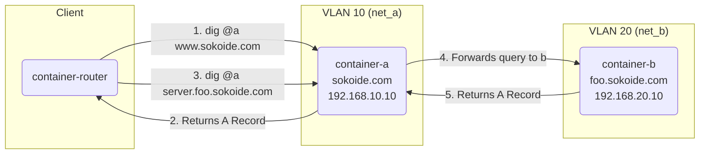

# Terraform Workshop: From Basics to Building a Practical DNS Server

In this workshop, you will learn the fundamentals of **Terraform**, an Infrastructure as Code (IaC) tool, and ultimately automate the deployment of a practical DNS server environment using container technology.

## Goal

Master basic Terraform operations (init, plan, apply, destroy) and define/deploy an environment where three containers collaborate as a network.


```mermaid
graph LR
    subgraph Client
        Router("container-router")
    end

    subgraph "VLAN 10 (net_a)"
        A("container-a<br>sokoide.com<br>192.168.10.10")
    end

    subgraph "VLAN 20 (net_b)"
        B("container-b<br>foo.sokoide.com<br>192.168.20.10")
    end

    Router -- "1. dig @a www.sokoide.com" --> A
    A -- "2. Returns A Record" --> Router

    Router -- "3. dig @a server.foo.sokoide.com" --> A
    A -- "4. Forwards query to b" --> B
    B -- "5. Returns A Record" --> A
```

**What you will learn in this workshop:**

1. **Terraform Basics**: Defining resources, variables, and outputs.
2. **Using Providers**: The `local` provider (file manipulation) and the `docker` provider.
3. **Environment Building with IaC**: Managing networks, configuration files, and containers together.

---

## Challenges in Infrastructure Management

Traditionally, building servers and networks involved manual labor (command entry or GUI operations).

### ❌ Challenges

- **Non-reproducible**: Hard to recreate the same environment; procedure manuals quickly become outdated.
- **Untraceable changes**: Difficult to know "who changed what and when," making recovery from trouble hard.
- **Dependency complexity**: With multiple components, errors occur if the creation order is wrong.

### ✅ Terraform (IaC) Solutions

- **Declarative Approach**: Write the "desired state" in code, and Terraform calculates the diff to build it.
- **Version Control**: Manage infrastructure configuration with Git, allowing reviews and diff checks.
- **Automation**: Deploy even large configurations without mistakes with a single command.

---

## Architecture

This workshop is divided into two parts.

### Directory Structure

```text
terraform-handson/
├── part1/                # Part 1: Basics
│   ├── main.tf
│   ├── variables.tf
│   └── outputs.tf
└── part2/                # Part 2: Practical (DNS Server)
    ├── Dockerfile        # For CoreDNS image
    ├── main.tf           # Container and Network definitions
    └── versions.tf       # Provider settings
```

---

## Workshop: Part 1 (Basics)

Learn the basics using the `local` provider to manipulate local files.

### STEP 1: Define Your First Resource

Create `part1/main.tf`:

```terraform
resource "local_file" "hello" {
  content  = "hello-terraform"
  filename = "${path.module}/hello.txt"
}
```

### STEP 2: Init, Plan, and Apply

```bash
cd part1
terraform init    # Download providers
terraform plan    # Review changes
terraform apply   # Execute (type 'yes')
```

*Check that `hello.txt` has been created.*

### STEP 3: Using Variables and Outputs

Create `variables.tf` and `outputs.tf` to make the configuration flexible.

```terraform
# variables.tf
variable "filename" {
  default = "hello_variable.txt"
}

# outputs.tf
output "file_path" {
  value = local_file.hello.filename
}
```

Update `main.tf` to reference the variable:

```terraform
resource "local_file" "hello" {
  content  = "hello-terraform"
  filename = "${path.module}/${var.filename}"
}
```

Run `terraform apply` again.

### STEP 4: Creating Multiple Resources (`for_each`)

Use `for_each` to efficiently create multiple resources based on a list.

```terraform
# Overwrite main.tf
locals {
  users = toset(["alice", "bob", "charlie"])
}

resource "local_file" "user_files" {
  for_each = local.users
  content  = "hello, ${each.key}"
  filename = "${path.module}/${each.value}.txt"
}
```

*Note: If `outputs.tf` still references the previous `local_file.hello` resource, an error will occur. Delete or comment out `outputs.tf` before running STEP 4.*

Run `terraform plan` and `terraform apply`, and verify that three user files are created.

---

## Workshop: Part 2 (Practical: DNS Server)

Use the Docker/Podman provider to automatically build a complex network configuration.

### STEP 0: Build CoreDNS Image

```bash
cd ../part2
```

Create a `Dockerfile`:

```dockerfile
FROM alpine:3.17
ARG COREDNS_VERSION=1.10.0
RUN wget https://github.com/coredns/coredns/releases/download/v${COREDNS_VERSION}/coredns_${COREDNS_VERSION}_linux_amd64.tgz -O /tmp/coredns.tgz && \
    tar -xvzf /tmp/coredns.tgz -C /usr/local/bin/ && \
    rm /tmp/coredns.tgz
CMD ["/usr/local/bin/coredns", "-conf", "/etc/coredns/Corefile"]
```

Build the image (replace `docker` with `podman` if using Podman):

```bash
docker build -t coredns-handson .
```

### STEP 1: Configure Docker Provider

Create `part2/versions.tf`:

```terraform
terraform {
  required_providers {
    docker = {
      source  = "kreuzwerker/docker"
      version = "3.0.2"
    }
  }
}
```

### STEP 2: Define Containers and Networks

In `part2/main.tf`, define networks, configuration files, and containers.

```terraform
# Network definitions
resource "docker_network" "net_a" {
  name = "net_a"
  ipam_config {
    subnet = "192.168.10.0/24"
  }
}

resource "docker_network" "net_b" {
  name = "net_b"
  ipam_config {
    subnet = "192.168.20.0/24"
  }
}

# CoreDNS configuration (sokoide.com)
resource "local_file" "coredns_a" {
  content = <<-EOF
  sokoide.com:53 {
    log
    errors
    cache
    forward . 192.168.20.10:53
    template IN A www.sokoide.com {
      answer "{{ .Name }} 60 IN A 1.1.1.1"
    }
  }
  EOF
  filename = "${path.module}/Corefile.a"
}

# CoreDNS configuration (foo.sokoide.com)
resource "local_file" "coredns_b" {
  content = <<-EOF
  foo.sokoide.com:53 {
    log
    errors
    cache
    template IN A server.foo.sokoide.com {
      answer "{{ .Name }} 60 IN A 2.2.2.2"
    }
  }
  EOF
  filename = "${path.module}/Corefile.b"
}

# CoreDNS containers
resource "docker_container" "dns_a" {
  name  = "container-a"
  image = "coredns-handson:latest"
  networks_advanced {
    name         = docker_network.net_a.name
    ipv4_address = "192.168.10.10"
  }
  # Connect to net_b for forwarding to B
  networks_advanced {
    name         = docker_network.net_b.name
    ipv4_address = "192.168.20.11"
  }
  uploads {
    content    = local_file.coredns_a.content
    file       = "/etc/coredns/Corefile"
    executable = false
  }
  command = ["-conf", "/etc/coredns/Corefile"]
}

resource "docker_container" "dns_b" {
  name  = "container-b"
  image = "coredns-handson:latest"
  networks_advanced {
    name         = docker_network.net_b.name
    ipv4_address = "192.168.20.10"
  }
  uploads {
    content    = local_file.coredns_b.content
    file       = "/etc/coredns/Corefile"
    executable = false
  }
  command = ["-conf", "/etc/coredns/Corefile"]
}

# Router container (for testing)
resource "docker_container" "router" {
  name    = "container-router"
  image   = "alpine:3.17"
  command = ["sleep", "infinity"]
  networks_advanced {
    name = docker_network.net_a.name
  }
}
```

### STEP 3: Deploy and Verify

```bash
cd ../part2
terraform init
terraform apply
```

After deployment, enter the `router` container and test name resolution with the `dig` command.

```bash
docker exec -it container-router sh
# Inside container
apk add bind-tools
# Test direct resolution of A record
dig @192.168.10.10 www.sokoide.com
# Test recursive resolution (forwarding to B)
dig @192.168.10.10 server.foo.sokoide.com
```

---

## Cleanup

```bash
terraform destroy
```

*Note: All containers, networks, and temporary files will be deleted at once.*

---

## References

- [Terraform Documentation](https://developer.hashicorp.com/terraform/docs)
- [Terraform Docker Provider](https://registry.terraform.io/providers/kreuzwerker/docker/latest/docs)
