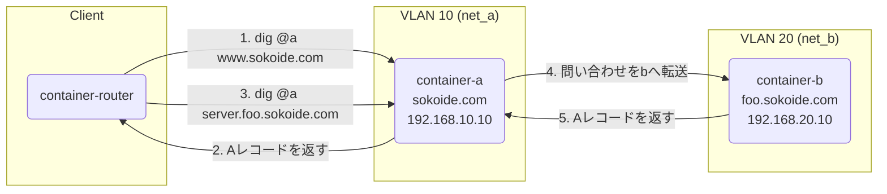

# Terraformワークショップ：基礎から実践的なDNSサーバー構築まで

このドキュメントは、Infrastructure as Code（IaC）ツールであるTerraformの基礎を学び、最終的にコンテナ技術（Podman/Docker）と組み合わせて実践的なDNSサーバー環境を構築することを目的としたワークショップです。

## パート1：Terraformの基礎と`local`プロバイダー

このパートでは、クラウドサービスを使わずに、ローカルマシン上のファイルを操作する`local`プロバイダーを通じてTerraformの基本的な概念とコマンドを学びます。

### 1. 準備

**Terraformのインストール**

[公式サイトの手順](https://learn.hashicorp.com/tutorials/terraform/install-cli)に従って、お使いのOSにTerraformをインストールしてください。

**作業ディレクトリの作成**

```bash
mkdir terraform-handson
cd terraform-handson
mkdir part1
cd part1
```

### 2. 最初のTerraformファイル

1. `main.tf`という名前でファイルを作成し、以下の内容を記述します。これは「`hello.txt`というファイルを`hello-terraform`という内容で作成する」というインフラの構成を定義しています。

    ```terraform
    # main.tf
    resource "local_file" "hello" {
      content  = "hello-terraform"
      filename = "${path.module}/hello.txt"
    }
    ```

2. **初期化 (`init`)**: Terraformが必要なプロバイダー（この場合は`local`プロバイダー）をダウンロードします。

    ```bash
    terraform init
    ```

3. **実行計画 (`plan`)**: どのような変更が行われるかを確認します。

    ```bash
    terraform plan
    ```

    `+ create`という表示で、`local_file.hello`リソースが作成されることがわかります。

4. **適用 (`apply`)**: 計画を承認し、実際にリソースを作成します。

    ```bash
    terraform apply
    ```

    確認を求められたら`yes`と入力します。`part1`ディレクトリに`hello.txt`が作成されていることを確認してください。

### 3. 変数と出力

ハードコーディングを避け、柔軟な構成にするために変数を使います。

1. `variables.tf`を作成し、ファイル名を可変にします。

    ```terraform
    # variables.tf
    variable "filename" {
      description = "作成するファイル名"
      type        = string
      default     = "hello_from_variable.txt"
    }
    ```

2. `main.tf`を修正して、変数を参照するようにします。

    ```terraform
    # main.tf
    resource "local_file" "hello" {
      content  = "hello-terraform"
      filename = "${path.module}/${var.filename}" # var.filenameを参照
    }
    ```

3. `outputs.tf`を作成し、作成されたファイル名を出力します。

    ```terraform
    # outputs.tf
    output "created_filename" {
      value = local_file.hello.filename
    }
    ```

4. 再度`terraform apply`を実行してください。`default`で指定した名前のファイルが作成され、実行後に出力（`Outputs`）が表示されることを確認します。

### 4. 複数のリソース (`for_each`)

`for_each`を使うと、リストやマップに基づいて複数のリソースを効率的に作成できます。

1. `main.tf`を以下のように修正し、複数のユーザー名のファイルを作成するようにします。

    ```terraform
    # main.tf
    locals {
      users = toset(["sato", "suzuki", "tanaka"])
    }

    resource "local_file" "user_files" {
      for_each = local.users

      content  = "hello, ${each.key}"
      filename = "${path.module}/${each.value}.txt"
    }
    ```

    * `for_each`にセット（重複しない文字列のリスト）を渡すと、セットの各要素に対してリソースが作成されます。
    * `each.key`と`each.value`には、要素の値（この場合はユーザー名）が入ります。

2. `terraform plan`と`terraform apply`を実行し、3つのユーザーファイルが作成されることを確認します。

### 5. リソースの破棄

作成したリソースをすべて削除します。

```bash
terraform destroy
```

`yes`と入力すると、Terraformが管理していたすべてのファイルが削除されます。

---

## パート2：TerraformとPodman/DockerでDNSサーバーを構築する

このパートでは、パート1で学んだ知識を応用し、Podman/Dockerコンテナを使ってDNSサーバー環境をTerraformで構築します。

**完成図:**

このパートで構築するDNS環境の全体像と、名前解決の流れは以下のようになります。



* `container-a`: `sokoide.com`の権威DNSサーバーとして機能し、`foo.sokoide.com`への問い合わせは`container-b`へ転送（フォワード）します。
* `container-b`: `foo.sokoide.com`の権威DNSサーバーとして機能します。
* `container-router`: `dig`コマンドを実行して名前解決をテストするためのクライアントです。

### 1. 準備

**作業ディレクトリの作成**

```bash
cd ../
mkdir part2
cd part2
```

**CoreDNSコンテナイメージの作成**

1. CoreDNS（DNSサーバーソフトウェア）を含むコンテナイメージを作成します。以下の内容で`Dockerfile`を作成してください。

    ```dockerfile
    # Dockerfile
    FROM alpine:3.17
    ARG COREDNS_VERSION=1.10.0
    RUN wget https://github.com/coredns/coredns/releases/download/v${COREDNS_VERSION}/coredns_${COREDNS_VERSION}_linux_amd64.tgz -O /tmp/coredns.tgz && \
        tar -xvzf /tmp/coredns.tgz -C /usr/local/bin/ && \
        rm /tmp/coredns.tgz
    CMD ["/usr/local/bin/coredns", "-conf", "/etc/coredns/Corefile"]
    ```

2. イメージをビルドします。（Podmanをお使いの場合は`docker`を`podman`に読み替えてください）

    ```bash
    docker build -t coredns-handson .
    ```

### 2. Terraformプロジェクトのセットアップ

1. `versions.tf`を作成し、Dockerプロバイダーを指定します。（このプロバイダーはPodmanとも互換性があります）

    ```terraform
    # versions.tf
    terraform {
      required_providers {
        docker = {
          source  = "kreuzwerker/docker"
          version = "3.0.2"
        }
      }
    }
    ```

2. プロバイダーを初期化します。

    ```bash
    terraform init
    ```

### 3. TerraformによるDNS環境の構築

1. `main.tf`に、ネットワーク、CoreDNS設定ファイル、ゾーンファイル、そしてコンテナの定義をすべて記述します。

    ```terraform
    # main.tf

    # 1. ネットワークの定義
    resource "docker_network" "net_a" {
      name = "net_a"
      ipam_config {
        subnet = "192.168.10.0/24"
      }
    }

    resource "docker_network" "net_b" {
      name = "net_b"
      ipam_config {
        subnet = "192.168.20.0/24"
      }
    }

    # 2. CoreDNS設定ファイルとゾーンファイルの生成
    # コンテナa用 (sokoide.com)
    resource "local_file" "corefile_a" {
      content = <<-EOF
    . {
        log
        errors
        forward . 8.8.8.8
    }
    sokoide.com {
        file /etc/coredns/sokoide.com.db
    }
    foo.sokoide.com {
        forward . 192.168.20.10
    }
    EOF
      filename = "${path.module}/Corefile_a"
    }

    resource "local_file" "zonefile_a" {
      content = <<-EOF
    sokoide.com.   IN SOA sns.dns.icann.org. noc.dns.icann.org. 2015082541 7200 3600 1209600 3600
    www.sokoide.com. IN A 1.2.3.4
    EOF
      filename = "${path.module}/sokoide.com.db"
    }

    # コンテナb用 (foo.sokoide.com)
    resource "local_file" "corefile_b" {
      content = <<-EOF
    . {
        log
        errors
        forward . 8.8.8.8
    }
    foo.sokoide.com {
        file /etc/coredns/foo.sokoide.com.db
    }
    EOF
      filename = "${path.module}/Corefile_b"
    }

    resource "local_file" "zonefile_b" {
      content = <<-EOF
    foo.sokoide.com.   IN SOA sns.dns.icann.org. noc.dns.icann.org. 2015082541 7200 3600 1209600 3600
    server.foo.sokoide.com. IN A 5.6.7.8
    EOF
      filename = "${path.module}/foo.sokoide.com.db"
    }

    # 3. コンテナの定義
    resource "docker_container" "container_a" {
      name  = "container-a"
      image = "coredns-handson"
      networks_advanced {
        name         = docker_network.net_a.name
        ipv4_address = "192.168.10.10"
      }
      # container-bへ転送（フォワード）するためにnet_bにも接続
      networks_advanced {
        name = docker_network.net_b.name
      }
      volumes {
        host_path      = local_file.corefile_a.filename
        container_path = "/etc/coredns/Corefile"
        read_only      = true
      }
      volumes {
        host_path      = local_file.zonefile_a.filename
        container_path = "/etc/coredns/sokoide.com.db"
        read_only      = true
      }
    }

    resource "docker_container" "container_b" {
      name  = "container-b"
      image = "coredns-handson"
      networks_advanced {
        name         = docker_network.net_b.name
        ipv4_address = "192.168.20.10"
      }
      volumes {
        host_path      = local_file.corefile_b.filename
        container_path = "/etc/coredns/Corefile"
        read_only      = true
      }
      volumes {
        host_path      = local_file.zonefile_b.filename
        container_path = "/etc/coredns/foo.sokoide.com.db"
        read_only      = true
      }
    }

    resource "docker_container" "router" {
      name  = "container-router"
      image = "alpine:3.17"
      command = ["sleep", "3600"]
      networks_advanced {
        name = docker_network.net_a.name
      }
      networks_advanced {
        name = docker_network.net_b.name
      }
    }
    ```

### 4. 実行と動作確認

1. `terraform apply`を実行して、すべてのリソース（ネットワーク、設定ファイル、コンテナ）を構築します。`yes`と入力します。

2. コンテナが起動していることを確認します。

    ```bash
    docker ps
    ```

3. `router`コンテナに入り、`dig`コマンド（DNSクエリツール）をインストールして実行します。

    ```bash
    docker exec -it container-router sh

    # コンテナ内で以下を実行
    apk update && apk add bind-tools
    ```

4. `dig`で名前解決をテストします。

    * `container-a`に`sokoide.com`の問い合わせ

    ```sh
    # dig @192.168.10.10 www.sokoide.com
    # ...
    # ;; ANSWER SECTION:
    # www.sokoide.com.    3600    IN    A    1.2.3.4
    ```

    * `container-a`に`foo.sokoide.com`の問い合わせ (bへフォワードされる)

    ```sh
    # dig @192.168.10.10 server.foo.sokoide.com
    # ...
    # ;; ANSWER SECTION:
    # server.foo.sokoide.com. 3600    IN    A    5.6.7.8
    ```

    * `container-b`に`foo.sokoide.com`の問い合わせ

    ```sh
    # dig @192.168.20.10 server.foo.sokoide.com
    # ...
    # ;; ANSWER SECTION:
    # server.foo.sokoide.com. 3600    IN    A    5.6.7.8
    ```

    コンテナから出るには `exit` と入力します。

### 5. クリーンアップ

ワークショップが終わったら、`destroy`コマンドで作成したすべてのリソースを削除します。

```bash
terraform destroy
```

ローカルに作成された設定ファイルも不要であれば削除してください。

以上でワークショップは終了です。この演習を通じて、Terraformの基本操作から、より実践的な複数コンポーネント構成の管理までを体験できました。
