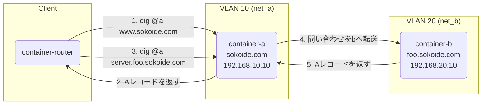

# Terraform 実習：基礎から実践的な DNS サーバー構築まで

このワークショップでは、Infrastructure as Code (IaC) ツールである **Terraform** の基礎を学び、最終的にコンテナ技術と組み合わせて実践的な DNS サーバー環境を自動構築します。

## ゴール

Terraform の基本操作（init, plan, apply, destroy）を習得し、以下の 3 つのコンテナが連携する環境をコードで定義・構築します。


```mermaid
graph LR
    subgraph Client
        Router("container-router")
    end

    subgraph "VLAN 10 (net_a)"
        A("container-a<br>sokoide.com<br>192.168.10.10")
    end

    subgraph "VLAN 20 (net_b)"
        B("container-b<br>foo.sokoide.com<br>192.168.20.10")
    end

    Router -- "1. dig @a www.sokoide.com" --> A
    A -- "2. Aレコードを返す" --> Router

    Router -- "3. dig @a server.foo.sokoide.com" --> A
    A -- "4. 問い合わせをbへ転送" --> B
    B -- "5. Aレコードを返す" --> A
```

**この実習で習得すること:**

1. **Terraform の基本**: リソースの定義、変数、出力。
2. **プロバイダーの使用**: `local` プロバイダー（ファイル操作）と `docker` プロバイダー。
3. **IaC による環境構築**: ネットワーク、設定ファイル、コンテナの一括管理。

---

## インフラ管理の課題

従来、サーバーやネットワークの構築は手作業（コマンド入力や GUI 操作）で行われてきました。

### ❌ 課題

- **再現性がない**: 同じ環境をもう一度作るのが難しく、手順書がすぐ古くなる。
- **変更履歴が追えない**: 「誰がいつ何を変えたか」が分からず、トラブル時の復旧が困難。
- **依存関係の複雑さ**: 複数のコンポーネントがある場合、作成順序を間違えるとエラーになる。

### ✅ Terraform (IaC) の解決策

- **宣言的記述**: 「あるべき姿」をコードで書けば、Terraform が差分を計算して構築。
- **バージョン管理**: インフラ構成を Git で管理でき、レビューや差分確認が可能。
- **自動化**: 大規模な構成でもコマンド一つでミスなくデプロイ。

---

## アーキテクチャ

本実習は 2 つのパートに分かれています。

### 想定ディレクトリ構造

```text
terraform-handson/
├── part1/                # パート1: 基礎編
│   ├── main.tf
│   ├── variables.tf
│   └── outputs.tf
└── part2/                # パート2: 実践編 (DNSサーバー)
    ├── Dockerfile        # CoreDNSイメージ用
    ├── main.tf           # コンテナ・NW定義
    └── versions.tf       # プロバイダー設定
```

---

## 実習：パート 1 (基礎編)

ローカルファイルを操作する `local` プロバイダーを使って基本を学びます。

### STEP 1: 最初のリソース定義

`part1/main.tf` を作成します。

```terraform
resource "local_file" "hello" {
  content  = "hello-terraform"
  filename = "${path.module}/hello.txt"
}
```

### STEP 2: 初期化・計画・適用

```bash
cd part1
terraform init    # プロバイダーのダウンロード
terraform plan    # 変更内容の確認
terraform apply   # 実行 (yes と入力)
```

※ `hello.txt` が作成されたことを確認してください。

### STEP 3: 変数と出力の活用

`variables.tf` と `outputs.tf` を作成し、構成を柔軟にします。

```terraform
# variables.tf
variable "filename" {
  default = "hello_variable.txt"
}

# outputs.tf
output "file_path" {
  value = local_file.hello.filename
}
```

`main.tf` を修正して変数を参照します。

```terraform
resource "local_file" "hello" {
  content  = "hello-terraform"
  filename = "${path.module}/${var.filename}"
}
```

再び `terraform apply` を実行してください。

### STEP 4: 複数リソースの作成 (`for_each`)

`for_each` を使うと、リストに基づいて複数のリソースを効率的に作成できます。

```terraform
# main.tf を上書き
locals {
  users = toset(["sato", "suzuki", "tanaka"])
}

resource "local_file" "user_files" {
  for_each = local.users
  content  = "hello, ${each.key}"
  filename = "${path.module}/${each.value}.txt"
}
```

※ `outputs.tf` が以前のリソース `local_file.hello` を参照している場合、エラーが発生します。STEP 4 を実行する前に `outputs.tf` を削除するか、コメントアウトしてください。

`terraform plan` と `terraform apply` を実行し、3 つのユーザーファイルが作成されることを確認します。

---

## 実習：パート 2 (実践編：DNS サーバー)

Docker/Podman プロバイダーを使用し、複雑なネットワーク構成を自動構築します。

### STEP 0: CoreDNS イメージのビルド

```bash
cd ../part2
```

`Dockerfile` を作成します。

```dockerfile
FROM alpine:3.17
ARG COREDNS_VERSION=1.10.0
RUN wget https://github.com/coredns/coredns/releases/download/v${COREDNS_VERSION}/coredns_${COREDNS_VERSION}_linux_amd64.tgz -O /tmp/coredns.tgz && \
    tar -xvzf /tmp/coredns.tgz -C /usr/local/bin/ && \
    rm /tmp/coredns.tgz
CMD ["/usr/local/bin/coredns", "-conf", "/etc/coredns/Corefile"]
```

イメージをビルドします（Podman の場合は `docker` を `podman` に読み替えてください）。

```bash
docker build -t coredns-handson .
```

### STEP 1: Docker プロバイダーの設定

`part2/versions.tf` を作成します。

```terraform
terraform {
  required_providers {
    docker = {
      source  = "kreuzwerker/docker"
      version = "3.0.2"
    }
  }
}
```

### STEP 2: コンテナとネットワークの定義

`part2/main.tf` にネットワーク、設定ファイル、コンテナを定義します。

```terraform
# ネットワーク定義
resource "docker_network" "net_a" {
  name = "net_a"
  ipam_config {
    subnet = "192.168.10.0/24"
  }
}

resource "docker_network" "net_b" {
  name = "net_b"
  ipam_config {
    subnet = "192.168.20.0/24"
  }
}

# CoreDNS 設定ファイル (sokoide.com)
resource "local_file" "coredns_a" {
  content = <<-EOF
  sokoide.com:53 {
    log
    errors
    cache
    forward . 192.168.20.10:53
    template IN A www.sokoide.com {
      answer "{{ .Name }} 60 IN A 1.1.1.1"
    }
  }
  EOF
  filename = "${path.module}/Corefile.a"
}

# CoreDNS 設定ファイル (foo.sokoide.com)
resource "local_file" "coredns_b" {
  content = <<-EOF
  foo.sokoide.com:53 {
    log
    errors
    cache
    template IN A server.foo.sokoide.com {
      answer "{{ .Name }} 60 IN A 2.2.2.2"
    }
  }
  EOF
  filename = "${path.module}/Corefile.b"
}

# CoreDNS コンテナ
resource "docker_container" "dns_a" {
  name  = "container-a"
  image = "coredns-handson:latest"
  networks_advanced {
    name         = docker_network.net_a.name
    ipv4_address = "192.168.10.10"
  }
  # Bへの転送用にnet_bにも接続
  networks_advanced {
    name         = docker_network.net_b.name
    ipv4_address = "192.168.20.11"
  }
  uploads {
    content        = local_file.coredns_a.content
    file           = "/etc/coredns/Corefile"
    executable     = false
  }
  command = ["-conf", "/etc/coredns/Corefile"]
}

resource "docker_container" "dns_b" {
  name  = "container-b"
  image = "coredns-handson:latest"
  networks_advanced {
    name         = docker_network.net_b.name
    ipv4_address = "192.168.20.10"
  }
  uploads {
    content        = local_file.coredns_b.content
    file           = "/etc/coredns/Corefile"
    executable     = false
  }
  command = ["-conf", "/etc/coredns/Corefile"]
}

# ルーターコンテナ (検証用)
resource "docker_container" "router" {
  name  = "container-router"
  image = "alpine:3.17"
  command = ["sleep", "infinity"]
  networks_advanced {
    name = docker_network.net_a.name
  }
}
```

### STEP 3: 環境のデプロイと検証

```bash
cd ../part2
terraform init
terraform apply
```

構築後、`router` コンテナに入って `dig` コマンドで名前解決をテストします。

```bash
docker exec -it container-router sh
# コンテナ内で
apk add bind-tools
# Aレコードの直接解決をテスト
dig @192.168.10.10 www.sokoide.com
# Bへの転送（再帰解決）をテスト
dig @192.168.10.10 server.foo.sokoide.com
```

---

## 片付け

```bash
terraform destroy
```

※ すべてのコンテナ、ネットワーク、一時ファイルが一括で削除されます。

---

## 参考文献

- [Terraform Documentation](https://developer.hashicorp.com/terraform/docs)
- [Terraform Docker Provider](https://registry.terraform.io/providers/kreuzwerker/docker/latest/docs)
