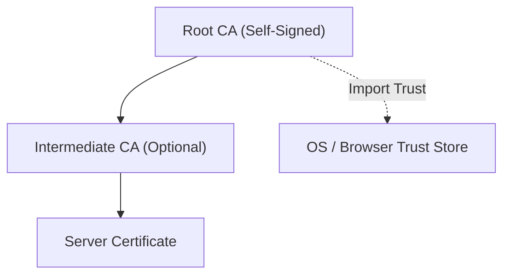

# TLS/SSL Certificate Workshop: Building Self-Signed CA and Understanding Certificate Chains

In this workshop, you will learn how TLS/SSL and certificate chains work by building your own Certificate Authority (CA) and issuing/verifying server certificates using OpenSSL.

## 1. Basics of TLS/SSL and Certificate Chains

### Why do we need a CA?

To simply encrypt communication on the Internet, you can use a key created by the server itself (self-signed certificate). However, without a third party to prove that the key "really belongs to that server," impersonation cannot be prevented. This "root of trust" is the Certificate Authority (CA).

### Structure of a Certificate Chain

Trust is passed down from top to bottom.



## 2. Preparation

We will use the `openssl` command for this workshop.

```bash
openssl version
```

## 3. Step 1: Building a Root CA

Create a Root CA, which will be the source of all trust.

### 1.1 Generate a private key for the CA

```bash
openssl genrsa -out rootCA.key 4096
```

### 1.2 Create a self-signed root certificate

```bash
openssl req -x509 -new -nodes -key rootCA.key -sha256 -days 3650 -out rootCA.crt \
  -subj "/C=JP/ST=Tokyo/L=Minato/O=Workshop/CN=Workshop Root CA"
```

## 4. Step 2: Issuing a Server Certificate

### 2.1 Generate a private key for the server

```bash
openssl genrsa -out server.key 2048
```

### 2.2 Create a Certificate Signing Request (CSR)

```bash
openssl req -new -key server.key -out server.csr \
  -subj "/C=JP/ST=Tokyo/L=Minato/O=Workshop/CN=localhost"
```

### 2.3 Signing by the CA (Issuing the Certificate)

```bash
openssl x509 -req -in server.csr -CA rootCA.crt -CAkey rootCA.key -CAcreateserial \
  -out server.crt -days 365 -sha256
```

## 5. Step 3: Inspecting and Verifying Certificate Content

### 3.1 Inspecting Certificate Details
Display the contents of the issued certificate in text format and verify that the configured items are correctly reflected.

```bash
openssl x509 -noout -text -in server.crt
```

#### How to read the output sample
Information like the following will be displayed:

```text
Certificate:
    Data:
        Version: 3 (0x2)
        Serial Number:
            75:4b:de:3c:2b:06:f3:9d:e6:2d:68:a2:b6:60:db:12:e6:d5:75:fc
        Signature Algorithm: sha256WithRSAEncryption
        Issuer: C = JP, ST = Tokyo, L = Minato, O = Workshop, CN = Workshop Root CA
        Validity
            Not Before: Dec 28 10:00:00 2025 GMT
            Not After : Dec 28 10:00:00 2026 GMT
        Subject: C = JP, ST = Tokyo, L = Minato, O = Workshop, CN = localhost
        Subject Public Key Info:
            Public Key Algorithm: rsaEncryption
                RSA Public-Key: (2048 bit)
        X509v3 extensions:
            X509v3 Basic Constraints: 
                CA:FALSE
            X509v3 Subject Alternative Name: 
                DNS:localhost, DNS:www.example.com, IP:127.0.0.1
...
```

- **Serial Number**: A unique number used to identify certificates issued by the CA.
- **Signature Algorithm**: The algorithm used for signing (sha256 is currently common).
- **Issuer**: The CA that signed this certificate.
- **Validity**: From `Not Before` (start) to `Not After` (end).
- **Subject**: Information about the owner of this certificate.
    - **CN (Common Name)**: Formerly used for identification, but SAN now takes precedence.
- **X509v3 Subject Alternative Name (SAN)**: **The most important item in modern HTTPS**. A list of domain names or IP addresses for which the certificate is valid.

### 3.2 Verifying the Certificate
Verify that the issued certificate is correctly signed by the CA.

```bash
openssl verify -CAfile rootCA.crt server.crt
# Output: server.crt: OK
```

## 6. Server Name Validation in HTTPS

When a client such as a browser performs HTTPS communication, it validates whether the connection destination is correct through the following process. This is called **Server Name Validation**.

1. **Verification of Trust**: Verify if the presented certificate is connected from a "trusted root certificate" that the client holds (certificate chain).
2. **Matching the Name**: Match the domain name of the URL entered in the browser with the **SAN (Subject Alternative Name)** of the certificate.
    - **Relationship with CNAME**: CNAME is an alias at the DNS level. In certificate verification, the domain name you are ultimately accessing must be included in the SAN.

### SSL Pass-through and SAN
In an **SSL Pass-through** configuration where SSL termination is not performed at the Load Balancer (LB) and the encrypted data is forwarded as is to the backend Web server, the Web server itself holds the certificate.

In this case, the domain name used in front of the LB (the domain name the client accesses) must match the SAN in the Web server's certificate. If they do not match, the client will display a "security warning."

---

## 7. Summary

- **Private Key (.key)**: Must never be leaked to the outside.
- **CSR (.csr)**: An "application form" to have the CA issue a certificate.
- **Certificate (.crt)**: The application form stamped (signed) by the CA.
- **Root Certificate**: By installing this into a client (browser, etc.), you can trust all certificates issued by that CA.

```