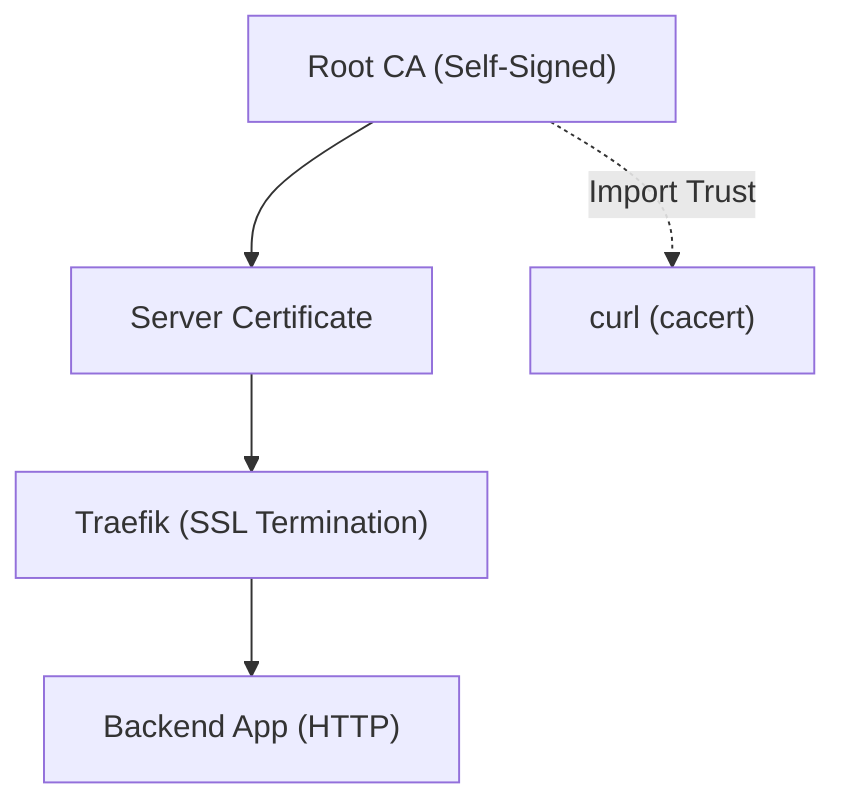

# TLS/SSL Certificate Workshop: Building Self-Signed CA and Understanding Certificate Chains

In this workshop, you will learn how TLS/SSL and certificate chains work by building your own Certificate Authority (CA) and issuing/verifying server certificates using OpenSSL.

## Goal

Build your own Root CA, issue a server certificate that supports SAN (Subject Alternative Name), and configure HTTPS termination using Traefik.


```mermaid
graph TD
    RootCA["Root CA (Self-Signed)"] --> ServerCert["Server Certificate"]
    RootCA -.-> |Import Trust| Client["curl (cacert)"]
    ServerCert --> Traefik["Traefik (SSL Termination)"]
    Traefik --> App["Backend App (HTTP)"]
```

**What you will learn in this workshop:**

1. **The Role of a CA**: Understanding why a root of trust is necessary.
2. **Certificate Issuance Flow**: Generating private keys, creating CSRs, and signing with a CA.
3. **Modern Name Validation**: Transitioning from Common Name (CN) to Subject Alternative Name (SAN).
4. **Certificate Verification**: Confirming validity using `curl` or `openssl verify`.

---

## Challenges in Certificate Trust

To simply encrypt communication on the Internet, you can use a key created by the server itself (a self-signed certificate).

### ❌ Challenges

- **No impersonation protection**: There is no third party to prove that the key "really belongs to that server."
- **Browser warnings**: Certificates issued by untrusted CAs are flagged as unsafe.

### ✅ Certificate Authority (CA) Solutions

- **Root of Trust**: Standard browsers/OSs pre-trust "Root CAs." Getting a signature (stamp) from them proves authenticity.
- **Certificate Chain**: Establishes trust through a chain where the Root CA guarantees an Intermediate CA, which in turn guarantees the server.

---

## Architecture

In this workshop, we will reproduce all roles (CA, Server, Client) in a local environment.

### Directory Structure

```text
~/
    ├── rootCA.key        # CA private key (highly sensitive)
    ├── rootCA.crt        # CA certificate (public)
    ├── server.key        # Server private key
    ├── server.csr        # Server signing request
    ├── server.crt        # Server certificate (signed by CA)
    └── dynamic_conf.yaml # TLS configuration for Traefik
```

---

## Workshop Steps

### STEP 1: Build a Root CA

Create your own "Private Certificate Authority" as the source of all trust.

```bash
# 1.1 Generate a private key for the CA
openssl genrsa -out rootCA.key 4096

# 1.2 Create a self-signed root certificate (valid for 10 years)
openssl req -x509 -new -nodes -key rootCA.key -sha256 -days 3650 -out rootCA.crt \
  -subj "/C=JP/ST=Tokyo/L=Minato/O=Workshop/CN=Workshop Root CA"
```

### STEP 2: Issue a Server Certificate

Create a certificate for the actual Web Server (Traefik) and have it signed by your CA.

```bash
# 2.1 Generate a private key for the server
openssl genrsa -out server.key 2048

# 2.2 Create a Certificate Signing Request (CSR)
openssl req -new -key server.key -out server.csr \
  -subj "/C=JP/ST=Tokyo/L=Minato/O=Workshop/CN=server.workshop.local"

# 2.3 Create a SAN configuration file (mandatory for modern browsers)
cat <<EOF > server.ext
subjectAltName = @alt_names
[alt_names]
DNS.1 = server.workshop.local
DNS.2 = localhost
EOF

# 2.4 Sign the certificate with the CA
openssl x509 -req -in server.csr -CA rootCA.crt -CAkey rootCA.key -CAcreateserial \
  -out server.crt -days 365 -sha256 -extfile server.ext
```

### STEP 3: Verify the Certificate

```bash
openssl verify -CAfile rootCA.crt server.crt
# -> Success if it outputs: server.crt: OK
```

### STEP 4: Practical Application with Traefik

Configure an actual HTTPS server using the created certificate.

```bash
# 1. Configure local hostname resolution
echo "127.0.0.1 server.workshop.local" | sudo tee -a /etc/hosts

# 2. Start backend Web Server (Python)
python3 -m http.server 8000 &

# 3. Start Traefik (mounting the certificates)
sudo podman run -d --name traefik -p 443:443 \
  -v .:/certs:ro \
  -v ./dynamic_conf.yaml:/etc/traefik/dynamic_conf.yaml:ro \
  docker.io/library/traefik:v3.1 \
  --providers.file.filename=/etc/traefik/dynamic_conf.yaml \
  --entrypoints.websecure.address=:443
```

### STEP 5: Verification from Client (curl)

```bash
# Access without CA certificate (expected to fail)
curl https://server.workshop.local

# Access by specifying your custom Root CA certificate (expected to succeed)
curl --cacert rootCA.crt https://server.workshop.local
```

---

## Clean Architecture and SSL Termination

In this workshop, we used a configuration called **SSL Termination**.

- **Traefik (Infrastructure Layer)**: Handles SSL termination. It takes care of the complexity of certificate management and encryption/decryption.
- **App (Business Logic Layer)**: The backend Python app is unaware of SSL and operates on pure HTTP.

This ensures security through infrastructure layer changes alone, without needing to modify application code for HTTPS support.

---

## Cleanup

```bash
sudo podman rm -f traefik
kill %1  # Stop Python server
rm rootCA.* server.* dynamic_conf.yaml
```

---

## References

- [OpenSSL Documentation](https://www.openssl.org/docs/)
- [Traefik TLS Documentation](https://doc.traefik.io/traefik/https/tls/)
