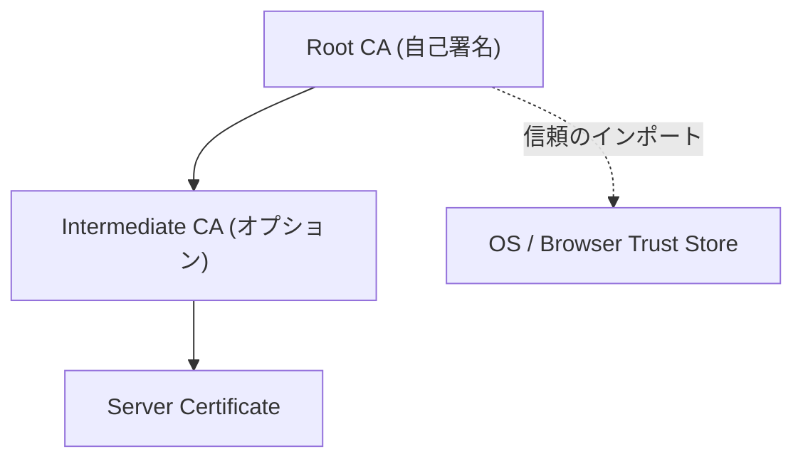

# TLS/SSL 証明書実習：自己署名 CA 構築と証明書チェーン

このワークショップでは、OpenSSL を使用して独自の認証局 (CA) を構築し、サーバー証明書を発行・検証するプロセスを通じて、TLS/SSL および証明書チェーンの仕組みを学びます。

## 1. TLS/SSL と証明書チェーンの基礎

### なぜ CA が必要なのか？

インターネット上の通信を暗号化するだけなら、サーバーが自分で作った鍵（自己署名証明書）でも可能です。しかし、その鍵が「本当にそのサーバーのものか」を証明する第三者がいないと、なりすましを防げません。この「信頼の起点」となるのが認証局 (CA) です。

### 証明書チェーンの構造

信頼は上位から下位へと引き継がれます。



## 2. 準備

実習には `openssl` コマンドを使用します。

```bash
openssl version
```

## 3. Step 1: ルートCA (Root CA) の構築

すべての信頼の源となるルートCAを作成します。

### 1.1 CA 用の秘密鍵を生成

```bash
openssl genrsa -out rootCA.key 4096
```

### 1.2 自己署名ルート証明書を作成

```bash
openssl req -x509 -new -nodes -key rootCA.key -sha256 -days 3650 -out rootCA.crt \
  -subj "/C=JP/ST=Tokyo/L=Minato/O=Workshop/CN=Workshop Root CA"
```

## 4. Step 2: サーバー証明書の発行

### 2.1 サーバー用の秘密鍵を生成

```bash
openssl genrsa -out server.key 2048
```

### 2.2 証明書署名要求 (CSR) の作成

```bash
openssl req -new -key server.key -out server.csr \
  -subj "/C=JP/ST=Tokyo/L=Minato/O=Workshop/CN=localhost"
```

### 2.3 CA による署名 (証明書の発行)

```bash
openssl x509 -req -in server.csr -CA rootCA.crt -CAkey rootCA.key -CAcreateserial \
  -out server.crt -days 365 -sha256
```

## 5. Step 3: 証明書の内容確認と検証

### 3.1 証明書の詳細を確認する
発行された証明書の中身をテキスト形式で表示し、設定した項目が正しく反映されているか確認します。

```bash
openssl x509 -noout -text -in server.crt
```

#### 出力サンプルの読み方
以下のような情報が表示されます。

```text
Certificate:
    Data:
        Version: 3 (0x2)
        Serial Number:
            75:4b:de:3c:2b:06:f3:9d:e6:2d:68:a2:b6:60:db:12:e6:d5:75:fc
        Signature Algorithm: sha256WithRSAEncryption
        Issuer: C = JP, ST = Tokyo, L = Minato, O = Workshop, CN = Workshop Root CA
        Validity
            Not Before: Dec 28 10:00:00 2025 GMT
            Not After : Dec 28 10:00:00 2026 GMT
        Subject: C = JP, ST = Tokyo, L = Minato, O = Workshop, CN = localhost
        Subject Public Key Info:
            Public Key Algorithm: rsaEncryption
                RSA Public-Key: (2048 bit)
        X509v3 extensions:
            X509v3 Basic Constraints: 
                CA:FALSE
            X509v3 Subject Alternative Name: 
                DNS:localhost, DNS:www.example.com, IP:127.0.0.1
...
```

- **Serial Number**: CAが発行した証明書を識別するためのユニークな番号。
- **Signature Algorithm**: 署名に使用されたアルゴリズム（現在は sha256 が一般的）。
- **Issuer (発行者)**: この証明書に署名した CA。
- **Validity (有効期間)**: `Not Before` (開始) から `Not After` (終了) まで。
- **Subject (所有者)**: この証明書の持ち主の情報。
    - **CN (Common Name)**: かつては識別に使用されていましたが、現在は SAN が優先されます。
- **X509v3 Subject Alternative Name (SAN)**: **現代の HTTPS において最も重要な項目**です。証明書が有効なドメイン名や IP アドレスのリストです。

### 3.2 証明書の検証
発行された証明書が、正しく CA によって署名されているか確認します。

```bash
openssl verify -CAfile rootCA.crt server.crt
# 出力: server.crt: OK
```

## 6. HTTPS における Server Name Validation

ブラウザなどのクライアントが HTTPS 通信を行う際、以下のプロセスで「接続先が正しいか」を検証します。これを **Server Name Validation** と呼びます。

1. **信頼の確認**: 提示された証明書が、自身が持つ「信頼されたルート証明書」から繋がっているか（証明書チェーン）を確認。
2. **名前の照合**: ブラウザに入力したURLのドメイン名と、証明書の **SAN (Subject Alternative Name)** を照合。
    - **CNAME との関係**: CNAME は DNS レベルの別名です。証明書の検証においては、最終的にアクセスしているドメイン名が SAN に含まれている必要があります。

### SSL Pass-through と SAN
Load Balancer (LB) で SSL 終端を行わず、バックエンドの Web サーバーまで暗号化されたまま転送する **SSL Pass-through** 構成では、Web サーバー自身が証明書を持ちます。

この場合、LB の手前（クライアントがアクセスするドメイン名）と、Web サーバーの証明書の SAN が一致している必要があります。一致していない場合、クライアントは「セキュリティ警告」を表示します。

---

## 7. まとめ

- **秘密鍵 (.key)**: 絶対に外部に漏らしてはいけない。
- **CSR (.csr)**: CA に証明書を発行してもらうための「申込書」。
- **証明書 (.crt)**: 申込書に CA が判子（署名）を押したもの。
- **ルート証明書**: クライアント（ブラウザ等）にインストールすることで、その CA が発行したすべての証明書を信頼させることができる。

```
