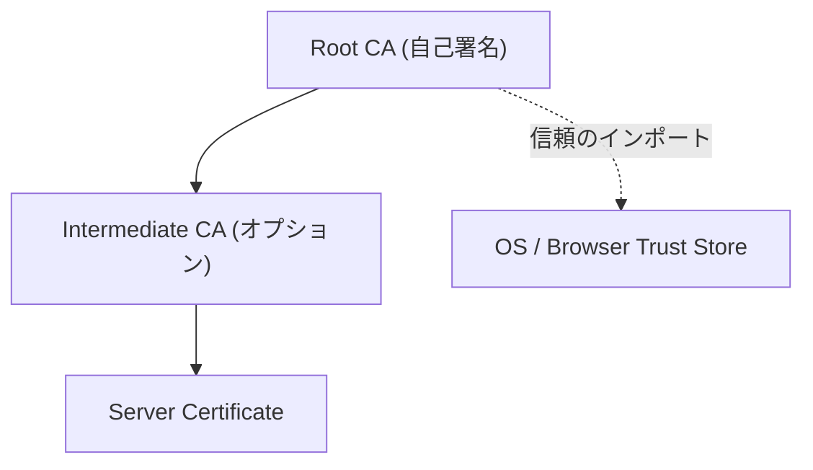

# TLS/SSL 証明書実習：自己署名 CA 構築と証明書チェーン

このワークショップでは、OpenSSL を使用して独自の認証局 (CA) を構築し、サーバー証明書を発行・検証するプロセスを通じて、TLS/SSL および証明書チェーンの仕組みを学びます。

## 1. TLS/SSL と証明書チェーンの基礎

### なぜ CA が必要なのか？

インターネット上の通信を暗号化するだけなら、サーバーが自分で作った鍵（自己署名証明書）でも可能です。しかし、その鍵が「本当にそのサーバーのものか」を証明する第三者がいないと、なりすましを防げません。この「信頼の起点」となるのが認証局 (CA) です。

### 証明書チェーンの構造

信頼は上位から下位へと引き継がれます。


```mermaid
graph TD
    RootCA["Root CA (自己署名)"] --> IntermediateCA["Intermediate CA (オプション)"]
    IntermediateCA --> ServerCert["Server Certificate"]
    RootCA -.-> |信頼のインポート| Browser["OS / Browser Trust Store"]
```

## 2. 準備

実習には `openssl` コマンドを使用します。

```bash
openssl version
```

## 3. Step 1: ルートCA (Root CA) の構築

すべての信頼の源となるルート CA を作成します。

### 1.1 CA 用の秘密鍵を生成

```bash
openssl genrsa -out rootCA.key 4096
```

### 1.2 自己署名ルート証明書を作成

```bash
openssl req -x509 -new -nodes -key rootCA.key -sha256 -days 3650 -out rootCA.crt \
  -subj "/C=JP/ST=Tokyo/L=Minato/O=Workshop/CN=Workshop Root CA"
```

## 4. Step 2: サーバー証明書の発行

### 2.1 サーバー用の秘密鍵を生成

```bash
openssl genrsa -out server.key 2048
```

### 2.2 証明書署名要求 (CSR) の作成

```bash
openssl req -new -key server.key -out server.csr \
  -subj "/C=JP/ST=Tokyo/L=Minato/O=Workshop/CN=server.workshop.local"
```

### 2.3 CA による署名 (証明書の発行)

現代のブラウザやツールでは、**SAN (Subject Alternative Name)** による名前検証が必須です。署名時に拡張設定ファイルを使用して SAN を追加します。

```bash
# SAN 設定ファイルの作成
cat <<EOF > server.ext
authorityKeyIdentifier=keyid,issuer
basicConstraints=CA:FALSE
keyUsage = digitalSignature, nonRepudiation, keyEncipherment, dataEncipherment
subjectAltName = @alt_names

[alt_names]
DNS.1 = server.workshop.local
DNS.2 = localhost
EOF

# 署名の実行
openssl x509 -req -in server.csr -CA rootCA.crt -CAkey rootCA.key -CAcreateserial \
  -out server.crt -days 365 -sha256 -extfile server.ext
```

## 5. Step 3: 証明書の内容確認と検証

### 3.1 証明書の詳細を確認する

発行された証明書の中身をテキスト形式で表示し、設定した項目が正しく反映されているか確認します。

```bash
openssl x509 -noout -text -in server.crt
```

#### 出力サンプルの読み方

以下のような情報が表示されます。

```text
Certificate:
    Data:
        Version: 3 (0x2)
...
        Issuer: C = JP, ST = Tokyo, L = Minato, O = Workshop, CN = Workshop Root CA
        Validity
            Not Before: Dec 28 10:00:00 2025 GMT
            Not After : Dec 28 10:00:00 2026 GMT
        Subject: C = JP, ST = Tokyo, L = Minato, O = Workshop, CN = server.workshop.local
        Subject Public Key Info:
            Public Key Algorithm: rsaEncryption
                RSA Public-Key: (2048 bit)
        X509v3 extensions:
            X509v3 Basic Constraints:
                CA:FALSE
            X509v3 Subject Alternative Name:
                DNS:server.workshop.local, DNS:localhost
...
```

- **Serial Number**: CA が発行した証明書を識別するためのユニークな番号。
- **Signature Algorithm**: 署名に使用されたアルゴリズム（現在は sha256 が一般的）。
- **Issuer (発行者)**: この証明書に署名した CA。
- **Validity (有効期間)**: `Not Before` (開始) から `Not After` (終了) まで。
- **Subject (所有者)**: この証明書の持ち主の情報。
  - **CN (Common Name)**: かつては識別に使用されていましたが、現在は SAN が優先されます。
- **X509v3 Subject Alternative Name (SAN)**: **現代の HTTPS において最も重要な項目**です。証明書が有効なドメイン名や IP アドレスのリストです。

### 3.2 証明書の検証

発行された証明書が、正しく CA によって署名されているか確認します。

```bash
openssl verify -CAfile rootCA.crt server.crt
# 出力: server.crt: OK
```

## 6. Step 4: Web サーバーでの実践利用 (Traefik)

作成した証明書を使用して、実際に HTTPS サーバーを立ち上げてみましょう。
構成としては、背後でシンプルな Python HTTP サーバーを動かし、手前に **Traefik** を配置して HTTPS 終端（SSL 終端）を行います。

### 1. ホスト名の設定

DNS サーバーを立てる代わりに、`/etc/hosts` に今回使用するドメイン名を定義します。

```bash
# /etc/hosts に追記
echo "127.0.0.1 server.workshop.local" | sudo tee -a /etc/hosts
```

### 2. バックエンド Web サーバーの起動

Python を使って、HTTP (8000 番ポート) で動作するシンプルなサーバーを起動します。

```bash
# 別のターミナルで実行
python3 -m http.server 8000
```

### 3. Traefik の設定

Traefik が証明書を読み込み、HTTPS (443) から HTTP (8000) へ転送するように設定します。

**dynamic_conf.yaml** (動的設定ファイル) を作成します。

```yaml
http:
  routers:
    to-python:
      rule: "Host(`server.workshop.local`)"
      service: python-server
      entryPoints:
        - websecure
      tls: {}

  services:
    python-server:
      loadBalancer:
        servers:
          - url: "http://host.containers.internal:8000" # ホスト側で動く Python サーバーを指定

tls:
  certificates:
    - certFile: /certs/server.crt
      keyFile: /certs/server.key
```

### 4. Traefik コンテナの起動

```bash
sudo podman run -d --name traefik \
  -p 443:443 \
  --add-host host.containers.internal:host-gateway \
  -v .:/certs:ro \
  -v ./dynamic_conf.yaml:/etc/traefik/dynamic_conf.yaml:ro \
  docker.io/library/traefik:v3.1 \
  --providers.file.filename=/etc/traefik/dynamic_conf.yaml \
  --entrypoints.websecure.address=:443
```

## 7. Step 5: クライアントからの検証 (curl)

構築した HTTPS サーバーに `curl` でアクセスし、証明書の検証がどのように行われるか確認します。

### 1. CA 証明書なしでアクセス (失敗例)

システムの信頼されたストアにルート CA が入っていないため、検証に失敗します。

```bash
curl https://server.workshop.local
# 出力例: curl: (60) SSL certificate problem: unable to get local issuer certificate
```

### 2. 自作のルート CA 証明書を指定してアクセス (成功例)

`--cacert` オプションで自作のルート CA 証明書を渡すことで、正しく検証が行われます。

```bash
curl --cacert rootCA.crt https://server.workshop.local
# 出力例: Python サーバーが返すディレクトリ一覧の HTML 等が表示されれば成功！
```

## 8. HTTPS における Server Name Validation

ブラウザなどのクライアントが HTTPS 通信を行う際、以下のプロセスで「接続先が正しいか」を検証します。これを **Server Name Validation** と呼びます。

1. **信頼の確認**: 提示された証明書が、自身が持つ「信頼されたルート証明書」から繋がっているか（証明書チェーン）を確認。
2. **名前の照合**: ブラウザに入力した URL のドメイン名と、証明書の **SAN (Subject Alternative Name)** を照合。
    - **CNAME との関係**: CNAME は DNS レベルの別名です。証明書の検証においては、最終的にアクセスしているドメイン名が SAN に含まれている必要があります。

### SSL Pass-through と SAN

Load Balancer (LB) で SSL 終端を行わず、バックエンドの Web サーバーまで暗号化されたまま転送する **SSL Pass-through** 構成では、Web サーバー自身が証明書を持ちます。

この場合、LB の手前（クライアントがアクセスするドメイン名）と、Web サーバーの証明書の SAN が一致している必要があります。一致していない場合、クライアントは「セキュリティ警告」を表示します。

---

## 9. クリーンアップ

実習が終わったら、起動したプロセスやコンテナを停止し、設定を元に戻します。

```bash
# 1. Traefik コンテナの停止と削除
sudo podman rm -f traefik

# 2. Python サーバーの停止
# Python サーバーを実行しているターミナルで Ctrl+C を押して停止します

# 3. 生成したファイルの削除（必要であれば）
rm rootCA.* server.* dynamic_conf.yaml

# 4. /etc/hosts の修正
# 追加した "127.0.0.1 server.workshop.local" の行を削除してください
sudo nano /etc/hosts
```

## 10. まとめ

- **秘密鍵 (.key)**: 絶対に外部に漏らしてはいけない。
- **CSR (.csr)**: CA に証明書を発行してもらうための「申込書」。
- **証明書 (.crt)**: 申込書に CA が判子（署名）を押したもの。
- **ルート証明書**: クライアント（ブラウザ等）にインストールすることで、その CA が発行したすべての証明書を信頼させることができる。
