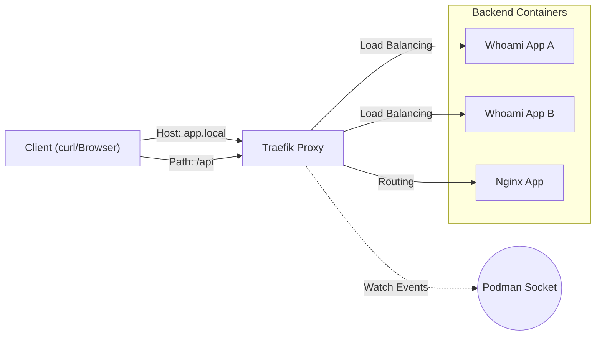

# Reverse Proxy Workshop: Understanding K8s Ingress through Traefik

In this workshop, you will learn the mechanics behind Kubernetes Ingress Controllers (L7 routing, load balancing, service discovery) using **Traefik**, a cloud-native edge router.

> **💡 Glossary**: Please refer to [Reverse Proxy](glossary_en.md#network), [Ingress](glossary_en.md#architecture), or [Service Discovery](glossary_en.md#architecture) in the [Glossary](glossary_en.md) for technical terms used in this workshop.

## Goal

By completing this workshop, you will be able to:

- Understand basic L7 reverse proxy functions (path-based/host-based routing)
- Configure load balancing for multiple backend services
- Process requests using middleware (Basic Auth, header modification)
- Understand service discovery mechanisms that detect dynamic container changes

---

## Traditional Challenges (Limits of Static Proxies)

With traditional proxies like Nginx, you had to rewrite configuration files (`nginx.conf`) and reload the service every time backend servers were added or removed.

### ❌ Challenges

- Configuration changes required whenever container IPs change
- Risk of downtime and operational errors during updates
- Increased management cost in microservices environments

### ✅ Traefik's Approach

- **Service Discovery**: Watches Podman or Kubernetes API to automatically update configuration
- **Dynamic Configuration**: Applies routing rules immediately without restarts
- **Middleware**: Applies features like authentication and rate limiting as plugins

---

## Architecture

We will build dynamic routing based on container labels using Podman's Docker-compatible API provider. Traefik watches the Podman socket and immediately adds containers with labels to routing as they start.



### Directory Structure

```text
infra/assets/traefik/
├── docker-compose.yml      # Traefik and backend definition
└── Makefile                # Operations commands
```

---

## Preparation

### 1. Create Podman Compose Definition

Create a `docker-compose.yml` with the following content. We will use the lightweight `traefik/whoami` image (an app that simply returns HTTP request info) as the backend.

```yaml
version: "3"

services:
  # Traefik Reverse Proxy
  traefik:
    image: traefik:v2.10
    command:
      - "--api.insecure=true"
      - "--providers.docker=true"
      - "--providers.docker.exposedbydefault=false"
      - "--entrypoints.web.address=:80"
    ports:
      - "80:80"
      - "8080:8080" # Dashboard
    volumes:
      - /run/podman/podman.sock:/var/run/docker.sock:ro

  # Backend A (Whoami)
  whoami-a:
    image: traefik/whoami
    labels:
      - "traefik.enable=true"
      - "traefik.http.routers.whoami.rule=Host(`whoami.localhost`)"
      - "traefik.http.services.whoami.loadbalancer.server.port=80"

  # Backend B (Whoami - LB as same service)
  whoami-b:
    image: traefik/whoami
    labels:
      - "traefik.enable=true"
      - "traefik.http.routers.whoami.rule=Host(`whoami.localhost`)"
      - "traefik.http.services.whoami.loadbalancer.server.port=80"
```

### 2. Start Containers

```bash
podman compose up -d
```

### ✅ Verification Checkpoints

- [ ] Confirmed `traefik`, `whoami-a`, and `whoami-b` are running via `podman ps`.
- [ ] Confirmed Traefik Dashboard is accessible at `http://localhost:8080`.
- [ ] Confirmed the `whoami` HTTP Router is visible in the dashboard.

> Note: This repository includes `infra/assets/traefik` as a sample directory. Review and adjust the files as needed while following this guide.

---

## Workshop Steps

### STEP 1: Check Dashboard

Access `http://localhost:8080` in your browser.
Verify that Traefik has automatically detected the services running on Podman (`whoami-a`, `whoami-b`). The key point is that they are recognized without writing a configuration file.

### STEP 2: Host-based Routing and Load Balancing

Send requests to `whoami.localhost` and confirm that Traefik distributes requests between the two containers.

```bash
# 1st request
curl -H "Host: whoami.localhost" http://localhost
# Output: Hostname: <Container-ID-A>

# 2nd request
curl -H "Host: whoami.localhost" http://localhost
# Output: Hostname: <Container-ID-B>
```

**Check Point**: The output `Hostname` is the container ID. If a different ID is displayed for each request, load balancing is successful.
_Note_: Just by launching multiple containers with the same `Host` rule in `docker-compose.yml`, Traefik automatically handles load balancing.

### STEP 3: Add Path-based Routing

Add a new Nginx container and make it accessible at the `/nginx` path. This can be done dynamically via `podman run` without editing `docker-compose.yml`.

```bash
podman run -d --name nginx-demo \
  --label "traefik.enable=true" \
  --label "traefik.http.routers.nginx.rule=Host(`localhost`) && PathPrefix(`/nginx`)" \
  --label "traefik.http.services.nginx.loadbalancer.server.port=80" \
  nginx:alpine
```

Verify:

```bash
curl http://localhost/nginx
```

### ✅ Verification Checkpoints

- [ ] Confirmed different container IDs are returned by `curl -H "Host: whoami.localhost" http://localhost`.
- [ ] Confirmed the `nginx-demo` service immediately appears in the dashboard after starting it via `podman run`.
- [ ] Confirmed `/nginx` returns the Nginx welcome page or response.

### STEP 4: Apply Middleware (Basic Auth)

Try Middleware, a powerful feature of Traefik. Apply Basic Auth to specific routes.

```bash
# Generate password (user:password)
htpasswd -nb user password
# user:$apr1$Sr...
```

By adding labels and restarting the container, you can add an authentication layer without changing application code.

---

## Technical Highlights

### Relationship with Ingress

Kubernetes Ingress resources are standardized definitions of the "routing rules" configured in this workshop. Traefik acts as an Ingress Controller, reading Ingress resources from the K8s API and executing similar routing.

### Gateway to Service Mesh

Traefik mainly handles "Edge (External to Internal)" traffic, while controlling internal service-to-service communication (East-West) is the role of the next step, "Service Mesh (Envoy)".

---

## Cleanup

```bash
podman compose down
podman rm -f nginx-demo
```

---

## Next Steps

- **HTTPS**: Automatic certificate issuance with Let's Encrypt
- **Deploy to Kubernetes**: Installing Traefik using Helm Charts
- **Service Mesh**: Advanced traffic control using Envoy (Next Workshop)

---

## 🔧 Troubleshooting

### Dashboard Returning 404

**Symptoms**: Accessing `http://localhost:8080` returns a 404 or connection error.

**Causes and Solutions**:

- **API Not Enabled**: Ensure `--api.insecure=true` is present in the Traefik `command` section.
- **Port Mapping**: Verify port `8080:8080` is correctly mapped in `docker-compose.yml`.

### Services Not Discovered

**Symptoms**: `whoami` routers do not appear in the dashboard.

**Causes and Solutions**:

- **Socket Permissions**: Verify the `podman.sock` path and ensures it's mounted with `ro` (read-only).
- **Missing Labels**: Ensure the `traefik.enable=true` label is present on your backend containers.

---

## 💻 Environment Notes

### For macOS Users

- If using Podman Desktop, the socket path might differ from `/var/run/docker.sock`. Check your `DOCKER_HOST` environment variable if connection fails.

### For Windows Users

- Ensure localhost forwarding is enabled between WSL2 and Windows. If the browser fails to connect, try using `curl` directly within your WSL terminal.
