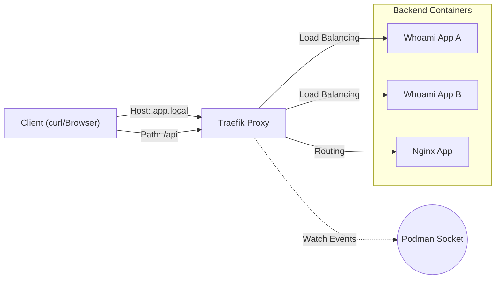

# リバースプロキシ実習：Traefik で学ぶ K8s Ingress の裏側

この実習では、クラウドネイティブなエッジルーターである **Traefik** を使用して、Kubernetes Ingress コントローラーの背後にある仕組み（L7 ルーティング、ロードバランシング、サービスディスカバリ）を学びます。

> **💡 用語集**: この実習で登場する[Reverse Proxy](glossary_ja.md#network)や[Ingress](glossary_ja.md#architecture)、[Service Discovery](glossary_ja.md#architecture)などの専門用語は [用語集](glossary_ja.md) を参照してください。

## ゴール

この実習を完了すると、以下のことができるようになります：

- L7 リバースプロキシの基本機能（パスベース/ホストベースのルーティング）を理解する
- 複数のバックエンドサービスに対するロードバランシングを設定する
- ミドルウェアを使用したリクエストの加工（Basic 認証、ヘッダー追加）を行う
- コンテナの動的な追加・削除を検知するサービスディスカバリの仕組みを理解する

---

## 従来の課題（静的プロキシの限界）

Nginx などの従来のプロキシでは、バックエンドサーバーが増減するたびに設定ファイル（`nginx.conf`）を書き換えてリロードする必要がありました。

### ❌ 課題

- コンテナの IP アドレスが変わるたびに設定変更が必要
- 設定変更時のダウンタイムやオペレーションミスのリスク
- マイクロサービス環境での管理コスト増大

### ✅ Traefik のアプローチ

- **サービスディスカバリ**: Podman や Kubernetes API を監視し、設定を自動更新
- **動的設定**: 再起動なしでルーティングルールを即座に反映
- **ミドルウェア**: 認証やレート制限などをプラグインのように適用可能

---

## アーキテクチャ

Podman の Docker 互換 API プロバイダーを使用して、コンテナラベルに基づいた動的なルーティングを構築します。Traefik は Podman ソケットを監視し、ラベルが付いたコンテナが起動すると即座にルーティングに追加します。



### 想定ディレクトリ構造

```text
infra/assets/traefik/
├── docker-compose.yml      # Traefik とバックエンドの定義
└── Makefile                # 操作コマンド
```

---

## 準備

### 1. Podman Compose 定義の作成

以下の内容で `docker-compose.yml` を作成します。ここでは軽量な `traefik/whoami` イメージ（HTTP リクエスト情報を返すだけのアプリ）をバックエンドとして使用します。

```yaml
version: "3"

services:
    # Traefik リバースプロキシ
    traefik:
        image: traefik:v2.10
        command:
            - "--api.insecure=true"
            - "--providers.docker=true"
            - "--providers.docker.exposedbydefault=false"
            - "--entrypoints.web.address=:80"
        ports:
            - "80:80"
            - "8080:8080" # Dashboard
        volumes:
            - /run/podman/podman.sock:/var/run/docker.sock:ro

    # バックエンド A (Whoami)
    whoami-a:
        image: traefik/whoami
        labels:
            - "traefik.enable=true"
            - "traefik.http.routers.whoami.rule=Host(`whoami.localhost`)"
            - "traefik.http.services.whoami.loadbalancer.server.port=80"

    # バックエンド B (Whoami - 同一サービスとしてLB)
    whoami-b:
        image: traefik/whoami
        labels:
            - "traefik.enable=true"
            - "traefik.http.routers.whoami.rule=Host(`whoami.localhost`)"
            - "traefik.http.services.whoami.loadbalancer.server.port=80"
```

### 2. コンテナの起動

```bash
podman compose up -d
```

### ✅ チェックポイント

- [ ] `podman ps` で `traefik`, `whoami-a`, `whoami-b` が実行中であることを確認した
- [ ] ブラウザで `http://localhost:8080` を開き、Dashboard が表示されることを確認した
- [ ] Dashboard の `HTTP Routers` タブに `whoami` ルールが存在することを確認した

> 注: このリポジトリには `infra/assets/traefik` のサンプルディレクトリが含まれています。必要に応じて内容を確認・編集して進めてください。

---

## 実習ステップ

### STEP 1: ダッシュボードの確認

ブラウザで `http://localhost:8080` にアクセスします。
Traefik が Podman 上で実行されているサービス（`whoami-a`, `whoami-b`）を自動的に検出していることを確認します。設定ファイルを書かなくても認識されている点がポイントです。

### STEP 2: ホストベース・ルーティングとロードバランシング

`whoami.localhost` へのリクエストを送信し、Traefik が 2 つのコンテナにリクエストを振り分けていることを確認します。

```bash
# 1回目
curl -H "Host: whoami.localhost" http://localhost
# Output: Hostname: <Container-ID-A>

# 2回目
curl -H "Host: whoami.localhost" http://localhost
# Output: Hostname: <Container-ID-B>
```

**確認ポイント**: 出力される `Hostname` はコンテナ ID です。リクエストごとに異なる ID が表示されれば、ロードバランシングが成功しています。
※ `docker-compose.yml` で同じ `Host` ルールを持つコンテナを複数起動するだけで、Traefik が自動的に負荷分散を行います。

### STEP 3: パスベース・ルーティングの追加

新しい Nginx コンテナを追加し、`/nginx` パスでアクセスできるようにします。これは `docker-compose.yml` を編集せずに、`podman run` で動的に追加できます。

```bash
podman run -d --name nginx-demo \
  --label "traefik.enable=true" \
  --label "traefik.http.routers.nginx.rule=Host(`localhost`) && PathPrefix(`/nginx`)" \
  --label "traefik.http.services.nginx.loadbalancer.server.port=80" \
  nginx:alpine
```

確認：

```bash
curl http://localhost/nginx
```

### ✅ チェックポイント

- [ ] `curl -H "Host: whoami.localhost" http://localhost` を複数回実行し、異なるコンテナ ID が返ることを確認した
- [ ] `podman run` で追加した nginx コンテナが Dashboard に即座に現れることを確認した
- [ ] `/nginx` へのアクセスで nginx の Welcome ページ（または 404 Nginx 版）が返ることを確認した

### STEP 4: ミドルウェアの適用（Basic 認証）

Traefik の強力な機能であるミドルウェアを試します。特定のルートに Basic 認証をかけます。

```bash
# パスワード生成 (user:password)
htpasswd -nb user password
# user:$apr1$Sr...
```

ラベルを追加してコンテナを再起動することで、アプリケーションコードを変更せずに認証層を追加できます。

---

## 技術的なポイント

### Ingress との関係

Kubernetes の Ingress リソースは、この実習で設定した「ルーティングルール」の標準化された定義です。Traefik は Ingress Controller として動作し、K8s API から Ingress リソースを読み取って、同様のルーティングを実行します。

### サービスメッシュへの入り口

Traefik は主に「エッジ（外部から内部）」のトラフィックを扱いますが、内部のサービス間通信（East-West）を制御するのが次のステップである「サービスメッシュ（Envoy）」です。

---

## 片付け

```bash
podman compose down
podman rm -f nginx-demo
```

---

## 次のステップ

- **HTTPS 化**: Let's Encrypt と連携した自動証明書発行
- **Kubernetes へのデプロイ**: Helm チャートを使用した Traefik の導入
- **サービスメッシュ**: Envoy を使用したより高度なトラフィック制御（次の実習）

---

## 🔧 トラブルシューティング

### Dashboard にアクセスできない (404)

**症状**: `http://localhost:8080` が 404 になる、または接続できない

**原因と対処**:

- **API 未有効化**: `docker-compose.yml` の `command` に `--api.insecure=true` が含まれているか確認してください。
- **ポートマッピング**: `ports` に `8080:8080` が正しく記述されているか確認してください。

### サービスが検出されない (Service Discovery)

**症状**: Dashboard に `whoami` ルーターが表示されない

**原因と対処**:

- **ソケットの権限**: `podman.sock` のマウントパスが正しいか、読み取り権限 (`ro`) があるか確認してください。
- **ラベルの誤記**: `traefik.enable=true` ラベルを忘れていないか確認してください。

---

## 💻 環境別注意事項

### macOS の場合

- Podman Desktop を使用している場合、`podman.sock` のパスが `/var/run/docker.sock` ではない場合があります。必要に応じて環境変数 `DOCKER_HOST` を確認してください。

### Windows の場合

- WSL2 で実行する場合、localhost 転送を有効にする必要があります。ブラウザから Dashboard にアクセスできない場合は `wsl.conf` や Windows のファイアウォール設定を確認してください。
