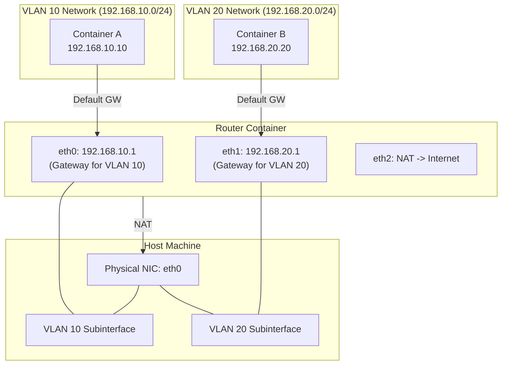

# Podman Workshop: Building an L3 Isolated Network with macvlan and Linux Router

This is a hands-on workshop for software engineers to build a simulated physical network environment using container technology (Podman) and Linux network features (macvlan, VLAN, iptables).

## Goal

Build and understand the following configuration **hands-on**.



**Achieved State:**

1. **L2 Isolation:** `Container A` and `Container B` belong to different VLANs and cannot communicate directly (ping fails).
2. **L3 Routing:** Communication is possible via the `Router` container.
3. **Internet Connectivity:** Through the NAT function of the `Router`, each container can connect to the outside (Internet) to install packages, etc.

---

## Prerequisites

- **OS:** Ubuntu 24.04 LTS (Recommended)
- **Podman:** Rootful mode (sudo privileges required)
- **Physical NIC Name:** `eth0`
  - *Note:* Depending on the environment, it may be `ens5`, `ens3`, `enp0s3`, etc. Check with `ip link` and replace accordingly.
- **Environment limitations:** macvlan/VLAN may not work on some cloud VMs or desktop hypervisors due to NIC restrictions. Use a Linux VM with a bridged NIC when possible.

### Environment Check

```bash
# Ensure rootless is false
podman info | grep rootless
# rootless: false

# Check physical NIC name
ip link show
```

---

## Step 1. Create VLAN Subinterfaces on the Host

First, create virtual VLAN interfaces on top of the physical NIC (`IF`). This serves as the "physical" separation line of the network.

```bash
# Check physical interface names (e.g., ens5, eth0, enp0s3)
ip -brief link
export IF=ens5 # Replace with your actual interface name

# Ensure the VLAN module (8021q) is loaded
sudo modprobe 8021q

# Delete existing subinterfaces (if they exist)
sudo ip link delete $IF.10 2>/dev/null
sudo ip link delete $IF.20 2>/dev/null

# Create subinterface for VLAN 10
sudo ip link add link $IF name $IF.10 type vlan id 10

# Create subinterface for VLAN 20
sudo ip link add link $IF name $IF.20 type vlan id 20

# Enable interfaces
sudo ip link set $IF.10 up
sudo ip link set $IF.20 up

# Verify $IF.10 and $IF.20 are displayed
ip link show
```

*Note:* "Cannot find device" errors are OK if the subinterfaces do not exist.

**Explanation:**

- The `macvlan` network driver requires a parent physical (or VLAN) interface.
- We do not assign IP addresses here. These function purely as pipes for passing L2 frames.

---

## Step 2. Define Podman Networks

Create Podman network definitions using the created VLAN interfaces.

### VLAN 10 (For Container A)

```bash
sudo podman network create \
  --driver macvlan \
  --subnet 192.168.10.0/24 \
  --gateway 192.168.10.1 \
  -o parent=$IF.10 \
  net-vlan10
```

### VLAN 20 (For Container B)

```bash
sudo podman network create \
  --driver macvlan \
  --subnet 192.168.20.0/24 \
  --gateway 192.168.20.1 \
  -o parent=$IF.20 \
  net-vlan20
```

**Verification:**

```bash
sudo podman network ls
# net-vlan10 and net-vlan20 should be displayed
```

> **📝 Note: CIDR Notation (`/24`) and macvlan**
>
> **CIDR (Classless Inter-Domain Routing):**
> `/24` is a notation representing an IP address range. It means the first 24 bits of the 32-bit IP address represent the "Network Address" (the street), and the remaining 8 bits represent the "Host Address" (the house number).
> For `/24`, the host portion has $2^8 = 256$ addresses. However, since the first (Network address) and last (Broadcast address) are reserved, **254** addresses are actually available for use.
>
> - Network: `192.168.10.0`
> - Host Range: `192.168.10.1` to `192.168.10.254`
>
> **macvlan:**
> A Linux kernel feature that allows a single physical NIC to have multiple distinct MAC addresses.
> To the container, it appears as if it has "its own physical cable plugged into a switch." This enables high-performance network isolation (L2 isolation) with very low overhead.

---

## Step 3. Build the Router Container

Create a "router" to connect different networks. This container has 3 network interfaces.

1. **eth0 (podman):** Exit to host/Internet (for NAT, default gateway)
2. **eth1 (net-vlan10):** Gateway for VLAN 10 side (192.168.10.1)
3. **eth2 (net-vlan20):** Gateway for VLAN 20 side (192.168.20.1)

```bash
# 1. Start container (connect to default podman network first)
# This ensures the default gateway points to the Internet
sudo podman run -d --name router \
  --network podman \
  --cap-add NET_ADMIN \
  --sysctl net.ipv4.ip_forward=1 \
  alpine sleep infinity

# 2. Connect to net-vlan10
sudo podman network connect \
  --ip 192.168.10.1 \
  net-vlan10 router

# 3. Connect to net-vlan20
sudo podman network connect \
  --ip 192.168.20.1 \
  net-vlan20 router
```

**Verification:**
Confirm that the container has 3 interfaces: `eth0`, `eth1`, and `eth2` (+ `lo`).

```bash
sudo podman exec router ip addr
```

Output should show `10.88.x.x` (eth0), `192.168.10.1` (eth1), and `192.168.20.1` (eth2) IPs.

---

## Step 4. Configure NAT (IP Masquerade) on Router

Use `iptables` inside the router container to relay traffic from private networks to the Internet.
These rules are not persistent and will be lost if the router container restarts. A common way to make them persistent is to save rules with `iptables-save` and run `iptables-restore` at container startup (via entrypoint or a startup script). In practice, people also bake the rules into the image or use `nftables` configs loaded on boot.

```bash
# Install iptables tool
sudo podman exec router apk add --no-cache iptables

# Apply NAT settings
sudo podman exec router sh -c \
'\
# Rewrite source IP of outgoing traffic (eth0) to eth0 IP (Masquerade)
iptables -t nat -A POSTROUTING -o eth0 -j MASQUERADE

# Forwarding permission settings
# VLAN 10 (eth1) -> Internet (eth0)
iptables -A FORWARD -i eth1 -o eth0 -j ACCEPT
# VLAN 20 (eth2) -> Internet (eth0)
iptables -A FORWARD -i eth2 -o eth0 -j ACCEPT
# Allow return packets (Established/Related)
iptables -A FORWARD -i eth0 -m state --state ESTABLISHED,RELATED -j ACCEPT
'
```

**Command Breakdown:**

1. `iptables -t nat -A POSTROUTING -o eth0 -j MASQUERADE`
    - **Meaning:** "Rewrite the source IP of packets going out to the Internet (`eth0`) to the router's own IP."
    - `-t nat`: Uses the NAT table for address translation.
    - `POSTROUTING`: Processes packets *after* the routing decision has been made.
    - `MASQUERADE`: Performs dynamic IP Masquerading (NAPT).

2. `iptables -A FORWARD -i eth1 -o eth0 -j ACCEPT`
    - **Meaning:** "Allow (`ACCEPT`) packets entering from VLAN 10 (`eth1`) and destined for the Internet (`eth0`)."
    - `FORWARD`: The chain that handles packets simply passing *through* the router (not destined for the router itself).

3. `iptables -A FORWARD -i eth2 -o eth0 -j ACCEPT`
    - **Meaning:** "Allow packets entering from VLAN 20 (`eth2`) and destined for the Internet (`eth0`)."

4. `iptables -A FORWARD -i eth0 -m state --state ESTABLISHED,RELATED -j ACCEPT`
    - **Meaning:** "Allow packets returning from the Internet (`eth0`) only if they are part of an existing connection (`ESTABLISHED`) or related to one (`RELATED`)."
    - Without this, you could send requests out, but the firewall would block the responses (like web pages) from coming back.

> **📝 Note: NAT and IP Masquerade (NAPT)**
>
> **NAT (Network Address Translation):**
> A general term for technologies that translate IP addresses. Typically, devices with private IP addresses (192.168.x.x) cannot communicate directly with the Internet because Internet routers do not know routes to private IPs.
>
> **IP Masquerade (NAPT / IP Masquerade):**
> A type of NAT that allows multiple containers to share a single public IP address (the host's IP in this case) to communicate externally.
> The router (this container) rewrites the "source IP" and "source port" of outgoing traffic to its own "external IP" and an "available port," records this in a translation table, and sends it out. Returning packets are forwarded back to the original container by referencing this table.
> To the outside world, it appears as if only the router (one IP) is communicating. This is why it's called "Masquerade."

---

## Step 5. Create Client Containers

Deploy client containers to VLAN 10 and VLAN 20 respectively.

### Container A (VLAN 10)

```bash
sudo podman run -d --name a \
  --network net-vlan10 \
  --ip 192.168.10.10 \
  alpine sleep infinity
```

**Verification:**

```bash
# 1. Check if IP address is assigned correctly
sudo podman exec a ip addr show eth0

# 2. Check ping to gateway (router)
sudo podman exec a ping -c 3 192.168.10.1
```

### Container B (VLAN 20)

```bash
sudo podman run -d --name b \
  --network net-vlan20 \
  --ip 192.168.20.20 \
  alpine sleep infinity
```

**Verification:**

```bash
# 1. Check IP address
sudo podman exec b ip addr show eth0

# 2. Check ping to gateway (router)
sudo podman exec b ping -c 3 192.168.20.1
```

---

## Step 6. Verify Operation

Verify that the built network operates as expected.

### 1. Reachability Check (Routing)

Ping from Container A to Container B (different network).
If the router is functioning correctly, the Ping will pass.

```bash
sudo podman exec a ping -c 3 192.168.20.20
# PING 192.168.20.20 (192.168.20.20): 56 data bytes
# 64 bytes from 192.168.20.20: seq=0 ttl=63 time=0.xxx ms
# ...
```

Check reverse direction (B -> A) as well.

```bash
sudo podman exec b ping -c 3 192.168.10.10
```

### 2. Internet Connection Check (NAT)

Confirm access to Internet resources from Container A.

```bash
# Install curl and dig (bind-tools) (Internet connection required)
sudo podman exec a apk add --no-cache curl bind-tools

# Check DNS
sudo podman exec a dig www.google.com

# Check HTTP
sudo podman exec a curl -I https://www.google.com
# Response like HTTP/2 200 ... is OK
```

### 3. Experiment: Blocking and Restoring Routing

Let's add a rule to the router's `FORWARD` chain to block traffic from VLAN 10 (`eth1`) to VLAN 20 (`eth2`).

```bash
# 1. Add a blocking rule (Insert at the top)
# "Drop packets entering from eth1 and exiting to eth2"
sudo podman exec router iptables -I FORWARD -i eth1 -o eth2 -j DROP

# 2. Verify reachability (Confirm failure)
# Container A -> Container B
sudo podman exec a ping -c 3 -W 1 192.168.20.20
# Result: Should result in 100% packet loss

# 3. Delete the rule (Restore)
# Delete (-D) the rule we added
sudo podman exec router iptables -D FORWARD -i eth1 -o eth2 -j DROP

# 4. Verify reachability (Confirm success)
sudo podman exec a ping -c 3 192.168.20.20
```

---

## Cleanup

After finishing the workshop, restore the environment.

```bash
# Stop and remove containers
sudo podman rm -f a b router

# Remove networks
sudo podman network rm net-vlan10 net-vlan20

# Delete VLAN interfaces on host
sudo ip link delete $IF.10
sudo ip link delete $IF.20
```

---

## Summary

1. **macvlan** is a technology that makes containers appear as if they are directly connected to the physical network (L2).
2. By using **VLAN** subinterfaces, you can logically separate networks over a single physical cable.
3. **Linux Containers** can function as high-performance routers easily with appropriate settings (`ip_forward`, `iptables`).

```
