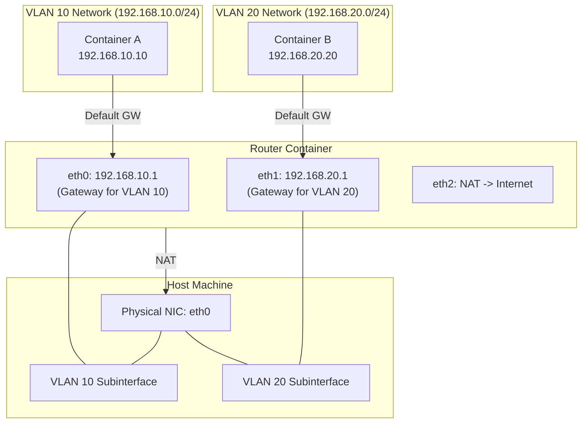

# Podman Workshop: Building L3 Isolated Networks with macvlan and Linux Router

This is a hands-on workshop for software engineers to build a simulated physical network environment using container technology (Podman) and Linux network features (macvlan, VLAN, iptables).

## Goal

Build the following configuration and understand the mechanisms of L2 isolation and L3 routing.


```mermaid
graph TD
    subgraph Host [Host Machine]
        eth0[Physical NIC: eth0]
        eth0 --- eth0.10[VLAN 10 Subinterface]
        eth0 --- eth0.20[VLAN 20 Subinterface]
    end

    subgraph "VLAN 10 Network (192.168.10.0/24)"
        ContainerA[Container A<br>192.168.10.10]
    end

    subgraph "VLAN 20 Network (192.168.20.0/24)"
        ContainerB[Container B<br>192.168.20.20]
    end

    subgraph RouterContainer [Router Container]
        eth10["eth0: 192.168.10.1<br>(Gateway for VLAN 10)"]
        eth20["eth1: 192.168.20.1<br>(Gateway for VLAN 20)"]
        ethNat[eth2: NAT -> Internet]
    end

    ContainerA -->|Default GW| eth10
    ContainerB -->|Default GW| eth20

    eth10 --- eth0.10
    eth20 --- eth0.20

    RouterContainer -->|NAT| eth0
```

**Achieved State:**

1. **L2 Isolation**: `Container A` and `Container B` belong to different VLANs and cannot communicate directly.
2. **L3 Routing**: Communication is possible via the `Router` container.
3. **Internet Connectivity**: Each container can connect to the outside through the NAT function of the `Router`.

---

## Challenges in Network Isolation

Traditionally, physically separating networks required separate switches and cables.

### ❌ Challenges

- Physical wiring is cumbersome and error-prone.
- Hard to change the configuration flexibly as servers are added or changed.
- Difficult to efficiently share a single physical NIC.

### ✅ macvlan and VLAN Solutions

- **VLAN**: Logically creates multiple independent "pipes" within a single physical cable.
- **macvlan**: Assigns a unique MAC address to a container, making it appear directly connected to the physical network. This enables high-speed communication without the overhead of virtual bridges.

---

## Architecture

In this workshop, we use Rootful Podman and directly manipulate Linux kernel network features.

### Layer Structure and Directory

```text
/etc/cni/net.d/ (Internal)
    -- net-vlan10.conflist   # Podman VLAN 10 network definition
    -- net-vlan20.conflist   # Podman VLAN 20 network definition
```

---

## Preparation

### 1. Prerequisites

- **OS:** Ubuntu 24.04 LTS (Recommended)
- **Podman:** Rootful mode (sudo required)
- **Physical NIC:** `eth0` (Replace with `ens5`, etc., as needed)

### 2. Verify Environment

```bash
# Ensure Rootful mode (should be false)
sudo podman info | grep rootless
# rootless: false
```

---

## Workshop Steps

### STEP 1: Create VLAN Subinterfaces on Host

Create virtual VLAN interfaces on top of the physical NIC.

```bash
export IF=eth0 # Change as needed
sudo modprobe 8021q

# Create and enable subinterfaces for VLAN 10/20
sudo ip link add link $IF name $IF.10 type vlan id 10
sudo ip link add link $IF name $IF.20 type vlan id 20
sudo ip link set $IF.10 up
sudo ip link set $IF.20 up
```

### STEP 2: Define Podman Networks

```bash
# VLAN 10 definition
sudo podman network create --driver macvlan --subnet 192.168.10.0/24 --gateway 192.168.10.1 -o parent=$IF.10 net-vlan10

# VLAN 20 definition
sudo podman network create --driver macvlan --subnet 192.168.20.0/24 --gateway 192.168.20.1 -o parent=$IF.20 net-vlan20
```

### STEP 3: Build Router Container

Create a router that bridges the three networks (Internet, VLAN 10, VLAN 20).

```bash
# 1. Start router
sudo podman run -d --name router --network podman --cap-add NET_ADMIN --sysctl net.ipv4.ip_forward=1 alpine sleep infinity

# 2. Connect to VLAN 10/20
sudo podman network connect --ip 192.168.10.1 net-vlan10 router
sudo podman network connect --ip 192.168.20.1 net-vlan20 router

# 3. Remove redundant default routes
sudo podman exec router ip route del default via 192.168.10.1 dev eth1 2>/dev/null || true
sudo podman exec router ip route del default via 192.168.20.1 dev eth2 2>/dev/null || true
```

### STEP 4: Configure NAT on Router

```bash
sudo podman exec router apk add --no-cache iptables

# Allow NAT and forwarding
sudo podman exec router sh -c \
'iptables -t nat -A POSTROUTING -o eth0 -j MASQUERADE
iptables -A FORWARD -i eth1 -o eth0 -j ACCEPT
iptables -A FORWARD -i eth2 -o eth0 -j ACCEPT
iptables -A FORWARD -i eth0 -m state --state ESTABLISHED,RELATED -j ACCEPT'
```

### STEP 5: Create Client Containers

```bash
# Container A (VLAN 10)
sudo podman run -d --name a --network net-vlan10 --ip 192.168.10.10 alpine sleep infinity

# Container B (VLAN 20)
sudo podman run -d --name b --network net-vlan20 --ip 192.168.20.20 alpine sleep infinity
```

### STEP 6: Verify Operation

1. **Connectivity**: Confirm Ping from A to B.

   ```bash
   sudo podman exec a ping -c 3 192.168.20.20
   ```

2. **Blocking Routing**: Verify that Ping fails when blocked at the router.

   ```bash
   sudo podman exec router iptables -I FORWARD -i eth1 -o eth2 -j DROP
   sudo podman exec a ping -c 3 -W 1 192.168.20.20 # Should fail
   ```

---

## Cleanup

```bash
sudo podman rm -f a b router
sudo podman network rm net-vlan10 net-vlan20
sudo ip link delete $IF.10
sudo ip link delete $IF.20
```

---

## Summary

1. **VLANs** allow logical partitioning of physical interfaces.
2. **macvlan** enables a network configuration where containers are directly connected to physical switches.
3. A **Linux router** can be easily built with just `ip_forward` and `iptables`.
