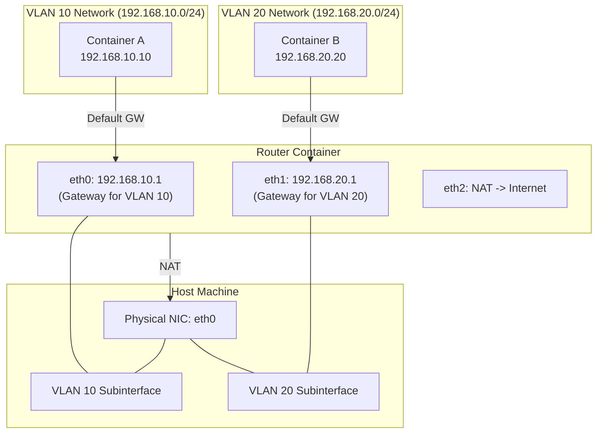

# Podman 実習：macvlan と Linux ルーターで作る L3 分離ネットワーク

ソフトウェアエンジニア向けに、コンテナ技術（Podman）と Linux のネットワーク機能（macvlan, VLAN, iptables）を使って、擬似的な物理ネットワーク環境を構築する実習です。

## ゴール

以下の構成を **手を動かして構築し、理解** します。



**達成する状態:**

1. **L2 分離:** `Container A` と `Container B` は異なる VLAN に属し、直接通信できません（ping が通らない）。
2. **L3 ルーティング:** `Router` コンテナを経由することで、相互に通信できます。
3. **インターネット接続:** `Router` の NAT 機能により、各コンテナから外部（インターネット）へ接続し、パッケージのインストールなどが可能です。

---

## 前提条件

- **OS:** Ubuntu 24.04 LTS (推奨)
- **Podman:** Rootful モード (sudo 権限が必要)
- **物理 NIC 名:** `eth0`
  - ※ 環境によって `ens5`, `ens3`, `enp0s3` など異なります。`ip link` コマンドで確認し、適宜読み替えてください。
- **環境制約:** macvlan/VLAN が利用できないクラウドVMやデスクトップ仮想環境があります。可能であればブリッジ接続の Linux VM を利用してください。

### 環境確認

```bash
# rootless が false であることを確認
podman info | grep rootless
# rootless: false

# 物理NIC名を確認
ip link show
```

---

## Step 1. ホストに VLAN サブインタフェースを作る

まず、物理 NIC (`IF`) の上に、仮想的な VLAN インタフェースを作成します。これがネットワークの「物理的な」分離線となります。

```bash
# 物理インタフェース名を確認 (例: ens5, eth0, enp0s3)
ip -brief link
export IF=ens5 # ご自身の環境に合わせて変更してください

# VLAN モジュール (8021q) がロードされているか確認
sudo modprobe 8021q

# 既存のサブインタフェースを削除（存在する場合）
sudo ip link delete $IF.10 2>/dev/null
sudo ip link delete $IF.20 2>/dev/null

# VLAN 10 用のサブインタフェース作成
sudo ip link add link $IF name $IF.10 type vlan id 10

# VLAN 20 用のサブインタフェース作成
sudo ip link add link $IF name $IF.20 type vlan id 20

# インタフェースを有効化
sudo ip link set $IF.10 up
sudo ip link set $IF.20 up

# $IF.10, $IF.20 が表示されることを確認
ip link show
```

※ `Cannot find device` などのエラーは、サブインタフェースが存在しない場合は問題ありません。

**解説:**

- `macvlan` ネットワークドライバは、親となる物理（または VLAN）インタフェースを必要とします。
- ここでは IP アドレスを付与しません。これらは純粋に L2 フレームを流す土管として機能します。

---

## Step 2. Podman ネットワークを定義する

作成した VLAN インタフェースを使って、Podman のネットワーク定義を作成します。

### VLAN 10 (Container A 用)

```bash
sudo podman network create \
  --driver macvlan \
  --subnet 192.168.10.0/24 \
  --gateway 192.168.10.1 \
  -o parent=$IF.10 \
  net-vlan10
```

### VLAN 20 (Container B 用)

```bash
sudo podman network create \
  --driver macvlan \
  --subnet 192.168.20.0/24 \
  --gateway 192.168.20.1 \
  -o parent=$IF.20 \
  net-vlan20
```

**確認:**

```bash
sudo podman network ls
# net-vlan10 と net-vlan20 が表示されること
```

> **📝 Note: CIDR 表記 (`/24`) と macvlan**
>
> **CIDR (Classless Inter-Domain Routing):**
> `/24` は IPアドレスの範囲を表す記法です。IPアドレス（32ビット）のうち、先頭24ビットが「ネットワークの住所（街）」、残りの8ビットが「個々のホスト（番地）」を表します。
> `/24` の場合、ホスト部は $2^8 = 256$ 個ですが、最初（ネットワークアドレス）と最後（ブロードキャストアドレス）は予約されているため、実際に使えるのは **254個** です。
>
> - ネットワーク: `192.168.10.0`
> - ホスト範囲: `192.168.10.1` ～ `192.168.10.254`
>
> **macvlan:**
> Linuxカーネルの機能で、1つの物理NICに複数の異なるMACアドレスを持たせることができます。
> コンテナからは「自分専用の物理ケーブルがスイッチに刺さっている」ように見えます。これにより、非常にオーバーヘッドの少ない高速なネットワーク分離（L2分離）が可能になります。

---

## Step 3. ルーターコンテナを構築する

異なるネットワーク間をつなぐ「ルーター」を作成します。このコンテナは 3 つのネットワークインタフェースを持ちます。

1. **eth0 (podman):** ホスト/インターネットへの出口 (NAT用、デフォルトゲートウェイ)
2. **eth1 (net-vlan10):** VLAN 10 側のゲートウェイ (192.168.10.1)
3. **eth2 (net-vlan20):** VLAN 20 側のゲートウェイ (192.168.20.1)

```bash
# 1. コンテナ起動（まず podman デフォルトネットワークに接続）
# これにより、このコンテナのデフォルトゲートウェイがインターネットを向きます
sudo podman run -d --name router \
  --network podman \
  --cap-add NET_ADMIN \
  --sysctl net.ipv4.ip_forward=1 \
  alpine sleep infinity

# 2. net-vlan10 に接続
sudo podman network connect \
  --ip 192.168.10.1 \
  net-vlan10 router

# 3. net-vlan20 に接続
sudo podman network connect \
  --ip 192.168.20.1 \
  net-vlan20 router
```

**確認:**
コンテナ内のインタフェースが `eth0`, `eth1`, `eth2` の 3 つ（+ `lo`）存在することを確認します。

```bash
sudo podman exec router ip addr
```

出力に `10.88.x.x` (eth0), `192.168.10.1` (eth1), `192.168.20.1` (eth2) の IP が見えれば成功です。

---

## Step 4. ルーターで NAT (IP マスカレード) を設定する

ルーターコンテナ内で `iptables` を使い、プライベートネットワークからの通信をインターネットへ中継できるようにします。
これらのルールは永続ではなく、ルーターコンテナの再起動で消えます。永続化する場合は、`iptables-save` でルールを保存し、コンテナ起動時に `iptables-restore` を実行する（エントリポイントや起動スクリプトで自動実行する）方法が一般的です。運用では、ルールを入れたイメージを作る、または `nftables` の設定を用意して起動時に読み込む構成もよく使われます。

```bash
# iptables ツールをインストール
sudo podman exec router apk add --no-cache iptables

# NAT 設定を投入
sudo podman exec router sh -c \
'\
# 外向き (eth0) 通信の送信元 IP を eth0 の IP に書き換える (Masquerade)
iptables -t nat -A POSTROUTING -o eth0 -j MASQUERADE

# 転送許可設定
# VLAN 10 (eth1) -> Internet (eth0)
iptables -A FORWARD -i eth1 -o eth0 -j ACCEPT
# VLAN 20 (eth2) -> Internet (eth0)
iptables -A FORWARD -i eth2 -o eth0 -j ACCEPT
# 戻りパケットの許可 (Established/Related)
iptables -A FORWARD -i eth0 -m state --state ESTABLISHED,RELATED -j ACCEPT
'
```

**コマンド詳細解説:**

1. `iptables -t nat -A POSTROUTING -o eth2 -j MASQUERADE`
    - **意味:** 「インターネット側（`eth2`）から出ていくパケットの送信元IPを、ルーター自身のIPに書き換える」
    - `-t nat`: アドレス変換を行う NAT テーブルを使用します。
    - `POSTROUTING`: ルーティング（行き先決定）が終わった「後」のタイミングで処理します。
    - `MASQUERADE`: 動的IPマスカレードを行います（NAPT）。

2. `iptables -A FORWARD -i eth0 -o eth2 -j ACCEPT`
    - **意味:** 「VLAN 10 (`eth0`) から入り、インターネット (`eth2`) へ抜けるパケットを許可 (`ACCEPT`) する」
    - `FORWARD`: ルーター自体宛てではなく、ルーターを「通過」するパケットを扱うチェーンです。

3. `iptables -A FORWARD -i eth1 -o eth2 -j ACCEPT`
    - **意味:** 「VLAN 20 (`eth1`) から入り、インターネット (`eth2`) へ抜けるパケットを許可する」

4. `iptables -A FORWARD -i eth2 -m state --state ESTABLISHED,RELATED -j ACCEPT`
    - **意味:** 「インターネット (`eth2`) から戻ってくるパケットのうち、こちらから開始した通信 (`ESTABLISHED`) やそれに関連するもの (`RELATED`) だけを許可する」
    - これがないと、リクエストは出せてもレスポンス（Webサイトの表示結果など）がファイアウォールでブロックされて戻ってきません。

> **📝 Note: NAT と IPマスカレード（NAPT）**
>
> **NAT (Network Address Translation):**
> IPアドレスを変換する技術の総称です。通常、プライベートIPアドレス（192.168.x.x）を持つ機器は、そのままではインターネットと通信できません。インターネット上のルーターはプライベートIPへの経路を知らないからです。
>
> **IPマスカレード (NAPT / IP Masquerade):**
> NATの一種で、1つのグローバルIPアドレス（ここではホスト側のIP）を複数のコンテナで共有して外部と通信する仕組みです。
> ルーター（このコンテナ）は、内側からの通信の「送信元IP」と「送信元ポート」を、自分の「外側のIP」と「空いているポート」に書き換え、変換テーブルに記録して外部へ送信します。戻ってきたパケットはそのテーブルを参照して、元のコンテナへ転送されます。
> これにより、外部からはルーター（1つのIP）だけが通信しているように見えます。「マスカレード（仮面舞踏会）」と呼ばれる所以です。

---

## Step 5. クライアントコンテナを作成する

VLAN 10 と VLAN 20 にそれぞれクライアントコンテナを配置します。

### Container A (VLAN 10)

```bash
sudo podman run -d --name a \
  --network net-vlan10 \
  --ip 192.168.10.10 \
  alpine sleep infinity
```

**確認:**

```bash
# 1. IPアドレスが正しく割り当てられているか
sudo podman exec a ip addr show eth0

# 2. ゲートウェイ（router）に Ping が届くか
sudo podman exec a ping -c 3 192.168.10.1
```

### Container B (VLAN 20)

```bash
sudo podman run -d --name b \
  --network net-vlan20 \
  --ip 192.168.20.20 \
  alpine sleep infinity
```

**確認:**

```bash
# 1. IPアドレスの確認
sudo podman exec b ip addr show eth0

# 2. ゲートウェイ（router）に Ping が届くか
sudo podman exec b ping -c 3 192.168.20.1
```

---

## Step 6. 動作確認

構築したネットワークが期待通り動作するか検証します。

### 1. 疎通確認 (Routing)

Container A から Container B (異なるネットワーク) へ Ping を打ちます。
ルーターが正しく機能していれば、Ping は通ります。

```bash
sudo podman exec a ping -c 3 192.168.20.20
# PING 192.168.20.20 (192.168.20.20): 56 data bytes
# 64 bytes from 192.168.20.20: seq=0 ttl=63 time=0.xxx ms
# ...
```

逆方向 (B -> A) も確認します。

```bash
sudo podman exec b ping -c 3 192.168.10.10
```

### 2. インターネット接続確認 (NAT)

Container A からインターネット上のリソースにアクセスできるか確認します。

```bash
# curl と dig (bind-tools) をインストールしてみる（インターネット接続が必要）
sudo podman exec a apk add --no-cache curl bind-tools

# DNS の確認
sudo podman exec a dig www.google.com

# HTTP の確認
sudo podman exec a curl -I https://www.google.com
# HTTP/2 200 ... などのレスポンスがあればOK
```

### 3. 実験：ルーティングを遮断してみる

ルーターの `FORWARD` チェーンにルールを追加して、VLAN 10 (`eth1`) から VLAN 20 (`eth2`) への通信をブロックしてみましょう。

```bash
# 1. 遮断ルールの追加（先頭に挿入）
# "eth1 から入って eth2 へ出るパケットを破棄 (DROP) する"
sudo podman exec router iptables -I FORWARD -i eth1 -o eth2 -j DROP

# 2. 疎通確認（失敗することを確認）
# Container A -> Container B
sudo podman exec a ping -c 3 -W 1 192.168.20.20
# 結果: パケットロス 100% になるはずです

# 3. ルールの削除（復旧）
# 追加したルール (-D) を削除
sudo podman exec router iptables -D FORWARD -i eth1 -o eth2 -j DROP

# 4. 疎通確認（成功することを確認）
sudo podman exec a ping -c 3 192.168.20.20
```

---

## クリーンアップ

実習が終わったら、環境をきれいに戻しましょう。

```bash
# コンテナの停止と削除
sudo podman rm -f a b router

# ネットワークの削除
sudo podman network rm net-vlan10 net-vlan20

# ホスト上の VLAN インタフェース削除
sudo ip link delete $IF.10
sudo ip link delete $IF.20
```

---

## まとめ

1. **macvlan** は、コンテナを物理ネットワーク（L2）に直接接続したように見せる技術です。
2. **VLAN** サブインタフェースを使うことで、1本の物理ケーブル上で論理的にネットワークを分離できます。
3. **Linux コンテナ** は、適切な設定（`ip_forward`, `iptables`）を行えば、簡単に高性能なルーターとして機能します。
