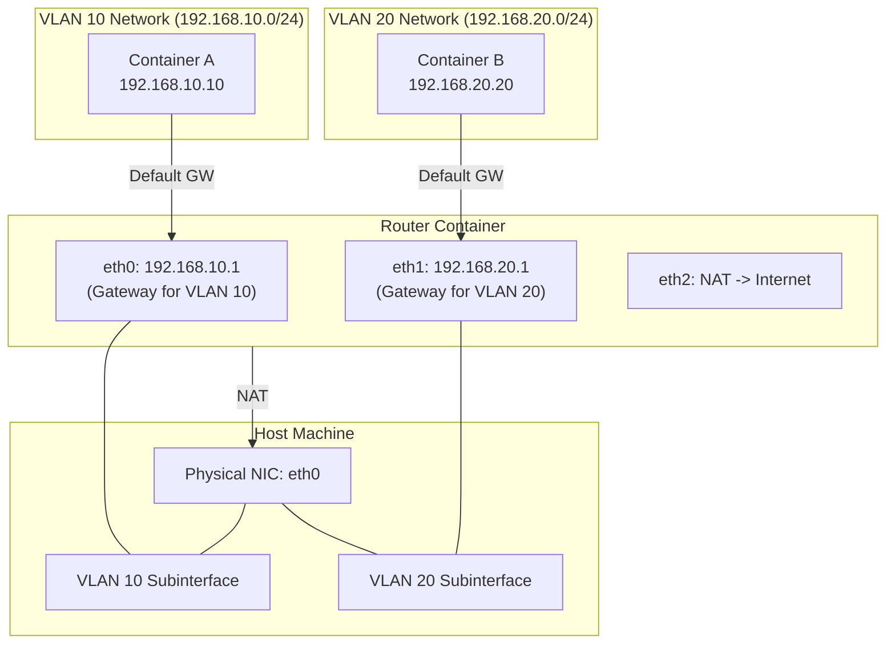

# Podman 実習：macvlan と Linux ルーターで作る L3 分離ネットワーク

ソフトウェアエンジニア向けに、コンテナ技術（Podman）と Linux のネットワーク機能（macvlan, VLAN, iptables）を使って、擬似的な物理ネットワーク環境を構築する実習です。

## ゴール

以下の構成を構築し、L2 分離と L3 ルーティングの仕組みを理解します。


```mermaid
graph TD
    subgraph Host [Host Machine]
        eth0[Physical NIC: eth0]
        eth0 --- eth0.10[VLAN 10 Subinterface]
        eth0 --- eth0.20[VLAN 20 Subinterface]
    end

    subgraph "VLAN 10 Network (192.168.10.0/24)"
        ContainerA[Container A<br>192.168.10.10]
    end

    subgraph "VLAN 20 Network (192.168.20.0/24)"
        ContainerB[Container B<br>192.168.20.20]
    end

    subgraph RouterContainer [Router Container]
        eth10["eth0: 192.168.10.1<br>(Gateway for VLAN 10)"]
        eth20["eth1: 192.168.20.1<br>(Gateway for VLAN 20)"]
        ethNat[eth2: NAT -> Internet]
    end

    ContainerA -->|Default GW| eth10
    ContainerB -->|Default GW| eth20

    eth10 --- eth0.10
    eth20 --- eth0.20

    RouterContainer -->|NAT| eth0
```

**達成する状態:**

1. **L2 分離**: `Container A` と `Container B` は異なる VLAN に属し、直接通信できません。
2. **L3 ルーティング**: `Router` コンテナを経由することで、相互に通信できます。
3. **インターネット接続**: `Router` の NAT 機能により、各コンテナから外部へ接続可能です。

---

## ネットワーク分離の課題

従来、ネットワークを物理的に分けるには、スイッチやケーブルを個別に用意する必要がありました。

### ❌ 課題

- 物理的な配線作業が煩雑でミスが起きやすい。
- サーバーの増設や変更に合わせて柔軟に構成を変えられない。
- 1 つの物理 NIC を効率的に使い分けることが難しい。

### ✅ macvlan と VLAN の解決策

- **VLAN**: 1 つの物理ケーブルの中に、論理的に独立した「土管」を複数通します。
- **macvlan**: コンテナに独自の MAC アドレスを割り当て、物理ネットワークに直結しているように見せます。これにより、仮想ブリッジのオーバーヘッドなしに高速な通信が可能です。

 ```mermaid
 graph TD
     subgraph Host_OS [Host: Linux Kernel]
         PhysNIC[Physical NIC (eth0)]
         
         subgraph VLAN_Interfaces [VLAN Sub-interfaces]
             V10[eth0.10<br>(Tag: 10)]
             V20[eth0.20<br>(Tag: 20)]
         end
         
         PhysNIC --- V10
         PhysNIC --- V20
     end
 
     subgraph Containers [Podman Containers]
         ContA[Container A<br>(IP: 192.168.10.10)]
         ContB[Container B<br>(IP: 192.168.20.20)]
     end
 
     V10 -. "macvlan<br>(Direct L2 Access)" .- ContA
     V20 -. "macvlan<br>(Direct L2 Access)" .- ContB
     
     style PhysNIC fill:#eee,stroke:#333
     style V10 fill:#d1e7dd,stroke:#0f5132
     style V20 fill:#f8d7da,stroke:#842029
 ```

 ---

## アーキテクチャ

本実習では Rootful Podman を使用し、Linux カーネルのネットワーク機能を直接操作します。

### レイヤー構造とディレクトリ

```text
/etc/cni/net.d/ (内部的)
├── net-vlan10.conflist   # Podman VLAN 10 ネットワーク定義
└── net-vlan20.conflist   # Podman VLAN 20 ネットワーク定義
```

---

## 準備

### 1. 前提条件

- **OS:** Ubuntu 24.04 LTS (推奨)
- **Podman:** Rootful モード (sudo 権限が必要)
- **物理 NIC 名:** `eth0` (環境に合わせて `ens5` などに読み替えてください)

### 2. 環境確認

```bash
# Rootful モードであることを確認 (false ならOK)
sudo podman info | grep rootless
# rootless: false
```

---

## 実習ステップ

### STEP 1: ホストに VLAN サブインタフェースを作る

物理 NIC の上に、仮想的な VLAN インタフェースを作成します。

```bash
export IF=eth0 # 環境に合わせて変更
sudo modprobe 8021q

# VLAN 10/20 用のサブインタフェース作成と有効化
sudo ip link add link $IF name $IF.10 type vlan id 10
sudo ip link add link $IF name $IF.20 type vlan id 20
sudo ip link set $IF.10 up
sudo ip link set $IF.20 up
```

### STEP 2: Podman ネットワークを定義する

```bash
# VLAN 10 ネットワーク定義
sudo podman network create --driver macvlan --subnet 192.168.10.0/24 --gateway 192.168.10.1 -o parent=$IF.10 net-vlan10

# VLAN 20 ネットワーク定義
sudo podman network create --driver macvlan --subnet 192.168.20.0/24 --gateway 192.168.20.1 -o parent=$IF.20 net-vlan20
```

### STEP 3: ルーターコンテナを構築する

3 つのネットワーク（インターネット、VLAN 10、VLAN 20）を橋渡しするルーターを作成します。

```bash
# 1. ルーター起動
sudo podman run -d --name router --network podman --cap-add NET_ADMIN --sysctl net.ipv4.ip_forward=1 alpine sleep infinity

# 2. VLAN 10/20 に接続
sudo podman network connect --ip 192.168.10.1 net-vlan10 router
sudo podman network connect --ip 192.168.20.1 net-vlan20 router

# 3. 不要なデフォルトルートの削除
sudo podman exec router ip route del default via 192.168.10.1 dev eth1 2>/dev/null || true
sudo podman exec router ip route del default via 192.168.20.1 dev eth2 2>/dev/null || true
```

### STEP 4: ルーターで NAT を設定する

```bash
sudo podman exec router apk add --no-cache iptables

# NAT とフォワーディングの許可
sudo podman exec router sh -c \
'iptables -t nat -A POSTROUTING -o eth0 -j MASQUERADE
iptables -A FORWARD -i eth1 -o eth0 -j ACCEPT
iptables -A FORWARD -i eth2 -o eth0 -j ACCEPT
iptables -A FORWARD -i eth0 -m state --state ESTABLISHED,RELATED -j ACCEPT'
```

### STEP 5: クライアントコンテナを作成する

```bash
# Container A (VLAN 10)
sudo podman run -d --name a --network net-vlan10 --ip 192.168.10.10 alpine sleep infinity

# Container B (VLAN 20)
sudo podman run -d --name b --network net-vlan20 --ip 192.168.20.20 alpine sleep infinity
```

### STEP 6: 動作確認

1. **疎通確認**: A から B への Ping が通ることを確認します。

   ```bash
   sudo podman exec a ping -c 3 192.168.20.20
   ```

2. **ルーティング遮断実験**: ルーターで通信をブロックし、Ping が通らなくなることを確認します。

   ```bash
   sudo podman exec router iptables -I FORWARD -i eth1 -o eth2 -j DROP
   sudo podman exec a ping -c 3 -W 1 192.168.20.20 # 失敗する
   ```

---

## 片付け

```bash
sudo podman rm -f a b router
sudo podman network rm net-vlan10 net-vlan20
sudo ip link delete $IF.10
sudo ip link delete $IF.20
```

---

## まとめ

1. **VLAN** を使うことで、物理インタフェースを論理的に分割できます。
2. **macvlan** は、コンテナを物理スイッチに直接繋いだようなネットワーク構成を実現します。
3. **Linux ルーター** は `ip_forward` と `iptables` だけで簡単に構築可能です。
