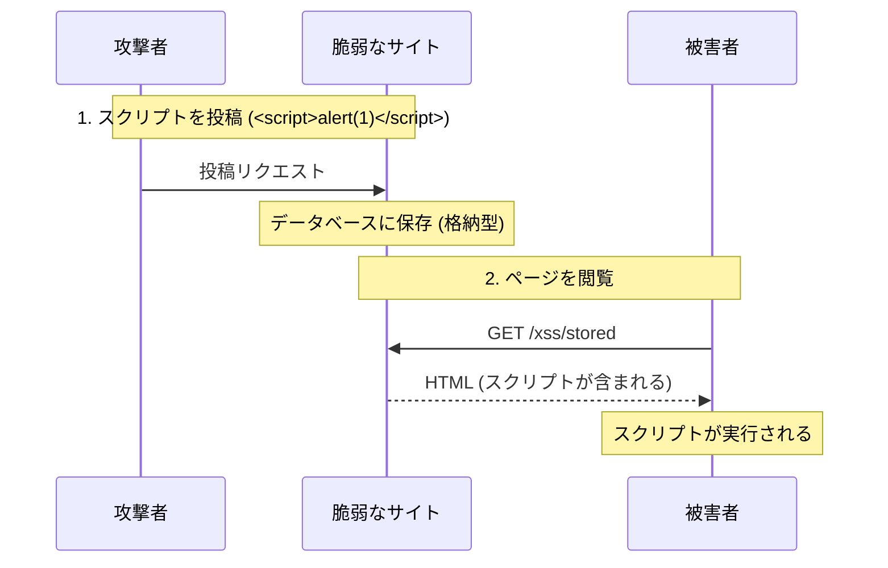
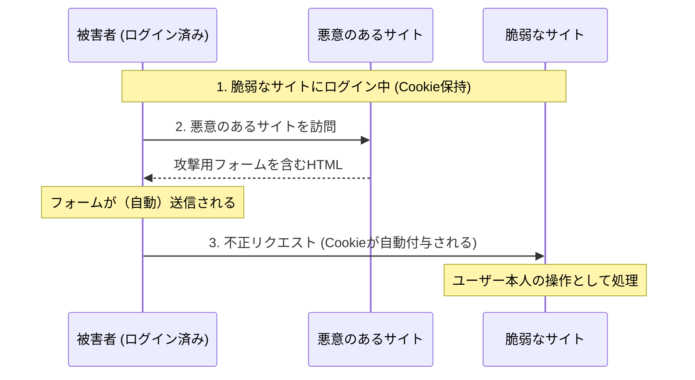
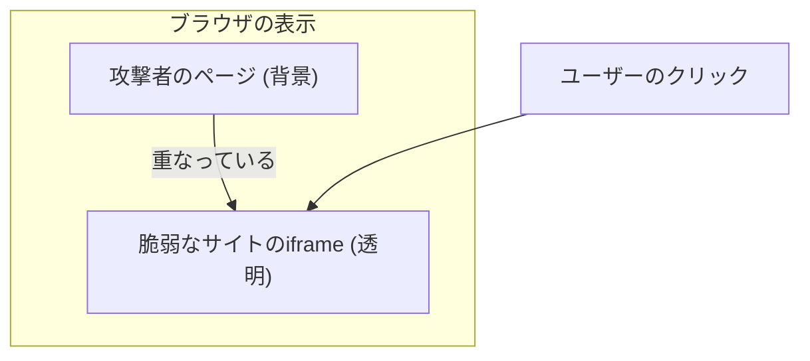

# Webセキュリティ実習：XSS, CSRF, クリックジャッキングを体験する

## 目的

このワークショップでは、Web アプリケーションの代表的な脆弱性である XSS (クロスサイトスクリプティング)、CSRF (クロスサイトリクエストフォージェリ)、クリックジャッキングを、意図的に脆弱なアプリケーションを用いて体験し、その仕組みと対策方法を学びます。

## ゴール

- XSS の仕組み（格納型・反射型）を理解し、JavaScript が実行される様子を確認する。
- CSRF の仕組みを理解し、認証済みユーザーに代わって不正なリクエストが送られる様子を確認する。
- クリックジャッキングの仕組みを理解し、iframe を用いた視覚的な騙しの手法を確認する。
- 各脆弱性に対する防御策（エスケープ、トークン、ヘッダー設定）を理解する。

---

## 登場人物と攻撃フロー

### XSS (Cross-Site Scripting)

攻撃者が悪意のあるスクリプトを Web ページに埋め込み、他のユーザーのブラウザで実行させます。



### CSRF (Cross-Site Request Forgery)

ログイン済みのユーザーを騙して、意図しないリクエスト（パスワード変更やメールアドレス変更など）を脆弱なサイトへ送信させます。



### クリックジャッキング (Clickjacking)

透明な iframe を用いて、ユーザーが意図したボタンとは別のボタンをクリックさせます。



---

## アンチパターンと解決策

| 脆弱性 | ❌ 危険な実装 | ✅ 安全な対策 |
| :--- | :--- | :--- |
| **XSS** | ユーザー入力をそのまま HTML として出力する | 出力を適切にエスケープする、CSPを設定する |
| **CSRF** | Cookie だけに頼った認証を行う | CSRFトークンを使用する、SameSite属性を設定する |
| **クリックジャッキング** | 外部サイトからの iframe 埋め込みを許可している | `X-Frame-Options` または CSP の `frame-ancestors` を設定する |

---

## アーキテクチャ

この実習では、一つの Go アプリケーションの中で「被害者サイト（Victim）」と「攻撃者サイト（Attacker）」の両方のエンドポイントを提供します。

### 想定ディレクトリ構造

```text
infra/assets/web_security/
├── main.go         # 脆弱なアプリケーション
├── go.mod
├── Dockerfile
└── docker-compose.yml
```

---

## 準備

### 1. アプリケーションの起動

```bash
cd infra/assets/web_security
podman compose up -d
```

### 2. 動作確認

ブラウザで `http://localhost:8080` にアクセスしてください。

---

## 実習ステップ

### STEP 1: 格納型 XSS (Stored XSS)

掲示板のような機能にスクリプトを保存させ、ページを開くたびに実行されることを確認します。

1. `格納型 XSS デモ` ページへ移動します。
2. 入力欄に `<script>alert('XSS!');</script>` と入力して送信します。
3. ページがリロードされ、アラートが表示されることを確認します。

### STEP 2: 反射型 XSS (Reflected XSS)

URL パラメータに含まれるスクリプトがそのままページに反映されることを確認します。

1. `反射型 XSS デモ` ページへ移動します。
2. URL の末尾に `<script>alert(document.cookie);</script>` を追加してアクセスします。
   - `http://localhost:8080/xss/reflected?q=<script>alert(document.cookie);</script>`
3. クッキー情報が表示されることを確認します（HttpOnly 属性がないため取得可能です）。

### STEP 3: CSRF (Cross-Site Request Forgery)

1. `ログイン` をクリックして、セッション Cookie をセットします。
2. `被害者サイト` のトップに戻り、現在のメールアドレスが `victim@example.com` であることを確認します。
3. `攻撃者サイトへのリンク` の `CSRF 攻撃ページ` をクリックします。
4. 攻撃者サイトの「賞品を受け取る」ボタンをクリックします。
5. 被害者サイトのトップに戻ると、メールアドレスが `hacker@evil.com` に勝手に変更されていることを確認します。

### STEP 4: クリックジャッキング (Clickjacking)

1. `攻撃者サイトへのリンク` の `クリックジャッキング 攻撃ページ` をクリックします。
2. 攻撃者サイトの「GET COOKIES」ボタンをクリックしようとすると、実際には背後にある被害者サイトの「送金を確定する」ボタンをクリックしてしまっていることを確認します。
   - ※デモを分かりやすくするため、iframe を半透明にしています。

---

## 防御策の実装例

### XSS 対策

Go の `html/template` パッケージは、デフォルトで変数をエスケープします。

```go
// ❌ 危険な例: エスケープせずにそのまま出力
fmt.Fprintf(w, "<li>%s</li>", comment)

// ✅ 安全な例: テンプレートエンジンを使用（自動エスケープ）
// 詳細は Go の公式ドキュメントを参照してください
```

### CSRF 対策

- **CSRF トークン**: リクエストごとに一意のトークンを発行し、サーバー側で検証します。
- **SameSite Cookie**: Cookie に `SameSite=Lax` または `Strict` を設定します。

### クリックジャッキング対策

レスポンスヘッダーに以下を追加します。

- `X-Frame-Options: DENY` または `SAMEORIGIN`
- `Content-Security-Policy: frame-ancestors 'self'`

---

## 片付け

```bash
podman compose down
```

---

## 参考文献

- [OWASP Top 10](https://owasp.org/www-project-top-ten/)
- [IPA: 安全なウェブサイトの作り方](https://www.ipa.go.jp/security/vuln/websecurity.html)
