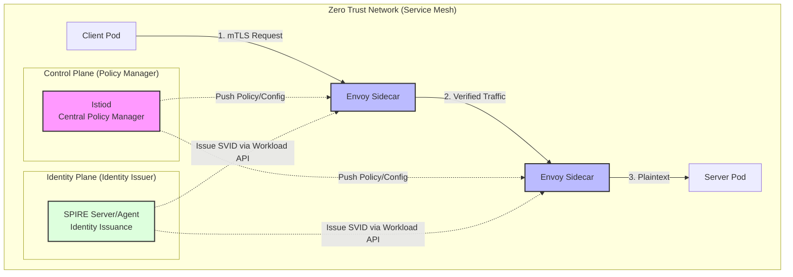
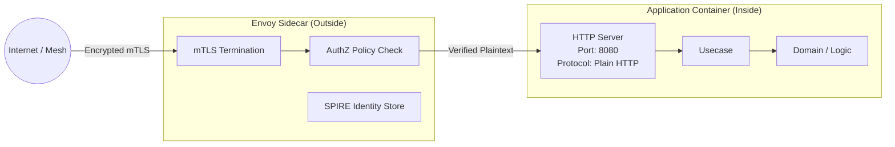

# Zero Trust Architecture Workshop: A Deep Dive into "Always Verify" with mTLS and Service Mesh

In this workshop, you will implement the core Zero Trust Architecture (ZTA) principle of "Never Trust, Always Verify" in a real system using **Istio Service Mesh** and **SPIRE/SPIFFE**.

> **💡 Glossary**: For technical terms such as [Zero Trust](glossary_en.md#security), [mTLS](glossary_en.md#security), [Service Mesh](glossary_en.md#security), and [SPIRE](glossary_en.md#security), please refer to the [Glossary](glossary_en.md).

---

## 1. Why Should Software Engineers Learn Zero Trust?

The days when "security is the infrastructure team's job" are over. In a modern microservices environment, software engineers (SWEs) must understand Zero Trust not just for defense, but to **"design more scalable and maintainable software."**

### 1.1 The End of IP Addresses (The Shift to Identity)

In dynamic environments like Kubernetes, Pod IP addresses are ephemeral. A rule like "Allow traffic from IP `10.0.x.y`" breaks every time a Pod restarts.
ZTA performs authorization based on **"Who are you? (Identity)"**. This effectively extends the concept of "Authentication and Authorization" from the API design layer down to the transport layer.

### 1.2 Preventing "Lateral Movement"

Traditional perimeter security (Firewalls) assumes "internal is safe," allowing an attacker who breaches the perimeter to move freely within the system (Lateral Movement).
ZTA operates on the premise that **"the internal network is already compromised."** This is equivalent to applying the "Principle of Least Privilege" to inter-service communication.

### 1.3 Decoupling Business Logic from Security

The biggest benefit for SWEs is the ability to **"exclude encryption and mutual authentication logic from application code."** By utilizing a Service Mesh, you can focus on business logic while security is externalized (decoupled) as an "infrastructure concern."

---

## 2. The Three Pillars of Zero Trust (Workshop Goals)

Through this workshop, you will understand these three technical concepts as part of a "working system":

1. **Identity**: Use **SPIFFE/SPIRE** to issue non-forgeable "Digital IDs (SVIDs)" to each microservice.
2. **Encryption & Verification**: Use **mTLS** to encrypt communications while mutually verifying that "the other party is truly the service they claim to be."
3. **Policy**: Use **Istio AuthorizationPolicy** to declaratively define "which service is allowed to access which path using which HTTP method."



---

## 3. Impact on Software Design: Integration with Clean Architecture

Implementing ZTA removes security "clutter" from your application code.

### 【Before】Traditional Code (Not Recommended)

You needed libraries to load TLS certificates and implement logic to check the sender's identity. This creates a tight coupling between business logic and a specific security implementation.

```go
// Security logic mixed into the app, making testing and certificate updates difficult
func handleRequest(w http.ResponseWriter, req *http.Request) {
    cert := req.TLS.PeerCertificates[0]
    if cert.Subject.CommonName != "trusted-client" { // Authorization inside code
        http.Error(w, "forbidden", http.StatusForbidden)
        return
    }
    // ... business logic ...
}
```

### 【After】Zero Trust + Clean Architecture (Recommended)

The app operates on **"Simple HTTP (Port 8080)."** Security is handled by the external Envoy Sidecar, and the app only receives "verified traffic."



- **SWE Perspective**: By offloading authorization logic to declarative YAML (Istio), unit testing becomes easier, and security policies can be changed without redeploying the application.

---

## 4. Environment Setup

We use a local K8s cluster created with `kind` and standard Service Mesh tools.

### ✅ Setup

```bash
# 1. Create cluster
kind create cluster --name zero-trust-workshop

# 2. Install Istio
istioctl install --set profile=demo -y

# 3. Enable Sidecar Injection
# This automatically injects an Envoy proxy into any Pod deployed hereafter
kubectl label namespace default istio-injection=enabled
```

---

## 5. Workshop Steps: Detailed Process

### STEP 1: Dropping "Unconditional Trust" (STRICT Mode)

By default, Istio accepts plaintext communication for compatibility (Permissive mode). The first step in Zero Trust is to eliminate this leniency.

```yaml
# peer-authentication.yaml
apiVersion: security.istio.io/v1beta1
kind: PeerAuthentication
metadata:
  name: default
spec:
  mtls:
    mode: STRICT # 100% rejection of any communication that cannot prove its identity
```

```bash
kubectl apply -f peer-authentication.yaml
```

**Why it matters**:
Even if an attacker compromises a Pod without a sidecar within the cluster, STRICT mode ensures that communications to other critical services are rejected.

### STEP 2: Dynamic Identity Proof (How SPIRE Works)

Identity in ZTA is not a static API key. **SPIRE** issues "Digital IDs (SVIDs)" through the following process:

1. **Workload Attestation**: When a process starts, the SPIRE Agent inspects kernel information (UID/GID, Namespace, ServiceAccount, etc.) to determine that "this process is definitely the `client` service."
2. **SVID Issuance**: Once verification succeeds, a short-lived X.509 certificate is delivered to Envoy.
3. **Automatic Rotation**: Certificates expire in hours, but SPIRE continuously updates them. This minimizes damage if a private key is ever leaked.

**Verification Command**:

```bash
# Verify the SPIFFE ID in the SVID held by Envoy
istioctl proxy-config secret <pod-name> | grep spiffe
# Example output: spiffe://cluster.local/ns/default/sa/client-sa
```

### STEP 3: L7 Authorization (AuthorizationPolicy)

Verify not just "Who" but "What." Restricting HTTP paths and methods limits potential damage to a specific API.

```yaml
apiVersion: security.istio.io/v1beta1
kind: AuthorizationPolicy
metadata:
  name: limit-access
spec:
  selector:
    matchLabels:
      app: server
  rules:
  - from:
    - source:
        principals: ["cluster.local/ns/default/sa/client-sa"]
    to:
    - operation:
        methods: ["GET"]
        paths: ["/api/v1/data"]
```

**💡 SWE Tip**:
With this configuration, if `client` tries to execute `DELETE /api/v1/data`, Envoy will return a `403 Forbidden` before it ever reaches your application.

---

## 6. Debugging Guide (Practical Techniques for SWEs)

Troubleshooting in a ZTA environment differs from traditional debugging.

### 6.1 Isolating the Error

| Symptom                     | Probable Cause                              | Action                                                     |
| :---                        | :---                                        | :---                                                       |
| **403 Forbidden**           | Rejected by an Authorization Policy (AuthZ) | Run `istioctl proxy-config authz` to see active policies   |
| **503 Service Unavailable** | mTLS handshake failure                      | Check if the target Pod has a sidecar injected             |
| **404 Not Found**           | Routing error                               | Check path definitions with `istioctl proxy-config routes` |

### 6.2 Using Logs (Envoy Access Log)

When an error occurs but nothing shows up in the app logs, the Envoy log is your only clue.

```bash
# Monitor Envoy (sidecar) logs in real-time
kubectl logs <pod-name> -c istio-proxy -f
```

If you see `RBAC: access denied`, it is a rejection by an `AuthorizationPolicy`.

---

## Summary: Engineering in the Zero Trust Era

1. **Trust no one**: Completely eliminate "implicit trust" in internal networks.
2. **Identity is the new perimeter**: Use cryptographic Identity (SPIFFE) as the root of trust, not IP addresses.
3. **Observability**: Treat security rejections as "observable events" rather than "unexpected errors."

## Cleanup

```bash
kind delete cluster --name zero-trust-workshop
```

---

## References

- [NIST SP 800-207: Zero Trust Architecture](https://csrc.nist.gov/publications/detail/sp/800-207/final)
- [SPIFFE.io: Production-Ready Workload Identity](https://spiffe.io/)
- [Istio Security Documentation](https://istio.io/latest/docs/concepts/security/)
