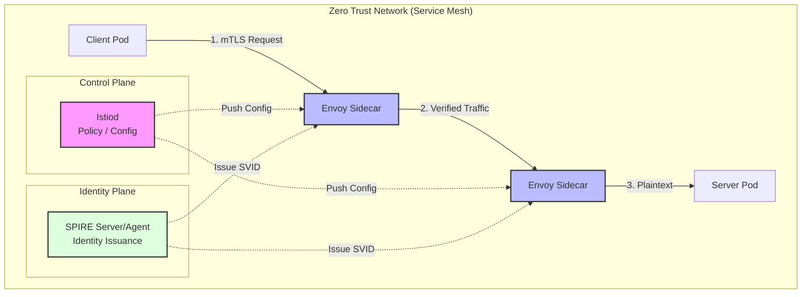
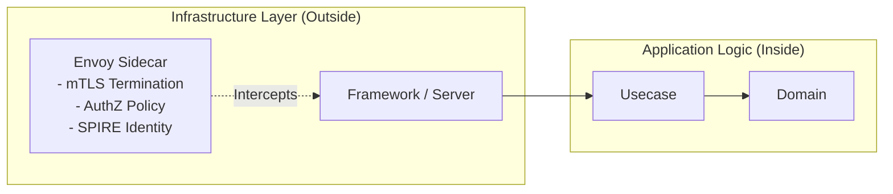

# Zero Trust Architecture Workshop: Implementing "Always Verify" with mTLS and Service Mesh

In this workshop, you will implement the core Zero Trust Architecture (ZTA) principle of "Never Trust, Always Verify" in a real system using **Istio Service Mesh** and **SPIRE/SPIFFE**.

> **💡 Glossary**: For technical terms such as [Zero Trust](glossary_en.md#security), [mTLS](glossary_en.md#security), [Service Mesh](glossary_en.md#security), and [SPIRE](glossary_en.md#security), please refer to the [Glossary](glossary_en.md).

---

## Why Should Software Engineers Learn Zero Trust?

Traditional network perimeter security (e.g., Firewalls) suffers from a vulnerability where "lateral movement" becomes easy once an attacker gains internal access. In modern microservices and cloud-native environments, shifting to **Identity-based** security is essential for the following reasons:

1. **Dissolution of the Perimeter**: With remote work and cloud migration, a reliable "internal network" no longer exists.
2. **Mitigation of Supply Chain Attacks**: Even if a trusted internal service is compromised, the damage must be contained within that specific service.
3. **Reduction of Operational Overhead**: IP address-based management breaks in Kubernetes (K8s) environments where Pods are dynamically created and destroyed. Identity-based security allows for consistent policy application in dynamic environments.

---

## Goals

Gain a practical understanding of Zero Trust Architecture and acquire the following skills:

- Understanding the **Never Trust, Always Verify** principle.
- Implementing encrypted inter-service communication and "mutual" identity verification using **mTLS (Mutual TLS)**.
- Applying authentication and authorization policies without changing application code via **Istio Service Mesh**.
- Building a dynamic, cryptographic identity system (SVID) using **SPIRE/SPIFFE**.
- Designing security layers as an "infrastructure concern" within the context of **Clean Architecture**.



---

## Architecture and Design Philosophy

### 1. Perimeter Defense vs. Zero Trust

| Feature | Traditional Perimeter Defense (Castle-and-Moat) | Zero Trust (Always Verify) |
| :--- | :--- | :--- |
| **Trust Foundation** | Network Location (IP/Subnet) | Workload Identity (Identity/SPIFFE) |
| **Communication Assumption** | Internal is assumed safe | Assume internal is also compromised |
| **Encryption** | Perimeter only (HTTPS) | All paths (mTLS) |
| **Authorization** | Coarse control (VLAN/FW) | Least Privilege (Method/Path level) |

### 2. Integration with Clean Architecture (Separation of Concerns)

The biggest advantage of ZTA for software engineers is the ability to **offload security logic from application code**.



- **Separation of Concerns**: Apps only need to listen on HTTP (8080). They don't need to manage SSL certificates or implement IP restriction logic. All of these are transparently handled by the Envoy Sidecar as an "infrastructure concern."

---

## Environment Setup

This workshop uses a local K8s cluster created with `kind` and the `istioctl` CLI.

### Expected Directory Structure

```text
infra/assets/zero_trust/
├── k8s/                        # Kubernetes Manifests
│   ├── istio/                  # Istio / SPIRE Configurations
│   └── services/               # Application Deployments
├── src/                        # Go Applications (Clean Architecture)
│   ├── client/
│   └── server/
└── Makefile
```

### ✅ Checklist

- [ ] `kubectl`, `kind`, `helm`, and `istioctl` are installed.

```bash
# Create cluster
kind create cluster --name zero-trust-workshop

# Install Istio
istioctl install --set profile=demo -y

# Enable sidecar injection (the first step in ZTA magic)
kubectl label namespace default istio-injection=enabled
```

---

## Workshop Steps

### STEP 1: Stripping "Trust" (mTLS Strict Mode)

By default, Istio operates in Permissive mode (allowing plaintext), but ZTA does not allow plaintext at all.

```yaml
# k8s/istio/peer-authentication.yaml
apiVersion: security.istio.io/v1beta1
kind: PeerAuthentication
metadata:
  name: default
spec:
  mtls:
    mode: STRICT
```

```bash
kubectl apply -f k8s/istio/peer-authentication.yaml
```

**Verification**: Confirm that access from a Pod without a sidecar is rejected.

### STEP 2: Proving Identity (SPIRE Integration)

Assign a cryptographic identity (SPIFFE ID) to workloads instead of using IP addresses.

1.  **Deploy SPIRE**: Install SPIRE into the cluster using Helm. SPIRE provides a "Control Plane" for identity.

    ```bash
    # Add the SPIFFE Helm repository
    helm repo add spiffe https://spiffe.github.io/helm-charts-hardened/
    helm repo update

    # Install SPIRE Server and Agent
    helm install spire spiffe/spire --namespace spire-mgmt --create-namespace
    ```

2.  **Configure Istio to use SPIRE**: Enable the Custom CA integration so that Istio trusts identities issued by SPIRE.

    ```yaml
    # k8s/istio/spire-config.yaml (Conceptual)
    apiVersion: install.istio.io/v1alpha1
    kind: IstioOperator
    spec:
      meshConfig:
        trustDomain: cluster.local
        caCertificates:
        - pem: |
            -----BEGIN CERTIFICATE-----
            <SPIRE-ROOT-CA-CONTENT>
            -----END CERTIFICATE-----
    ```

3.  **Automatic SVID Issuance**: Once configured, the Envoy sidecar automatically communicates with the SPIRE Agent via the Workload API (using a Unix Domain Socket) to retrieve its **SVID (SPIFFE Verifiable Identity Document)**.

**Verification**: Check the issued SPIFFE ID.
```bash
istioctl proxy-config secret <pod-name> | grep spiffe
# Output should contain: spiffe://cluster.local/ns/default/sa/server-sa
```

**SPIFFE ID Example**: `spiffe://cluster.local/ns/default/sa/server-sa`

### STEP 3: Applying Least Privilege (AuthorizationPolicy)

Define "Who" can perform "What operation" on "Which resource."

```yaml
# k8s/istio/authorization-policy.yaml
spec:
  selector:
    matchLabels:
      app: server
  rules:
  - from:
    - source:
        principals: ["cluster.local/ns/default/sa/client-sa"] # Client's Identity
    to:
    - operation:
        methods: ["GET"]
        paths: ["/api/v1/data"] # Minimal path access
```

---

## Development Workflow

Here is how SWEs interact with development in a ZTA environment:

1. **Local Dev**: Develop using plain HTTP locally.
2. **Dependency**: If access to external APIs is needed, define their identities using Istio's `ServiceEntry`.
3. **Observability**: If a communication error occurs, debug using Envoy's `access log` or `istioctl analyze` for authorization denials (403), rather than checking app logs.

---

## Troubleshooting: A Debugging Guide for SWEs

### 1. Connection Drops (503 / 403)
- **Cause**: mTLS configuration mismatch or block by an authorization policy.
- **Investigation**: 
  ```bash
  istioctl proxy-config secret <pod-name> # Check if certificate is delivered
  kubectl logs <pod-name> -c istio-proxy # Check Envoy logs
  ```

### 2. Sidecar Fails to Start
- **Cause**: Insufficient resources (Memory/CPU) or missing namespace label.
- **Investigation**: Check `Events` via `kubectl describe pod <pod-name>`.

---

## Cleanup

```bash
kind delete cluster --name zero-trust-workshop
```

## References

- [NIST SP 800-207: Zero Trust Architecture](https://csrc.nist.gov/publications/detail/sp/800-207/final)
- [SPIFFE.io: Production-Ready Workload Identity](https://spiffe.io/)
