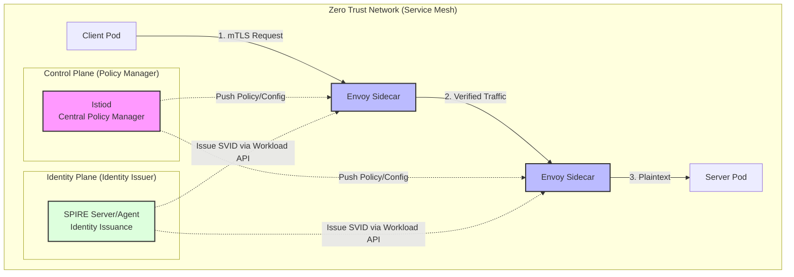
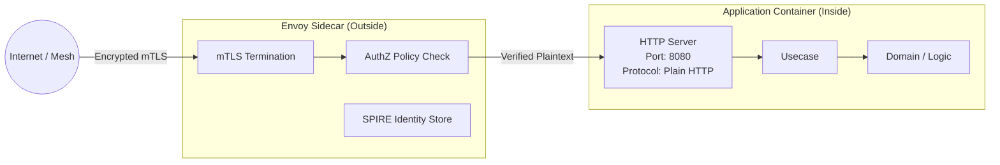

# Zero Trust Architecture 実習：mTLS と Service Mesh による「常に検証」ディープダイブ

このワークショップでは、**Istio Service Mesh** と **SPIRE/SPIFFE** を使用して、Zero Trust Architecture (ZTA) の核となる「信頼なし、常に検証」の原則を実際のシステムで実装します。

> **💡 用語集**: [Zero Trust](glossary_ja.md#security)、[mTLS](glossary_ja.md#security)、[Service Mesh](glossary_ja.md#security)、[SPIRE](glossary_ja.md#security) などの用語は [用語集](glossary_ja.md) を参照してください。

---

## 1. なぜソフトウェアエンジニアが Zero Trust を学ぶのか？

「セキュリティはインフラチームの仕事」という時代は終わりました。モダンなマイクロサービス環境において、ソフトウェアエンジニア（SWE）が Zero Trust を理解すべき理由は、単なる防御のためではなく、**「よりスケーラブルで保守性の高いソフトウェアを設計するため」** です。

### 1.1 IP アドレスの終焉（Identity へのシフト）

Kubernetes 等の動的環境では、Pod の IP アドレスは一時的なものです。「IP `10.0.x.y` からの通信を許可する」というルールは、Pod が再起動するたびに破綻します。
ZTA では **「何者か (Identity)」** に基づいて認可を行います。これは API 設計における「認証・認可」の概念を、トランスポート層まで拡張したものと言えます。

### 1.2 境界防御の限界と「横移動」の防止

従来の境界型セキュリティ（Firewall）は、一度内部に侵入されると「内部は安全」と見なされるため、攻撃者がシステム内を自由に動き回る（横移動：Lateral Movement）ことが容易でした。
ZTA は **「内部ネットワークもすでに侵害されている」** という前提に立ちます。これは、アプリケーション設計における「最小権限の原則 (Least Privilege)」をサービス間通信に適用することと同義です。

### 1.3 ビジネスロジックとセキュリティの分離

SWE にとっての最大の恩恵は、**「暗号化や相互認証のロジックをアプリケーションコードから排除できる」** ことです。Service Mesh を活用することで、ビジネスロジックに集中でき、セキュリティは「インフラの関心事」として外部化（Decoupling）されます。

---

## 2. Zero Trust の 3 つの柱（実習のゴール）

この実習を通じて、以下の 3 つの技術概念を「動くシステム」として理解します。

1. **Identity (身元)**: **SPIFFE/SPIRE** を使い、各マイクロサービスに偽造不可能な「身分証（SVID）」を発行します。
2. **Encryption & Verification (暗号化と検証)**: **mTLS** により、通信を暗号化しつつ「相手が本当に名乗っている通りのサービスか」を相互に確認します。
3. **Policy (認可ポリシー)**: **Istio AuthorizationPolicy** を使い、「どのサービスが、どのパスに対して、どの HTTP メソッドを許可するか」を宣言的に定義します。



---

## 3. ソフトウェア設計への影響：Clean Architecture との統合

ZTA を導入すると、アプリケーションコードからセキュリティの「汚れ」が消えます。

### 【Before】従来のコード（非推奨）

ライブラリを使ってコード内で TLS 証明書を読み込み、相手の身元をチェックするロジックが必要でした。これにより、ビジネスロジックが特定のセキュリティ実装に依存（密結合）してしまいます。

```go
// アプリ内にセキュリティロジックが混入し、テストや証明書更新が困難
func handleRequest(w http.ResponseWriter, req *http.Request) {
    cert := req.TLS.PeerCertificates[0]
    if cert.Subject.CommonName != "trusted-client" { // コード内での認可
        http.Error(w, "forbidden", http.StatusForbidden)
        return
    }
    // ... ビジネスロジック ...
}
```

### 【After】Zero Trust + Clean Architecture（推奨）

アプリは **「単純な HTTP (Port 8080)」** で動作します。セキュリティは外部の Envoy Sidecar が担当し、アプリは「検証済みのトラフィック」のみを受け取ります。



- **SWE の視点**: 認可ロジックを宣言的な YAML (Istio) に追い出すことで、コードの単体テストが容易になり、セキュリティポリシーの変更に際してアプリの再デプロイが不要になります。

---

## 4. 環境準備

`kind` を使用したローカル K8s クラスタと、標準的な Service Mesh ツールを使用します。

### ✅ セットアップ

```bash
# 1. クラスター作成
kind create cluster --name zero-trust-workshop

# 2. Istio インストール
istioctl install --set profile=demo -y

# 3. サイドカー注入を有効化
# これにより、今後デプロイされる Pod に自動で Envoy プロキシが注入されます
kubectl label namespace default istio-injection=enabled
```

---

## 5. 実習ステップ：詳細プロセス

### STEP 1: 「無条件の信頼」を捨てる（STRICT モード）

デフォルトの Istio は、互換性のために平文通信も受け入れてしまいます（Permissive モード）。Zero Trust の第一歩は、この「甘さ」を排除することです。

```yaml
# peer-authentication.yaml
apiVersion: security.istio.io/v1beta1
kind: PeerAuthentication
metadata:
  name: default
spec:
  mtls:
    mode: STRICT # サイドカーを持たない（＝身元を証明できない）通信は 100% 遮断
```

```bash
kubectl apply -f peer-authentication.yaml
```

**なぜ重要か？**:
攻撃者がクラスタ内の「サイドカーを持たない Pod」を乗っ取ったとしても、STRICT モードであれば他の重要サービスへの通信は拒否されます。

### STEP 2: 身元の動的証明（SPIRE の仕組み）

ZTA における Identity は、静的な API キーではありません。**SPIRE** は以下のプロセスで「身分証（SVID）」を発行します。

1. **Workload Attestation**: プロセスが起動すると、SPIRE Agent がカーネル情報（UID/GID, Namespace, ServiceAccount 等）を調べ、「このプロセスは間違いなく `client` サービスである」と断定します。
2. **SVID の発行**: 検証が成功すると、短寿命（Short-lived）の X.509 証明書が Envoy に渡されます。
3. **自動更新**: 証明書は数時間で期限切れになりますが、SPIRE が自動で更新し続けます。これにより、万が一秘密鍵が漏洩しても被害が最小限に抑えられます。

**検証コマンド**:

```bash
# Envoy が持っている身分証 (SVID) の SPIFFE ID を確認
istioctl proxy-config secret <pod-name> | grep spiffe
# 出力例: spiffe://cluster.local/ns/default/sa/client-sa
```

### STEP 3: L7 認可（AuthorizationPolicy）

「誰が」だけでなく「何を」まで検証します。HTTP のパスやメソッドを制限することで、侵害時の被害をその API 単位に封じ込めます。

```yaml
apiVersion: security.istio.io/v1beta1
kind: AuthorizationPolicy
metadata:
  name: limit-access
spec:
  selector:
    matchLabels:
      app: server
  rules:
  - from:
    - source:
        principals: ["cluster.local/ns/default/sa/client-sa"]
    to:
    - operation:
        methods: ["GET"]
        paths: ["/api/v1/data"]
```

**💡 SWE へのヒント**:
この設定により、`client` が `DELETE /api/v1/data` を実行しようとしても、アプリに届く前に Envoy が `403 Forbidden` を返します。

---

## 6. デバッグガイド（SWE 向け実用テクニック）

ZTA 環境でのトラブルシューティングは、従来のデバッグとは異なります。

### 6.1 エラーの切り分け

| 症状 | 推定原因 | アクション |
| :--- | :--- | :--- |
| **403 Forbidden** | 認可ポリシー (AuthZ) の拒否 | `istioctl proxy-config authz` で有効なポリシーを確認 |
| **503 Service Unavailable** | mTLS ハンドシェイク失敗 | 相手の Pod にサイドカーが注入されているか確認 |
| **404 Not Found** | ルーティングミス | `istioctl proxy-config routes` でパス定義を確認 |

### 6.2 ログの活用（Envoy Access Log）

アプリのログに何も出ていないのにエラーになる場合、Envoy のログが唯一の手がかりです。

```bash
# Envoy (サイドカー) のログをリアルタイムで監視
kubectl logs <pod-name> -c istio-proxy -f
```

`RBAC: access denied` という文字列があれば、それは `AuthorizationPolicy` による拒否です。

---

## まとめ：Zero Trust 時代のエンジニアリング

1. **Trust no one**: 内部ネットワークの「暗黙の信頼」を完全に排除する。
2. **Identity is the new perimeter**: IP アドレスではなく、暗号的な Identity (SPIFFE) を信頼の基点にする。
3. **Observability**: セキュリティ拒否を「予期せぬエラー」ではなく「観測可能なイベント」として扱う。

## 片付け

```bash
kind delete cluster --name zero-trust-workshop
```

---

## 参考文献

- [NIST SP 800-207: Zero Trust Architecture](https://csrc.nist.gov/publications/detail/sp/800-207/final)
- [SPIFFE.io: Production-Ready Workload Identity](https://spiffe.io/)
- [Istio Security Documentation](https://istio.io/latest/docs/concepts/security/)
