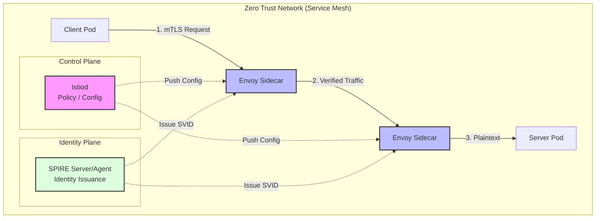
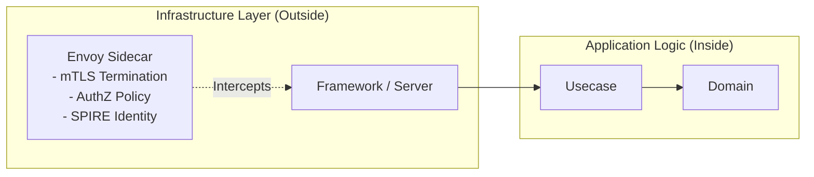

# Zero Trust Architecture 実習：mTLS と Service Mesh による「常に検証」の実現

このワークショップでは、**Istio Service Mesh** と **SPIRE/SPIFFE** を使用して、Zero Trust Architecture (ZTA) の核となる「信頼なし、常に検証」の原則を実際のシステムで実装します。

> **💡 用語集**: この実習で登場する[Zero Trust](glossary_ja.md#security)、[mTLS](glossary_ja.md#security)、[Service Mesh](glossary_ja.md#security)、[SPIRE](glossary_ja.md#security)などの専門用語は [用語集](glossary_ja.md) を参照してください。

---

## なぜソフトウェアエンジニアが Zero Trust を学ぶのか？

従来のネットワーク境界型セキュリティ（Firewall 等）は、一度内部に侵入されると「横移動（Lateral Movement）」が容易であるという脆弱性を抱えています。現代のマイクロサービスやクラウドネイティブな環境では、以下の理由から **Identity-based（身元ベース）** なセキュリティへの移行が不可欠です。

1. **境界の消滅**: リモートワークやクラウド移行により、信頼できる「内部ネットワーク」は存在しなくなりました。
2. **サプライチェーン攻撃への対策**: 信頼していた内部サービスが侵害された場合でも、被害をそのサービス内に封じ込める必要があります。
3. **運用負荷の軽減**: IP アドレスベースの管理は、Pod が動的に生成・消滅する K8s 環境では破綻します。身元（Identity）ベースであれば、動的な環境でも一貫したポリシーを適用できます。

---

## ゴール

Zero Trust Architecture を実践的に理解し、以下のスキルを習得します。

- **検証なし信頼なし (Never Trust, Always Verify)** 原則の理解。
- **mTLS (Mutual TLS)** によるサービス間通信の暗号化と「相互」身元証明の実装。
- **Istio Service Mesh** による、コードを変更しない認証・認可ポリシーの適用。
- **SPIRE/SPIFFE** による、動的で暗号的な身元証明システム（SVID）の構築。
- **Clean Architecture** の文脈で、セキュリティ層を「インフラの関心事」として分離する設計。



---

## アーキテクチャと設計思想

### 1. 境界防御 vs Zero Trust

| 特徴 | 従来の境界防御 (Castle-and-Moat) | Zero Trust (Always Verify) |
| :--- | :--- | :--- |
| **信頼の基盤** | ネットワークの場所 (IP/Subnet) | ワークロードの身元 (Identity/SPIFFE) |
| **通信の想定** | 内部は安全であると仮定 | 内部も侵害されていると仮定 |
| **暗号化** | 境界のみ (HTTPS) | 全経路 (mTLS) |
| **認可** | 粗い制御 (VLAN/FW) | 最小権限 (Method/Path 単位) |

### 2. Clean Architecture との統合（関心の分離）

ソフトウェアエンジニアにとっての ZTA の最大の利点は、**セキュリティロジックをアプリケーションコードから追い出せる**ことです。



- **Separation of Concerns**: アプリは HTTP(8080) で待ち受けるだけでよく、SSL 証明書の管理や IP 制限のロジックを書く必要はありません。これらは全て Envoy Sidecar が「インフラの関心事」として透過的に処理します。

---

## 環境準備

本実習では `kind` を使用したローカル K8s クラスタと、`istioctl` を使用します。

### 想定ディレクトリ構造

```text
infra/assets/zero_trust/
├── k8s/                        # Kubernetes マニフェスト
│   ├── istio/                  # Istio / SPIRE 設定
│   └── services/               # アプリケーションデプロイ
├── src/                        # Go アプリケーション (Clean Architecture)
│   ├── client/
│   └── server/
└── Makefile
```

### ✅ チェックリスト

- [ ] `kubectl`, `kind`, `helm`, `istioctl` がインストールされていること。

```bash
# クラスター作成
kind create cluster --name zero-trust-workshop

# Istio インストール
istioctl install --set profile=demo -y

# サイドカー注入の有効化 (これが ZTA の魔法の第一歩)
kubectl label namespace default istio-injection=enabled
```

---

## 実習ステップ

### STEP 1: 「信頼」の剥奪（mTLS Strict モード）

デフォルトでは Istio は Permissive モード（平文も許可）ですが、ZTA では平文を一切許容しません。

```yaml
# k8s/istio/peer-authentication.yaml
apiVersion: security.istio.io/v1beta1
kind: PeerAuthentication
metadata:
  name: default
spec:
  mtls:
    mode: STRICT
```

```bash
kubectl apply -f k8s/istio/peer-authentication.yaml
```

**検証**: サイドカーを持たない Pod からのアクセスが拒否されることを確認します。

### STEP 2: 身元の証明（SPIRE の統合）

IP アドレスではなく、暗号的な身元（SPIFFE ID）をワークロードに付与します。

1.  **SPIRE のデプロイ**: Helm を使用してクラスタに SPIRE をインストールします。SPIRE はアイデンティティを管理する「コントロールプレーン」として機能します。

    ```bash
    # SPIFFE Helm リポジトリの追加
    helm repo add spiffe https://spiffe.github.io/helm-charts-hardened/
    helm repo update

    # SPIRE Server と Agent のインストール
    helm install spire spiffe/spire --namespace spire-mgmt --create-namespace
    ```

2.  **Istio と SPIRE の連携設定**: Istio が SPIRE によって発行されたアイデンティティを信頼するように設定します。

    ```yaml
    # k8s/istio/spire-config.yaml (概念イメージ)
    apiVersion: install.istio.io/v1alpha1
    kind: IstioOperator
    spec:
      meshConfig:
        trustDomain: cluster.local
        caCertificates:
        - pem: |
            -----BEGIN CERTIFICATE-----
            <SPIRE-ROOT-CA-CONTENT>
            -----END CERTIFICATE-----
    ```

3.  **SVID の自動発行**: 設定後、Envoy サイドカーは Workload API (Unix Domain Socket) を介して SPIRE Agent と通信し、自身の **SVID (SPIFFE Verifiable Identity Document)** を自動的に取得します。

**検証**: 発行された SPIFFE ID を確認します。
```bash
istioctl proxy-config secret <pod-name> | grep spiffe
# 出力に spiffe://cluster.local/ns/default/sa/server-sa が含まれていることを確認
```

**SPIFFE ID の例**: `spiffe://cluster.local/ns/default/sa/server-sa`

### STEP 3: 最小権限の適用 (AuthorizationPolicy)

「誰が」「何に対して」「どの操作を」できるかを定義します。

```yaml
# k8s/istio/authorization-policy.yaml
spec:
  selector:
    matchLabels:
      app: server
  rules:
  - from:
    - source:
        principals: ["cluster.local/ns/default/sa/client-sa"] # Client の身元
    to:
    - operation:
        methods: ["GET"]
        paths: ["/api/v1/data"] # 最小限のパス
```

---

## 開発ワークフロー

ZTA 環境での開発における SWE の関わり方は以下の通りです：

1. **Local Dev**: ローカルではプレーンな HTTP で開発。
2. **Dependency**: 外部 API へのアクセスが必要な場合は、Istio の `ServiceEntry` で身元を定義。
3. **Observability**: 通信エラーが発生した場合、アプリログではなく Envoy の `access log` や `istioctl analyze` で認可拒否（403）をデバッグ。

---

## トラブルシューティング：SWE のためのデバッグガイド

### 1. 接続が切れる (503 / 403)
- **原因**: mTLS 設定の不一致、または認可ポリシーによるブロック。
- **調査**: 
  ```bash
  istioctl proxy-config secret <pod-name> # 証明書が来ているか
  kubectl logs <pod-name> -c istio-proxy # Envoy のログを確認
  ```

### 2. サイドカーが起動しない
- **原因**: 必要なリソース（メモリ/CPU）が不足している、または名前空間のラベル忘れ。
- **調査**: `kubectl describe pod <pod-name>` の `Events` を確認。

---

## 片付け

```bash
kind delete cluster --name zero-trust-workshop
```

## 参考文献

- [NIST SP 800-207: Zero Trust Architecture](https://csrc.nist.gov/publications/detail/sp/800-207/final)
- [SPIFFE.io: Production-Ready Workload Identity](https://spiffe.io/)
