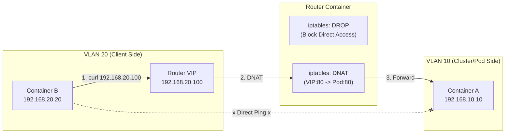

# K8s Service (LoadBalancer) 実習：iptables で作る仮想ロードバランサ

この実習は、[vlan_ja.md](./vlan_ja.md) の環境を拡張して行います。
Kubernetes の `Service (Type: LoadBalancer)` や `MetalLB` が、裏側でどのようにパケットを操作しているかを、Linux の基本機能だけで再現して学びます。

## ゴール

**「直接通信できない裏側のサーバーに、表側の代表IP (VIP) を経由してアクセスする」**



## 前提条件

- `vlan_ja.md` の Step 6 まで完了し、コンテナ `a`, `b`, `router` が起動していること。

---

## Step 1. Webサーバーの準備

まず、裏側のサーバー (Container A) で Web サーバーを起動します。

```bash
# nc が入っていない場合は追加
sudo podman exec a apk add --no-cache busybox-extras

# Container A でシンプルな HTTP サーバーを起動 (ポート 80)
sudo podman exec -d a sh -c "while true; do echo -e 'HTTP/1.1 200 OK\n\nHello from Pod A' | nc -l -p 80; done"
```

---

## Step 2. ネットワークの分断 (Firewall)

実験のため、VLAN 20 (Client) から VLAN 10 (Server) への直接通信をブロックします。
K8s でも「Pod IP には直接アクセスせず、Service IP を使う」のが原則ですが、それを強制的に再現します。

```bash
# Router で転送をブロックするルールを追加
sudo podman exec router iptables -I FORWARD -i eth1 -o eth0 -j DROP
```

**確認:**
Container B から A への Ping が通らなくなったことを確認します。

```bash
sudo podman exec b ping -c 2 192.168.10.10
# 結果: パケットロス 100% (通信不能)
```

---

## Step 3. VIP (Virtual IP) の設定

ルーターの VLAN 20 側のインタフェース (`eth1`) に、新しい IP アドレス (`192.168.20.100`) を追加します。
これが K8s の **LoadBalancer IP (External IP)** になります。

```bash
# eth1 に IP を追加 (ip addr add)
sudo podman exec router ip addr add 192.168.20.100/32 dev eth1
```

※ **解説:** `/32` は「この 1 つの IP だけ」を意味します。MetalLB (L2モード) もこれと同じことを行います。ARP（「誰がこのIPを持っていますか？」）に対して、ルーターが「私が持っています（MACアドレスはこれです）」と答えるようになります。

---

## Step 4. DNAT (Destination NAT) の設定

ここが **K8s Service の核心** です。
「VIP (`192.168.20.100`) へのアクセスを、Pod A (`192.168.10.10`) へ転送する」ルールを書きます。

```bash
# DNAT ルール: 宛先が 20.100:80 なら、10.10:80 に書き換える
sudo podman exec router iptables -t nat -A PREROUTING \
  -d 192.168.20.100 -p tcp --dport 80 \
  -j DNAT --to-destination 192.168.10.10:80
```

---

## Step 5. 戻りパケットの処理 (SNAT)

Step 2 で「直接通信をブロック」しているため、このままでは Pod A からの返事が Client B に戻れません（またはルーティング上の不整合が起きます）。
そこで、「Pod A から見て、アクセス元が Router (`192.168.10.1`) であるように見せかける」設定 (SNAT) を追加します。

```bash
# SNAT (Masquerade) ルール
# 宛先が 10.10:80 なら、送信元をルーターのIPに書き換える
sudo podman exec router iptables -t nat -A POSTROUTING \
  -d 192.168.10.10 -p tcp --dport 80 \
  -j MASQUERADE
```

※ **解説:** K8s では `kube-proxy` がこれらを自動設定します。また、クラウドLBを使う場合も `NodePort` への転送時に同様の変換が行われます。

---

## Step 6. 動作確認

Container B から、VIP (`192.168.20.100`) にアクセスしてみます。

```bash
# curl をインストール (入っていない場合)
sudo podman exec b apk add --no-cache curl

# VIP にアクセス
sudo podman exec b curl http://192.168.20.100
```

**期待される結果:**

```text
Hello from Pod A
```

Container A の IP (`10.10`) には直接アクセスできないのに、VIP (`20.100`) 経由であればアクセスできることが確認できました。これがロードバランサの基本的な挙動です。

**後片付け（任意）:** 実験用に入れたルールは戻しておきます。

```bash
sudo podman exec router iptables -D FORWARD -i eth1 -o eth0 -j DROP
```

---

## 解説：K8s との対応

| 今回の操作 | K8s のコンポーネント / 設定 |
| :--- | :--- |
| `ip addr add 192.168.20.100` | **MetalLB (Speaker)** <br> リーダー選出されたノードが IP を広報する。 |
| `iptables ... -j DNAT` | **kube-proxy** <br> Service IP (ClusterIP/NodePort) へのアクセスを Pod IP に変換する。 |
| `iptables ... -j DROP` | **NetworkPolicy** (Deny All) <br> 不要な直接通信を遮断する。 |

この実習で、ロードバランサが「魔法」ではなく、単なる **「IPアドレスの追加広告」** と **「パケット宛先書き換え (NAT)」** の組み合わせであることが理解できたはずです。
