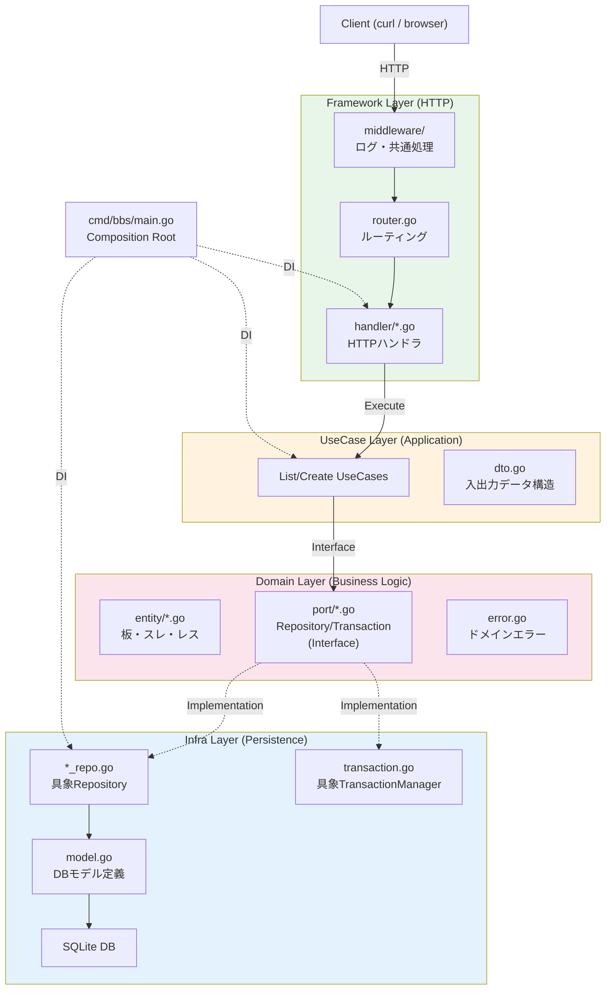

# BBS (2ちゃんねる風掲示板)

Go + SQLite で実装した2ちゃんねる風掲示板です。Clean Architecture の原則に基づき、依存関係の制御と責務の分離を徹底した構成になっています。

## 特徴

- **Clean Architecture 4層構成**: ドメインロジックを外部の関心事（HTTP, DB）から完全に分離。
- **SQLite 永続化**: 単一バイナリで動作可能。
- **スレッド・レス機能**: 板一覧、スレッド作成、レス投稿、age/sage機能。
- **トランザクション管理**: スレッド作成やレス投稿時の整合性を保証。

## 実行方法

### 1. ビルド

```bash
go build -o bbs ./cmd/bbs/
```

### 2. 起動

デフォルトでは `bbs.db` という名前の SQLite DB ファイルが作成されます。

```bash
./bbs
```

### 3. オプション

環境変数 `BBS_DB` を使用して DB パスを指定できます。

```bash
# 特定のパスを指定
BBS_DB=/tmp/bbs.db ./bbs

# インメモリ DB (テスト用)
BBS_DB=:memory: ./bbs
```

サーバーは `localhost:8080` で待機します。
初回起動時、以下の板が自動的に作成されます。

| slug    | name         |
| ------- | ------------ |
| program | プログラマー |
| news    | ニュース速報 |
| chat    | 雑談         |

## API 仕様

### 板一覧の取得

```bash
curl http://localhost:8080/api/boards
```

### スレッド一覧の取得

```bash
curl http://localhost:8080/api/boards/program/threads
```

### スレッドの作成

```bash
curl -X POST http://localhost:8080/api/boards/program/threads \
  -H 'Content-Type: application/json' \
  -d '{"title":"Go言語スレ","author":"gopher","body":"Go最高！"}'
```

### レス一覧の取得

```bash
curl http://localhost:8080/api/threads/1/posts
```

### レスの投稿

```bash
curl -X POST http://localhost:8080/api/threads/1/posts \
  -H 'Content-Type: application/json' \
  -d '{"author":"名無し","body":"sageテスト","sage":true}'
```

※ `sage: true` を指定すると、スレッドの最終更新日時（`last_posted_at`）が更新されません（ageられません）。

## アーキテクチャ構成図



## 各レイヤーの詳細

### 1. Domain Layer (依存関係なし)

ビジネスルールの中核です。

- **Entity**: `Board`, `Thread`, `Post`。ビジネスロジック（例：sageによるage判定、バリデーション）を保持。
- **Port**: リポジトリやトランザクションのインターフェース。
- **Error**: アプリケーション全体で共有されるドメイン例外。

### 2. UseCase Layer (Domain にのみ依存)

アプリケーション固有のビジネスシナリオを調整（オーケストレーション）します。

- `CreateThreadUseCase` など、複数のエンティティやリポジトリを組み合わせて一連の処理を実行。
- `dto.go` で定義された DTO を使用してデータの受け渡しを行い、他レイヤーとの結合を疎にします。

### 3. Infra Layer (Domain, 外部ライブラリに依存)

外部システム（DB）との接続を担います。

- **Repository**: SQL を発行し、エンティティと DB モデル（`Model`）の変換を行います。
- **TransactionManager**: 技術的な詳細（`sql.Tx` など）をドメイン層に漏らさずにトランザクション制御を提供。

### 4. Framework Layer (UseCase にのみ依存)

外部世界（HTTP）との接点です。

- **Handler**: HTTP リクエストをパースして UseCase を呼び出し、結果を JSON として返却。
- **Router**: URL パスとハンドラの紐付け。

## なぜ Clean Architecture がメンテナンス性に優れるのか

### 基本原則: 依存関係は常に外→内

Clean Architecture の核心は **依存関係の方向が一方向（外側→内側）にのみ向かう** ことです。
内側の層ほど「変更されにくい本質的なルール」を置き、外側の層ほど「交換可能な技術的詳細」を置きます。

```
Framework (HTTP/gRPC)  →  UseCase (アプリケーション手順)  →  Domain (ビジネスルール)
                              ↓                                   ↑
                         Infra Adapter (DB/外部API) ──────────────┘
                              (Domain の Port Interface を実装)
```

内側の層は外側の層について **何も知らない** ため、外側の変更が内側に波及することはありません。
この性質が、以下の3つのシナリオで具体的にどう効くかを説明します。

---

### シナリオ1: 通信方式の変更（HTTP → gRPC）

「REST API を gRPC に移行したい」という状況を考えます。

#### 変更が必要な層: Framework Layer のみ

| 変更対象 | 変更内容 |
|----------|---------|
| `handler/*.go` | `http.ResponseWriter` → protobuf メッセージの変換に差し替え |
| `router.go` | `http.ServeMux` → gRPC サービス登録 (`RegisterBbsServiceServer`) |
| `middleware/logging.go` | HTTP middleware → gRPC UnaryInterceptor |
| `cmd/bbs/main.go` | `http.ListenAndServe` → `grpc.NewServer()` + `net.Listen` |

Framework 層は「入力変換 → UseCase 呼び出し → 出力変換」という構造が同一です。
Handler の内部ロジックは変わらず、変わるのは DTO の変換先（JSON → protobuf）とエラー変換先（HTTP status → gRPC status）だけです。

**現在の HTTP Handler（参考）:**

```go
func (h *ThreadHandler) CreateThread(w http.ResponseWriter, r *http.Request) {
    // HTTP 固有の入力変換
    slug := r.PathValue("slug")
    var req createThreadRequest
    json.NewDecoder(r.Body).Decode(&req)

    // UseCase 呼び出し（ここは通信方式に依存しない）
    out, err := h.createThread.Execute(r.Context(), usecase.CreateThreadInput{
        BoardSlug: slug, Title: req.Title, Author: req.Author, Body: req.Body,
    })

    // HTTP 固有の出力変換（ドメインエラー → HTTP status）
    if errors.Is(err, domain.ErrBoardNotFound) {
        writeError(w, http.StatusNotFound, err.Error())
        return
    }
    writeJSON(w, http.StatusCreated, out)
}
```

**gRPC 版（イメージ）:**

```go
func (s *BBSServer) CreateThread(ctx context.Context, req *pb.CreateThreadRequest) (*pb.CreateThreadResponse, error) {
    // gRPC 固有の入力変換
    // UseCase 呼び出し（← 全く同じ）
    out, err := s.createThread.Execute(ctx, usecase.CreateThreadInput{
        BoardSlug: req.BoardSlug, Title: req.Title, Author: req.Author, Body: req.Body,
    })

    // gRPC 固有の出力変換（ドメインエラー → gRPC status）
    if errors.Is(err, domain.ErrBoardNotFound) {
        return nil, status.Errorf(codes.NotFound, err.Error())
    }
    return toProtoThread(out), nil
}
```

`Execute` の呼び出し行が **完全に同一** であることに注目してください。
UseCase のシグネチャ `Execute(ctx, Input) (Output, error)` は通信方式に依存しないため、そのまま使えます。

#### 変更が不要な層

| 層 | 理由 |
|----|------|
| **Domain** | Entity（Board, Thread, Post）、Port Interface、ドメインエラー — これらは gRPC の型を一切インポートしていないため |
| **UseCase** | `Execute` メソッドのシグネチャが不変。DTO（`CreateThreadInput`, `CreateThreadOutput`）も通信プロトコルに依存しないため |
| **Infra Adapter** | Repository 実装（SQLクエリ）、TransactionManager（`sql.Tx`） — DB アクセス方法は通信方式と無関係なため |

#### レイヤー分離がない場合との比較

```go
// 全てが1関数に混在している例
func CreateThread(w http.ResponseWriter, r *http.Request) {
    slug := r.PathValue("slug")           // HTTP 依存
    db, _ := sql.Open("sqlite3", "bbs.db") // DB 依存
    tx, _ := db.Begin()                    // 技術詳細
    res, _ := tx.Exec("INSERT INTO ...")   // SQL
    w.WriteHeader(201)                     // HTTP 依存
    json.NewEncoder(w).Encode(res)         // JSON 依存
}
```

この場合、gRPC に変えるには **関数全体を書き直す** 必要があります。ビジネスルールもフレームワーク依存の中に埋もれており、どこからどこまでがルールで、どこからが技術的詳細かが判別できません。

---

### シナリオ2: ビジネスルールの追加（スレ主以外書き込み禁止）

「スレ主しか書き込めない」というルールを追加するケースです。
ビジネスルールの追加は内側から外側へ変更が波及しますが、各層の変更は **その層の責務に直結する最小限のもの** です。

#### 変更内容

| 層 | 変更内容 | 役割 |
|----|---------|------|
| **Domain** | `Thread.Owner` フィールド追加、`CanPost()` メソッド追加、`ErrNotThreadOwner` エラー追加 | ルールの定義 |
| **UseCase** | `thread.CanPost(in.Author)` の呼び出し1行を追加 | ルールの適用 |
| **Infra** | `threads` テーブルに `owner` 列を追加、読み書きを対応 | 永続化の追従 |
| **Framework** | エラー変換に `ErrNotThreadOwner → 403 Forbidden` を1行追加 | 表示の追従 |

**Domain — ルールの定義:**

```go
// entity/thread.go
type Thread struct {
    // ...existing fields
    Owner string  // 追加: スレ主
}

// ビジネスルールをカプセル化
func (t *Thread) CanPost(author string) bool {
    return t.Owner == author
}
```

```go
// error.go
var ErrNotThreadOwner = errors.New("only thread owner can post")
```

**UseCase — ルールの適用（1行追加）:**

```go
func (u *CreatePostUseCase) Execute(ctx context.Context, in CreatePostInput) (*CreatePostOutput, error) {
    thread, err := u.threadRepo.FindByID(ctx, in.ThreadID)
    // ...

    // ↓ この1行を追加するだけ
    if !thread.CanPost(in.Author) {
        return nil, domain.ErrNotThreadOwner
    }

    // ...以降のロジックは変更なし
}
```

**Framework — 表示の追従（1 case 追加）:**

```go
// handler/post_handler.go — CreatePost 内のエラーハンドリング
case errors.Is(err, domain.ErrNotThreadOwner):
    writeError(w, http.StatusForbidden, err.Error())  // ← 1行追加
```

#### ポイント: ルールの居場所が明確

判定ロジックは `Thread.CanPost()` に **1箇所だけ** 存在します。

- **Domain** は「ルールとは何か」を知っている（`CanPost` の中身）
- **UseCase** は「いつルールを適用するか」を知っている（`CanPost` の呼び出しタイミング）
- **Framework** は「ルール違反をどう表示するか」を知っている（403 Forbidden）
- **Infra** は「ルールに必要なデータをどう保存するか」を知っている（owner 列）

どの層も自分の責務以外を持ちません。

#### 仕様のさらなる変更にも強い

「スレ主＋指定された人も書き込み可能」に仕様変更されても:

```go
// Domain だけ変更
func (t *Thread) CanPost(author string) bool {
    return t.Owner == author || t.IsInvited(author)
}
```

UseCase、Infra、Framework は **一切変更不要** です。
呼び出し側は `CanPost()` の中身を知らないため、内部実装が変わっても影響しません。
これが「依存関係が内側に向かっている」ことの直接的なメリットです。

#### レイヤー分離がない場合との比較

```go
// ビジネスルールが Handler に埋まっている例
func CreatePost(w http.ResponseWriter, r *http.Request) {
    // SQL でスレ主を取得
    row := db.QueryRow(
        "SELECT author FROM posts WHERE thread_id=? AND number=1", threadID,
    )
    var owner string
    row.Scan(&owner)
    // HTTP リクエストから投稿者を取得
    author := r.FormValue("author")
    if owner != author {                    // ← ビジネスルールがここに埋まっている
        w.WriteHeader(403)                  // ← HTTP 依存
        json.NewEncoder(w).Encode(map[string]string{"error": "forbidden"})
        return
    }
    // INSERT ...
}
```

このコードでは:

- 「スレ主 = 1レス目の投稿者」というルールが **SQL** に埋まっている
- 「スレ主以外禁止」というルールが **HTTP handler** に埋まっている
- 「招待された人もOK」に変更する場合、**どこを直すべきか** が不明
- HTTP → gRPC 移行時にも **このルールを書き直す** 必要がある

---

### シナリオ3: DB の変更（SQLite → PostgreSQL）

参考までに、永続化層の変更パターンも示します。

#### 変更が必要な層: Infra Adapter Layer のみ

| 変更対象 | 変更内容 |
|----------|---------|
| `infra/persistence/sqlite/` | → `infra/persistence/postgres/` を新規作成 |
| 各 `*_repo.go` | SQL 文法の差異（`?` → `$1`、`AUTOINCREMENT` → `SERIAL`）を修正 |
| `transaction.go` | `sql.Tx` の扱いは同じだが、接続文字列等の設定を変更 |
| `model.go` | PostgreSQL 用の型マッピングに調整 |

#### 変更が不要な層

| 層 | 理由 |
|----|------|
| **Domain** | Port Interface（`BoardRepository`, `TransactionManager`）が抽象的なため、実装が SQLite でも PostgreSQL でも同じように呼び出せる |
| **UseCase** | Repository の **Interface** に依存しているため、具象実装が何に置き換わっても影響なし |
| **Framework** | Handler は UseCase を呼ぶだけで、DB の種類を知らない |

Composition Root（`cmd/bbs/main.go`）だけが具象実装の差し替え箇所を知っています:

```go
// SQLite の場合
boardRepo := sqlite.NewBoardRepository(db)

// PostgreSQL の場合（ここだけ変更）
boardRepo := postgres.NewBoardRepository(db)
```

---

### シナリオ4: 外部APIの統合（新規投稿時にSlack通知）

「スレに新しい投稿があったら Slack に通知する」機能を追加するケースです。
これは **新しい Port を定義して Infra Adapter を増やす** パターンで、既存コードへの影響を最小限に抑えられます。

#### 変更内容

| 層 | 変更内容 | 役割 |
|----|---------|------|
| **Domain** | `port.NotificationGateway` interface を新規定義 | 「通知が必要である」という抽象の定義 |
| **UseCase** | `CreatePostUseCase` に `NotificationGateway` を注入、投稿成功後に呼び出し | 通知のタイミング制御 |
| **Infra** | `infra/notification/slack_gateway.go` を新規作成 | Slack API の具体実装 |
| **Framework** | 変更なし | — |

**Domain — 新しい Port:**

```go
// port/notification.go（新規ファイル）
type NotificationGateway interface {
    NotifyNewPost(ctx context.Context, threadTitle string, postAuthor string, postBody string) error
}
```

`NotificationGateway` は「通知手段」を抽象化します。
Slack なのか Email なのか LINE なのか、Domain は知りません。

**UseCase — 通知の呼び出し（2行追加）:**

```go
type CreatePostUseCase struct {
    threadRepo port.ThreadRepository
    postRepo   port.PostRepository
    tm         port.TransactionManager
    notifier   port.NotificationGateway  // ← 追加
}

func (u *CreatePostUseCase) Execute(ctx context.Context, in CreatePostInput) (*CreatePostOutput, error) {
    // ...既存の投稿ロジック（変更なし）

    var out *CreatePostOutput
    if err := u.tm.RunInTransaction(ctx, func(txCtx context.Context) error {
        // ...既存の保存処理（変更なし）
        out = &CreatePostOutput{Post: toPostDTO(post)}
        return nil
    }); err != nil {
        return nil, err
    }

    // ↓ 2行追加（トランザクション外で実行 — 通知失敗で投稿を巻き戻さない）
    u.notifier.NotifyNewPost(ctx, thread.Title, post.Author, post.Body)

    return out, nil
}
```

**Infra — Slack 実装（新規ファイル）:**

```go
// infra/notification/slack_gateway.go（新規ファイル）
type SlackGateway struct {
    webhookURL string
}

func NewSlackGateway(webhookURL string) *SlackGateway {
    return &SlackGateway{webhookURL: webhookURL}
}

func (g *SlackGateway) NotifyNewPost(ctx context.Context, threadTitle, author, body string) error {
    payload := fmt.Sprintf(`{"text":"[%s] %s: %s"}`, threadTitle, author, body)
    req, _ := http.NewRequestWithContext(ctx, "POST", g.webhookURL, strings.NewReader(payload))
    // ... HTTP リクエスト送信
}
```

**Composition Root — DI に1行追加:**

```go
notifier := slack.NewSlackGateway("https://hooks.slack.com/...")
createPost := usecase.NewCreatePostUseCase(threadRepo, postRepo, tm, notifier)
```

#### 変更が不要な層

| 層 | 理由 |
|----|------|
| **Entity** | Board, Thread, Post — 通知とは無関係なため |
| **Framework (Handler)** | HTTP リクエストの処理は通知を知らないため |

#### ポイント: 通知先の差し替えが容易

Slack → Email に変更する場合:

```go
// Composition Root だけで差し替え可能
notifier := email.NewEmailGateway(smtpConfig)
```

UseCase、Domain、Framework は一切変更不要。
`NotificationGateway` interface が「何を通知するか」を決め、「どう通知するか」は Infra Adapter に任せています。

#### レイヤー分離がない場合との比較

```go
// NG: 通知処理が Handler に直接埋まっている
func CreatePost(w http.ResponseWriter, r *http.Request) {
    // ...DB に投稿保存
    // Slack 通知をハードコード
    http.Post("https://hooks.slack.com/...", "application/json", bytes.NewReader(payload))
    w.WriteHeader(201)
}
```

この場合:

- Slack → Email に変えるのに **Handler を書き直す** 必要がある
- 通知失敗時のリトライやエラーハンドリングも Handler に混ざる
- テスト時に毎回 Slack に通知が飛ぶ（モックできない）

---

### シナリオ5: 認証の追加（JWT Bearer Token）

「投稿時に JWT で認証を要求する」機能を追加するケースです。
これは **Framework 層に横断的関心を追加する** パターンで、内側の層を一切変更しません。

#### 変更内容

| 層 | 変更内容 | 役割 |
|----|---------|------|
| **Framework** | `middleware/auth.go` を新規作成、Router に適用 | 認証・認可 |
| その他の層 | **変更なし** | — |

**Framework — 認証ミドルウェア（新規ファイル）:**

```go
// middleware/auth.go（新規ファイル）
func Auth(secret string) func(http.Handler) http.Handler {
    return func(next http.Handler) http.Handler {
        return http.HandlerFunc(func(w http.ResponseWriter, r *http.Request) {
            token := strings.TrimPrefix(r.Header.Get("Authorization"), "Bearer ")
            if token == "" {
                writeError(w, http.StatusUnauthorized, "missing token")
                return
            }
            claims, err := validateJWT(token, secret)
            if err != nil {
                writeError(w, http.StatusUnauthorized, "invalid token")
                return
            }
            // 認証済みユーザー情報を context に格納
            ctx := context.WithValue(r.Context(), authKey{}, claims)
            next.ServeHTTP(w, r.WithContext(ctx))
        })
    }
}
```

**Router — ミドルウェアの適用（1箇所変更）:**

```go
// router.go
mux.HandleFunc("POST /api/boards/{slug}/threads", auth(secret)(threadHandler.CreateThread))
mux.HandleFunc("POST /api/threads/{threadID}/posts", auth(secret)(postHandler.CreatePost))
// GET エンドポイントは認証なし（既存動作を維持）
```

#### 変更が不要な層

| 層 | 理由 |
|----|------|
| **Domain** | Entity と Port は「誰が」操作しているかを知らない。認証は Framework の責務 |
| **UseCase** | `Execute(ctx, Input)` のシグネチャ不変。認証済みユーザーが必要なら Input DTO にフィールドを追加するだけで対応可能 |
| **Infra** | DB アクセスは認証とは無関係 |

#### ポイント: 認証ロジックがビジネスに混ざらない

Clean Architecture では **認証は外側の関心事** です。
UseCase は「認証済みかどうか」を知らず、単に Input を受け取って処理します。
これにより:

- 認証方式（JWT → API Key → OAuth）を変えても UseCase は変更不要
- 認証なしの社内API版を簡単に作れる（ミドルウェアを外すだけ）
- UseCase のテストで認証をモックする必要がない

#### レイヤー分離がない場合との比較

```go
// NG: 認証がビジネスロジックに混ざっている
func CreatePost(w http.ResponseWriter, r *http.Request) {
    token := r.Header.Get("Authorization")  // ← HTTP 依存
    if !validateJWT(token) {                 // ← 認証がここに埋まっている
        w.WriteHeader(401)
        return
    }
    // ...DB 処理
}
```

この場合、すべてのエンドポイントで認証チェックを重複して書く必要があり、
認証方式の変更が全エンドポイントに波及します。

---

### データ境界による保護

各層の境界で型変換が行われ、Entity が外部の関心事に汚染されません。

```
HTTP Request JSON
    ↓ (Handler でデコード)
UseCase Input DTO（JSON tag なし）
    ↓ (UseCase で Entity を生成)
Entity（ORM tag なし、JSON tag なし）
    ↓ (Infra Adapter で変換)
DB Model（SQL tag 付き、Entity とは別型）
    ↓
SQLite
```

もしこの変換を怠り、Entity に JSON tag や ORM tag を付けてしまうと:

```go
// NG: Entity が外部関心事に汚染されている
type Post struct {
    ID   int64  `json:"id" gorm:"primaryKey"`  // JSON も ORM も知っている
    Body string `json:"body"`                   // 通信フォーマットに依存
}
```

これでは gRPC（protobuf tag）に移行する際に Entity を変更しなければならず、内側の層が外側に振り回されることになります。
Clean Architecture ではこの **怠惰な型共有** を防ぎ、各境界で明示的に DTO とマッピングを定義します。

### エラー境界による保護

エラーも層の境界で変換され、技術的詳細が内側に漏れません。

```
Infra Adapter:  sql.ErrNoRows → domain.ErrBoardNotFound    （DB エラーをドメインエラーに変換）
UseCase:        domain.ErrBoardNotFound をそのまま返す       （技術的非依存）
Framework:      domain.ErrBoardNotFound → 404 Not Found     （ドメインエラーをHTTPステータスに変換）
```

もしこの変換を怠ると:

```go
// NG: UseCase が DB エラーを知ってしまう
func (u *CreateThreadUseCase) Execute(...) {
    board, err := u.boardRepo.FindBySlug(ctx, slug)
    if err == sql.ErrNoRows {  // ← database/sql に依存！
        // ...
    }
}
```

UseCase が `database/sql` に依存してしまい、DB を変更できなくなります。
このプロジェクトでは Infra Adapter 側で `sql.ErrNoRows` を `domain.ErrBoardNotFound` に変換しているため、UseCase は標準ライブラリの `errors` だけを知っていればよい状態になっています。

### テストの安定性

層ごとにテストが独立しているため、変更時のテスト追加も影響層だけで済みます。

```
Domain Test:    Thread.CanPost("owner", "other") → false        （DBもHTTPも不要）
UseCase Test:   モック Repository → ErrNotThreadOwner が返る    （DBもHTTPも不要）
Infra Test:     実際の SQLite で SQL の整合性確認               （HTTP不要）
Framework Test: モック UseCase → 403 が返る                     （DBもビジネスロジックも不要）
```

- ビジネスルールの変更 → Domain Test と UseCase Test だけ追加
- 通信方式の変更 → Framework Test だけ書き直し
- DB の変更 → Infra Test だけ書き直し

既存のテストは壊れません。

### まとめ: 変更の種類と影響範囲

| 変更の種類 | 影響する層 | 触らない層 |
|-----------|-----------|-----------|
| 通信方式の変更（HTTP → gRPC） | Framework | Domain, UseCase, Infra |
| DB の変更（SQLite → PostgreSQL） | Infra | Domain, UseCase, Framework |
| ビジネスルールの追加・変更 | Domain, UseCase | Framework, Infra |
| 外部サービス統合（Slack通知など） | Domain (Port), UseCase, Infra (新規) | Entity, Framework |
| 認証の追加（JWTなど） | Framework | Domain, UseCase, Infra |

**DB が変われば Infra だけ、通信方式が変われば Framework だけ、ビジネスルールが変われば Domain と UseCase だけ。**
この「影響範囲の局所化」が Clean Architecture のメンテナンス性の源泉です。

各層は **自分の責務だけ** を持ち、自分の変更理由だけに応答して変わります。
他の層の変更理由で書き換えられることはありません。

## プロジェクト構造

```text
.
├── cmd/bbs/            # エントリポイント (Composition Root)
├── internal/
│   ├── domain/         # ドメイン層 (Entity, Port, Error)
│   ├── usecase/        # ユースケース層 (Interactors, DTO)
│   ├── infra/          # インフラ層 (Persistence/SQLite)
│   └── framework/      # フレームワーク層 (HTTP Handler, Router, Middleware)
└── bbs.db              # デフォルトのデータベースファイル
```
