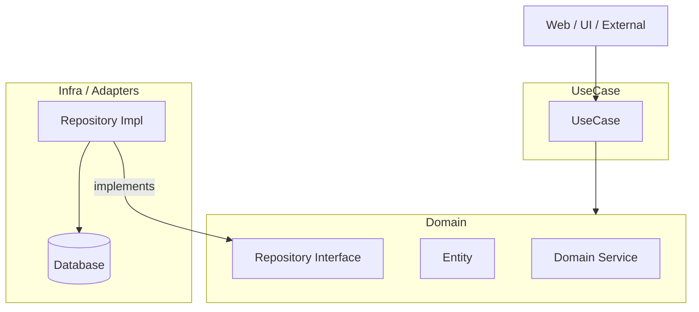

# Clean Architecture (3-Layer Structure)

A proposal for building loosely coupled software centered on business logic, independent of external details such as databases or communication protocols.

## Layer Structure and Dependencies

Dependencies always point **inwards (towards the Domain)**. External inputs like Web call the UseCase, and Infra depends on the Domain through interfaces.



---

## 1. Domain Layer

The heart of the application, representing the business rules themselves.

* **Entity:** Business "objects" or "concepts".
* **Domain Service:** Knowledge or logic that spans multiple entities.
* **Repository Interface:** An "abstract contract" regarding data persistence. Implementation is not included here.

## 2. UseCase Layer

Describes the steps to realize specific "features" of the application.

* **Role:** Manipulates objects from the Domain layer and defines the flow of processing (orchestration).
* **Dependencies:** Depends only on the Domain layer. It is unaware of what the external database actually is.

## 3. Infra / Adapters Layer

Responsible for bridging with external systems (Adapters) and specific technical implementations.

* **Repository Impl (Adapter):** Specifically implements the interface defined in the Domain layer. This is where SQL queries and other concrete operations occur.
* **External Resources:** Concrete entities such as databases, external APIs, and file systems.

---

## Implementation Example (Go)

A simple example determining if a user belongs to a specific group shows the implementation image of each layer.

### 1. Domain Layer

Defines business rules (interfaces).

```go
// domain/membership.go
package domain
import "context"

// MembershipRepository defines abstract queries against a data source
type MembershipRepository interface {
 IsMember(ctx context.Context, userID, groupID string) (bool, error)
}
```

### 2. UseCase Layer

Defines business "procedures". Uses Domain interfaces.

```go
// usecase/membership.go
package usecase

import (
 "context"
 "your-project/domain"
)

// MembershipUseCase is the concrete executor of the use case
type MembershipUseCase struct {
 repo domain.MembershipRepository
}

func NewMembershipUseCase(r domain.MembershipRepository) *MembershipUseCase {
 return &MembershipUseCase{repo: r}
}

// Execute performs the "membership check" use case
func (u *MembershipUseCase) Execute(ctx context.Context, userID, groupID string) (bool, error) {
 // Domain-specific validation can be performed here if necessary
 return u.repo.IsMember(ctx, userID, groupID)
}
```

### 3. Infra Layer

Specifically implements the interface.

```go
// infra/membership_repository.go
package infra

import (
 "context"
 "database/sql"
)

// SqlMembershipRepository is a repository implementation using a SQL database
type SqlMembershipRepository struct {
 db *sql.DB
}

func NewSqlMembershipRepository(db *sql.DB) *SqlMembershipRepository {
 return &SqlMembershipRepository{db: db}
}

// IsMember issues actual SQL against the database
func (r *SqlMembershipRepository) IsMember(ctx context.Context, userID, groupID string) (bool, error) {
 var exists bool
 query := "SELECT EXISTS(SELECT 1 FROM memberships WHERE user_id = ? AND group_id = ?)"
 err := r.db.QueryRowContext(ctx, query, userID, groupID).Scan(&exists)
 return exists, err
}
```

---

## Calling from External (REST / gRPC)

Web frameworks or gRPC servers reside at the outermost edge and are only responsible for calling the `UseCase`.

```go
// Example usage in a Web handler
func HandleCheckMembership(w http.ResponseWriter, r *http.Request) {
    // 1. Create real DB instance (usually done at startup)
    dbRepo := infra.NewSqlMembershipRepository(sqlDB)

    // 2. Inject repository into the UseCase (Dependency Injection)
    useCase := usecase.NewMembershipUseCase(dbRepo)

    // 3. Execute the UseCase
    isMember, err := useCase.Execute(r.Context(), "user123", "groupA")

    // 4. Return result as response
    json.NewEncoder(w).Encode(map[string]bool{"is_member": isMember})
}
```

### Role of context.Context

In the Go implementation example, `ctx context.Context` is passed through each layer for the following primary purposes:

1. **Cancellation Propagation:** If a user closes their browser, the signal is propagated down to the DB query, immediately stopping the execution and saving resources.

2. **Timeout Management:** It allows enforcing deadlines (e.g., "the whole request must finish within 5 seconds") across all operations, including database calls.

3. **Tracing:** It carries request-scoped metadata like Request IDs, enabling you to trace a single request's journey through multiple layers and services in logs.

#### 💡 ctx vs. Arguments

* **Use Arguments for:** **Essential business data** such as `userID` or `groupID`. Passing these explicitly as arguments ensures type safety and makes the function's dependencies clear.

* **Use ctx for:** **Cross-cutting (supplementary) information** such as `Request ID` or `Auth Tokens`. These are not core to the business logic but are necessary for logging, authorization at the infra layer, or distributed tracing.
