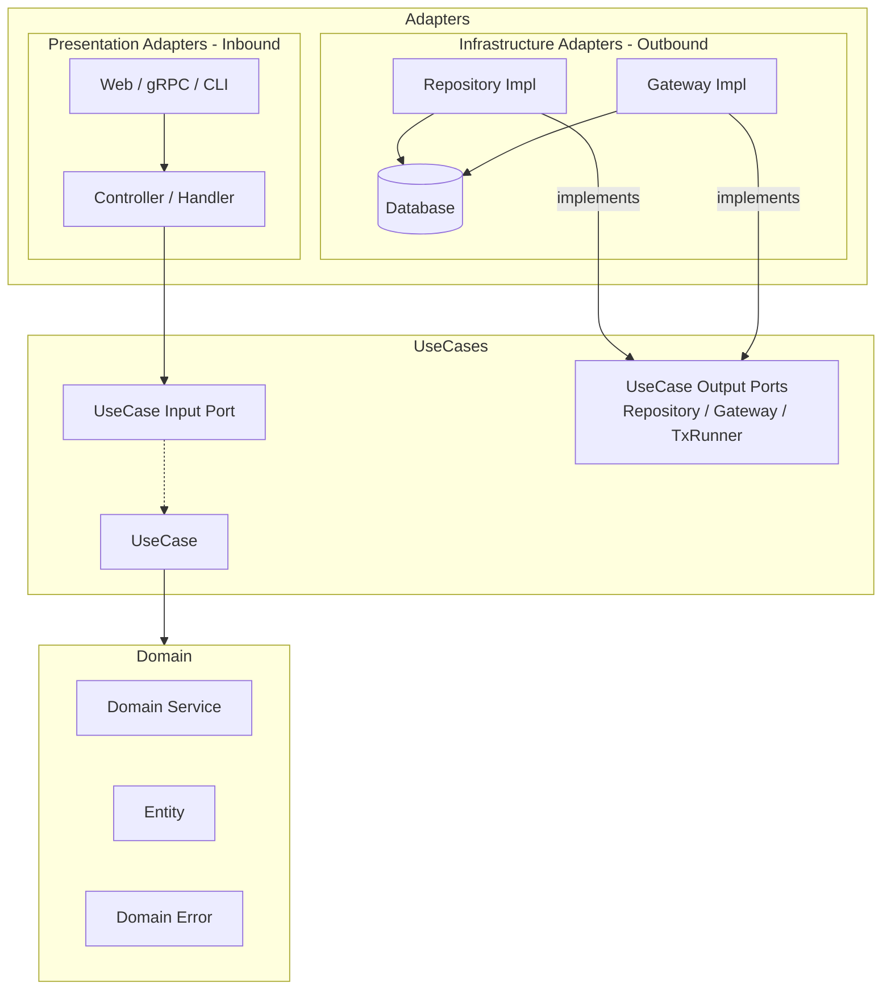

# Clean Architecture (3-Layer Variant: Adapters / UseCases / Domain)

A proposal for building loosely coupled software centered on business logic, independent of external details such as databases or communication protocols.

This variant uses three conceptual layers. The **Adapters** layer is conceptually one layer but split into **Presentation Adapters** (inbound/driving) and **Infrastructure Adapters** (outbound/driven) to prevent monolithic growth and clarify the side-effect boundary.

## Layer Structure and Dependencies

Dependencies always point **inward toward higher-level policies**. External inputs (Presentation Adapters) call UseCases, and Infrastructure Adapters implement inner ports.

```text
Presentation Adapters ---→ UseCases ---→ Domain
                             ↑              ↑
                             +--------------+-- Infrastructure Adapters
        implements ports owned by UseCases or Domain
```


```mermaid
graph TD
    subgraph AdaptersLayer [Adapters]
        subgraph PresentationAdapters [Presentation Adapters - Inbound]
            Web[Web / gRPC / CLI]
            Controller[Controller / Handler]
        end
        subgraph InfraAdapters [Infrastructure Adapters - Outbound]
            RI_Impl[Repository Impl]
            GW_Impl[Gateway Impl]
            DB[(Database)]
        end
    end

    subgraph UseCaseLayer [UseCases]
        UC[UseCase]
        UC_Port[UseCase Input Port]
        UO[UseCase Output Ports<br/>Repository / Gateway / TxRunner]
    end

    subgraph DomainLayer [Domain]
        DS[Domain Service]
        E[Entity]
        DE[Domain Error]
    end

    %% Inbound dependencies
    Web --> Controller
    Controller --> UC_Port
    UC_Port -.-> UC
    UC --> DomainLayer

    %% Outbound dependencies
    RI_Impl -- "implements" --> UO
    GW_Impl -- "implements" --> UO
    RI_Impl --> DB
    GW_Impl --> DB
```

---

## Mapping to Original Architectures

| Original Clean Architecture | This Variant's Placement                                            |
| :-------------------------- | :------------------------------------------------------------------ |
| Entities                    | Domain                                                              |
| Use Cases                   | UseCases                                                            |
| Interface Adapters          | Adapters (Presentation + Infrastructure)                            |
| Frameworks & Drivers        | Concrete mechanisms used by Adapters and Composition Root (main.go) |

> **Note:** In this 3-layer variant, the traditional "Frameworks & Drivers" layer is absorbed into Adapters and Composition Root. Web frameworks, routing libraries, and DB drivers are treated as implementation details within the Adapters layer, not as a separate architectural layer. The Composition Root (`main.go`) wires everything together but contains no business logic.

| Hexagonal Architecture          | This Variant's Placement |
| ------------------------------- | ------------------------ |
| Driving (Inbound) Adapters      | Presentation Adapters    |
| Application (Ports & Use Cases) | UseCases                 |
| Driven (Outbound) Adapters      | Infrastructure Adapters  |
| Domain                          | Domain                   |

The names differ, but the main rule stays the same: **source-code dependencies point inward toward higher-level policies.**

---

## Layer Definitions

### 1. Domain Layer

The heart of the application, representing the business rules themselves.

- **Entity / Aggregate / Value Object:** Business "objects" or "concepts."
- **Domain Service:** Knowledge or logic that spans multiple entities.
- **Domain Error:** Errors defined in domain vocabulary.
- **Domain Port (Interface):** Only when the abstraction is part of the domain language. Persistence repositories and external-tool ports belong to UseCases.
- **No external dependencies:** No DB, HTTP, ORM, SDK, web framework, or generated transport types.
- **Note on `context.Context`:** Domain interfaces in Go commonly accept `context.Context` as the first parameter for cancellation and deadline propagation. This is a **pragmatic exception** to the "no external dependencies" rule, justified specifically because `context.Context` carries cancellation and deadline signals — a Go runtime concern, not a business dependency. The exception does not extend to other standard library packages (e.g., `net/http`, `database/sql`). Domain MUST NOT read custom values from context — that responsibility belongs to Infrastructure Adapters.

### 2. UseCases Layer

Describes the steps to realize specific "features" of the application. **Orchestration only.**

- **Role:** Coordinates Domain objects and boundary interfaces without direct SQL / HTTP / file / SDK calls.
- **Defines input/output boundaries** and application DTOs.
- **Defines ports** for application-specific external capabilities (UseCase Ports).
- **Controls transaction boundaries** and application policies (retries, idempotency, authorization decisions).
- **Dependencies:** Domain only. No direct dependency on concrete Adapters, web frameworks, or database drivers.

### 3. Adapters Layer

**Adapter = side-effect boundary.** All I/O, external integrations, and framework interactions are confined here.

#### 3a. Presentation Adapters (Inbound / Driving)

Adapters that deliver application behavior to users or external callers.

- **Controller / Handler:** Converts external requests (HTTP, CLI) to UseCase inputs and calls the UseCase.
- **Presenter:** Formats the UseCase output for external consumption (e.g., JSON).
- **Request/Response DTOs:** Transport-specific data structures.
- **Auth Middleware:** Authentication and authorization entry-point checks when they are delivery concerns.

#### 3b. Infrastructure Adapters (Outbound / Driven)

Adapters that connect UseCases or Domain-owned ports to external systems.

- **Repository Impl:** Implements persistence interfaces defined in the UseCases layer. Mapping and query construction live here.
- **Gateway Impl:** Implementation of external API clients, notification, search, payment, etc.
- **Error Conversion:** Converts driver errors (e.g., `sql.ErrNoRows`) to domain errors before they reach inner layers.

---

## Dependency Matrix

| From / To                 | Domain | UseCases | Adapters |
| ------------------------- | ------ | -------- | -------- |
| Domain                    | yes    | no       | no       |
| UseCases                  | yes    | yes      | no       |
| Adapters (Presentation)   | cond.  | yes      | self     |
| Adapters (Infrastructure) | yes    | yes      | self     |
| Composition Root          | yes    | yes      | yes      |

- `Presentation → Domain` is `cond.` (conditional): Presentation MAY read Domain values returned by UseCases for serialization (pragmatic mode). This is only permissible if the **Boundary Simplification Checklist** below is fully satisfied.

### Boundary Simplification Checklist

1. **Read-Only**: The operation is a "Query" and does not involve any data modification (Command).
2. **Structure-Only**: The Presentation layer treats the Entity as a plain data structure and **MUST NOT invoke any methods (behavior)**.
3. **No Secrets**: The Entity does not contain sensitive information (e.g., password hashes) that should not be exposed to the Presentation layer.
4. **Consistency**: The risk of Entity field changes directly affecting API specifications (e.g., JSON keys) is acceptable.

For modification operations (Create/Update/Delete), always use dedicated Input DTOs to protect invariants and perform input validation.

- Presentation Adapters and Infrastructure Adapters are in the same conceptual layer but must not depend on each other directly.

---

## Implementation Example (Go)

A simple example determining if a user belongs to a specific group shows the implementation image of each layer.

### 1. Domain Layer (Implementation)

Defines business rules (interfaces).

```go
// internal/domain/membership.go
package domain

import "context"

// MembershipRepository defines abstract queries against a data source.
type MembershipRepository interface {
	IsMember(ctx context.Context, userID, groupID string) (bool, error)
}
```

### 2. UseCases Layer (Implementation)

Defines business "procedures". Uses Domain interfaces.

```go
// internal/usecase/membership.go
package usecase

import (
	"context"

	"your-project/internal/domain"
)

// MembershipUseCase is the concrete executor of the use case.
type MembershipUseCase struct {
	repo domain.MembershipRepository
}

func NewMembershipUseCase(r domain.MembershipRepository) *MembershipUseCase {
	return &MembershipUseCase{repo: r}
}

// Execute performs the "membership check" use case.
func (uc *MembershipUseCase) Execute(ctx context.Context, userID, groupID string) (bool, error) {
	// Domain-specific validation can be performed here if necessary.
	return uc.repo.IsMember(ctx, userID, groupID)
}
```

### 3. Infrastructure Adapters Layer (Implementation)

Specifically implements the interfaces (Ports) defined in the Domain layer. Details like DB drivers are isolated here to keep upper layers independent of specific technologies.

```go
// internal/adapters/infra/persistence/membership_repository.go
package persistence

import (
	"context"
	"database/sql"
	"fmt"
)

// SQLMembershipRepository is a repository implementation using a SQL database.
type SQLMembershipRepository struct {
	db *sql.DB
}

func NewSQLMembershipRepository(db *sql.DB) *SQLMembershipRepository {
	return &SQLMembershipRepository{db: db}
}

// IsMember issues actual SQL against the database.
func (r *SQLMembershipRepository) IsMember(ctx context.Context, userID, groupID string) (bool, error) {
	var exists bool
	query := "SELECT EXISTS(SELECT 1 FROM memberships WHERE user_id = ? AND group_id = ?)"
	err := r.db.QueryRowContext(ctx, query, userID, groupID).Scan(&exists)
	if err != nil {
		return false, fmt.Errorf("query membership: %w", err) // Convert driver error
	}
	return exists, nil
}
```

---

## Calling from External (REST / gRPC)

Web frameworks or gRPC servers reside at the outermost edge and are only responsible for calling the `UseCase`. Handlers depend on **UseCase interfaces (input ports)** to keep implementations swappable.

```go
// internal/usecase/membership_port.go
package usecase

import "context"

// MembershipChecker is the input port (public UseCase API).
type MembershipChecker interface {
	Execute(ctx context.Context, userID, groupID string) (bool, error)
}
```

```go
// internal/adapters/presentation/http/handler.go
package http

import (
	"encoding/json"
	"net/http"

	"your-project/internal/usecase"
)

// Example usage in a Web handler (Composition Root injects useCase at startup)
func HandleCheckMembership(w http.ResponseWriter, r *http.Request, useCase usecase.MembershipChecker) {
	userID := r.URL.Query().Get("id")
	groupID := r.URL.Query().Get("group")

	// Execute the UseCase
	isMember, err := useCase.Execute(r.Context(), userID, groupID)
	if err != nil {
		// Do NOT leak internal error details to the client.
		// Log the error and return a generic message.
		writeError(w, http.StatusInternalServerError, "internal server error")
		return
	}

	// Return result as response
	json.NewEncoder(w).Encode(map[string]bool{"is_member": isMember})
}
```

> **Note**: DB instances and UseCase construction belong in the Composition Root (`main.go`), not inside handlers. The handler receives the UseCase as a dependency and is responsible only for request/response conversion.

### Role of context.Context

In the Go implementation example, `ctx context.Context` is passed through each layer for the following primary purposes:

1. **Cancellation Propagation:** If a user closes their browser, the signal is propagated down to the DB query, immediately stopping the execution and saving resources.

2. **Timeout Management:** It allows enforcing deadlines (e.g., "the whole request must finish within 5 seconds") across all operations, including database calls.

3. **Tracing:** It carries request-scoped metadata like Request IDs, enabling you to trace a single request's journey through multiple layers and services in logs.

**Cancellation implementation example:**

The `context` cancellation signal propagates through the `Done()` channel. For long-running operations, check this channel periodically.

```go
func LongRunningProcess(ctx context.Context) error {
    select {
    case <-ctx.Done():
        // Cancelled (including timeout)
        return ctx.Err()
    default:
        // Continue processing
    }
    // ... heavy processing ...
    return nil
}
```

#### ctx vs. Arguments

- **Use Arguments for:** **Essential business data** such as `userID` or `groupID`. Passing these explicitly as arguments ensures type safety and makes the function's dependencies clear.

- **Use ctx for:** **Cross-cutting (supplementary) information** such as `Request ID` or `Auth Tokens`. These are not core to the business logic but are necessary for logging, authorization at the infra layer, or distributed tracing.

**Do not smuggle resources in context:** Do not hide `sql.Tx`, DB handles, request objects, or SDK clients inside `context.Context` to cross architectural boundaries. Use explicit function parameters or dependency injection instead. The one exception: Infrastructure Adapters MAY propagate transaction handles internally via `context.WithValue` (e.g., to share `*sql.Tx` across repository calls within a transaction), but UseCases and Domain MUST NOT read those values from context.

---

## Port Ownership Guidance

- **Domain Port:** When the abstraction is part of the "Domain Language" and is essential for the domain model to fulfill its core business rules.
  - _Examples:_ Domain-decision ports such as `PricingPolicy` or `FraudDetector`.
  - _Heuristic:_ "Would the domain model be incomplete or unable to enforce its invariants without this capability?"
- **UseCase Port:** When the abstraction is a "Tool" required to complete an application-specific procedure.
  - _Examples:_ `NotificationGateway.SendWelcomeEmail` (a side-effect of a workflow), `IdentityGateway.IsMember` (authorization check against external provider), `TransactionManager.RunInTransaction` (application-level transaction boundary).
  - _Heuristic:_ "Is this a requirement of the application workflow rather than the core business logic itself?"
- **Repository Ports:** Persistence is a capability needed to complete an application workflow, so interfaces such as `BoardRepository` and `ThreadRepository` live in the UseCase layer. `TransactionManager` likewise controls an application transaction boundary and is a UseCase Port.
- Concrete implementations live in **Infrastructure Adapters** regardless of which inner layer owns the interface.

### Input Port Interface Policy

Input Ports (UseCase interfaces called by Presentation Adapters) should be defined **when the UseCase is consumed by multiple Presentation types** (e.g., HTTP + gRPC + CLI) or when you want to explicitly decouple the handler from the concrete UseCase struct for testing. For single-protocol applications, defining an interface for every UseCase adds unnecessary boilerplate — the Presentation can depend on the concrete UseCase struct directly, and Go's structural typing still allows swapping when needed.

**Guideline:** Define Input Port interfaces where they add value (multi-protocol support, test isolation). Do not create them by default for every UseCase. The BBS project in this repository defines Input Ports (`CreatePostInputPort`, etc.) to keep its HTTP Handlers independently testable from UseCase implementations. The current BBS includes HTTP only; it does not include a gRPC implementation.

## Ports and Repository Boundary

- **Input Port:** The UseCase interface called by Presentation Adapters (Web/CLI/Batch). Controllers depend on this port.
- **Output Port:** Contracts the Domain / UseCases require from the outside (e.g., repositories). Interfaces live inside, implementations live in Infrastructure Adapters.
- **Repository Boundary:** Repositories define persistence contracts. Transactions and retries sit in UseCases; mapping and query construction belong in Infrastructure Adapters.

## Error Boundary Rules

- **Infrastructure Adapters** convert driver errors (e.g., `sql.ErrNoRows`) to domain errors before they reach inner layers.
- **Domain / UseCases** errors carry business or application meaning, not HTTP status codes or SQL sentinel errors.
- **Presentation Adapters** convert application errors to transport errors (HTTP status, gRPC status, CLI exit codes).

## Data Boundary Rules

- **UseCase Input/Output** should be explicit when it protects the inner policy from transport or persistence details.
- **Domain objects** are not Presentation DTOs or ORM records. Avoid transport annotations, ORM tags, or generated API types in domain objects.
- **Mapping responsibility** is consistent: Presentation maps request/response; Infrastructure maps persistence/external data; UseCases may map application DTOs.

## Anti-Patterns

- Domain leaks DB / HTTP / ORM / SDK / framework types.
- UseCases directly perform SQL / HTTP / file I/O instead of depending on a boundary interface.
- Presentation bypasses UseCases to run business workflow or persistence decisions directly.
- Infrastructure Adapter code owns business decisions that belong in Domain or UseCases.
- Transport DTOs, ORM records, or generated API models are reused as Domain objects.
- Presentation and Infrastructure Adapters are merged in a way that makes their responsibilities hard to find.

### Domain Events

Domain Events are a common Clean Architecture pattern for decoupling side effects from UseCase orchestration. When a significant business event occurs (e.g., `PostCreated`), the Domain or UseCase layer publishes an event, and Infrastructure Adapters subscribe to perform side effects (notifications, audit logs, cache invalidation). This avoids the UseCase needing to know about every downstream consumer.

```go
// internal/usecase/event.go
type DomainEvent interface {
    EventName() string
}

type PostCreatedEvent struct {
    BoardID  int64
    ThreadID int64
    PostID   int
}

func (PostCreatedEvent) EventName() string { return "PostCreated" }

type EventPublisher interface {
    Publish(ctx context.Context, event DomainEvent) error
}
```

The UseCase publishes the event after the transaction completes, and the Composition Root wires subscribers (e.g., SlackNotifier) to the EventPublisher. This keeps the UseCase focused on orchestration while side effects are handled asynchronously.

> **Caution:** Publishing after commit risks event loss if the publish call fails. For production systems, consider a **Transactional Outbox** — store the event in the same DB transaction, then relay it asynchronously — to guarantee at-least-once delivery.

### Go Implementation Notes

- **SQL placeholders:** Drivers differ (`?`, `$1`, etc.). Choose what matches your driver.
- **Initialisms:** In Go, initialisms like `SQL` are typically all-caps.
- **Context values:** Use typed keys and avoid storing business data in `context`.
- **DI frameworks:** For larger projects, consider using DI frameworks like [Google Wire](https://github.com/google/wire) or [Uber Fx](https://github.com/uber-go/fx) to manage dependency wiring automatically. However, start with manual DI in `main.go` — it's explicit, debuggable, and sufficient for most projects in this repository.

## Typical Directory Layout (Go)

```text
cmd/app/main.go                                  // composition root
internal/domain/...                               // entities, value objects, domain services, domain errors
internal/usecase/...                              // interactors, input/output DTOs, usecase-owned ports
internal/adapters/presentation/http/...          // HTTP handlers/controllers/presenters
internal/adapters/presentation/grpc/...          // gRPC handlers and transport mapping
internal/adapters/presentation/cli/...           // CLI commands and output formatting
internal/adapters/infra/persistence/...          // repository implementations, DB models, mapping
internal/adapters/infra/external/...             // external API gateway implementations
```

Each project may adapt this layout as long as the Dependency Rule and responsibility boundaries are preserved.
