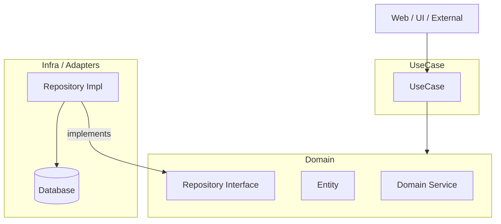

# クリーンアーキテクチャ (3レイヤー構成)

ビジネスロジックを中心に据え、外部の詳細（DBや通信）に依存しない疎結合なソフトウェアを構築するための構成案です。

## レイヤー構造と依存関係

依存関係は常に **内側（Domain）** に向かいます。Webなどの外部入力は UseCase を呼び出し、Infra はインターフェースを介して Domain に依存します。



---

## 1. Domain (ドメイン層)

ビジネスルールそのものを表現する、アプリケーションの心臓部です。

* **Entity (エンティティ):** ビジネス上の「物」や「概念」。
* **Domain Service (ドメインサービス):** 複数のエンティティに跨る知識やロジック。
* **Repository Interface:** データの永続化に関する「抽象的な約束」。実装はここには含みません。

## 2. UseCase (ユースケース層)

アプリケーションとしての具体的な「機能」を実現するための手順を記述します。

* **役割:** Domain 層のオブジェクトを操作し、一連の処理の流れ（オーケストレーション）を定義します。
* **依存先:** Domain 層にのみ依存します。外部のデータベースが何であるかは意識しません。

## 3. Infra / Adapters (インフラ層)

外部システムとの橋渡し（Adapter）と、具体的な技術実装を担います。

* **Repository Impl (Adapter):** Domain 層で定義されたインターフェースを具体的に実装します。SQLの発行などはここで行われます。
* **外部リソース:** データベース、外部API、ファイルシステムなどの具体的な実体。

---

## 実装例 (Go)

「ユーザーが特定のグループに所属しているか」を判定するシンプルな機能を例に、各レイヤーの実装イメージを示します。

### 1. Domain 層

ビジネスルール（インターフェース）を定義します。

```go
// domain/membership.go
package domain
import "context"

// MembershipRepository は、データソースに対する抽象的な問い合わせを定義します
type MembershipRepository interface {
 IsMember(ctx context.Context, userID, groupID string) (bool, error)
}
```

### 2. UseCase 層

ビジネスの「手順」を定義します。Domain のインターフェースを利用します。

```go
// usecase/membership.go
package usecase

import (
 "context"
 "your-project/domain"
)

// MembershipUseCase は、ユースケースの具体的な実行者です
type MembershipUseCase struct {
 repo domain.MembershipRepository
}

func NewMembershipUseCase(r domain.MembershipRepository) *MembershipUseCase {
 return &MembershipUseCase{repo: r}
}

// Execute は「所属確認」というユースケースを実行します
func (i *MembershipUseCase) Execute(ctx context.Context, userID, groupID string) (bool, error) {
 // 必要に応じてここでドメイン固有のバリデーションなどを行う
 return i.repo.IsMember(ctx, userID, groupID)
}
```

### 3. Infra 層

インターフェースを具体的に実装します。

```go
// infra/membership_repository.go
package infra

import (
 "context"
 "database/sql"
)

// SqlMembershipRepository は、SQL データベースを使用したリポジトリの実装です
type SqlMembershipRepository struct {
 db *sql.DB
}

func NewSqlMembershipRepository(db *sql.DB) *SqlMembershipRepository {
 return &SqlMembershipRepository{db: db}
}

// IsMember は実際のデータベースに対して SQL を発行します
func (r *SqlMembershipRepository) IsMember(ctx context.Context, userID, groupID string) (bool, error) {
 var exists bool
 query := "SELECT EXISTS(SELECT 1 FROM memberships WHERE user_id = ? AND group_id = ?)"
 err := r.db.QueryRowContext(ctx, query, userID, groupID).Scan(&exists)
 return exists, err
}
```

---

## 外部からの呼び出し (REST / gRPC)

Web フレームワークや gRPC サーバーは最外周に位置し、`UseCase` を呼び出す役割のみを担います。

### context.Context の役割

Go の実装例で登場する `ctx context.Context` は、主に以下の目的で各レイヤーをバケツリレーします。

1. **キャンセルの伝搬:** ユーザーがブラウザを閉じた際などに、実行中の DB クエリなどを即座に中断させ、リソースの無駄を防ぎます。

2. **タイムアウト管理:** 「API 全体で 5 秒以内」といった制限時間を、末端の DB 操作まで伝えます。

3. **トレーシング:** リクエスト ID などを運び、ログから一連の処理を追跡可能にします。

#### 💡 ctx と引数の使い分け

* **引数で渡すもの:** `userID` や `groupID` などの **ビジネスロジックに不可欠なデータ** です。型安全性を保ち、関数の依存関係を明確にするために、明示的に引数として渡します。

* **ctx に含めるもの:** `Request ID` や `認証トークン` などの **横断的（付加的）な情報** です。ビジネスロジックの本質ではないが、ログ出力やインフラ層での認可などに必要な情報を運びます。
