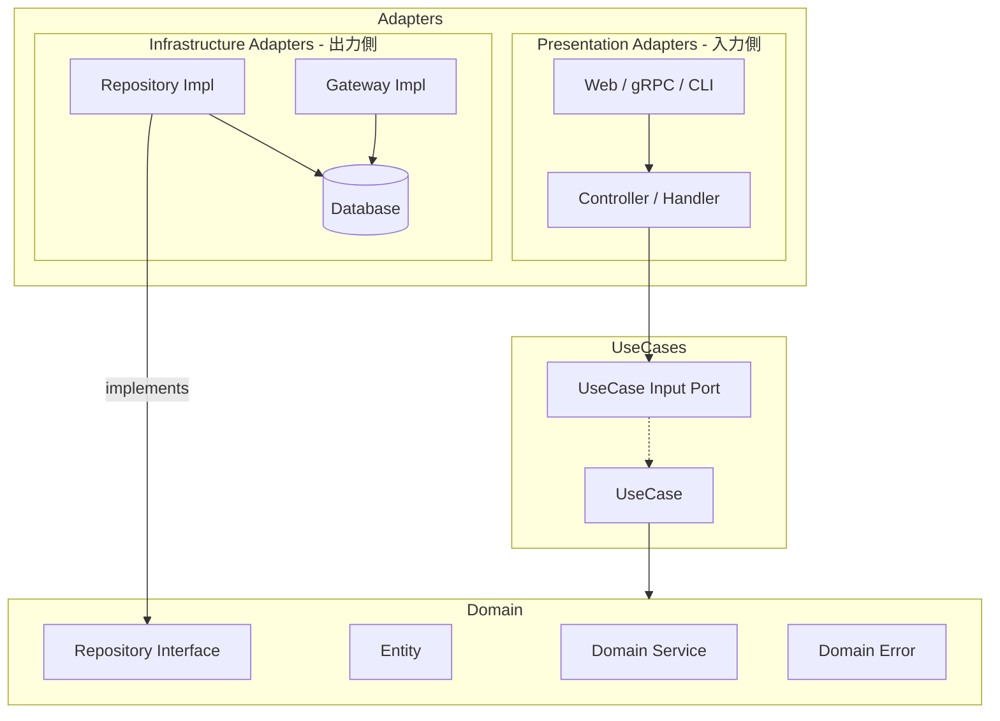

# クリーンアーキテクチャ（3層バリアント: Adapters / UseCases / Domain）

ビジネスロジックを中心に据え、外部の詳細（DB や通信）に依存しない疎結合なソフトウェアを構築するための構成案です。

このバリアントは 3 つの概念層を用います。**Adapters** 層は概念的には 1 層ですが、単一レイヤーの巨大化を防ぎ、副作用の境界を明確にするため、**Presentation Adapters**（入力/駆動側）と **Infrastructure Adapters**（出力/被駆動側）に分割しています。

## レイヤー構造と依存関係

依存関係は常に **内側（より高位のポリシー）** に向かいます。外部入力（Presentation Adapters）は UseCases を呼び出し、Infrastructure Adapters は内側のポートを実装します。

```text
Presentation Adapters ---→ UseCases ---→ Domain
                             ↑              ↑
                             +--------------+-- Infrastructure Adapters
        implements ports owned by UseCases or Domain
```


```mermaid
graph TD
    subgraph AdaptersLayer [Adapters]
        subgraph PresentationAdapters [Presentation Adapters - 入力側]
            Web[Web / gRPC / CLI]
            Controller[Controller / Handler]
        end
        subgraph InfraAdapters [Infrastructure Adapters - 出力側]
            RI_Impl[Repository Impl]
            GW_Impl[Gateway Impl]
            DB[(Database)]
        end
    end

    subgraph UseCaseLayer [UseCases]
        UC[UseCase]
        UC_Port[UseCase Input Port]
    end

    subgraph DomainLayer [Domain]
        DS[Domain Service]
        E[Entity]
        RI[Repository Interface]
        DE[Domain Error]
    end

    %% 入力側の依存
    Web --> Controller
    Controller --> UC_Port
    UC_Port -.-> UC
    UC --> DomainLayer

    %% 出力側の依存
    RI_Impl -- "implements" --> RI
    RI_Impl --> DB
    GW_Impl --> DB
```

---

## オリジナルアーキテクチャとの対応

| オリジナル Clean Architecture | このバリアントでの位置づけ                                          |
| :---------------------------- | :------------------------------------------------------------------ |
| Entities                      | Domain                                                              |
| Use Cases                     | UseCases                                                            |
| Interface Adapters            | Adapters（Presentation + Infrastructure）                           |
| Frameworks & Drivers          | Adapters と Composition Root（main.go）が使用する具体的なメカニズム |

> **補足:** この 3 層バリアントでは、従来の「Frameworks & Drivers」層は Adapters と Composition Root に吸収されています。Web フレームワーク、ルーティングライブラリ、DB ドライバーは Adapters 層内の実装詳細として扱われ、独立したアーキテクチャ層とはなりません。Composition Root（`main.go`）はすべての配線を行いますが、ビジネスロジックは一切含みません。

| Hexagonal Architecture           | このバリアントでの位置づけ |
| -------------------------------- | -------------------------- |
| Driving（Inbound）Adapters       | Presentation Adapters      |
| Application（Ports & Use Cases） | UseCases                   |
| Driven（Outbound）Adapters       | Infrastructure Adapters    |
| Domain                           | Domain                     |

名前は異なりますが、主なルールは同じです：**ソースコードの依存関係は常に内側の高位ポリシーに向かいます。**

---

## レイヤーの定義

### 1. Domain（ドメイン層）

ビジネスルールそのものを表現する、アプリケーションの心臓部です。

- **Entity / Aggregate / Value Object:** ビジネス上の「物」や「概念」。
- **Domain Service:** 複数のエンティティに跨る知識やロジック。
- **Domain Error:** ドメイン語彙で定義されたエラー。
- **Domain Port（Interface）:** 抽象がドメイン言語の一部である場合にのみ、リポジトリ等のポートを定義。
- **外部依存なし:** DB、HTTP、ORM、SDK、Web フレームワーク、生成されたトランスポート型への依存なし。
- **`context.Context` に関する注記:** Go の Domain インターフェースでは、キャンセルやデッドライン伝搬のために `context.Context` を第一引数に取ることが一般的です。これは「外部依存なし」ルールに対する **プラグマティックな例外** ですが、その正当化根拠は `context.Context` がキャンセル・デッドラインシグナルという Go ランタイムの関心事を運ぶことに限定されます。この例外は他の標準ライブラリパッケージ（例: `net/http`, `database/sql`）には及びません。Domain は context からカスタム値を読み取ってはなりません — その責務は Infrastructure Adapters にあります。

### 2. UseCases（ユースケース層）

アプリケーションとしての具体的な「機能」を実現するための手順を記述します。**オーケストレーションのみ。**

- **役割:** Domain 層のオブジェクトと境界インターフェースを調整し、直接的な SQL / HTTP / ファイル / SDK 呼び出しを行わない。
- **入出力境界**とアプリケーション DTO を定義。
- **ポート**を定義（アプリケーション固有の外部機能に対する UseCase Port）。
- **トランザクション境界**とアプリケーションポリシー（リトライ、冪等性、認可の判断）を制御。
- **依存先:** Domain のみ。具象 Adapter、Web フレームワーク、DB ドライバへの直接依存なし。

### 3. Adapters（アダプター層）

**Adapter = 副作用の境界。** すべての I/O、外部統合、フレームワークとの相互作用はここに閉じ込めます。

#### 3a. Presentation Adapters（入力 / 駆動側）

アプリケーションの動作をユーザーや外部呼び出し元に届けるアダプター。

- **Controller / Handler:** HTTP リクエストや CLI 引数を UseCase の入力形式に変換し、UseCase を呼び出します。
- **Presenter:** UseCase の実行結果を外部向けのレスポンス形式（JSON など）に整形します。
- **Request/Response DTO:** トランスポート固有のデータ構造。
- **認証ミドルウェア:** 認証・認可のエントリポイントチェックがデリバリー関心事である場合。

#### 3b. Infrastructure Adapters（出力 / 被駆動側）

UseCases または Domain が所有するポートを外部システムに接続するアダプター。

- **Repository Impl:** Domain 層や UseCases 層で定義されたインターフェースを実装します。データのマッピングやクエリ組み立て、DB エラーの変換を行います。
- **Gateway Impl:** 外部 API クライアント、通知、検索、決済などの実装。
- **エラー変換:** ドライバエラー（例: `sql.ErrNoRows`）を内側の層に渡す前にドメインエラーに変換。

---

## 依存マトリクス

|         依存元 ↓ →         | Domain | UseCases | Adapters |
| :------------------------: | :----: | :------: | :------: |
|           Domain           |  yes   |    no    |    no    |
|          UseCases          |  yes   |   yes    |    no    |
|  Adapters（Presentation）  | cond.  |   yes    |   self   |
| Adapters（Infrastructure） |  yes   |   yes    |   self   |
|      Composition Root      |  yes   |   yes    |   yes    |

- `Presentation → Domain` は `cond.` (conditional): Presentation は UseCases から返された Domain の値をシリアライズのために **読み取ってもよい**（pragmatic モード）。ただし、これは以下の **Boundary Simplification Checklist** をすべて満たす場合に限られる。

### Boundary Simplification Checklist

1. **Read-Only**: 対象の操作が「参照 (Query)」であり、データの更新 (Command) を伴わない。
2. **Structure-Only**: Presentation 層は Entity を単なるデータ構造体として扱い、**いかなるメソッド（振る舞い）も呼び出さない**。
3. **No Secrets**: Entity に Presentation に公開してはならない秘密情報（パスワードハッシュ等）が含まれていない。
4. **Consistency**: Entity のフィールド変更が Presentation の API 仕様（JSON キー名等）に直接影響を与えるリスクを許容できる。

更新操作（Create/Update/Delete）では、不変条件の保護と入力バリデーションのために、常に専用の Input DTO を使用してください。

- Presentation Adapters と Infrastructure Adapters は同じ概念層にありますが、互いに直接依存してはなりません。

---

## 実装例（Go）

「ユーザーが特定のグループに所属しているか」を判定するシンプルな機能を例に、各レイヤーの実装イメージを示します。

### 1. Domain 層

ビジネスルール（インターフェース）を定義します。

```go
// internal/domain/membership.go
package domain

import "context"

// MembershipRepository は、データソースに対する抽象的な問い合わせを定義します。
type MembershipRepository interface {
	IsMember(ctx context.Context, userID, groupID string) (bool, error)
}
```

### 2. UseCases 層

ビジネスの「手順」を定義します。Domain のインターフェースを利用します。

```go
// internal/usecase/membership.go
package usecase

import (
	"context"

	"your-project/internal/domain"
)

// MembershipUseCase は、ユースケースの具体的な実行者です。
type MembershipUseCase struct {
	repo domain.MembershipRepository
}

func NewMembershipUseCase(r domain.MembershipRepository) *MembershipUseCase {
	return &MembershipUseCase{repo: r}
}

// Execute は「所属確認」というユースケースを実行します。
func (uc *MembershipUseCase) Execute(ctx context.Context, userID, groupID string) (bool, error) {
	// 必要に応じてここでドメイン固有のバリデーションなどを行う。
	return uc.repo.IsMember(ctx, userID, groupID)
}
```

### 3. Infrastructure Adapters 層

Domain 層で定義されたインターフェース（Port）を具体的に実装します。DB ドライバなどの詳細はここから分離し、上位レイヤーが特定の技術に依存しないようにします。

```go
// internal/adapters/infra/persistence/membership_repository.go
package persistence

import (
	"context"
	"database/sql"
	"fmt"
)

// SQLMembershipRepository は、SQL データベースを使用したリポジトリの実装です。
type SQLMembershipRepository struct {
	db *sql.DB
}

func NewSQLMembershipRepository(db *sql.DB) *SQLMembershipRepository {
	return &SQLMembershipRepository{db: db}
}

// IsMember は実際のデータベースに対して SQL を発行します。
func (r *SQLMembershipRepository) IsMember(ctx context.Context, userID, groupID string) (bool, error) {
	var exists bool
	query := "SELECT EXISTS(SELECT 1 FROM memberships WHERE user_id = ? AND group_id = ?)"
	err := r.db.QueryRowContext(ctx, query, userID, groupID).Scan(&exists)
	if err != nil {
		return false, fmt.Errorf("query membership: %w", err) // ドライバエラーを変換
	}
	return exists, nil
}
```

---

## 外部からの呼び出し (REST / gRPC)

Web フレームワークや gRPC サーバーは最外周に位置し、`UseCase` を呼び出す役割のみを担います。ハンドラは **UseCase のインターフェース（入力ポート）** に依存させ、実装を差し替え可能にします。

```go
// internal/usecase/membership_port.go
package usecase

import "context"

// MembershipChecker は入力ポート（UseCaseの公開API）です。
type MembershipChecker interface {
	Execute(ctx context.Context, userID, groupID string) (bool, error)
}
```

```go
// internal/adapters/presentation/http/handler.go
package http

import (
	"encoding/json"
	"net/http"

	"your-project/internal/usecase"
)

// Web ハンドラでの使用例（Composition Root が useCase を注入）
func HandleCheckMembership(w http.ResponseWriter, r *http.Request, useCase usecase.MembershipChecker) {
	userID := r.URL.Query().Get("id")
	groupID := r.URL.Query().Get("group")

	// UseCase を実行
	isMember, err := useCase.Execute(r.Context(), userID, groupID)
	if err != nil {
		// 内部エラーの詳細をクライアントに漏らさない
		// エラーをログに記録し、汎用メッセージを返す
		writeError(w, http.StatusInternalServerError, "internal server error")
		return
	}

	// 結果をレスポンスとして返す
	json.NewEncoder(w).Encode(map[string]bool{"is_member": isMember})
}
```

> **注意**: DB インスタンスと UseCase の構築は Composition Root（`main.go`）で行います。ハンドラは UseCase を依存として受け取り、リクエスト/レスポンスの変換のみを担当します。

### context.Context の役割

Go の実装例で登場する `ctx context.Context` は、主に以下の目的で各レイヤーをバケツリレーします。

1. **キャンセルの伝搬:** ユーザーがブラウザを閉じた際などに、実行中の DB クエリなどを即座に中断させ、リソースの無駄を防ぎます。
2. **タイムアウト管理:** 「API 全体で 5 秒以内」といった制限時間を、末端の DB 操作まで伝えます。
3. **トレーシング:** リクエスト ID などを運び、ログから一連の処理を追跡可能にします。

**キャンセルの実装例:**

`context` のキャンセルシグナルは `Done()` チャネルを通じて伝搬します。長い処理を行う場合は、定期的にこのチャネルを確認する必要があります。

```go
func LongRunningProcess(ctx context.Context) error {
	select {
	case <-ctx.Done():
		// キャンセルされた場合（タイムアウト含む）
		return ctx.Err()
	default:
		// 処理を続行
	}
	// ... 重い処理 ...
	return nil
}
```

#### ctx と引数の使い分け

- **引数で渡すもの:** `userID` や `groupID` などの **ビジネスロジックに不可欠なデータ** です。型安全性を保ち、関数の依存関係を明確にするために、明示的に引数として渡します。
- **ctx に含めるもの:** `Request ID` や `認証トークン` などの **横断的（付加的）な情報** です。ビジネスロジックの本質ではないが、ログ出力やインフラ層での認可などに必要な情報を運びます。

**context でのリソースの密輸禁止:** `sql.Tx`、DB ハンドル、リクエストオブジェクト、SDK クライアントなどを `context.Context` に隠してアーキテクチャ境界を越えてはなりません。明示的な関数パラメータや依存注入を使用してください。唯一の例外: Infrastructure Adapters は内部で `context.WithValue` を使ってトランザクションハンドルを伝播しても構いません（例: 同一トランザクション内で `*sql.Tx` をリポジトリ間で共有）。ただし、UseCases と Domain は context からこれらの値を読み取ってはなりません。

---

## Port 所有権のガイダンス

- **Domain Port:** 抽象が「ドメイン言語」の一部であり、ドメインモデルがコアビジネスルールを満たすために不可欠な場合。
  - _例:_ `UserRepository.FindByID`（エンティティの再構成に不可欠）。
  - _判断基準:_ 「この能力なしではドメインモデルが不完全か、不変条件を強制できないか？」
- **UseCase Port:** 抽象がアプリケーション固有の手順を完了するための「道具」である場合。
  - _例:_ `NotificationGateway.SendWelcomeEmail`（ワークフローの副作用）、`IdentityGateway.IsMember`（外部プロバイダに対する認可チェック）、`TransactionManager.RunInTransaction`（アプリケーションレベルのトランザクション境界）。
  - _判断基準:_ 「これはコアビジネスロジックではなく、アプリケーションワークフロー要件か？」
- **Repository Port — Domain か UseCase か？** Repository インターフェース（例: `BoardRepository`, `ThreadRepository`）は、その操作がコアドメイン言語を表現する場合（例: 「エンティティを ID で見つける」は集約の再構成に不可欠）、Domain 層に置いても構いません。対照的に、`TransactionManager` はアプリケーションレベルのトランザクション境界を制御するものであり、オーケストレーションの関心事であってドメイン概念ではないため、UseCase 層に属します。判断基準: _インターフェースを除去したとき、ドメインモデルが不変条件を強制できなくなるなら Domain Port。そうでなければ UseCase Port。_
- 具象実装は、どの内側レイヤーがインターフェースを所有していても **Infrastructure Adapters** に置きます。

### Input Port インターフェースの方針

Input Port（Presentation Adapters から呼ばれる UseCase のインターフェース）は、**UseCase が複数の Presentation 種別（HTTP + gRPC + CLI など）から利用される場合**、またはテスト容易性のための明示的な分離が必要な場合に定義します。単一プロトコルのアプリケーションでは、すべての UseCase にインターフェースを定義することは不要なボイラープレートとなります。Go の構造的型付けにより、Presentation が具象 UseCase 構造体に直接依存していても、必要に応じて差し替えは可能です。

**ガイドライン:** Input Port インターフェースは価値を生む場所（マルチプロトコル対応、テスト分離）でのみ定義してください。デフォルトで全 UseCase に作成する必要はありません。このリポジトリの BBS プロジェクトでは、WS3 で HTTP に加えて gRPC が追加されるため、Input Port（`CreatePostInputPort` 等）の定義は正当化されるマルチプロトコルパターンです。

## ポート設計とリポジトリ境界

- **入力ポート（Input Port）:** Presentation Adapters（Web/CLI/Batch）から呼ばれる UseCase のインターフェースです。Controller はこのポートに依存します。
- **出力ポート（Output Port）:** Domain / UseCases が外側に要求する契約です（例: Repository）。インターフェースは内側に置き、実装は Infrastructure Adapters 側に置きます。
- **リポジトリ境界:** Repository は「永続化の契約」です。トランザクションやリトライなどの制御は UseCases、データ変換とクエリ組み立ては Infrastructure Adapters が担当します。

## エラー境界ルール

- **Infrastructure Adapters** はドライバエラー（例: `sql.ErrNoRows`）を内側の層に渡す前にドメインエラーに変換します。
- **Domain / UseCases** のエラーはビジネスやアプリケーションの意味を持ち、HTTP ステータスコードや SQL 固有のエラーを含みません。
- **Presentation Adapters** はアプリケーションエラーをトランスポートエラー（HTTP ステータス、gRPC ステータス、CLI 終了コード）に変換します。

## データ境界ルール

- **UseCase の入出力** は、内側のポリシーをトランスポートや永続化の詳細から保護するために明示的に定義すべきです。
- **Domain オブジェクト** は Presentation DTO や ORM レコードではありません。トランスポートアノテーション、ORM タグ、生成された API 型をドメインオブジェクトに含めないでください。
- **マッピングの責務** は一貫させます: Presentation はリクエスト/レスポンスを変換、Infrastructure は永続化/外部データを変換、UseCases はアプリケーション DTO を変換（任意）。

## アンチパターン

- Domain が DB / HTTP / ORM / SDK / フレームワークの型に依存している。
- UseCases が境界インターフェースに依存せず、直接 SQL / HTTP / ファイル I/O を実行している。
- Presentation が UseCases をバイパスしてビジネスワークフローや永続化の判断を直接実行している。
- Infrastructure Adapter のコードが Domain や UseCases に属するビジネス判断を所有している。
- トランスポート DTO、ORM レコード、生成された API モデルが Domain オブジェクトとして再利用されている。
- Presentation と Infrastructure Adapters がマージされ、それぞれの責務が見つけにくくなっている。

### ドメインイベント（Domain Events）

ドメインイベントは、UseCase のオーケストレーションから副作用を分離するための一般的な Clean Architecture パターンです。重要なビジネスイベント（例: `PostCreated`）が発生した際、Domain または UseCase 層がイベントを発行し、Infrastructure Adapters が購読して副作用（通知、監査ログ、キャッシュ無効化）を実行します。これにより UseCase がすべての下流コンシューマを知る必要がなくなります。

```go
// internal/usecase/event.go
type DomainEvent interface {
    EventName() string
}

type PostCreatedEvent struct {
    BoardID  int64
    ThreadID int64
    PostID   int
}

func (PostCreatedEvent) EventName() string { return "PostCreated" }

type EventPublisher interface {
    Publish(ctx context.Context, event DomainEvent) error
}
```

UseCase はトランザクション完了後にイベントを発行し、Composition Root が購読者（例: SlackNotifier）を EventPublisher に配線します。これにより UseCase はオーケストレーションに集中し、副作用は非同期に処理されます。

> **注意:** コミット後の発行では、publish 呼び出しが失敗した場合にイベントがロストするリスクがあります。本番システムでは **Transactional Outbox** の利用を検討してください — 同一 DB トランザクション内でイベントを保存し、非同期で中継することで、at-least-once 配信を保証します。

### Go 実装の補足

- **SQL プレースホルダ:** ドライバによって `?` や `$1` のように異なります。実装環境に合わせて選択します。
- **命名:** Go では `SQL` のようなイニシャリズムは大文字にまとめるのが慣例です。
- **コンテキスト:** `context` の値は型付きキーで管理し、ビジネスデータは入れません。
- **DI フレームワーク:** 大規模プロジェクトでは、[Google Wire](https://github.com/google/wire) や [Uber Fx](https://github.com/uber-go/fx) などの DI フレームワークの利用を検討してください。ただし、まずは `main.go` での手動 DI から始めることを推奨します — 明示的でデバッグしやすく、このリポジトリのほとんどのプロジェクトでは十分です。

## 典型的なディレクトリレイアウト（Go）

```text
cmd/app/main.go                                  // composition root
internal/domain/...                               // entities, value objects, domain services, domain errors
internal/usecase/...                              // interactors, input/output DTOs, usecase-owned ports
internal/adapters/presentation/http/...          // HTTP handlers/controllers/presenters
internal/adapters/presentation/grpc/...          // gRPC handlers and transport mapping
internal/adapters/presentation/cli/...           // CLI commands and output formatting
internal/adapters/infra/persistence/...          // repository implementations, DB models, mapping
internal/adapters/infra/external/...             // external API gateway implementations
```

各プロジェクトは、依存ルールと責務の境界が保たれる限り、このレイアウトに適応しても構いません。
