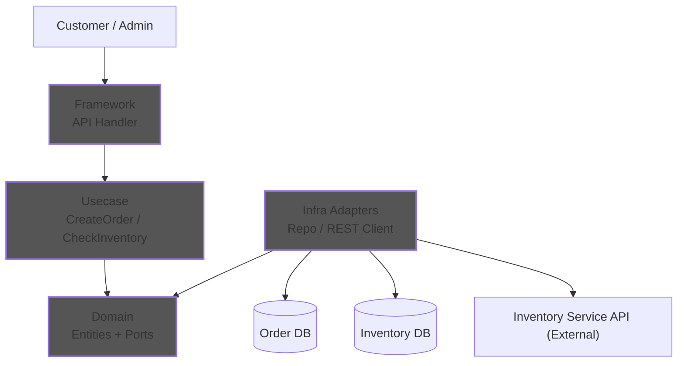

# Clean Architecture Workshop: advent-calm-2025

In this workshop, you will learn how to build a robust and testable application using **Go** based on **Clean Architecture**.
The complete project files are in the [advent-of-calm-2025](./advent-of-calm-2025/) directory.

## 1. What is Clean Architecture?

Clean Architecture is a design philosophy that separates concerns, keeping business logic independent of frameworks, databases, and external tools.

### The 4 Layers

This workshop adopts a simple and practical **4-layer structure**.

1. **Domain Layer** - `domain/`
    * **Role**: Core business rules and data structures.
    * **Characteristics**: **Depends on nothing**. Written purely in Go.
    * **Components**: Entities, Port Interfaces (Ports), Domain Services (for complex logic).

2. **Usecase Layer** - `usecase/`
    * **Role**: Application-specific business rules (what the user wants to do).
    * **Characteristics**: Depends only on the Domain Layer. Knows nothing about the DB or HTTP details.
    * **Components**: Interactors (Usecases), Input/Output Data Structures (DTOs).

3. **Infra Adapter Layer** - `infra/`
    * **Role**: Specifically implement domain contracts (Ports) and bridge to external I/O (DB, etc.).
    * **Characteristics**: **Implements the interfaces defined in the Domain Layer** (dependencies point inward).
    * **Components**: Repository implementations, External client implementations, DB integration.

4. **Framework Layer**
    * **Role**: Web frameworks, gRPC, CLI, and their handlers.
    * **Characteristics**: Controls the outermost I/O, converting inputs for UseCases.
    * **Components**: Web handlers, Routers, DTO mapping.

### The Dependency Rule

**"Dependencies always point inwards (towards the Domain)."**
Source code dependencies must always point from lower-level details (concrete implementations) to higher-level abstractions.



> **Note: Unifying External Interfaces**
> `Customer` (the person ordering) and `Admin` (inventory manager) interact with the system via the appropriate API endpoints. The `Inventory REST Client` within the `Order Service` should be treated as calling an **external Inventory Service API, not the same-process Framework layer**, to avoid confusion about dependency direction.
>
> **What are "Ports"?**
> Ports are the "contracts (interfaces) that the inner rules demand from the outside." Details about the DB or external APIs are hidden behind Ports. UseCases depend on Ports to define behavior only. The outside layer (Infra Adapters) implements these Ports, keeping the dependency direction pointing inward.

### Ports and Repository Boundary

* **Input Port:** The UseCase interface exposed to external adapters. Controllers depend on this port.
* **Output Port:** Contracts required by Domain/UseCase (e.g., repositories, clients). Interfaces live inside, implementations live in adapters.
* **Repository Boundary:** Persistence contracts. Transactions/retries belong in UseCase; mapping and query construction belong in adapters.

---

## Workshop: Building an Order System

We will implement a fictional "Order Creation System," starting from the inside and working our way out.

### Step 1: Designing the Domain Layer (`domain/`)

The Domain Layer is the **heart** of the application and consists of the following elements. These do not depend on any external (DB or Web) concerns.

1. **Entity**: Business data and rules (e.g., `Order`, `Inventory`).
2. **Interface (Port)**: Contracts for data persistence or external integration (e.g., `OrderRepository`, `InventoryClient`).
3. **Domain Service**: Complex calculations or logic spanning multiple entities (avoid simple I/O wrapping).

First, we define the core business object, the "Order," and the "Interfaces" used to interact with the outside world.

**1. Define Entities (`domain/entity/models.go`)**
Define the state and structure of an Order.

```go
type Order struct {
	ID         string
	CustomerID string
	Amount     float64
	Status     OrderStatus
	CreatedAt  time.Time
}
```

**2. Define Interfaces (Ports) (`domain/repository/interfaces.go`)**
**Abstract** how data is saved or how external services are accessed. The implementation of these interfaces will be done in Step 3.

```go
// Dependency Inversion Principle (DIP): High-level modules own the abstractions.
type OrderRepository interface {
	Save(ctx context.Context, order *entity.Order) error
	FindByID(ctx context.Context, id string) (*entity.Order, error)
}

type InventoryClient interface {
	CheckAndReserve(ctx context.Context, productID string, quantity int) (bool, error)
}

type PaymentPublisher interface {
	PublishPaymentTask(ctx context.Context, order *entity.Order) error
}
```

### Step 2: Implementing the Usecase Layer (`usecase/`)

Combine the Domain Layer components (Entities and Ports) to implement the application feature: "Create an Order."

**Implementation (`usecase/create_order.go`)**

```go
type CreateOrderUsecase struct {
	orderRepo repository.OrderRepository // Depends on abstraction
	invClient repository.InventoryClient // External API integration via Port
	// ...
}

func (u *CreateOrderUsecase) Execute(ctx context.Context, input CreateOrderInput) error {
	// 1. Validation and Stock Reservation (using Port)
	// 2. Create Order entity
	// 3. Save to database (using Repository)
	// 4. Publish event
}
```

The key point here is that `CreateOrderUsecase` does not know about the concrete database (e.g., Postgres) or communication protocols (REST/gRPC). It only knows the Ports (e.g., `OrderRepository`).

### Step 3: Implementing the Infra Adapters Layer (`infra/`)

This is where concrete technologies like "PostgreSQL" or "REST API" appear. **We implement the Domain Layer interfaces defined in Step 1**.

* `PostgresOrderRepository` implements `domain.OrderRepository`.
* `RestInventoryClient` implements `domain.InventoryClient`.

**Repository Implementation (`infra/repository/postgres_order_repository.go`)**

```go
type PostgresOrderRepository struct {
	// DB connection instance, etc.
}

// Satisfies the domain/repository.OrderRepository interface
func (r *PostgresOrderRepository) Save(ctx context.Context, order *entity.Order) error {
	fmt.Printf("Saving order %s to Postgres\n", order.ID)
	// Actual SQL execution logic...
	return nil
}
```

**Error boundary note**

* Infra Adapters should not return driver errors (e.g., `sql.ErrNoRows`) directly across boundaries; convert them into domain/usecase-level errors such as `entity.ErrOrderNotFound`.
* Framework should convert domain/usecase errors into transport-level errors (HTTP status, gRPC status, etc.).

### Step 4: Assembling the Application (`main.go`)

Finally, we wire up all the parts in `main.go` using **Dependency Injection**.

```go
func main() {
	// 1. Create Infra Adapters objects
	orderRepo := &repository.PostgresOrderRepository{}
	inventoryClient := &client.RestInventoryClient{}
	paymentPub := &messaging.RabbitMQPaymentPublisher{}
	idGen := &util.UUIDGenerator{}
	inventoryRepo := &repository.PostgresInventoryRepository{}

	// 2. Direct injection into Usecase (Pass Adapters that implement Domain Ports)
	createOrderUsecase := usecase.NewCreateOrderUsecase(orderRepo, inventoryClient, paymentPub, idGen)
	checkInventoryUsecase := usecase.NewCheckInventoryUsecase(inventoryRepo)
	updateInventoryUsecase := usecase.NewUpdateInventoryUsecase(inventoryRepo)

	// 3. Run
	createOrderUsecase.Execute(ctx, input)
}
```

> **Note: Composition Root vs Framework separation**
> This sample keeps wiring and execution in `main.go` for simplicity. For stricter layering, keep `main.go` as composition root only, and move CLI/Web I/O handling into `framework/...`.

---

## Design Analysis & Quality (Clean Architecture Analysis)

This project maintains high design quality based on the following principles:

1. **Loose Coupling**: Order and Inventory concerns are separated at the domain level, making it easy to split into microservices in the future.
2. **Pure Business Logic**: The `domain` package has zero dependencies on external libraries, containing only business rules.
3. **Appropriate Responsibility Separation**: By avoiding the misuse of "Domain Services" as mere I/O wrappers and letting UseCases handle orchestration, we ensure that the Domain remains focused on logic with true business value.

---

## How to Run

Execute the following commands in the project root directory to resolve dependencies and run the application.

```bash
# Tidy up dependencies
go mod tidy

# Run the application
go run main.go
```

## Summary

* **Robust against change**: Even if you switch the DB to MySQL, the code in `domain` and `usecase` does not change by a single line.
* **Easy to Test**: You only need to mock the `repository` to test the `usecase`. No database is required.
* **Separation of Concerns**: Business logic and technical details are clearly separated.
