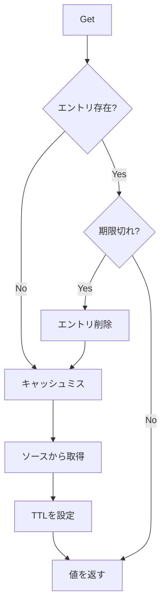
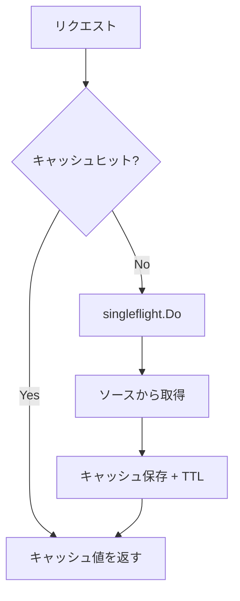
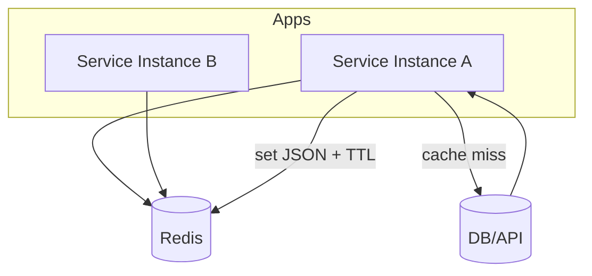
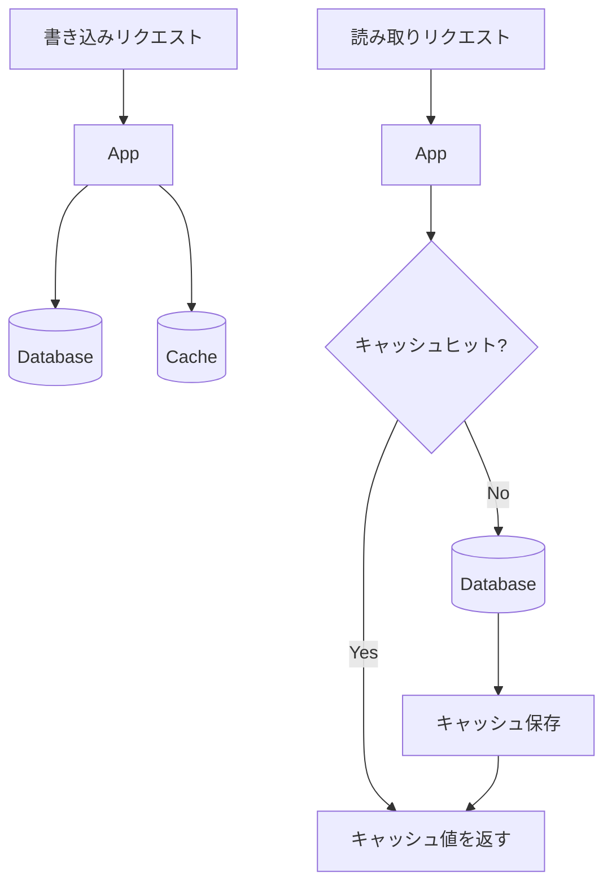

# Go言語におけるキャッシュパターン

[English](go_cache_patterns_en.md) | [日本語](go_cache_patterns_ja.md)

## キャッシュシステムとツールの理解

### 基礎

#### キャッシュとは？

キャッシュとは、頻繁にアクセスされるデータを、それが必要とされる場所の近くに保持しておく一時的なストレージ層のことです。
主な目的は、**データ取得の高速化**と、データベースのような低速な一次データソースへの**負荷軽減**です。

**例え**
キッチンまで毎回取りに行く代わりに、お気に入りのコーヒーマグをデスクに置いておくようなものです。

---

#### なぜキャッシュが重要なのか：パフォーマンスへの影響

##### レスポンスタイムの即時化

* キャッシュからデータを直接提供
* 遅いデータベースクエリを回避
* サブミリ秒単位のレイテンシ

##### バックエンド負荷の軽減

* トラフィックスパイク（急増）を吸収
* データベースのボトルネックを防止

##### コスト削減

* データベースクエリ数の削減
* ネットワーク帯域幅の使用量削減
* サーバーリソース消費の低減

**実例**
E コマースプラットフォームでは、フラッシュセール中にデータベースがダウンしないよう、商品詳細をキャッシュしています。

---

#### キャッシュアーキテクチャ：キャッシュの保存場所

##### ローカルキャッシュ

* アプリケーションのメモリ（RAM）に保存
* 非常に高速なアクセス
* 容量に制限がある
* プロセスのクラッシュでデータが失われる

##### 分散キャッシュ

* 複数のサーバー間で共有される
* 水平スケールが可能
* ローカルキャッシュより耐障害性が高い
* ローカルメモリよりわずかにレイテンシが高い

##### エッジキャッシュ

* 地理的にユーザーに近い場所に配置
* 通常、CDN を介して実装される
* インターネットレイテンシを最小化
* グローバルなユーザー体験を向上

---

#### キャッシュ戦略：データの流れ

##### 1. ライトスルー (Write-Through)

* 書き込みはキャッシュとデータベースに同期的に行われる
* 強い整合性
* 書き込みレイテンシの増加

##### 2. ライトバック (Write-Back)

* 書き込みはまずキャッシュに行われる
* データベースは非同期で更新される
* 高速な書き込み
* キャッシュ障害時にデータ損失のリスクがある

##### 3. キャッシュアサイド (Cache-Aside / Lazy Loading)

* アプリケーションはまずキャッシュを確認する
* ミス（見つからない）場合、データベースからロードしてキャッシュに保存する
* パフォーマンスと鮮度のバランスが良い
* 実務で最も一般的に使用される

---

#### キャッシュの無効化：困難な問題

> 「計算機科学にはハードなことが2つだけある。キャッシュの無効化と、名前付けだ。」

一次データの情報源（Source of Truth）が変更されると、キャッシュされたデータは**古く（Stale）**なります。

##### 一般的な無効化のアプローチ

###### 時間ベースの有効期限 (TTL)

* キャッシュエントリは一定時間後に自動的に期限切れになる

###### 手動パージ

* データ変更時に明示的にキャッシュエントリを削除する
* 注意深い調整が必要

###### イベント駆動型の無効化

* データベースイベントやメッセージキューに基づいてキャッシュをクリアする
* 複雑だが、より正確

---

#### 注目のツール：Redis

Redis は、オープンソースのインメモリデータストアで、一般的に以下として使用されます：

* キャッシュ
* データベース
* メッセージブローカー

高性能なシステムで広く採用されています。

##### Redisの主な特徴

* サブミリ秒の読み書きレイテンシ
* 豊富なデータ構造：
  * 文字列 (Strings)
  * ハッシュ (Hashes)
  * リスト (Lists)
  * セット (Sets)
  * ソート済みセット (Sorted Sets)
* オプションのディスク永続化
* アトミック操作

##### 一般的なユースケース

###### セッションストレージ

* 高速な認証
* サービス間でのセッション状態の共有

###### リーダーボード（ランキング）

* ソート済みセットを使用したリアルタイムランキング
* ゲームや競技プラットフォーム

###### リアルタイム分析

* カウンター
* ステリーミングメトリクス
* ダッシュボードとモニタリング

---

#### 決定ガイド：いつキャッシュを使うべきか

##### 理想的なユースケース

* 読み取り頻度が高いワークロード
* 比較的安定したデータ
* コストの高い計算やクエリ

##### 適さないケース

* 書き込み頻度が極端に高いシステム
* 強力かつ即時の整合性が求められる要件
* 無制限または予測不可能なデータセット

##### 考慮すべきトレードオフ

* システムの複雑さの増加
* 古いデータのリスク
* 運用上のオーバーヘッド

---

#### まとめ：パフォーマンス増強としてのキャッシュ

1. **キャッシュはレイテンシを削減する**
   高速なアクセス、バックエンドの圧力軽減、より良いユーザー体験。

2. **適切な戦略を選ぶ**
   キャッシュの種類、配置、無効化戦略はシステム要件に合わせる必要がある。

3. **Redisは柔軟性を提供する**
   機能豊富で、現代のアプリケーション向けにスケーラブル。

4. **実験と計測**
   シンプルに始め、全てを計測し、実際のメトリクスで検証する。

## パターン1: スレッドセーフなインメモリTTLキャッシュ

### コアコンセプト

文字列キーをバイトスライスの値にマッピングし、生存時間（TTL）を設定して期限切れ管理を行う基本的なキャッシュパターンです。
Mutex 同期によりスレッドセーフになっており、並行するゴルーチンから安全にアクセスできます。

### TTLキャッシュのフロー図



### 主な実装詳細

* `sync.RWMutex` で並行アクセスを保護
* 各エントリの保持内容：
  * 値
  * 有効期限のタイムスタンプ
* `Get` 操作時の遅延有効期限チェック（Lazy Expiration）
* 外部依存なし

### 使用場面

分散要件のない**単一インスタンスのアプリケーション**での基本的なキャッシュに最適です。

典型的なユースケース：

* 設定データ
* 計算結果
* 予測可能な寿命を持つ API レスポンス

### トレードオフ

* アクティブなクリーンアップがないとメモリが無制限に増加する可能性がある
* LRU（Least Recently Used）エビクション（追い出し）がない
* 有効期限管理は完全に TTL 値に依存する

### リファレンス実装

`software/go_cache_patterns/pattern1_ttl_cache/main.go`

---

## パターン2: メモリ制限付きLRUキャッシュ

### LRUの概要

Least Recently Used (LRU) ポリシーを使用して、冷たい（使われていない）データを自動的に追い出し、メモリ使用量を予測可能にするキャッシュです。

### LRUフロー図

```mermaid
flowchart TD
    A[Get/Put] --> B{キー存在?}
    B -- Yes --> C[先頭へ移動]
    B -- No --> D[先頭に挿入]
    D --> E{容量オーバー?}
    E -- Yes --> F[末尾(最古)を削除]
    E -- No --> G[完了]
    C --> G
```

### 実装ステップ

1. **容量を指定して初期化**
   * 最大エントリ数を設定
   * `container/list`（双方向連結リスト）を使用

2. **アクセス順序の追跡**
   * アクセスされたアイテムをリストの先頭に移動
   * 最新性（Recency）の順序を維持

3. **オーバーフロー時の追い出し**
   * 容量に達した場合、リストの末尾から最も使われていないエントリを削除

4. **ハッシュマップの維持**
   * キーをリストノードにマッピング
   * O(1) のルックアップ性能を保証

### なぜ機能するのか

`container/list` パッケージは以下の操作に対して O(1) を提供します：

* アクセス
* 更新
* 追い出し (Eviction)

これにより、**メモリ制約のある環境**でもプロダクション利用に耐えうるパターンとなります。

### LRUリファレンス実装

`software/go_cache_patterns/pattern2_lru_cache/main.go`

---

## パターン3: Singleflight保護付きキャッシュアサイド

### 概要

本番システムで最も広く展開されているキャッシュパターンです。
多数の同時キャッシュミスがバックエンドを圧倒する**キャッシュスタンピード**シナリオを防ぐように設計されています。

### キャッシュアサイドのフロー図



### リクエストフロー

1. **キャッシュ確認**
   * まずキャッシュ層からの読み取りを試みる

2. **ソースへのクエリ**
   * キャッシュミス時、`singleflight` を使用してデータベースや API からフェッチする

3. **キャッシュへの配置**
   * 取得したデータを適切な TTL と共に保存する

4. **結果を返す**
   * 待機中のすべてのリクエストに結果を提供する

### Singleflightの解説

`golang.org/x/sync/singleflight` パッケージは、重複するリクエストを単一のバックエンド呼び出しにまとめます。

**例:**
200 のゴルーチンが同時に同じ未キャッシュのキーをリクエストした場合：

* **1つ**だけがデータベースにアクセスします
* 他の 199 は共有された結果を待ちます

### なぜ重要なのか

#### Singleflightなし

* 200 の同時データベースクエリ
* バックエンドの過負荷
* レスポンスタイムの急増
* 連鎖的なサービス障害

#### Singleflightあり

* 1 つのデータベースクエリ
* 安定したレスポンスタイム
* トラフィックスパイクの優雅な処理

### キャッシュアサイドのリファレンス実装

`software/go_cache_patterns/pattern3_cache_aside_singleflight/main.go`

---

## パターン4: Go-Redisによる分散Redisキャッシュ

### Redisキャッシュの概要

Redis は業界標準の分散キャッシュソリューションです。
複数のアプリケーションインスタンスが単一のキャッシュを共有し、水平スケーリングと状態共有を可能にします。

### Redisフロー図



### 分散キャッシュの主な特徴

#### JSONシリアライズ

* Go の構造体を JSON にマーシャル（変換）
* 人間が読める形式
* `redis-cli` でデバッグ可能

#### ネイティブTTLサポート

* Redis が有効期限を自動的に処理
* 書き込み時に TTL を設定
* 手動クリーンアップ不要

#### 共有状態

* 全てのアプリケーションインスタンスが同じキャッシュにアクセス
* 以下の用途に最適：
  * マイクロサービス
  * ロードバランスされたデプロイメント
  * セッション整合性

### クライアントライブラリ

`go-redis/redis/v8` は以下を提供します：

* Go らしい（Idiomatic な）API
* コネクションプーリング
* パイプライン処理
* クラスタサポート

本番利用に必要なラッパーコードは最小限で済みます。

### Redisリファレンス実装

`software/go_cache_patterns/pattern4_redis_cache/main.go`

---

## パターン5: ライトスルーキャッシュパターン

### ライトスルーの概要

書き込みごとにデータベースとキャッシュの両方を同期的に更新します。
このパターンは**書き込み性能よりも整合性を優先**します。

### ライトスルーのフロー図



### 書き込みフロー

1. **書き込みリクエスト受信**
   * アプリケーションがクライアントからデータ更新を受け取る

2. **データベース更新**
   * プライマリデータストアに変更を永続化

3. **キャッシュ更新**
   * 新しいデータで即座にキャッシュを同期

4. **成功確認**
   * 両方の操作が完了した後にのみ成功を返す

### 利点

* キャッシュの整合性が保証される
* 書き込み後の読み取りで古いデータ（Stale Read）が発生しない
* データ状態のメンタルモデルがシンプル

### ライトスルーのトレードオフ

* 書き込み操作が遅くなる
* キャッシュが利用可能である必要がある
* 書き込みレイテンシの増加

### ライトスルーのリファレンス実装

`software/go_cache_patterns/pattern5_write_through/main.go`
