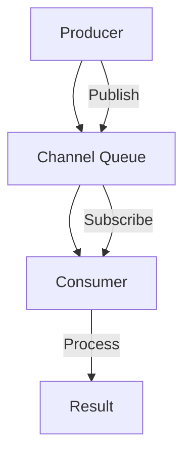
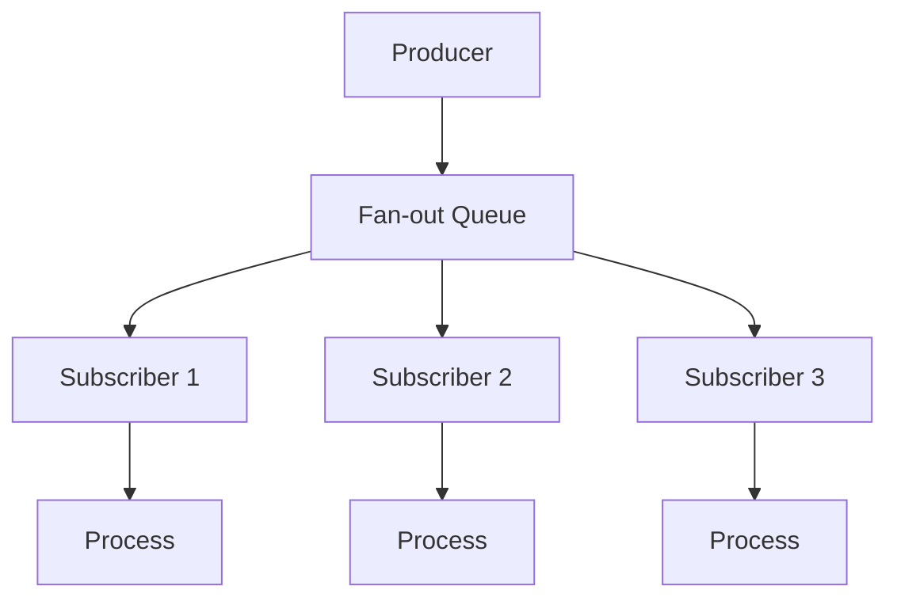
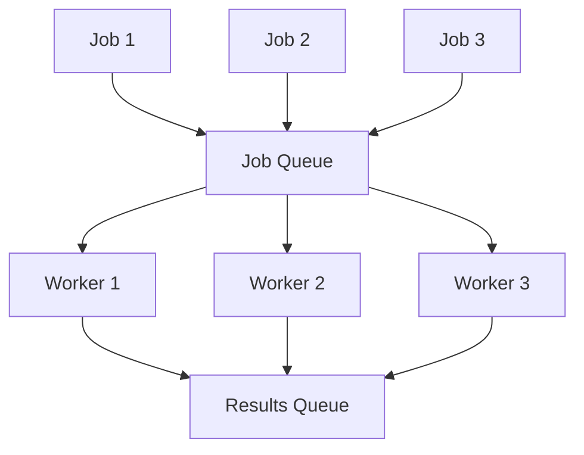
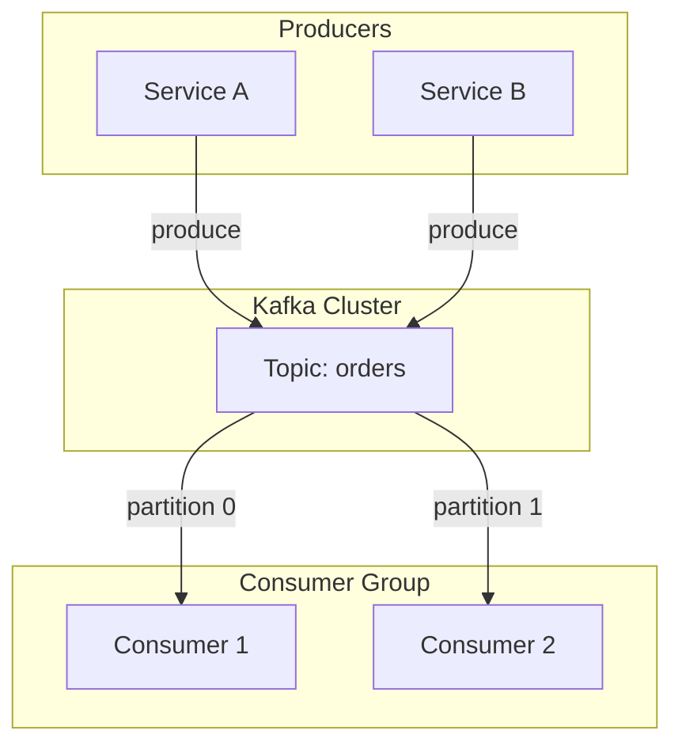
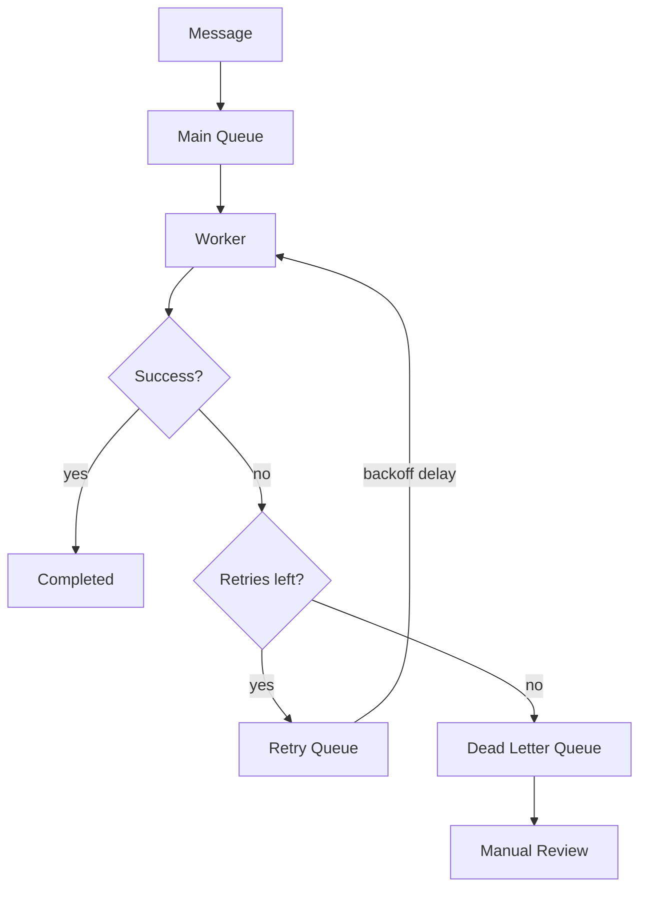

# Message Queue Patterns in Go

[English](go_mq_patterns_en.md) | [日本語](go_mq_patterns_ja.md)

## Table of Contents

- [Understanding Message Queues](#understanding-message-queues)
- [Pattern 1: Simple Channel-Based Queue](#pattern-1-simple-channel-based-queue)
- [Pattern 2: Fan-out Message Queue](#pattern-2-fan-out-message-queue)
- [Pattern 3: Worker Pool Pattern](#pattern-3-worker-pool-pattern)
- [Pattern 4: Distributed Kafka Queue](#pattern-4-distributed-kafka-queue)
- [Pattern 5: Retry with Dead Letter Queue](#pattern-5-retry-with-dead-letter-queue)

---

## Understanding Message Queues

### Fundamentals

#### What Is a Message Queue?

A message queue is a communication mechanism that enables asynchronous data exchange between services or components.
Its primary purpose is to **decouple producers from consumers** and **ensure reliable message delivery**.

**Analogy**
Like a mailbox where you drop letters without waiting for the recipient to open them immediately.

---

#### Why Message Queues Matter: System Benefits

##### Decoupled Architecture

- Services can evolve independently
- Failures don't cascade between components
- Easier to scale individual services

##### Load Leveling

- Absorbs traffic spikes
- Prevents backend overload
- Smooths out processing rates

##### Reliability

- Messages persist until processed
- Guaranteed delivery semantics
- Retry mechanisms for failures

**Real-world example**
E-commerce platforms use message queues to process orders asynchronously, ensuring no order is lost during peak traffic.

---

#### Message Queue Architecture: Components

##### Producer

- Creates and sends messages
- Fire-and-forget publishing
- Can batch messages for efficiency

##### Queue / Topic

- Stores messages temporarily
- Maintains ordering (FIFO or partitioned)
- Provides durability guarantees

##### Consumer

- Receives and processes messages
- Acknowledges successful processing
- Can be scaled horizontally

---

#### Messaging Patterns: How Messages Flow

##### 1. Point-to-Point (Queue)

- One producer, one consumer per message
- Each message delivered exactly once
- Work distribution across workers

##### 2. Publish-Subscribe (Topic)

- One producer, multiple consumers
- Each subscriber receives all messages
- Event broadcasting and notifications

##### 3. Request-Reply

- Synchronous-like communication over async transport
- Correlation IDs link requests to responses
- Useful for RPC-style interactions

---

#### Delivery Guarantees: The Reliability Spectrum

> "Exactly-once delivery is the holy grail of messaging systems."

##### At-Most-Once

- Message may be lost
- No retries on failure
- Lowest latency

##### At-Least-Once

- Message delivered one or more times
- Requires idempotent consumers
- Most common in practice

##### Exactly-Once

- Message delivered exactly once
- Requires transactional support
- Highest complexity and overhead

---

#### Featured Tool: Apache Kafka

Kafka is a distributed event streaming platform commonly used as:

- Message queue
- Event store
- Stream processor

It is widely adopted in high-throughput systems.

##### Key Features

- High throughput (millions of messages/second)
- Distributed and fault-tolerant
- Persistent message storage
- Consumer groups for parallel processing
- Configurable retention policies

##### Common Use Cases

###### Event Sourcing

- Capture all changes as events
- Rebuild state from event log

###### Log Aggregation

- Collect logs from multiple services
- Central processing and analysis

###### Stream Processing

- Real-time data transformation
- Windowed aggregations
- Complex event processing

---

#### Decision Guide: When to Use Message Queues

##### Ideal Use Cases

- Asynchronous workflows
- Microservices communication
- Background job processing
- Event-driven architectures

##### Not Suitable For

- Real-time, low-latency requirements
- Simple request-response APIs
- Small-scale, monolithic applications

##### Trade-offs to Consider

- Added infrastructure complexity
- Message ordering challenges
- Debugging distributed flows

---

#### Summary: Message Queues as Integration Backbone

1. **Queues enable decoupling**
   Services communicate without tight dependencies.

2. **Choose the right pattern**
   Point-to-point, pub-sub, or request-reply based on needs.

3. **Kafka provides scale**
   Production-ready for high-throughput distributed systems.

4. **Handle failures gracefully**
   Implement retries, dead letter queues, and monitoring.

---

## Pattern 1: Simple Channel-Based Queue

### Core Concept

A foundational messaging pattern using Go's native channels for in-memory message passing.
Thread-safe by design, leveraging Go's concurrency primitives.

### Channel Queue Flow Diagram

### Key Implementation Details

- Buffered channels for async publishing
- Built-in blocking behavior for backpressure
- Clean shutdown via channel close
- Zero external dependencies

### When to Use

Best for **single-process applications** that need simple async communication.

Typical use cases:

- Internal goroutine coordination
- Pipeline processing
- Event dispatching within a service

### Trade-offs

- No persistence across restarts
- Limited to single process
- Buffer size requires tuning

### Reference Implementation

`software/go_mq_patterns/pattern1_simple_channel/main.go`

---

## Pattern 2: Fan-out Message Queue

### Fan-out Overview

A broadcast pattern that delivers each message to all registered subscribers.
Useful for event notification and real-time updates.

### Fan-out Flow Diagram

### Implementation Steps

1. **Subscriber Registry**
   - Map of subscriber IDs to channels
   - Thread-safe registration/deregistration

2. **Broadcast on Publish**
   - Iterate all subscribers
   - Send message to each channel

3. **Handle Slow Subscribers**
   - Non-blocking send with select
   - Drop messages if buffer full

4. **Clean Shutdown**
   - Close all subscriber channels
   - Remove from registry

### Why This Works

Fan-out enables:

- Multiple consumers processing same events
- Real-time notifications
- Cache invalidation broadcasts

### Fan-out Reference Implementation

`software/go_mq_patterns/pattern2_fanout/main.go`

---

## Pattern 3: Worker Pool Pattern

### Overview

Distributes work across a fixed pool of workers for parallel processing.
Controls resource usage while maximizing throughput.

### Worker Pool Flow Diagram

### Request Flow

1. **Submit Jobs**
   - Push work items to job channel

2. **Worker Processing**
   - Fixed number of goroutines pull from channel
   - Each worker processes independently

3. **Collect Results**
   - Workers push results to output channel
   - Aggregator collects and processes

4. **Graceful Shutdown**
   - Close job channel
   - Wait for workers to complete

### Why Worker Pools Matter

#### Without Pool

- Unbounded goroutine creation
- Memory exhaustion risk
- No backpressure

#### With Pool

- Controlled concurrency
- Predictable resource usage
- Built-in backpressure via channel blocking

### Worker Pool Reference Implementation

`software/go_mq_patterns/pattern3_worker_pool/main.go`

---

## Pattern 4: Distributed Kafka Queue

### Kafka Overview

Kafka is the industry-standard distributed messaging solution.
Multiple services can produce and consume from shared topics, enabling event-driven architectures.

### Kafka Flow Diagram

### Key Characteristics

#### Partitioned Topics

- Messages distributed across partitions
- Parallel consumption per partition
- Ordering guaranteed within partition

#### Consumer Groups

- Multiple consumers share workload
- Automatic partition assignment
- Rebalancing on consumer changes

#### Durable Storage

- Messages persisted to disk
- Configurable retention period
- Replay capability

### Client Library

`segmentio/kafka-go` provides:

- Idiomatic Go APIs
- Automatic partition balancing
- Consumer group management
- Batch operations

### Kafka Reference Implementation

`software/go_mq_patterns/pattern4_kafka/main.go`

---

## Pattern 5: Retry with Dead Letter Queue

### DLQ Overview

Handles message processing failures with retry logic and a dead letter queue for poison messages.
This pattern prioritizes **reliability over speed**.

### Retry Flow Diagram

### Processing Flow

1. **Receive Message**
   - Pull from main queue

2. **Process with Handler**
   - Execute business logic
   - Track attempt count

3. **Handle Failure**
   - Check retry count against max
   - Apply exponential backoff
   - Requeue or move to DLQ

4. **Dead Letter Queue**
   - Store permanently failed messages
   - Enable manual inspection
   - Support reprocessing

### Advantages

- No message loss on transient failures
- Automatic retry with backoff
- Isolation of poison messages
- Observable failure patterns

### DLQ Trade-offs

- Slower overall processing
- Requires DLQ monitoring
- May need manual intervention

### DLQ Reference Implementation

`software/go_mq_patterns/pattern5_retry_dlq/main.go`
