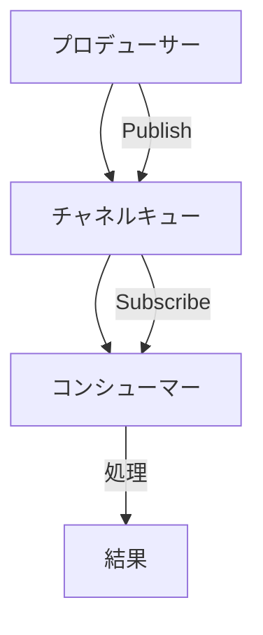
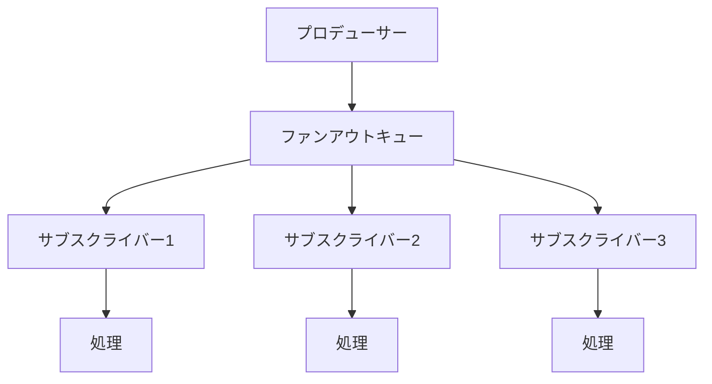
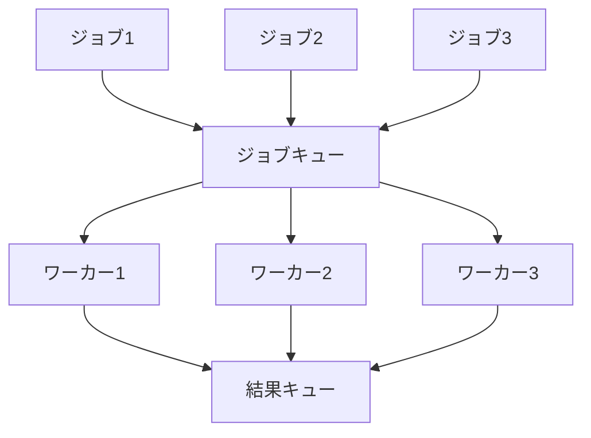
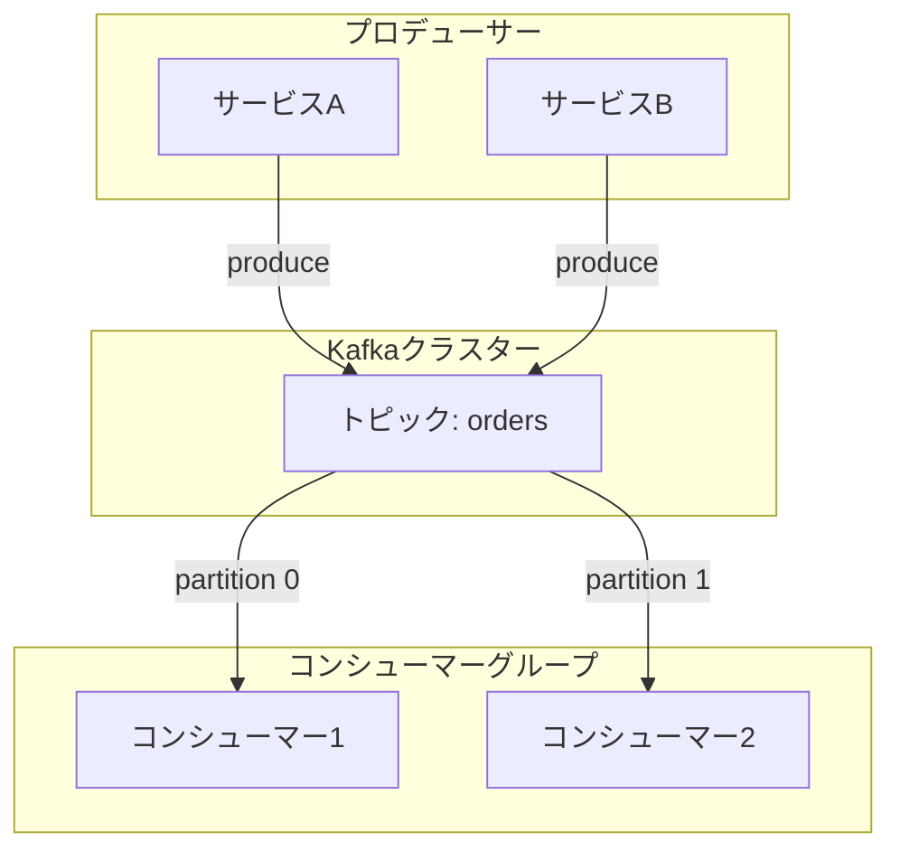
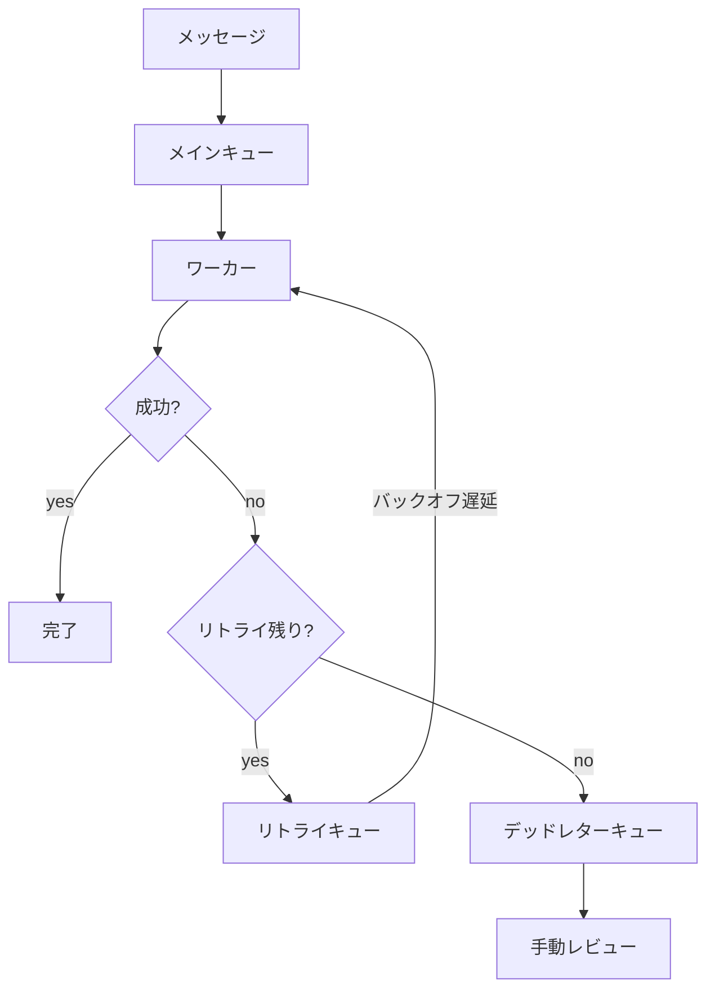

# Go言語におけるメッセージキューパターン

[English](go_mq_patterns_en.md) | [日本語](go_mq_patterns_ja.md)

## メッセージキューシステムとツールの理解

### 基礎

#### メッセージキューとは？

メッセージキューは、サービスやコンポーネント間で非同期にデータを交換するための通信メカニズムです。
主な目的は、**プロデューサーとコンシューマーを分離**し、**信頼性のあるメッセージ配信を保証**することです。

**例え**
受取人がすぐに開けるのを待たずに手紙を投函できる郵便ポストのようなものです。

---

#### なぜメッセージキューが重要なのか：システムへのメリット

##### 疎結合アーキテクチャ

- サービスを独立して進化させられる
- 障害がコンポーネント間で連鎖しない
- 個々のサービスをスケールしやすい

##### 負荷平準化

- トラフィックスパイクを吸収
- バックエンドの過負荷を防止
- 処理レートを平滑化

##### 信頼性

- 処理されるまでメッセージが永続化
- 配信保証のセマンティクス
- 障害時のリトライメカニズム

**実例**
ECプラットフォームでは、ピーク時のトラフィックでも注文が失われないよう、メッセージキューを使用して非同期に注文を処理しています。

---

#### メッセージキューアーキテクチャ：コンポーネント

##### プロデューサー

- メッセージを作成して送信
- ファイア・アンド・フォーゲット型のパブリッシュ
- 効率化のためにメッセージをバッチ処理可能

##### キュー / トピック

- メッセージを一時的に保存
- 順序を維持（FIFOまたはパーティション）
- 永続性の保証を提供

##### コンシューマー

- メッセージを受信して処理
- 処理成功を確認応答
- 水平スケール可能

---

#### メッセージングパターン：メッセージの流れ

##### 1. ポイント・ツー・ポイント（キュー）

- 1プロデューサー、メッセージごとに1コンシューマー
- 各メッセージは正確に1回配信
- ワーカー間での作業分配

##### 2. パブリッシュ・サブスクライブ（トピック）

- 1プロデューサー、複数コンシューマー
- 各サブスクライバーがすべてのメッセージを受信
- イベントのブロードキャストと通知

##### 3. リクエスト・リプライ

- 非同期トランスポート上での同期的な通信
- 相関IDでリクエストとレスポンスを紐付け
- RPCスタイルのインタラクションに有用

---

#### 配信保証：信頼性のスペクトラム

> 「Exactly-once配信はメッセージングシステムの聖杯である」

##### At-Most-Once（最大1回）

- メッセージが失われる可能性がある
- 障害時のリトライなし
- 最低レイテンシ

##### At-Least-Once（最低1回）

- メッセージが1回以上配信される
- 冪等なコンシューマーが必要
- 実務で最も一般的

##### Exactly-Once（正確に1回）

- メッセージが正確に1回配信される
- トランザクションサポートが必要
- 最高の複雑性とオーバーヘッド

---

#### 注目のツール：Apache Kafka

Kafkaは分散イベントストリーミングプラットフォームで、一般的に以下として使用されます：

- メッセージキュー
- イベントストア
- ストリームプロセッサー

高スループットシステムで広く採用されています。

##### Kafkaの主な特徴

- 高スループット（毎秒数百万メッセージ）
- 分散・耐障害性
- 永続的なメッセージストレージ
- 並列処理のためのコンシューマーグループ
- 設定可能な保持ポリシー

##### 一般的なユースケース

###### イベントソーシング

- すべての変更をイベントとしてキャプチャ
- イベントログから状態を再構築

###### ログ集約

- 複数サービスからログを収集
- 一元的な処理と分析

###### ストリーム処理

- リアルタイムデータ変換
- ウィンドウ集計
- 複合イベント処理

---

#### 判断ガイド：メッセージキューを使用すべき場合

##### 理想的なユースケース

- 非同期ワークフロー
- マイクロサービス間通信
- バックグラウンドジョブ処理
- イベント駆動アーキテクチャ

##### 適さない場合

- リアルタイム・低レイテンシ要件
- シンプルなリクエスト・レスポンスAPI
- 小規模なモノリシックアプリケーション

##### 考慮すべきトレードオフ

- インフラの複雑性が増加
- メッセージ順序の課題
- 分散フローのデバッグ

---

#### まとめ：統合基盤としてのメッセージキュー

1. **キューは疎結合を実現**
   サービスは密結合なしに通信できる。

2. **適切なパターンを選択**
   ニーズに応じてポイント・ツー・ポイント、pub-sub、リクエスト・リプライを選択。

3. **Kafkaはスケールを提供**
   高スループット分散システムに本番対応。

4. **障害を優雅に処理**
   リトライ、デッドレターキュー、モニタリングを実装。

---

## パターン1: シンプルなチャネルベースキュー

### コアコンセプト

Goネイティブのチャネルを使用したインメモリメッセージパッシングの基本パターン。
Goの並行性プリミティブを活用し、設計上スレッドセーフです。

### チャネルキューフロー図

### 主な実装詳細

- 非同期パブリッシュのためのバッファ付きチャネル
- バックプレッシャーのための組み込みブロッキング動作
- チャネルクローズによるクリーンなシャットダウン
- 外部依存なし

### 使用すべき場合

シンプルな非同期通信が必要な**シングルプロセスアプリケーション**に最適。

典型的なユースケース：

- 内部ゴルーチン間の調整
- パイプライン処理
- サービス内でのイベントディスパッチ

### トレードオフ

- 再起動時に永続化されない
- シングルプロセスに限定
- バッファサイズの調整が必要

### リファレンス実装

`software/go_mq_patterns/pattern1_simple_channel/main.go`

---

## パターン2: ファンアウトメッセージキュー

### ファンアウト概要

登録されたすべてのサブスクライバーに各メッセージを配信するブロードキャストパターン。
イベント通知やリアルタイム更新に有用です。

### ファンアウトフロー図

### 実装ステップ

1. **サブスクライバーレジストリ**
   - サブスクライバーIDからチャネルへのマップ
   - スレッドセーフな登録/登録解除

2. **パブリッシュ時のブロードキャスト**
   - すべてのサブスクライバーを反復
   - 各チャネルにメッセージを送信

3. **遅いサブスクライバーの処理**
   - selectによるノンブロッキング送信
   - バッファが一杯の場合はメッセージをドロップ

4. **クリーンなシャットダウン**
   - すべてのサブスクライバーチャネルをクローズ
   - レジストリから削除

### なぜこれが機能するか

ファンアウトにより以下が可能：

- 複数のコンシューマーが同じイベントを処理
- リアルタイム通知
- キャッシュ無効化のブロードキャスト

### ファンアウトリファレンス実装

`software/go_mq_patterns/pattern2_fanout/main.go`

---

## パターン3: ワーカープールパターン

### 概要

固定数のワーカープールに作業を分配して並列処理。
スループットを最大化しながらリソース使用を制御します。

### ワーカープールフロー図

### リクエストフロー

1. **ジョブの投入**
   - ジョブチャネルに作業項目をプッシュ

2. **ワーカー処理**
   - 固定数のゴルーチンがチャネルからプル
   - 各ワーカーが独立して処理

3. **結果の収集**
   - ワーカーが出力チャネルに結果をプッシュ
   - アグリゲーターが収集して処理

4. **グレースフルシャットダウン**
   - ジョブチャネルをクローズ
   - ワーカーの完了を待機

### なぜワーカープールが重要か

#### プールなしの場合

- 無制限なゴルーチン作成
- メモリ枯渇のリスク
- バックプレッシャーなし

#### プールありの場合

- 制御された並行性
- 予測可能なリソース使用
- チャネルブロッキングによる組み込みバックプレッシャー

### ワーカープールリファレンス実装

`software/go_mq_patterns/pattern3_worker_pool/main.go`

---

## パターン4: 分散Kafkaキュー

### Kafka概要

Kafkaは業界標準の分散メッセージングソリューションです。
複数のサービスが共有トピックからプロデュース・コンシュームでき、イベント駆動アーキテクチャを実現します。

### Kafkaフロー図

### 主な特性

#### パーティション化されたトピック

- メッセージがパーティション間で分散
- パーティションごとの並列消費
- パーティション内での順序保証

#### コンシューマーグループ

- 複数のコンシューマーがワークロードを共有
- 自動パーティション割り当て
- コンシューマー変更時のリバランシング

#### 永続ストレージ

- メッセージがディスクに永続化
- 設定可能な保持期間
- リプレイ機能

### クライアントライブラリ

`segmentio/kafka-go` が提供する機能：

- イディオマティックなGo API
- 自動パーティションバランシング
- コンシューマーグループ管理
- バッチ操作

### Kafkaリファレンス実装

`software/go_mq_patterns/pattern4_kafka/main.go`

---

## パターン5: リトライとデッドレターキュー

### DLQ概要

リトライロジックとポイズンメッセージ用のデッドレターキューでメッセージ処理障害を処理。
このパターンは**速度より信頼性**を優先します。

### リトライフロー図

### 処理フロー

1. **メッセージ受信**
   - メインキューからプル

2. **ハンドラーで処理**
   - ビジネスロジックを実行
   - 試行回数を追跡

3. **障害処理**
   - リトライ回数を最大値と比較
   - 指数バックオフを適用
   - 再キューまたはDLQへ移動

4. **デッドレターキュー**
   - 永続的に失敗したメッセージを保存
   - 手動検査を可能に
   - 再処理をサポート

### メリット

- 一時的障害でメッセージを失わない
- バックオフ付き自動リトライ
- ポイズンメッセージの隔離
- 障害パターンの可観測性

### DLQのトレードオフ

- 全体的な処理が遅くなる
- DLQのモニタリングが必要
- 手動介入が必要な場合がある

### DLQリファレンス実装

`software/go_mq_patterns/pattern5_retry_dlq/main.go`
