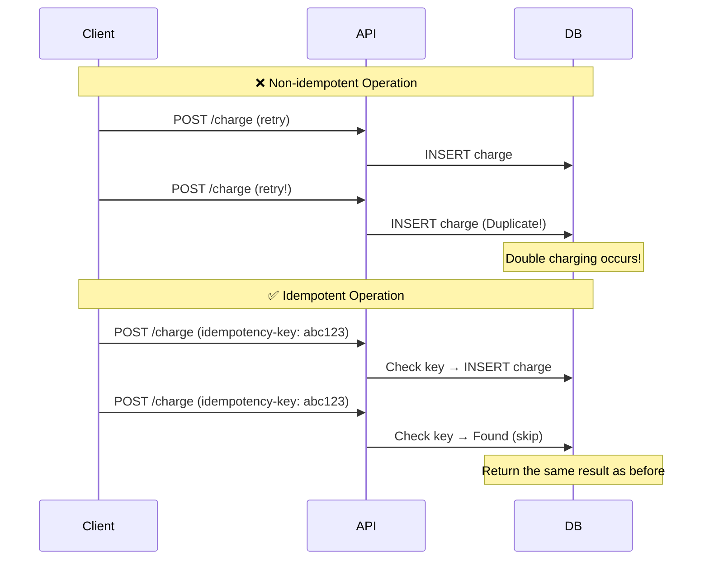
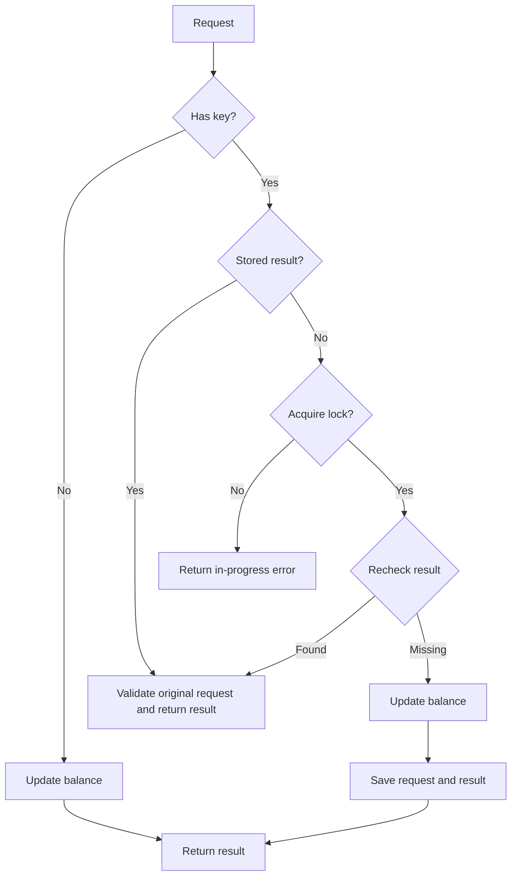
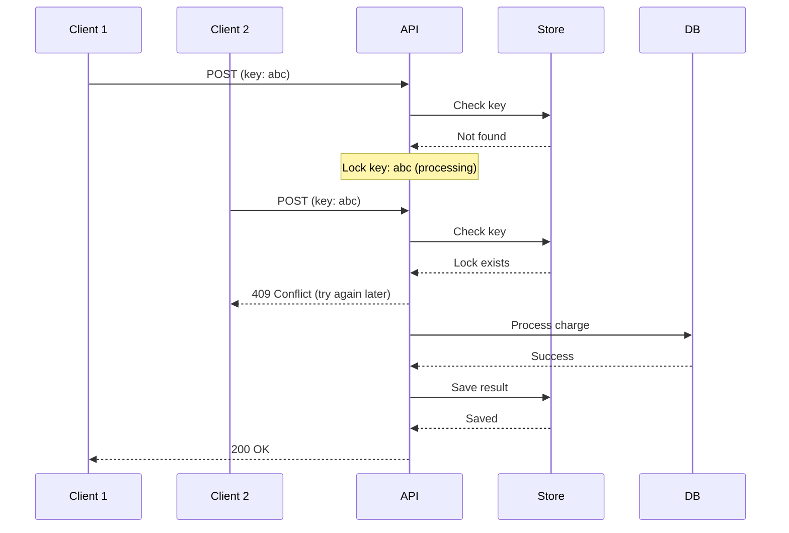

# Idempotency Pattern Workshop: Designing for Safe Retries

> **⏱️ Estimated Time**: Approx. 45 minutes

In this workshop, you will learn the "Idempotency" pattern to safely retry operations when network failures or timeouts occur in distributed systems.

> **💡 Glossary**: For technical terms such as [Idempotency](../infra/glossary_en.md#software), [Retry](../infra/glossary_en.md#software), and [Dead Letter Queue](../infra/glossary_en.md#software), please refer to the [Glossary](../infra/glossary_en.md).

## Implementation Code

An executable minimal sample is available in [`software/assets/idempotency/`](assets/idempotency/). It is a CLI that stores balances and idempotency keys in Redis.

```bash
cd software/assets/idempotency
ls -la
# domain/  usecase/  infra/  main.go
```

## Goal

Design and implement an idempotent API and build a system where retries can be performed safely.



**What you will learn:**

1. **Definition of Idempotency**: The property where performing the same operation multiple times does not change the result.
2. **Idempotency Key**: A pattern using client-generated unique identifiers.
3. **Designing for Idempotency**: Relationship between HTTP methods and idempotency.

---

## Challenges of Idempotency

In distributed systems, network failures and timeouts occur daily.

### ❌ Challenges

- **Double Processing**: Retrying before receiving a response can lead to the same process running twice.
- **Inconsistency**: Duplicates in balance updates, inventory reduction, or billing can corrupt data.
- **Ambiguous State**: It becomes unclear whether a request was actually processed.

### ✅ Idempotency Solutions

- **Safe Retries**: Clients can resend requests with peace of mind.
- **Accuracy**: Prevent double processing, overbilling, and data inconsistency.
- **Clarity**: Traceability of request status.

---

## HTTP Methods and Idempotency

| Method | Idempotent | Description                                                          |
| :----- | :--------- | :------------------------------------------------------------------- |
| GET    | ✅ Yes     | Retrieval only (no side effects)                                     |
| HEAD   | ✅ Yes     | Header retrieval only (no side effects)                              |
| PUT    | ✅ Yes     | Full replacement (same data results in same state)                   |
| DELETE | ✅ Yes     | Resource deletion (2nd call is 404, but state is the same)           |
| POST   | ❌ No      | Resource creation (each call creates a new resource)                 |
| PATCH  | ⚠️ Depends | Content dependent (absolute values are idempotent, relative are not) |

**Important**: POST is non-idempotent by default. Without special duplicate detection mechanisms, sending the same request twice may result in two different resources being created. If idempotency is needed, implement server-side duplicate detection (e.g., Idempotency Key) or design for idempotent behavior.

---

## Architecture

### Idempotency Key Pattern



---

## Sample Directory Structure

```text
software/assets/idempotency/
├── domain/                  # Entities and ports
│   └── repository.go        # Repository and idempotency-store interfaces
├── usecase/                 # Business Logic
│   └── charge_usecase.go    # Charge Usecase
├── infra/                   # Infrastructure
│   └── idempotency_store.go # Redis idempotency-store implementation
└── main.go                  # Dependency Injection
```

---

## Setup

### 1. Start Redis

```bash
# For Podman
podman run -d --name idempotency-redis \
  -p 6379:6379 \
  docker.io/library/redis:alpine

# For Docker (alternative)
docker run -d --name idempotency-redis \
  -p 6379:6379 \
  redis:alpine
```

### 2. Project Setup

```bash
cd software/assets/idempotency
go mod tidy
```

### ✅ Checkpoint

- [ ] Confirmed Redis is running

---

## Hands-on Steps

### STEP 1: Observe Issues with Non-idempotent API

First, reproduce the problem using an implementation without idempotency.

```bash
# Execute charge (Balance: 1000, Charge: 100)
go run main.go -user user1 -amount 100
# Result: &{Status:success Balance:900 Source:DB (Freshly Processed)}

# Retry assuming a timeout
go run main.go -user user1 -amount 100
# Result: &{Status:success Balance:800 Source:DB (Freshly Processed)}
```

**Issue**: The same transaction was processed twice, and the balance decreased twice.

### ✅ Checkpoint

- [ ] Confirmed double processing occurs in the non-idempotent implementation

### STEP 2: Implement Idempotency Key

Use a client-generated unique key to achieve idempotency.

```bash
# Generate the key once in the same shell.
key=$(uuidgen)

# Charge with Idempotency Key
go run main.go -user user2 -amount 100 -idempotency-key "$key"
# Result: &{Status:success Balance:900 Source:DB (Freshly Processed)}

# Retry with the same key
go run main.go -user user2 -amount 100 -idempotency-key "$key"
# Result: &{Status:success Balance:900 Source:Cache (Idempotent)}
```

### ✅ Checkpoint

- [ ] Confirmed processing is not duplicated when retrying with the same Idempotency Key
- [ ] Confirmed new processing occurs for a different Key

### STEP 3: Inspect the Idempotency Store

The sample stores processing results in Redis for 24 hours, using the `idemp:` key prefix.

**Go Code Structure:**

```go
// Infra: Redis implementation (simplified from the sample)
type RedisIdempotencyStore struct {
    client *redis.Client
    ttl    time.Duration  // 24 hours in the sample
}

func (s *RedisIdempotencyStore) GetResult(ctx context.Context, key string) ([]byte, error) {
    val, err := s.client.Get(ctx, "idemp:"+key).Bytes()
    if err == redis.Nil {
        return nil, nil
    }
    return val, err
}

func (s *RedisIdempotencyStore) SaveResult(ctx context.Context, key string, result []byte) error {
    return s.client.Set(ctx, "idemp:"+key, result, s.ttl).Err()
}
```

### ✅ Checkpoint

- [ ] Confirmed processing results are saved in Redis
- [ ] Confirmed Key is cleared after TTL expiration

### STEP 4: Read the Idempotent Charge Processing

The sample's `ChargeUsecase.Execute` retrieves a result, obtains a Redis `SETNX` lock, updates the balance, and saves the result in that order.

Read the [usecase](assets/idempotency/usecase/charge_usecase.go) and [Redis lock adapter](assets/idempotency/infra/idempotency_store.go). The executable sample validates the user and positive amount, checks the result, acquires an ownership token, rechecks the result, updates the balance, and saves both request and response. Reusing a key for a different request is rejected. Redis and decoding errors stop processing.

The stored result now includes the original request. Results saved by older versions are rejected rather than treated as successful responses; use a fresh key for a new exercise.

### ✅ Checkpoint

- [ ] Confirmed Clean Architecture layers are separated

---

## Advanced Patterns

### 1. Handling Concurrent Requests

When multiple requests with the same Idempotency Key arrive simultaneously:



The sample also uses Redis `SETNX` (Set if Not eXists) and returns an error when the same key is already being processed. The sample uses an ownership token as shown below; the failure and concurrency limits still apply.

```go
token, err := store.Lock(ctx, key)
if err != nil { return nil, err }
if token == "" { return nil, ErrRequestInProgress }
// The adapter atomically compares the token before deleting the lock.
// See Execute for bounded cleanup after request cancellation.
defer store.Unlock(context.WithoutCancel(ctx), key, token)
```

### 2. Key Expiration Strategy

| Use Case    | Recommended TTL | Reason                                  |
| :---------- | :-------------- | :-------------------------------------- |
| Payments    | 48 hours        | Inquiry window after payment completion |
| Inventory   | 15 minutes      | Cart session duration                   |
| File Upload | 24 hours        | Grace period for upload completion      |

### 3. Partial Idempotency

Even if the whole operation isn't idempotent, ensure critical sections are.

```go
// Logging doesn't need to be idempotent
log.Printf("Charge request received: %v", req)

// Ensure only balance update is idempotent
result, err := uc.chargeWithIdempotency(ctx, req)
```

---

## Cleanup

```bash
podman stop idempotency-redis
podman rm idempotency-redis
```

---

## References

- [Stripe API: Idempotency Keys](https://stripe.com/docs/api/idempotent_requests)
- [AWS: Designing Idempotent APIs](https://docs.aws.amazon.com/appsync/latest/devguide/designing-idempotent-apis.html)
- [RFC 9110: HTTP Semantics](https://httpwg.org/specs/rfc9110.html)

---

## 🔧 Troubleshooting

### Idempotency Key Collision

**Symptoms**: Different requests result in the same Key being generated.

**Causes and Solutions:**

- **Use UUID v4**: Use a cryptographically strong random number generator.
- **Client-side Generation**: Letting the client generate the Key is the safest.

### Processing Request Hangs

**Symptoms**: Lock remains, blocking subsequent requests.

**Causes and Solutions:**

- **Lock TTL**: Always set a TTL (typically 30s) on locks.
- **Deadlock Detection**: Implement backoff and retry if processing time exceeds TTL.

### Redis and Persistent-DB Inconsistency

**Symptoms**: Redis has a result but the persistent DB does not reflect it.

**Causes and Solutions:**

- **Transaction Boundaries**: In production, save the balance change and idempotency result in one transaction or atomic operation. This sample updates them separately, so it demonstrates the normal retry path, not failure-atomic charging.
  - ❌ Cache save → DB commit (risk of cache-only success)
  - ✅ DB commit → Cache save (safe to retry if only DB succeeds)

---

## Environment-specific Notes

### macOS

You can also install Redis directly via Homebrew.

```bash
brew install redis
brew services start redis
```

### Windows

Recommended to run on Ubuntu via WSL2.

**Sample limits**: Balance updates and result storage are separate operations. A result-save failure is reported as an uncertain outcome; reconcile the balance before retrying. An ownership token prevents an expired owner from deleting a newer lock, but does not stop stale writes after lock expiry. Different keys for the same account can also race. Production charging needs an atomic balance/result transaction, account-level concurrency control, and durable request records.
