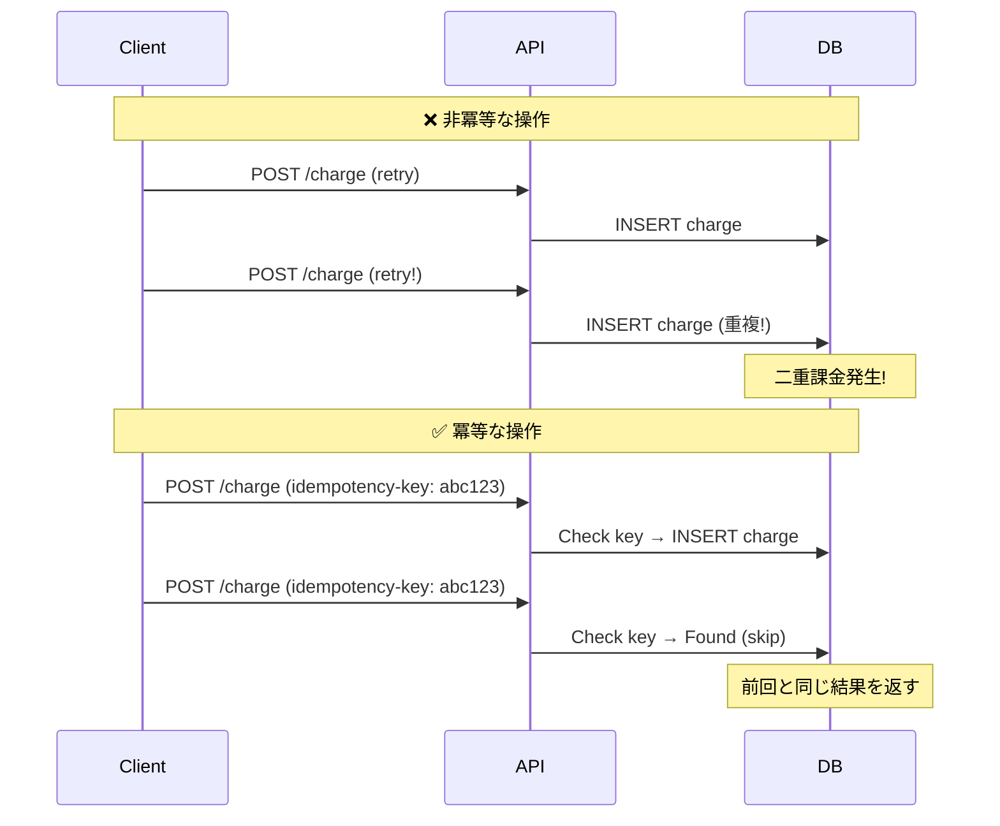
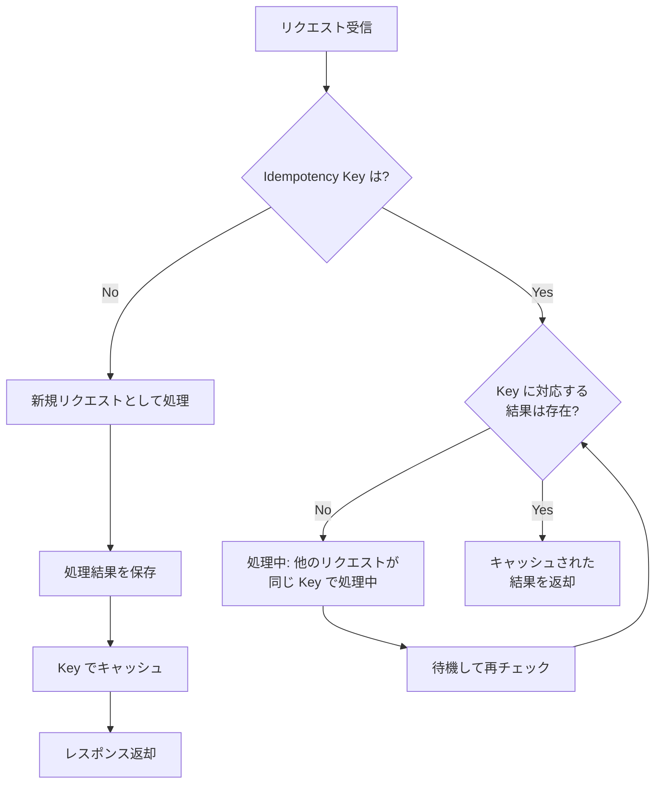
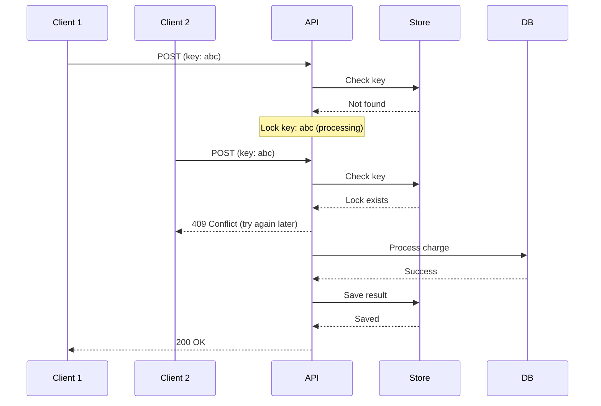

# 冪等性（Idempotency）パターン：安全な再試行を実現する設計

> **⏱️ 所要時間**: 約 45 分

この実習では、分散システムにおいてネットワーク障害やタイムアウトが発生した際に安全に再試行を行うための「冪等性（Idempotency）」パターンを学びます。

> **💡 用語集**: この実習で登場する[冪等性](glossary.md#software)や[再試行](glossary.md#software)、[デッドレターキュー](glossary.md#software)などの専門用語は [用語集](glossary.md) を参照してください。

## 実装コード

この実習の完全な実装は [`software/assets/idempotency/`](assets/idempotency/) にあります。

```bash
cd software/assets/idempotency
ls -la
# domain/  usecase/  infra/  main.go
```

## ゴール

冪等性を持つ API を設計・実装し、再試行が安全に行えるシステムを構築します。



**この実習で理解すること:**

1. **冪等性の定義**: 同じ操作を何度行っても結果が変わらない性質。
2. **Idempotency Key**: クライアント生成の一意識別子を活用したパターン。
3. **冪等性の設計**: HTTP メソッドと冪等性の関係。

---

## 冪等性の課題

分散システムでは、ネットワーク障害やタイムアウトが日常的に発生します。

### ❌ 課題

- **二重処理**: クライアントが応答を受け取る前に再試行すると、同じ処理が2回実行される。
- **不整合**: 残高更新、在庫減少、課金処理などで重複が発生するとデータが破損する。
- **曖昧な状態**: リクエストが処理されたかどうかが不明確になる。

### ✅ 冪等性の解決策

- **安全な再試行**: クライアントは安心してリクエストを再送できる。
- **正確性**: 二重処理、過剰な請求、データ不整合を防止。
- **明確性**: リクエストの状態を追跡可能。

---

## HTTP メソッドと冪等性

| メソッド | 冪等性 | 説明 |
|---------|-------|------|
| GET | ✅ あり | リソースの取得のみ（副作用なし） |
| HEAD | ✅ あり | ヘッダーの取得のみ（副作用なし） |
| PUT | ✅ あり | リソースの完全置換（同じデータなら同じ結果） |
| DELETE | ✅ あり | リソースの削除（2回目は404だが状態は同じ） |
| POST | ❌ なし | リソースの作成（同じデータでも毎回新しいリソースが作成される） |
| PATCH | ⚠️ 依存 | 変更内容による（絶対値なら冪等、相対値なら非冪等） |

**重要**: POST はデフォルトで非冪等です。同じリクエストを2回送ると、2つの異なるリソースが作成されます。冪等性が必要な場合は Idempotency Key パターンを使用します。

---

## アーキテクチャ

### Idempotency Key パターン



---

## 想定ディレクトリ構造

```text
software/assets/idempotency/
├── domain/                  # エンティティとインターフェース
│   ├── idempotency_key.go   # 冪等性キーのエンティティ
│   └── repository.go        # リポジトリインターフェース
├── usecase/                 # ビジネスロジック
│   └── charge_usecase.go    # 課金処理ユースケース
├── infra/                   # インフラストラクチャ
│   ├── db_repository.go     # データベース実装
│   └── idempotency_store.go # Redis/DB 実装
├── cmd/                     # CLI エントリーポイント
│   └── main.go
└── main.go                  # 依存注入
```

---

## 準備

### 1. データベースの起動

```bash
# Podman の場合
podman run -d --name idempotency-db \
  -e POSTGRES_USER=user \
  -e POSTGRES_PASSWORD=pass \
  -e POSTGRES_DB=idempotency \
  -p 5432:5432 \
  docker.io/library/postgres:alpine

# Docker の場合（読み替え）
docker run -d --name idempotency-db \
  -e POSTGRES_USER=user \
  -e POSTGRES_PASSWORD=pass \
  -e POSTGRES_DB=idempotency \
  -p 5432:5432 \
  postgres:alpine
```

### 2. Redis の起動（キャッシュ用）

```bash
# Podman の場合
podman run -d --name idempotency-redis \
  -p 6379:6379 \
  docker.io/library/redis:alpine

# Docker の場合（読み替え）
docker run -d --name idempotency-redis \
  -p 6379:6379 \
  redis:alpine
```

### 3. プロジェクトのセットアップ

```bash
cd software/assets/idempotency
go mod tidy
```

### ✅ チェックポイント

- [ ] PostgreSQL と Redis が起動していることを確認した

---

## 実習ステップ

### STEP 1: 非冪等な API の問題確認

まず、冪等性のない実装で問題を再現します。

```bash
# 課金処理を実行（残高: 1000円、支払い: 100円）
go run main.go -action charge -user user1 -amount 100
# 残高: 900円

# タイムアウトを想定して再試行
go run main.go -action charge -user user1 -amount 100
# 残高: 800円（二重課金！）
```

**問題**: 同じ取引が2回処理され、残高が2回減少しました。

### ✅ チェックポイント

- [ ] 非冪等な実装で二重処理が発生することを確認した

### STEP 2: Idempotency Key の実装

クライアント生成の一意キーを使用して冪等性を実現します。

```bash
# Idempotency Key を指定して課金
go run main.go -action charge -user user1 -amount 100 \
  -idempotency-key $(uuidgen)
# 残高: 900円、キー: abc123-def456-...

# 同じキーで再試行
go run main.go -action charge -user user1 -amount 100 \
  -idempotency-key abc123-def456-...
# 残高: 900円（変わらず）、前回と同じ結果を返す
```

### ✅ チェックポイント

- [ ] 同じ Idempotency Key で再試行しても、処理が重複しないことを確認した
- [ ] 異なる Key では新しい処理が行われることを確認した

### STEP 3: 冪等性ストアの実装

処理結果をキャッシュするストアを実装します。

**Go コードの構造:**

```go
// Domain: エンティティ定義
type IdempotencyKey struct {
    Key       string
    UserID    string
    Result    []byte  // 処理結果のJSON
    CreatedAt time.Time
}

// Infra: Redis 実装
type RedisIdempotencyStore struct {
    client *redis.Client
    ttl    time.Duration  // 通常 24-48 時間
}

func (s *RedisIdempotencyStore) GetResult(ctx context.Context, key string) ([]byte, error) {
    val, err := s.client.Get(ctx, "idempotency:"+key).Bytes()
    if err == redis.Nil {
        return nil, ErrKeyNotFound
    }
    return val, err
}

func (s *RedisIdempotencyStore) SaveResult(ctx context.Context, key string, result []byte) error {
    return s.client.Set(ctx, "idempotency:"+key, result, s.ttl).Err()
}
```

### ✅ チェックポイント

- [ ] Redis に処理結果が保存されていることを確認した
- [ ] TTL 期限切れ後に Key がクリアされることを確認した

### STEP 4: 冪等性付き課金処理の完成

Clean Architecture で実装します。

```go
// Usecase: ビジネスロジック
type ChargeUsecase struct {
    repo          AccountRepository
    idempotencyStore IdempotencyStore
}

func (uc *ChargeUsecase) Execute(ctx context.Context, req ChargeRequest) (*ChargeResponse, error) {
    // 1. Idempotency Key をチェック
    if cached, err := uc.idempotencyStore.GetResult(ctx, req.IdempotencyKey); err == nil {
        // キャッシュされた結果を返す
        return deserializeResponse(cached), nil
    }

    // 2. 新規処理を実行
    result, err := uc.processCharge(ctx, req)
    if err != nil {
        return nil, err
    }

    // 3. 結果を保存
    serialized, _ := serializeResponse(result)
    uc.idempotencyStore.SaveResult(ctx, req.IdempotencyKey, serialized)

    return result, nil
}
```

### ✅ チェックポイント

- [ ] Clean Architecture の各レイヤーが分離されていることを確認した

---

## 高度なパターン

### 1. 処理中のリクエストの扱い

同じ Idempotency Key で同時に複数のリクエストが来た場合：



**実装方法**: Redis の `SETNX`（Set if Not eXists）を使用

```go
// 排他ロックの取得
locked, _ := redis.SetNX(ctx, "lock:"+key, "1", 30*time.Second).Result()
if !locked {
    return nil, ErrRequestInProgress
}
defer redis.Del(ctx, "lock:"+key)
```

### 2. Key の有効期限戦略

| ユースケース | 推奨 TTL | 理由 |
|------------|---------|------|
| 課金処理 | 48時間 | 決済完了後の問い合わせ対応期間 |
| 在庫確保 | 15分 | カートのセッション時間 |
| ファイルアップロード | 24時間 | アップロード完了の猶予期間 |

### 3. 部分的な冪等性

全操作が冪等でなくても、クリティカルな部分のみ冪等にします。

```go
// ログ記録は非冪等でも問題ない
log.Printf("Charge request received: %v", req)

// 残高更新のみ冪等性を保証
result, err := uc.chargeWithIdempotency(ctx, req)
```

---

## 片付け

```bash
podman stop idempotency-db idempotency-redis
podman rm idempotency-db idempotency-redis
```

---

## 参考文献

- [Stripe API: Idempotency Keys](https://stripe.com/docs/api/idempotent_requests)
- [AWS: Designing Idempotent APIs](https://docs.aws.amazon.com/appsync/latest/devguide/designing-idempotent-apis.html)
- [RFC 9110: HTTP Semantics](https://httpwg.org/specs/rfc9110.html)

---

## 🔧 トラブルシューティング

### Idempotency Key の衝突

**症状**: 異なるリクエストで同じ Key が生成される

**原因と対処:**

- **UUID v4 の使用**: 暗号的に強力な乱数生成器を使用してください
- **クライアントサイド生成**: クライアントに Key 生成を任せるのが最も安全です

### 処理中のリクエストがハングする

**症状**: Lock が残ったまま、後続のリクエストがブロックされる

**原因と対処:**

- **Lock の TTL**: ロックには必ず TTL（通常30秒）を設定してください
- **デッドロック検出**: 処理時間が TTL を超える場合は、バックオフと再試行を実装してください

### キャッシュと DB の不整合

**症状**: キャッシュには結果があるが、DB には反映されていない

**原因と対処:**

- **トランザクションの境界**: DB コミット後、キャッシュ保存を行ってください
  - ❌ キャッシュ保存 → DB コミット（キャッシュだけが成功する可能性）
  - ✅ DB コミット → キャッシュ保存（DB だけが成功しても再試行可能）

---

## 環境別注意事項

### macOS の場合

Homebrew で PostgreSQL と Redis を直接インストールすることも可能です。

```bash
brew install postgresql@14 redis
brew services start postgresql@14
brew services start redis
```

### Windows の場合

WSL2 上の Ubuntu で Podman を使用することを推奨します。
