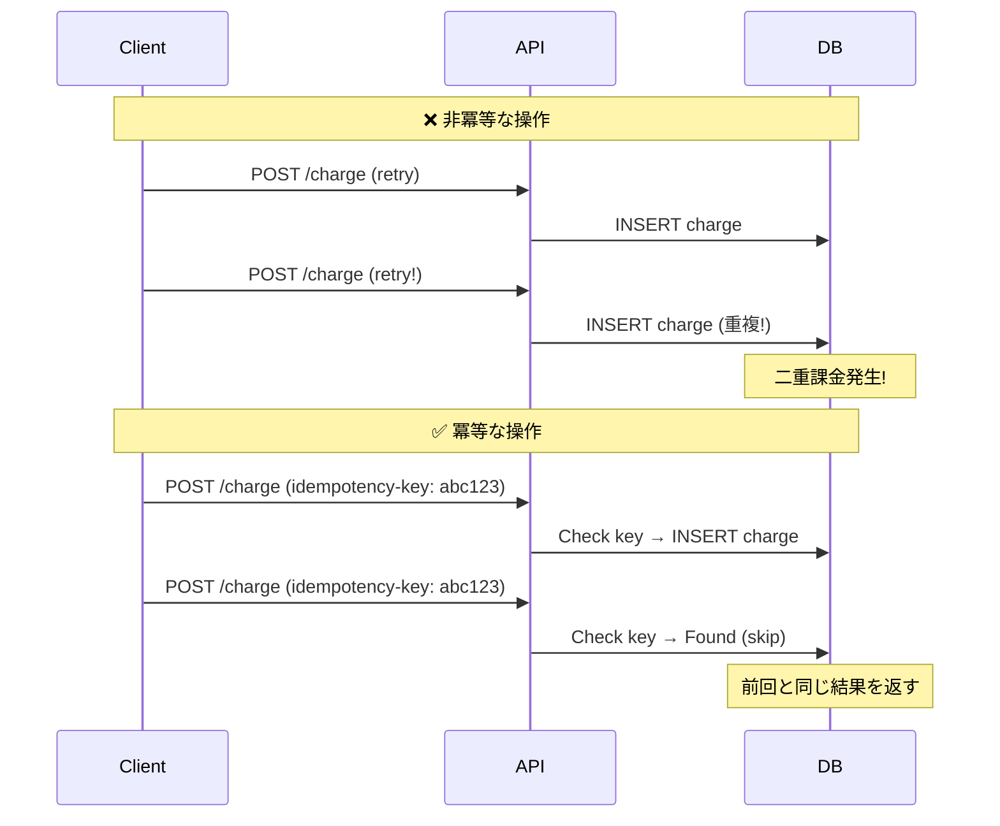
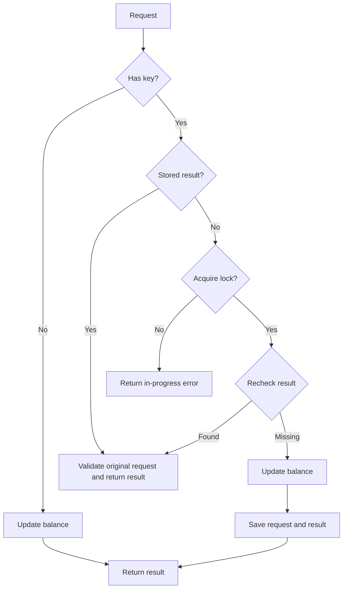
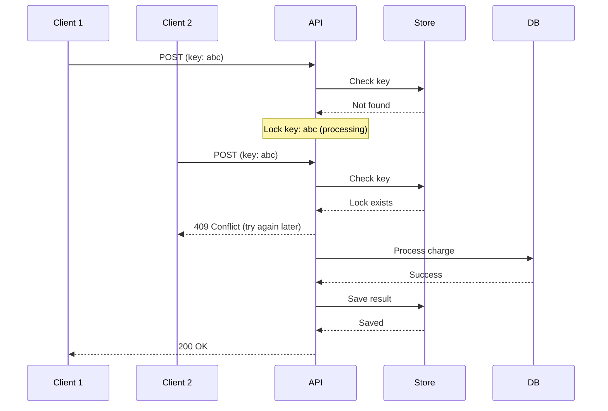

# 冪等性（Idempotency）パターン：安全な再試行を実現する設計

> **⏱️ 所要時間**: 約 45 分

この実習では、分散システムにおいてネットワーク障害やタイムアウトが発生した際に安全に再試行を行うための「冪等性（Idempotency）」パターンを学びます。

> **💡 用語集**: この実習で登場する[冪等性](../infra/glossary_ja.md#software)や[再試行](../infra/glossary_ja.md#software)、[デッドレターキュー](../infra/glossary_ja.md#software)などの専門用語は [用語集](../infra/glossary_ja.md) を参照してください。

## 実装コード

この実習の実行可能な最小サンプルは [`software/assets/idempotency/`](assets/idempotency/) にあります。Redis に残高と冪等性キーを保存する CLI です。

```bash
cd software/assets/idempotency
ls -la
# domain/  usecase/  infra/  main.go
```

## ゴール

冪等性を持つ API を設計・実装し、再試行が安全に行えるシステムを構築します。



**この実習で理解すること:**

1. **冪等性の定義**: 同じ操作を何度行っても結果が変わらない性質。
2. **Idempotency Key**: クライアント生成の一意識別子を活用したパターン。
3. **冪等性の設計**: HTTP メソッドと冪等性の関係。

---

## 冪等性の課題

分散システムでは、ネットワーク障害やタイムアウトが日常的に発生します。

### ❌ 課題

- **二重処理**: クライアントが応答を受け取る前に再試行すると、同じ処理が 2 回実行される。
- **不整合**: 残高更新、在庫減少、課金処理などで重複が発生するとデータが破損する。
- **曖昧な状態**: リクエストが処理されたかどうかが不明確になる。

### ✅ 冪等性の解決策

- **安全な再試行**: クライアントは安心してリクエストを再送できる。
- **正確性**: 二重処理、過剰な請求、データ不整合を防止。
- **明確性**: リクエストの状態を追跡可能。

---

## HTTP メソッドと冪等性

| メソッド | 冪等性  | 説明                                                           |
| :------- | :------ | :------------------------------------------------------------- |
| GET      | ✅ あり | リソースの取得のみ（副作用なし）                               |
| HEAD     | ✅ あり | ヘッダーの取得のみ（副作用なし）                               |
| PUT      | ✅ あり | リソースの完全置換（同じデータなら同じ結果）                   |
| DELETE   | ✅ あり | リソースの削除（2回目は404だが状態は同じ）                     |
| POST     | ❌ なし | リソースの作成（同じデータでも毎回新しいリソースが作成される） |
| PATCH    | ⚠️ 依存 | 変更内容による（絶対値なら冪等、相対値なら非冪等）             |

**重要**: POST はデフォルトで非冪等です。特別な重複検出機構がなければ、同じリクエストを 2 回送ると 2 つの異なるリソースが作成される可能性があります。冪等性が必要な場合は、サーバー側で重複検出（例：Idempotency Key）を実装するか、冪等性を保証する設計にしてください。

---

## アーキテクチャ

### Idempotency Key パターン



---

## サンプルのディレクトリ構造

```text
software/assets/idempotency/
├── domain/                  # エンティティとポート
│   └── repository.go        # リポジトリと冪等性ストアのインターフェース
├── usecase/                 # ビジネスロジック
│   └── charge_usecase.go    # 課金処理ユースケース
├── infra/                   # インフラストラクチャ
│   └── idempotency_store.go # Redis の冪等性ストア実装
└── main.go                  # 依存注入
```

---

## 準備

### 1. Redis の起動

```bash
# Podman の場合
podman run -d --name idempotency-redis \
  -p 6379:6379 \
  docker.io/library/redis:alpine

# Docker の場合（読み替え）
docker run -d --name idempotency-redis \
  -p 6379:6379 \
  redis:alpine
```

### 2. プロジェクトのセットアップ

```bash
cd software/assets/idempotency
go mod tidy
```

### ✅ チェックポイント

- [ ] Redis が起動していることを確認した

---

## 実習ステップ

### STEP 1: 非冪等な API の問題確認

まず、冪等性のない実装で問題を再現します。

```bash
# 課金処理を実行（残高: 1000円、支払い: 100円）
go run main.go -user user1 -amount 100
# Result: &{Status:success Balance:900 Source:DB (Freshly Processed)}

# タイムアウトを想定して再試行
go run main.go -user user1 -amount 100
# Result: &{Status:success Balance:800 Source:DB (Freshly Processed)}
```

**問題**: 同じ取引が 2 回処理され、残高が 2 回減少しました。

### ✅ チェックポイント

- [ ] 非冪等な実装で二重処理が発生することを確認した

### STEP 2: Idempotency Key の実装

クライアント生成の一意キーを使用して冪等性を実現します。

```bash
# 同じシェルでキーを一度だけ生成する
key=$(uuidgen)

# Idempotency Key を指定して課金
go run main.go -user user2 -amount 100 -idempotency-key "$key"
# Result: &{Status:success Balance:900 Source:DB (Freshly Processed)}

# 同じキーで再試行
go run main.go -user user2 -amount 100 -idempotency-key "$key"
# Result: &{Status:success Balance:900 Source:Cache (Idempotent)}
```

### ✅ チェックポイント

- [ ] 同じ Idempotency Key で再試行しても、処理が重複しないことを確認した
- [ ] 異なる Key では新しい処理が行われることを確認した

### STEP 3: 冪等性ストアを確認

サンプルでは Redis に処理結果を 24 時間保存します。キーの接頭辞は `idemp:` です。

**Go コードの構造:**

```go
// Infra: Redis 実装（サンプルを簡略化）
type RedisIdempotencyStore struct {
    client *redis.Client
    ttl    time.Duration  // サンプルでは 24 時間
}

func (s *RedisIdempotencyStore) GetResult(ctx context.Context, key string) ([]byte, error) {
    val, err := s.client.Get(ctx, "idemp:"+key).Bytes()
    if err == redis.Nil {
        return nil, nil
    }
    return val, err
}

func (s *RedisIdempotencyStore) SaveResult(ctx context.Context, key string, result []byte) error {
    return s.client.Set(ctx, "idemp:"+key, result, s.ttl).Err()
}
```

### ✅ チェックポイント

- [ ] Redis に処理結果が保存されていることを確認した
- [ ] TTL 期限切れ後に Key がクリアされることを確認した

### STEP 4: 冪等性付き課金処理を読む

サンプルの `ChargeUsecase.Execute` は、結果の取得、Redis の `SETNX` によるロック、残高更新、結果保存の順に実行します。

[ユースケース](assets/idempotency/usecase/charge_usecase.go)と[Redis ロックアダプター](assets/idempotency/infra/idempotency_store.go)を読みます。実行可能なサンプルはユーザーと正の金額を検証し、結果確認、所有者トークンによるロック取得、結果の再確認、残高更新、リクエストと結果の保存を行います。同じキーを異なる要求で使うとエラーになります。Redis やデコードのエラー時も処理を停止します。

保存結果に元のリクエストを含める形式に変更しています。旧版の保存結果は成功応答として扱わず拒否するため、新しい演習には新しいキーを使ってください。

### ✅ チェックポイント

- [ ] クリーンアーキテクチャの各レイヤーが分離されていることを確認した

---

## 高度なパターン

### 1. 処理中のリクエストの扱い

同じ Idempotency Key で同時に複数のリクエストが来た場合：



サンプルも Redis の `SETNX`（Set if Not eXists）を使い、同じキーが処理中ならエラーを返します。サンプルは次のように所有者トークンを使います。障害時と並行処理の制約は引き続き存在します。

```go
token, err := store.Lock(ctx, key)
if err != nil { return nil, err }
if token == "" { return nil, ErrRequestInProgress }
// The adapter atomically compares the token before deleting the lock.
// See Execute for bounded cleanup after request cancellation.
defer store.Unlock(context.WithoutCancel(ctx), key, token)
```

### 2. Key の有効期限戦略

| ユースケース         | 推奨 TTL | 理由                           |
| :------------------- | :------- | :----------------------------- |
| 課金処理             | 48時間   | 決済完了後の問い合わせ対応期間 |
| 在庫確保             | 15分     | カートのセッション時間         |
| ファイルアップロード | 24時間   | アップロード完了の猶予期間     |

### 3. 部分的な冪等性

全操作が冪等でなくても、クリティカルな部分のみ冪等にします。

```go
// ログ記録は非冪等でも問題ない
log.Printf("Charge request received: %v", req)

// 残高更新のみ冪等性を保証
result, err := uc.chargeWithIdempotency(ctx, req)
```

---

## 片付け

```bash
podman stop idempotency-redis
podman rm idempotency-redis
```

---

## 参考文献

- [Stripe API: Idempotency Keys](https://stripe.com/docs/api/idempotent_requests)
- [AWS: Designing Idempotent APIs](https://docs.aws.amazon.com/appsync/latest/devguide/designing-idempotent-apis.html)
- [RFC 9110: HTTP Semantics](https://httpwg.org/specs/rfc9110.html)

---

## 🔧 トラブルシューティング

### Idempotency Key の衝突

**症状**: 異なるリクエストで同じ Key が生成される

**原因と対処:**

- **UUID v4 の使用**: 暗号的に強力な乱数生成器を使用してください
- **クライアントサイド生成**: クライアントに Key 生成を任せるのが最も安全です

### 処理中のリクエストがハングする

**症状**: Lock が残ったまま、後続のリクエストがブロックされる

**原因と対処:**

- **Lock の TTL**: ロックには必ず TTL（通常 30 秒）を設定してください
- **デッドロック検出**: 処理時間が TTL を超える場合は、バックオフと再試行を実装してください

### Redis と永続 DB の不整合

**症状**: Redis には結果があるが、永続 DB には反映されていない

**原因と対処:**

- **トランザクションの境界**: 本番では残高変更と冪等性結果を同じトランザクションまたは原子的な操作で保存してください。このサンプルは別々に更新するため、通常の再試行を示すもので、障害時の原子性は保証しません。
  - ❌ キャッシュ保存 → DB コミット（キャッシュだけが成功する可能性）
  - ⚠️ DB コミット → キャッシュ保存（結果保存が失敗すると、再試行で二重課金になる可能性）

---

## 環境別注意事項

### macOS の場合

Homebrew で Redis を直接インストールすることも可能です。

```bash
brew install redis
brew services start redis
```

### Windows の場合

WSL2 上の Ubuntu で Podman を使用することを推奨します。

**サンプルの制約**: 残高更新と結果保存は別操作です。結果保存の失敗は処理結果が不確かなエラーとして返すため、再試行前に残高を照合してください。所有者トークンは期限切れの所有者による新しいロックの削除を防ぎますが、期限切れ後の古い処理による書き込みまでは防ぎません。同じ口座へ異なるキーで並行処理する場合も競合します。本番の課金には、残高と結果の原子的な保存、口座単位の競合制御、永続的な要求記録が必要です。
