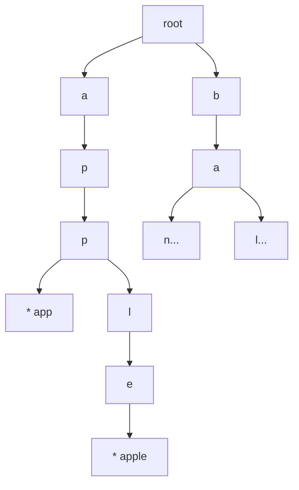
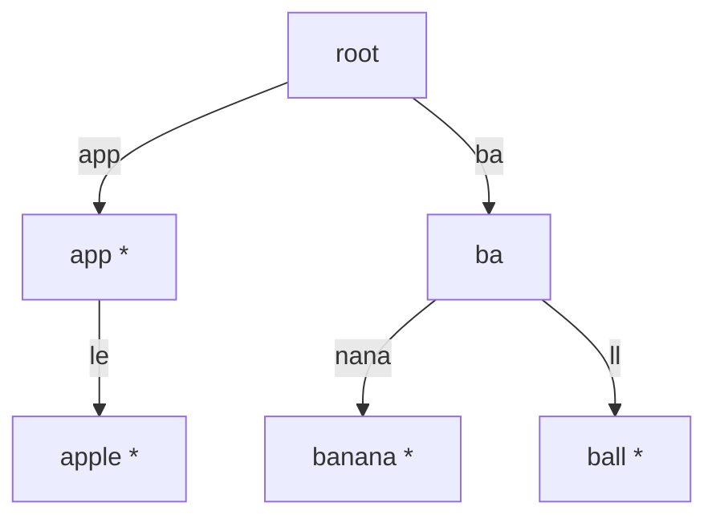
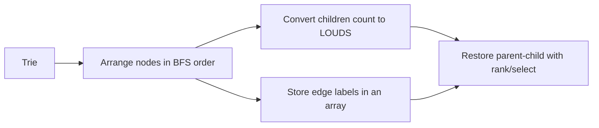
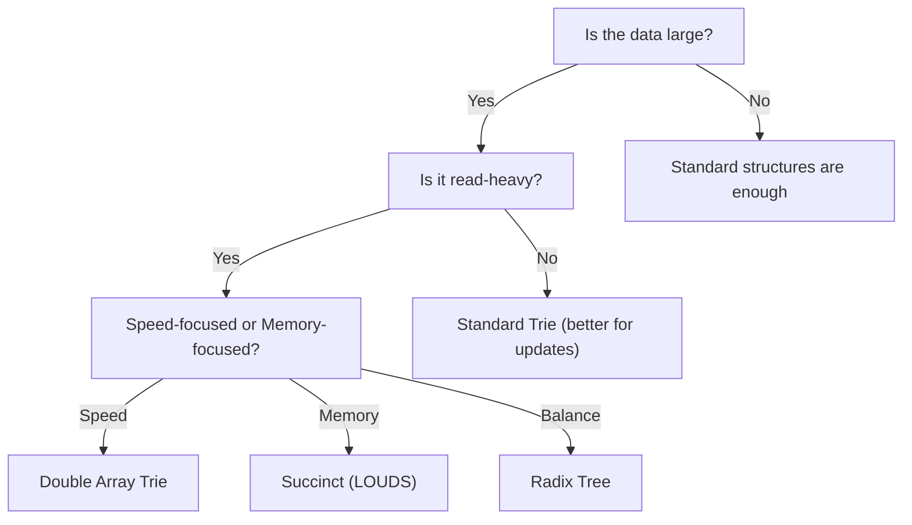

# Introduction to Succinct Data Structures (Go Perspective)

Succinct data structures are not just about data compression; they allow you to **search and operate on data directly in its compressed state (without deserialization)**. They represent data in a size close to its theoretical minimum (information-theoretic lower bound) while supporting operations like `rank/select/access` at high speed.

In this guide, we will first look at a standard `Trie`, then follow the flow of "converting a tree into a bit string" using `LOUDS`. The essence of Succinct is **replacing a forest of pointers with contiguous arrays and bit strings**.

---

## Prerequisites

### Succinct vs. Compressed

* **Succinct**: The original data is recoverable, and the size aims for `n + o(n)` bits for a theoretical lower bound `n`.
* **Compressed**: Becomes smaller on average, but worst-case scenario and operation costs are implementation-dependent.

### Why it Works in Practice

* Better memory locality, improving cache hit rates.
* Fewer pointer traversals, reducing CPU branch mispredictions.
* Effective for large-scale dictionaries, full-text search, and column-oriented data.

### 3 Key Points to Remember

* **Structure in bit strings**: Represent the shape of trees or arrays with bits instead of pointers.
* **Operations reduce to `rank/select`**: Determine "which child index" or "where the parent is" using bitwise operations.
* **Optimized for Reading**: Best for fixed dictionaries or read-heavy workloads.

---

## 1. Pointer-based Trie (Comparison Target)

This is a typical implementation. While easy to understand, it incurs significant overhead due to `map` and pointers for each node.

```go
package main

import "fmt"

type trieNode struct {
	children map[byte]*trieNode
	isWord   bool
}

type trie struct {
	root *trieNode
}

func newTrie() *trie {
	return &trie{root: &trieNode{children: make(map[byte]*trieNode)}}
}

func (t *trie) Insert(word string) {
	n := t.root
	for i := 0; i < len(word); i++ {
		c := word[i]
		if n.children[c] == nil {
			n.children[c] = &trieNode{children: make(map[byte]*trieNode)}
		}
		n = n.children[c]
	}
	n.isWord = true
}

func (t *trie) Search(word string) bool {
	n := t.root
	for i := 0; i < len(word); i++ {
		c := word[i]
		next := n.children[c]
		if next == nil {
			return false
		}
		n = next
	}
	return n.isWord
}

func main() {
	t := newTrie()
	for _, w := range []string{"app", "apple", "banana", "ball"} {
		t.Insert(w)
	}
	fmt.Println(t.Search("app"))   // true
	fmt.Println(t.Search("appl"))  // false
	fmt.Println(t.Search("apple")) // true
}
```

### Structure Image



While intuitive, the memory efficiency degrades as the number of words increases because each node holds a `map` and pointers.

### Why Pointer-based Implementation Consumes More Memory

The theoretical information of a `Trie` is simply "which node has which character branch" and "is it the end of a word." However, pointer-based implementations carry a lot of extra information for runtime convenience.

* Each node has pointers.
* The `map` itself has headers and buckets.
* Nodes are scattered on the heap, resulting in fine-grained allocations.
* The ratio of "management cost" to actual data tends to be large.

In short, you only want to represent the "shape of the tree," but you are paying a lot of memory for **pointers, hash tables, and allocator management information**.

---

## 2. Radix Tree / Patricia Trie (Structure Compression)

This method compresses the Trie by merging nodes that have only one child, holding strings (labels) on the edges.

* **Pros**: Reduced tree depth and dramatically fewer nodes. Used in Go's `httprouter`.
* **Cons**: String splitting and splicing make the implementation slightly more complex.

### Structure Image



---

## 3. Double Array Trie (Acceleration via Arrays)

This method represents the Trie using only two integer arrays (`base` and `check`), completely eliminating pointers. It is often considered the **best balance between search speed and memory efficiency** for static dictionaries.

* **Transition formula**: `next_state = base[current_state] + code(char)`
* **Verification**: `check[next_state] == current_state` (verifies if the transition is valid)

### Pros

* **Blazing Fast**: Transition achieved via simple array index access ($O(1)$ per character).
* **Pointer-less**: Densely packed in memory, leading to excellent cache efficiency.

### Cons

* **Construction Cost**: Heavy construction as it requires searching for empty slots while filling.
* **Dynamic Updates**: Primarily suitable for static dictionaries.

---

## 4. Succinct Trie Concept (LOUDS)

LOUDS (Level-Order Unary Degree Sequence) arranges each node of the tree (Trie) in Breadth-First Search (BFS) order and represents the structure as a bit string instead of pointers.

* Represent the number of children for each node as `1...10` (a sequence of `1`s equal to the number of children, terminated by a `0`).
* Store edge labels (characters) in a separate array.
* Restore parent-child relationships using `rank/select`.

### Conversion Flow



### Example (Concept)

```text
Children count per node: [3, 2, 1, 0, 1, 0, ...]
LOUDS:                   1110 110 10 0 10 0 ...
```

### Visualizing in ASCII

```text
Trie:
root
├─ a
│  └─ p
│     └─ p *
└─ b
   └─ a *

BFS Order:
[root][a][b][p][a][p]

Children Count:
root=2, a=1, b=1, p=1, a=0, p=0

LOUDS:
110 10 10 10 0 0
```

The reading method is simple: `110` for 2 children, `10` for 1 child, and `0` for 0 children. The shape of the tree is packed into this bit string, and character information is placed in a separate label array.

In production implementations, auxiliary indices (superblocks/blocks) are added to allow `rank/select` queries in approximately `O(1)` time. The essence is not linear search, but **fast positional queries against a bit string**.

### Benefits of LOUDS

LOUDS maps the tree structure into a contiguous bit string instead of pointers. This provides the following improvements:

* Eliminates the need for per-node pointers.
* No `map` is used, so hash table management costs disappear.
* Data is densely packed in arrays, leading to better cache locality.
* Tree structures can be handled with "arrays + bitwise operations," making it scalable for massive dictionaries.

In essence, while pointer-based trees are a "collection of objects," LOUDS treated the **tree as data that can be directly operated on as a serialized array, without needing to be deserialized**.

### Disadvantages of LOUDS

While memory efficient, implementation and updates are more difficult.

* Requires understanding and implementing `rank/select`, which has a high learning curve.
* Local updates (like adding a single node) are difficult; it usually requires reconstruction.
* Difficult to trace the structure visually during debugging.
* For small data, the effect might not justify the implementation complexity.
* If label search or auxiliary index design is incorrect, the expected speed will not be achieved.

---

## 5. Minimal Rank Implementation in Go (For Learning)

The following is a minimal example of "holding a bit string in `[]uint64`." `Rank1` uses linear scanning for educational purposes, but the implementation style is natural for Go.

```go
package succinct

import "math/bits"

type BitVector struct {
	words []uint64
	nbits int
}

func NewBitVector(nbits int) *BitVector {
	return &BitVector{
		words: make([]uint64, (nbits+63)/64),
		nbits: nbits,
	}
}

func (bv *BitVector) Set(i int) {
	if i < 0 || i >= bv.nbits {
		return
	}
	bv.words[i/64] |= 1 << (i % 64)
}

func (bv *BitVector) Get(i int) bool {
	if i < 0 || i >= bv.nbits {
		return false
	}
	return (bv.words[i/64]>>(i%64))&1 == 1
}

// Rank1 returns number of 1-bits in [0, i].
func (bv *BitVector) Rank1(i int) int {
	if bv.nbits == 0 {
		return 0
	}
	if i < 0 {
		return 0
	}
	if i >= bv.nbits {
		i = bv.nbits - 1
	}

	full := i / 64
	sum := 0
	for w := 0; w < full; w++ {
		sum += bits.OnesCount64(bv.words[w])
	}

	lastBits := (i % 64) + 1
	mask := ^uint64(0)
	if lastBits < 64 {
		mask = (uint64(1) << lastBits) - 1
	}
	sum += bits.OnesCount64(bv.words[full] & mask)
	return sum
}
```

### Key Understanding Points

* Pack bit strings into `[]uint64` instead of `[]bool`.
* Use `math/bits` to count the number of `1`s.
* In practice, instead of scanning everything in `Rank1`, auxiliary arrays are added for acceleration.

---

## 6. Complexity and Trade-offs

| Implementation | Space Efficiency | Search Speed | Updates | Main Use Cases |
| :--- | :--- | :--- | :--- | :--- |
| **Pointer-based Trie** | Low (Heavy pointers) | Medium | Fast | Prototyping, frequent updates |
| **Radix Tree** | Medium (Merged nodes) | Medium-High | Medium | Routers, path searching |
| **Double Array** | High (Arrays only) | **Extremely High** | Difficult | Static dictionaries |
| **LOUDS** | **Extremely High** | Medium-High | Difficult | Large-scale / low-memory |

### In a Nutshell

* **Pointer-based**: Easy to build and update, but consumes memory due to runtime overhead.
* **Double Array**: Difficult to build, but extremely fast lookup and compact.
* **LOUDS**: The hardest to build, but achieves near-theoretical memory limits.

### Rough Estimate: How much difference for 1 million words?

Let's estimate with some assumptions:

* 1 million words.
* 1-16 characters per word.
* Average length is about 8.5 characters.
* Characters represented as `byte`.
* Assuming about 6 million Trie nodes after prefix sharing.
* Pointer-based uses `map[byte]*trieNode` version.

Total characters are approximately `1M x 8.5 = 8.5M`. With prefix sharing, we assume about 6 million nodes.

#### Pointer-based Trie Breakdown

* `trieNode` body: ~16 bytes per node.
* `map` header: ~48 bytes per node.
* Bucket area: Dozens to over 100 bytes per node.

Roughly, for 6 million nodes:

* Node bodies: `6M x 16B` = ~96 MB.
* `map` headers: `6M x 48B` = ~288 MB.
* Bucket area: ~400–900 MB.
* Runtime costs like GC/fragmentation: Dozens to hundreds of MB.

In total, it wouldn't be surprising if it reached **0.8 GB to 1.5 GB**.

#### LOUDS Trie Breakdown

LOUDS holds the same structure with "Bit string + Label array + Auxiliary index."

* LOUDS bit string: ~`2N` bits.
* Label array: ~1 byte per node.
* End-of-word flags: 1 bit per node.
* Auxiliary arrays for `rank/select`: A few % to dozens of %.

For `N = 6M`:

* LOUDS bit string: ~12M bits = ~1.5 MB.
* Label array: ~6M bytes = ~6 MB.
* End flags: ~6M bits = ~0.75 MB.
* Auxiliary index: ~1–5 MB.
* Implementation overhead: A few MB.

In total, it often fits within **10 MB to 20+ MB**.

#### Conclusion from Comparison

For the same 1 million words, a `map`-based pointer Trie can be **GB-class**, whereas LOUDS can be **dozens of MB**. In terms of memory efficiency, there can be a **50x to 100x+ difference** because LOUDS avoids the overhead of managing millions of small objects.

Of course, this is because the conditions are "read-mostly and almost immutable." If frequent updates are needed, choosing based on memory alone is dangerous.

### Memory Comparison (Rough Estimate: 1M words / 6M nodes)

| Item | Pointer-based | Radix Tree | Double Array | LOUDS (Succinct) |
| :--- | :--- | :--- | :--- | :--- |
| **Total Size** | **0.8 - 1.5 GB** | **300 - 600 MB** | **100 - 150 MB** | **10 - 20 MB** |
| **Structure** | Pointers / map | Pointers / map (Merged) | Two integer arrays | Bit string (2n bits) |
| **Management** | Very High | High | Low | Extremely Low |
| **Search Speed** | Medium | Medium-High | **Extremely High** | Medium-High |

The essence of this difference is that while pointer-based or Radix implementations manage "nodes as objects," Double Array and LOUDS "flatten the structure into arrays or bit strings." LOUDS, in particular, achieves overwhelming memory savings by bringing management costs close to zero.

**Criteria for Practical Decision**

* Fixed or near-fixed dictionaries/indices: Consider **Succinct (LOUDS)** or **Double Array**.
* Frequent updates or early stage of development: Prioritize **Standard Trie**.

### Usage Cheat Sheet



---

## 7. SWE Implementation Guide (Go)

* Start by creating a baseline with `[]uint64` + `bits.OnesCount64`.
* Measure memory and latency using `go test -bench . -benchmem`.
* Add index construction (auxiliary arrays for rank/select) in a separate phase.
* Separate APIs by purpose: `Builder` (construction) and `Reader` (lookup).
* If updates are necessary, consider `immutable snapshots` + differential reconstruction.

### Implementation Order

1. Create `BitVector`.
2. Implement `Rank/Select`.
3. Add tree structure using `LOUDS`.
4. Benchmark and compare with standard Trie.

---

## 8. Real-world Example: Mozc (Google Japanese Input)

[Mozc](https://github.com/google/mozc), the open-source version of Google Japanese Input, extensively uses Trie structures to balance memory efficiency and search speed.

### Key Use Cases

1. **Fast Lookup with Double-Array Trie**:
    * Mozc uses a [Darts](https://github.com/google/mozc/blob/master/src/base/darts.h) based implementation.
    * **Purpose**: Candidate search and predictive input (Kana-Kanji conversion).
    * **Source**: [`src/storage/dictionary/`](https://github.com/google/mozc/tree/master/src/storage/dictionary)

2. **Massive Dictionary Compression with LOUDS**:
    * For huge system dictionaries (millions of words), it uses LOUDS.
    * **Purpose**: Minimize memory footprint while maintaining millisecond-level lookups.
    * **Source**: [`src/storage/louds/`](https://github.com/google/mozc/tree/master/src/storage/louds)

3. **Predictive Input (Suggestion) Acceleration**:
    * Uses "Common Prefix Search" to instantly list words (e.g., "today", "tomorrow") starting from a prefix.
    * **Source**: [`src/prediction/dictionary_predictor.cc`](https://github.com/google/mozc/blob/master/src/prediction/dictionary_predictor.cc)

### Why Trie for Mozc?

* **Common Prefix Search**: Japanese "yomi" (readings) often overlap, and Trie's prefix sharing directly leads to massive memory savings.
* **Deterministic Speed**: Unlike hash tables, lookups have a constant speed ($O(1)$ per char for Double-Array), minimizing latency for the user.

---

## 9. Optimization for Multi-byte (Japanese/Unicode) Environments

In languages like Japanese (Unicode) where the character set is massive, implementing "one character = one node" would result in tens of thousands of branches per node, causing the structure to collapse. Real-world products solve this with the following strategies.

### UTF-8 Byte Sequence Decomposition

Instead of treating multi-byte characters as single units, it is common to **decompose them into UTF-8 byte sequences (0–255) and map them onto the Trie**.

* **Pros**: Limits the branches per node to a maximum of 256, stabilizing Double Array packing efficiency and pointer-based memory management.
* **Cons**: Increases tree depth by 3x–4x (3 bytes per Japanese character), but the benefits of simplified search algorithms and improved memory efficiency outweigh this cost.

### Static vs. Dynamic Dictionary Trade-offs

IMEs like Mozc choose different data structures based on the use case:

* **System Dictionary (Static)**: Since it is not rewritten after construction, **LOUDS** (extreme compression) or **Double Array** (fastest lookup) are chosen.
* **User Dictionary (Dynamic)**: Due to frequent additions and deletions, **B-trees** or **Hash Tables**, which are more resilient to updates than Tries, are typically used.

### Suitability in Japanese Environments

| Structure | Suitability | Features |
| :--- | :--- | :--- |
| **Pointer-based** | Low | Excessive memory consumption. Not suitable for mobile or background PC software. |
| **Double Array** | **High (Lookup)** | Fastest speed. Cache efficiency is key when traversing deeper trees due to UTF-8 decomposition. |
| **LOUDS** | **High (Compression)** | Smallest size. Powerful in memory-constrained environments like mobile devices. |
| **Radix Tree** | Medium | Effective for long readings. Concepts are sometimes integrated into LOUDS internal optimizations. |

---

## Summary

* **Radix Tree**: "Structural efficiency" by pruning redundant nodes.
* **Double Array**: "Lookup efficiency" by reducing it to array operations.
* **Succinct (LOUDS)**: "Memory efficiency" by representing the tree as bits.
* In Go, choose your weapon (Radix for routing, DAT for static dictionaries, LOUDS for billions of words) based on the specific constraints of your use case.
* Don't implement everything at once; introduce phases in the order of `BitVector -> rank/select -> LOUDS`.
