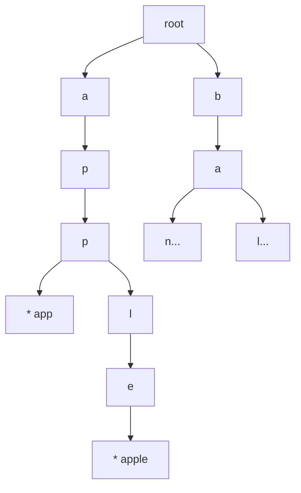
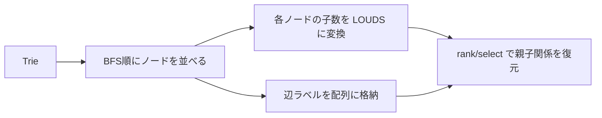
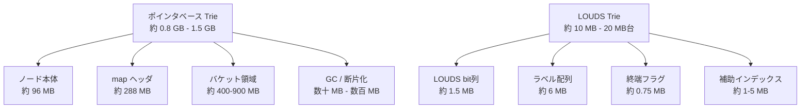
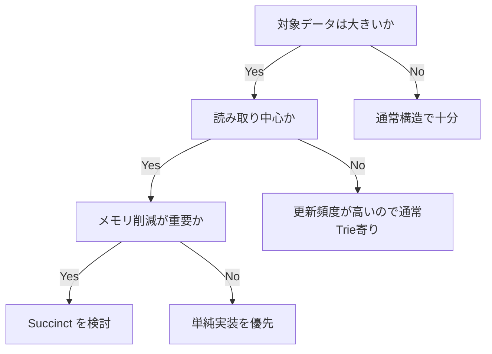

# Succinct データ構造入門（Go視点）

Succinct（簡潔）データ構造は、単なるデータ圧縮ではなく、**圧縮された状態のまま（デシリアライズせずに）データを検索・操作できる**手法です。データが持つ本来の情報量（情報理論的下界）に近いサイズで表現しつつ、`rank/select/access` といった操作を高速に行います。

この資料では、まず通常の `Trie` を見てから、`LOUDS` で「木をビット列に変える」流れを追います。先に結論を書くと、Succinct の本質は **ポインタの森を、連続した配列とビット列に置き換えること** です。

---

## まず押さえる前提

### Succinct と Compressed の違い

* **Succinct**: 元データを復元可能で、理論下界 `n` に対して `n + o(n)` ビットを目指す
* **Compressed**: 平均的には小さくなるが、最悪ケースや操作コストは実装依存

### なぜ現場で効くのか

* メモリ局所性が上がり、キャッシュヒット率が改善しやすい
* ポインタ追跡が減り、CPU の分岐ミスを抑えやすい
* 大規模辞書・全文検索・列指向データで有効

### まず覚える3点

* **構造をビット列に置く**: 木や配列の形をポインタではなくビットで表す
* **操作は `rank/select` に還元する**: 「何番目の子か」「親はどこか」をビット演算で引く
* **更新より参照向き**: 固定辞書や読み取り中心ワークロードで特に効く

---

## 1. ポインタベース Trie（比較対象）

まずは一般的な実装です。理解しやすい反面、ノードごとの `map` とポインタのオーバーヘッドが大きくなります。

```go
package main

import "fmt"

type trieNode struct {
	children map[byte]*trieNode
	isWord   bool
}

type trie struct {
	root *trieNode
}

func newTrie() *trie {
	return &Trie{root: &TrieNode{children: make(map[byte]*trieNode)}}
}

func (t *trie) Insert(word string) {
	n := t.root
	for i := 0; i < len(word); i++ {
		c := word[i]
		if n.children[c] == nil {
			n.children[c] = &TrieNode{children: make(map[byte]*trieNode)}
		}
		n = n.children[c]
	}
	n.isWord = true
}

func (t *trie) Search(word string) bool {
	n := t.root
	for i := 0; i < len(word); i++ {
		c := word[i]
		next := n.children[c]
		if next == nil {
			return false
		}
		n = next
	}
	return n.isWord
}

func main() {
	t := newTrie()
	for _, w := range []string{"app", "apple", "banana", "ball"} {
		t.Insert(w)
	}
	fmt.Println(t.Search("app"))   // true
	fmt.Println(t.Search("appl"))  // false
	fmt.Println(t.Search("apple")) // true
}
```

### 構造イメージ



この形は直感的ですが、各ノードが `map` とポインタを持つため、単語数が増えるほどメモリ効率が悪化しやすくなります。

### なぜポインタベース（pointer base）はメモリを使いやすいのか

`Trie` 自体の理論上の情報量は「どのノードに、どの文字の枝があるか」と「単語終端か」です。しかしポインタベース実装では、それ以外のランタイム都合の情報も大量に抱えます。

* 各ノードがポインタを持つ
* `map` 自体のヘッダやバケットを持つ
* ノードがヒープ上に散らばり、アロケーション単位が細かくなる
* 実データより「管理コスト」の比率が大きくなりやすい

つまり、「木の形」を表したいだけなのに、実際には **ポインタ、ハッシュテーブル、アロケータ管理情報** に多くのメモリを払っています。

---

## 2. Succinct Trie の考え方（LOUDS）

木（Trie）の各ノードを幅優先探索（BFS: Breadth-First Search）順に並べ、ポインタの代わりに「連続したビット列」として木構造を表します。

* 各ノードの子数を `1...10`（`1` を子の数だけ並べて `0` で閉じる）で表現
* ラベル配列（辺文字）を別配列で保持
* `rank/select` で親子関係を復元

### 変換の流れ



### 例（概念）

```text
ノードの子数: [3,2,1,0,1,0,...]
LOUDS:        1110 110 10 0 10 0 ...
```

### 何が起きているかをASCIIで見る

```text
Trie:
root
├─ a
│  └─ p
│     └─ p *
└─ b
   └─ a *

BFS順:
[root][a][b][p][a][p]

子の数:
root=2, a=1, b=1, p=1, a=0, p=0

LOUDS:
110 10 10 10 0 0
```

読み方は単純です。子が 2 個なら `110`、子が 1 個なら `10`、子が 0 個なら `0` です。木の形そのものはこのビット列に押し込み、文字情報は別のラベル配列に置きます。

本番実装では `rank/select` を `O(1)` 近似で引ける補助インデックスを載せます（superblock/block）。つまり、線形探索が本質ではなく、**ビット列に対する高速な位置問い合わせ** が本質です。

### LOUDS で何が良くなるのか

LOUDS では、木の形をポインタではなく連続したビット列に落とし込みます。その結果、次の改善が得られます。

* ノードごとのポインタが不要になる
* `map` を持たないため、ハッシュテーブルの管理コストが消える
* データが配列に密に詰まるので、キャッシュ局所性が良くなる
* 木構造を「配列 + ビット演算」で扱えるので、巨大辞書でスケールしやすい

要するに、ポインタベースが「オブジェクトの集合」で木を持つのに対し、LOUDS は **木をシリアライズされた配列のまま、デシリアライズせずに直接操作できるデータ** として持つイメージです。

### 逆に LOUDS のデメリットは何か

メモリ効率は良い一方で、実装と更新は難しくなります。

* `rank/select` の理解と実装が必要で、学習コストが高い
* 1 ノード追加のような局所更新がしづらく、再構築寄りになる
* デバッグ時に構造を目で追いにくい
* 小規模データでは、実装複雑性の割に効果が出にくい
* ラベル探索や補助インデックス設計を誤ると、期待した速度が出ない

---

## 3. Goでの最小 Rank 実装（学習用）

以下は「ビット列を `[]uint64` で持つ」最小例です。`Rank1` は線形走査なので学習目的ですが、Go での実装スタイルとしては自然です。

```go
package succinct

import "math/bits"

type BitVector struct {
	words []uint64
	nbits int
}

func NewBitVector(nbits int) *BitVector {
	return &BitVector{
		words: make([]uint64, (nbits+63)/64),
		nbits: nbits,
	}
}

func (bv *BitVector) Set(i int) {
	if i < 0 || i >= bv.nbits {
		return
	}
	bv.words[i/64] |= 1 << (i % 64)
}

func (bv *BitVector) Get(i int) bool {
	if i < 0 || i >= bv.nbits {
		return false
	}
	return (bv.words[i/64]>>(i%64))&1 == 1
}

// Rank1 returns number of 1-bits in [0, i].
func (bv *BitVector) Rank1(i int) int {
	if bv.nbits == 0 {
		return 0
	}
	if i < 0 {
		return 0
	}
	if i >= bv.nbits {
		i = bv.nbits - 1
	}

	full := i / 64
	sum := 0
	for w := 0; w < full; w++ {
		sum += bits.OnesCount64(bv.words[w])
	}

	lastBits := (i % 64) + 1
	mask := ^uint64(0)
	if lastBits < 64 {
		mask = (uint64(1) << lastBits) - 1
	}
	sum += bits.OnesCount64(bv.words[full] & mask)
	return sum
}
```

### このコードで理解すべき点

* ビット列を `[]bool` ではなく `[]uint64` に詰める
* `math/bits` を使って `1` の個数を数える
* 実運用では `Rank1` のたびに全走査せず、補助配列を追加して高速化する

---

## 4. 計算量とトレードオフ

| 観点 | ポインタTrie | Succinct Trie |
| ------ | -------------- | --------------- |
| 空間効率 | 低い（ポインタ/`map` オーバーヘッド） | 高い（`n + o(n)` を狙える） |
| 実装容易性 | 高い | 低い |
| 更新（Insert/Delete） | しやすい | 難しい（再構築コスト） |
| 検索速度 | 実装次第 | 配列のキャッシュ局所性で有利なことが多い |

### 一言で比較すると

* **ポインタベース**: 作りやすく更新しやすいが、ランタイムのオーバーヘッドによりメモリを食いやすい
* **LOUDS**: 構築は難しいが、大規模・読み取り中心では非常に強い（省メモリ・キャッシュヒット向上）

### ラフ試算: 100万語ならどれくらい違うか

前提を置いて概算します。

* 100 万語
* 1 単語 1-16 文字
* 平均文字数は約 8.5 文字
* 文字は `byte` で表現
* prefix 共有を考慮した Trie ノード数は約 600 万と仮定
* ポインタベースはこの資料の `map[byte]*trieNode` 版を想定

まず、総文字数はおよそ `100万 x 8.5 = 850万文字` です。Trie は prefix を共有するので、ノード数は総文字数より少し減る想定で、ここでは約 600 万ノードとします。

#### ポインタベース Trie のざっくり内訳

* `trieNode` 本体: 1 ノードあたり約 16 bytes
* 各ノードの `map` ヘッダ: 1 ノードあたり約 48 bytes 前後
* 子を持つノードのバケット領域: 1 ノードあたり数十 bytes から 100 bytes 超

かなり荒く見積もると、600 万ノード規模では次の程度になります。

* ノード本体: `600万 x 16B` = 約 96 MB
* `map` ヘッダ: `600万 x 48B` = 約 288 MB
* バケット領域: 約 400-900 MB
* GC/アロケーション断片化などの実行時コスト: 数十 MB から数百 MB

つまり、**合計でだいたい 0.8 GB から 1.5 GB 程度** になっても不思議ではありません。実装やデータ分布によっては、これより増減します。

#### LOUDS Trie のざっくり内訳

LOUDS では、同じ木構造を「ビット列 + ラベル配列 + 補助インデックス」で持ちます。

* 木構造の LOUDS ビット列: 約 `2N` bits
* ラベル配列: ほぼ 1 ノード 1 byte
* 単語終端フラグ: 1 ノード 1 bit
* `rank/select` 用の補助配列: 数 % から数十 %

`N = 600万` とすると、おおよそこうなります。

* LOUDS ビット列: `約1200万 bits` = 約 1.5 MB
* ラベル配列: `約600万 bytes` = 約 6 MB
* 終端フラグ: `約600万 bits` = 約 0.75 MB
* 補助インデックス: 約 1-5 MB
* スライスや実装オーバーヘッド: 数 MB

つまり、**合計でだいたい 10 MB から 20 MB 台** に収まることが多いです。

#### この比較から言えること

同じ 100 万語規模でも、`map` ベースのポインタ Trie は **GB 級**、LOUDS は **数十 MB 級** になる可能性があります。要するに、オブジェクトを細かく確保するランタイムコストがなくなり、**50 倍から 100 倍以上** のメモリ効率の差が出てもおかしくありません。

もちろん、これは「読み取り中心で、構築後はほぼ不変」という Succinct 向きの条件だからこそ効きます。頻繁更新が必要なら、メモリ差だけで即採用するのは危険です。

### メモリ差を図で見る



この差の本質は、ポインタベースが「ノードごとにポインタなどの管理構造を持つ」のに対し、LOUDS は「木全体を連続メモリに詰める」ことです。つまり、データそのものよりも管理コスト（ヘッダやポインタ）が支配的になる場合、ポインタベースは極めて不利になります。

**実務判断の目安**

* 語彙が固定に近い辞書・インデックス: Succinct を検討
* 頻繁更新・仕様変更多い段階: まず通常 Trie で検証

### 使いどころを一枚で見る



---

## 5. SWE向け実装ガイド（Go）

* まずは `[]uint64` + `bits.OnesCount64` でベースラインを作る
* `go test -bench . -benchmem` でメモリとレイテンシを計測する
* インデックス構築（rank/select の補助配列）は別フェーズで追加する
* API は用途別に分ける: `Builder`（構築）と `Reader`（参照）
* 更新が必要なら、`immutable snapshot` + 差分再構築を検討する

### 導入順

1. `BitVector` を作る
2. `Rank/Select` を実装する
3. `LOUDS` で木構造を載せる
4. ベンチして、通常 Trie と比較する

---

## まとめ

* Succinct は「圧縮そのもの」より、**操作可能な省メモリ表現**が本質
* Go では配列中心実装に寄せると、局所性と予測可能性を得やすい
* いきなり完全実装せず、`BitVector -> rank/select -> LOUDS` の順に段階導入する
