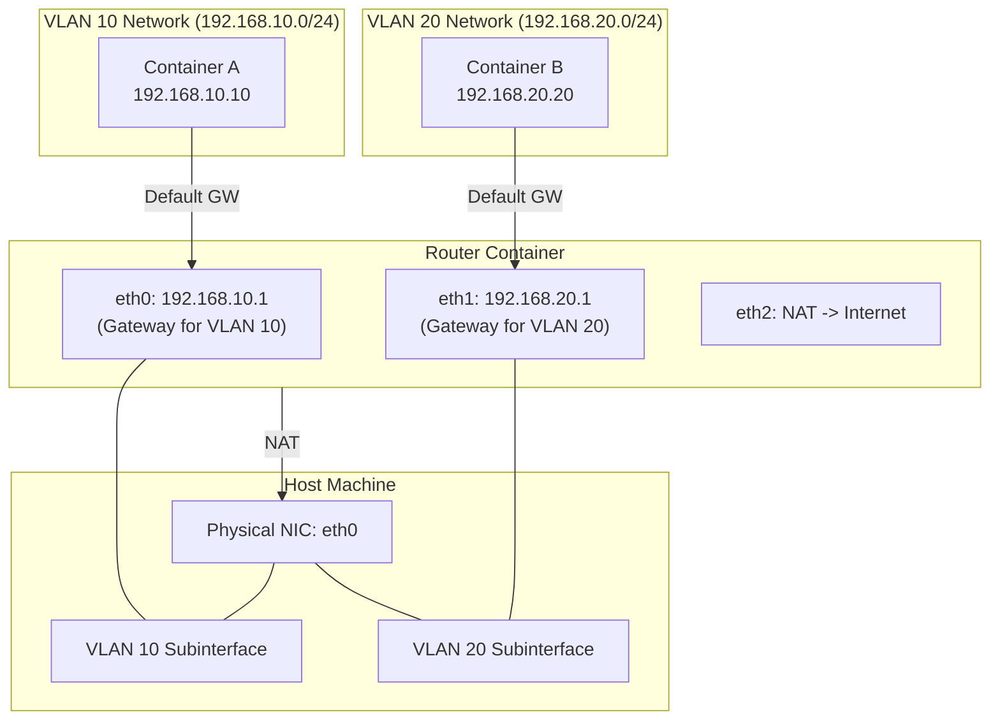

# Podman 実習：macvlan と Linux ルーターで作る L3 分離ネットワーク

ソフトウェアエンジニア向けに、コンテナ技術（Podman）と Linux のネットワーク機能（macvlan, VLAN, iptables）を使って、擬似的な物理ネットワーク環境を構築する実習です。

## ゴール

以下の構成を **手を動かして構築し、理解** します。



**達成する状態:**

1. **L2 分離:** `Container A` と `Container B` は異なる VLAN に属し、直接通信できません（ping が通らない）。
2. **L3 ルーティング:** `Router` コンテナを経由することで、相互に通信できます。
3. **インターネット接続:** `Router` の NAT 機能により、各コンテナから外部（インターネット）へ接続し、パッケージのインストールなどが可能です。

---

## 前提条件

- **OS:** Ubuntu 24.04 LTS (推奨)
- **Podman:** Rootful モード (sudo 権限が必要)
- **物理 NIC 名:** `eth0`
  - ※ 環境によって `ens5`, `ens3`, `enp0s3` など異なります。`ip link` コマンドで確認し、適宜読み替えてください。

### 環境確認

```bash
# rootless が false であることを確認
podman info | grep rootless
# rootless: false

# 物理NIC名を確認
ip link show
```

---

## Step 1. ホストに VLAN サブインタフェースを作る

まず、物理 NIC (`IF`) の上に、仮想的な VLAN インタフェースを作成します。これがネットワークの「物理的な」分離線となります。

```bash
# 物理インタフェースを確認
ip link show
export IF=ens5 # `eth0`の場合は `eth0` を指定

# 既存のサブインタフェースを削除（存在する場合）
sudo ip link delete $IF.10
sudo ip link delete $IF.20

# VLAN 10 用のサブインタフェース作成
sudo ip link add link $IF name $IF.10 type vlan id 10

# VLAN 20 用のサブインタフェース作成
sudo ip link add link $IF name $IF.20 type vlan id 20

# インタフェースを有効化
sudo ip link set $IF.10 up
sudo ip link set $IF.20 up
```

**解説:**

- `macvlan` ネットワークドライバは、親となる物理（または VLAN）インタフェースを必要とします。
- ここでは IP アドレスを付与しません。これらは純粋に L2 フレームを流す土管として機能します。

---

## Step 2. Podman ネットワークを定義する

作成した VLAN インタフェースを使って、Podman のネットワーク定義を作成します。

### VLAN 10 (Container A 用)

```bash
sudo podman network create \
  --driver macvlan \
  --subnet 192.168.10.0/24 \
  --gateway 192.168.10.1 \
  -o parent=$IF.10 \
  net-vlan10
```

### VLAN 20 (Container B 用)

```bash
sudo podman network create \
  --driver macvlan \
  --subnet 192.168.20.0/24 \
  --gateway 192.168.20.1 \
  -o parent=$IF.20 \
  net-vlan20
```

**確認:**

```bash
sudo podman network ls
# net-vlan10 と net-vlan20 が表示されること
```

---

## Step 3. ルーターコンテナを構築する

異なるネットワーク間をつなぐ「ルーター」を作成します。このコンテナは 3 つのネットワークインタフェースを持ちます。

1. **eth0 (net-vlan10):** VLAN 10 側のゲートウェイ (192.168.10.1)
2. **eth1 (net-vlan20):** VLAN 20 側のゲートウェイ (192.168.20.1)
3. **eth2 (podman):** ホスト/インターネットへの出口 (NAT用)

```bash
# 1. コンテナ起動（同時に net-vlan10 に接続）
# --cap-add NET_ADMIN: iptables などを操作する権限を与える
# --sysctl net.ipv4.ip_forward=1: Linux カーネルのパケット転送機能を有効化
sudo podman run -d --name router \
  --network net-vlan10 \
  --ip 192.168.10.1 \
  --cap-add NET_ADMIN \
  --sysctl net.ipv4.ip_forward=1 \
  alpine sleep infinity

# 2. net-vlan20 に接続
sudo podman network connect \
  --ip 192.168.20.1 \
  net-vlan20 router

# 3. デフォルトの podman ネットワーク（インターネット接続用）に接続
sudo podman network connect podman router
```

---

## Step 4. ルーターで NAT (IP マスカレード) を設定する

ルーターコンテナ内で `iptables` を使い、プライベートネットワークからの通信をインターネットへ中継できるようにします。

```bash
# iptables ツールをインストール
sudo podman exec router apk add --no-cache iptables

# NAT 設定を投入
sudo podman exec router sh -c \
'\
# 外向き (eth2) 通信の送信元 IP を eth2 の IP に書き換える (Masquerade)
iptables -t nat -A POSTROUTING -o eth2 -j MASQUERADE

# 転送許可設定
# VLAN 10 (eth0) -> Internet (eth2)
iptables -A FORWARD -i eth0 -o eth2 -j ACCEPT
# VLAN 20 (eth1) -> Internet (eth2)
iptables -A FORWARD -i eth1 -o eth2 -j ACCEPT
# 戻りパケットの許可 (Established/Related)
iptables -A FORWARD -i eth2 -m state --state ESTABLISHED,RELATED -j ACCEPT
'
```

---

## Step 5. クライアントコンテナを作成する

VLAN 10 と VLAN 20 にそれぞれクライアントコンテナを配置します。

### Container A (VLAN 10)

```bash
sudo podman run -d --name a \
  --network net-vlan10 \
  --ip 192.168.10.10 \
  alpine sleep infinity
```

### Container B (VLAN 20)

```bash
sudo podman run -d --name b \
  --network net-vlan20 \
  --ip 192.168.20.20 \
  alpine sleep infinity
```

---

## Step 6. 動作確認

構築したネットワークが期待通り動作するか検証します。

### 1. 疎通確認 (Routing)

Container A から Container B (異なるネットワーク) へ Ping を打ちます。
ルーターが正しく機能していれば、Ping は通ります。

```bash
sudo podman exec a ping -c 3 192.168.20.20
# PING 192.168.20.20 (192.168.20.20): 56 data bytes
# 64 bytes from 192.168.20.20: seq=0 ttl=63 time=0.xxx ms
# ...
```

逆方向 (B -> A) も確認します。

```bash
sudo podman exec b ping -c 3 192.168.10.10
```

### 2. インターネット接続確認 (NAT)

Container A からインターネット上のリソースにアクセスできるか確認します。

```bash
# curl をインストールしてみる（インターネット接続が必要）
sudo podman exec a apk add --no-cache curl

# Google へアクセス
sudo podman exec a curl -I https://www.google.com
# HTTP/2 200 ... などのレスポンスがあればOK
```

---

## クリーンアップ

実習が終わったら、環境をきれいに戻しましょう。

```bash
# コンテナの停止と削除
sudo podman rm -f a b router

# ネットワークの削除
sudo podman network rm net-vlan10 net-vlan20

# ホスト上の VLAN インタフェース削除
sudo ip link delete $IF.10
sudo ip link delete $IF.20
```

---

## まとめ

1. **macvlan** は、コンテナを物理ネットワーク（L2）に直接接続したように見せる技術です。
2. **VLAN** サブインタフェースを使うことで、1本の物理ケーブル上で論理的にネットワークを分離できます。
3. **Linux コンテナ** は、適切な設定（`ip_forward`, `iptables`）を行えば、簡単に高性能なルーターとして機能します。
