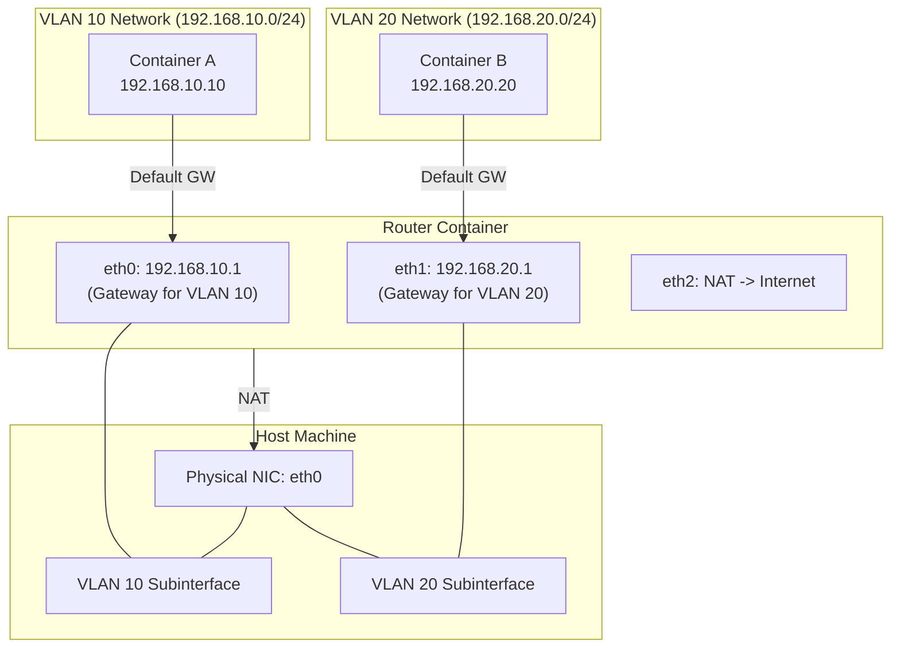

# Podman Workshop: Building an L3 Isolated Network with macvlan and Linux Router

This is a hands-on workshop for software engineers to build a simulated physical network environment using container technology (Podman) and Linux network features (macvlan, VLAN, iptables).

## Goal

Build and understand the following configuration **hands-on**.



**Achieved State:**

1. **L2 Isolation:** `Container A` and `Container B` belong to different VLANs and cannot communicate directly (ping fails).
2. **L3 Routing:** Communication is possible via the `Router` container.
3. **Internet Connectivity:** Through the NAT function of the `Router`, each container can connect to the outside (Internet) to install packages, etc.

---

## Prerequisites

- **OS:** Ubuntu 24.04 LTS (Recommended)
- **Podman:** Rootful mode (sudo privileges required)
- **Physical NIC Name:** `eth0`
  - *Note:* Depending on the environment, it may be `ens5`, `ens3`, `enp0s3`, etc. Check with `ip link` and replace accordingly.

### Environment Check

```bash
# Ensure rootless is false
podman info | grep rootless
# rootless: false

# Check physical NIC name
ip link show
```

---

## Step 1. Create VLAN Subinterfaces on the Host

First, create virtual VLAN interfaces on top of the physical NIC (`IF`). This serves as the "physical" separation line of the network.

```bash
# Check physical interfaces
ip link show
export IF=ens5 # Replace with `eth0` if applicable

# Delete existing subinterfaces (if they exist)
sudo ip link delete $IF.10
sudo ip link delete $IF.20

# Create subinterface for VLAN 10
sudo ip link add link $IF name $IF.10 type vlan id 10

# Create subinterface for VLAN 20
sudo ip link add link $IF name $IF.20 type vlan id 20

# Enable interfaces
sudo ip link set $IF.10 up
sudo ip link set $IF.20 up

# Verify $IF.10 and $IF.20 are displayed
ip link show
```

**Explanation:**

- The `macvlan` network driver requires a parent physical (or VLAN) interface.
- We do not assign IP addresses here. These function purely as pipes for passing L2 frames.

---

## Step 2. Define Podman Networks

Create Podman network definitions using the created VLAN interfaces.

### VLAN 10 (For Container A)

```bash
sudo podman network create \
  --driver macvlan \
  --subnet 192.168.10.0/24 \
  --gateway 192.168.10.1 \
  -o parent=$IF.10 \
  net-vlan10
```

### VLAN 20 (For Container B)

```bash
sudo podman network create \
  --driver macvlan \
  --subnet 192.168.20.0/24 \
  --gateway 192.168.20.1 \
  -o parent=$IF.20 \
  net-vlan20
```

**Verification:**

```bash
sudo podman network ls
# net-vlan10 and net-vlan20 should be displayed
```

---

## Step 3. Build the Router Container

Create a "router" to connect different networks. This container has 3 network interfaces.

1. **eth0 (net-vlan10):** Gateway for VLAN 10 side (192.168.10.1)
2. **eth1 (net-vlan20):** Gateway for VLAN 20 side (192.168.20.1)
3. **eth2 (podman):** Exit to host/Internet (for NAT)

```bash
# 1. Start container (connect to net-vlan10 simultaneously)
# --cap-add NET_ADMIN: Grants permission to manipulate iptables, etc.
# --sysctl net.ipv4.ip_forward=1: Enables Linux kernel packet forwarding
sudo podman run -d --name router \
  --network net-vlan10 \
  --ip 192.168.10.1 \
  --cap-add NET_ADMIN \
  --sysctl net.ipv4.ip_forward=1 \
  alpine sleep infinity

# 2. Connect to net-vlan20
sudo podman network connect \
  --ip 192.168.20.1 \
  net-vlan20 router

# 3. Connect to default podman network (for Internet access)
sudo podman network connect podman router
```

**Verification:**
Confirm that the container has 3 interfaces: `eth0`, `eth1`, and `eth2` (+ `lo`).

```bash
sudo podman exec router ip addr
```

Output should show `192.168.10.1`, `192.168.20.1`, and `10.88.x.x` (podman default) IPs.

---

## Step 4. Configure NAT (IP Masquerade) on Router

Use `iptables` inside the router container to relay traffic from private networks to the Internet.

```bash
# Install iptables tool
sudo podman exec router apk add --no-cache iptables

# Apply NAT settings
sudo podman exec router sh -c \
'\
# Rewrite source IP of outgoing traffic (eth2) to eth2 IP (Masquerade)
iptables -t nat -A POSTROUTING -o eth2 -j MASQUERADE

# Forwarding permission settings
# VLAN 10 (eth0) -> Internet (eth2)
iptables -A FORWARD -i eth0 -o eth2 -j ACCEPT
# VLAN 20 (eth1) -> Internet (eth2)
iptables -A FORWARD -i eth1 -o eth2 -j ACCEPT
# Allow return packets (Established/Related)
iptables -A FORWARD -i eth2 -m state --state ESTABLISHED,RELATED -j ACCEPT
'
```

---

## Step 5. Create Client Containers

Deploy client containers to VLAN 10 and VLAN 20 respectively.

### Container A (VLAN 10)

```bash
sudo podman run -d --name a \
  --network net-vlan10 \
  --ip 192.168.10.10 \
  alpine sleep infinity
```

**Verification:**

```bash
# 1. Check if IP address is assigned correctly
sudo podman exec a ip addr show eth0

# 2. Check ping to gateway (router)
sudo podman exec a ping -c 3 192.168.10.1
```

### Container B (VLAN 20)

```bash
sudo podman run -d --name b \
  --network net-vlan20 \
  --ip 192.168.20.20 \
  alpine sleep infinity
```

**Verification:**

```bash
# 1. Check IP address
sudo podman exec b ip addr show eth0

# 2. Check ping to gateway (router)
sudo podman exec b ping -c 3 192.168.20.1
```

---

## Step 6. Verify Operation

Verify that the built network operates as expected.

### 1. Reachability Check (Routing)

Ping from Container A to Container B (different network).
If the router is functioning correctly, the Ping will pass.

```bash
sudo podman exec a ping -c 3 192.168.20.20
# PING 192.168.20.20 (192.168.20.20): 56 data bytes
# 64 bytes from 192.168.20.20: seq=0 ttl=63 time=0.xxx ms
# ...
```

Check reverse direction (B -> A) as well.

```bash
sudo podman exec b ping -c 3 192.168.10.10
```

### 2. Internet Connection Check (NAT)

Confirm access to Internet resources from Container A.

```bash
# Install curl and dig (bind-tools) (Internet connection required)
sudo podman exec a apk add --no-cache curl bind-tools

# Check DNS
sudo podman exec a dig www.google.com

# Check HTTP
sudo podman exec a curl -I https://www.google.com
# Response like HTTP/2 200 ... is OK
```

---

## Cleanup

After finishing the workshop, restore the environment.

```bash
# Stop and remove containers
sudo podman rm -f a b router

# Remove networks
sudo podman network rm net-vlan10 net-vlan20

# Delete VLAN interfaces on host
sudo ip link delete $IF.10
sudo ip link delete $IF.20
```

---

## Summary

1. **macvlan** is a technology that makes containers appear as if they are directly connected to the physical network (L2).
2. By using **VLAN** subinterfaces, you can logically separate networks over a single physical cable.
3. **Linux Containers** can function as high-performance routers easily with appropriate settings (`ip_forward`, `iptables`).

```